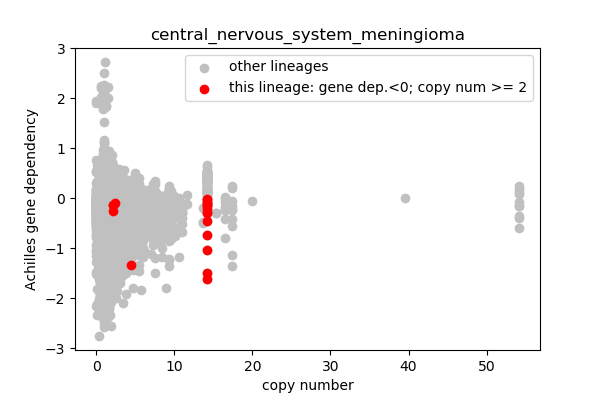
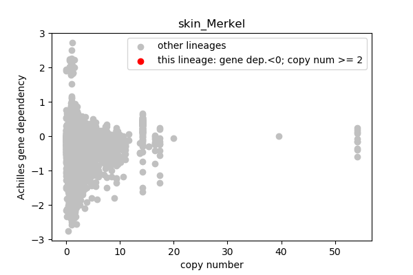
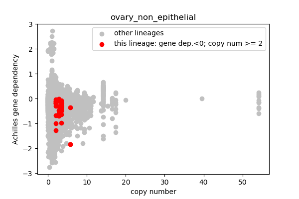

# Sample analysis of Cancer Dependency Map (DepMap) data 
## Request
* Identify the most frequent genetic alterations (could be mutations or copy number variations) in the cancer cell lines
* Match them with the best genetic dependencies that could be used for drug development for the cancers that carry those mutations
* Take into account the lineage of cancer cell lines (certain mutations/CNVs may be restricted to a specific lineage)

## Resources
### DepMap (https://depmap.org/portal) Data 
* Cell line metadata
* Expression (RNASeq)
* Copy number variation
* Mutations
* Genetic dependency
  * Crispr (Achilles)
  * RNAi (DEMETER2)
  
<b>Citations:</b> 
* Jordan G. Bryan, John M. Krill-Burger, Thomas M. Green, Francisca Vazquez, Jesse S. Boehm, Todd R. Golub, William C. Hahn, David E. Root, Aviad Tsherniak. (2018). Improved estimation of cancer dependencies from large-scale RNAi screens using model-based normalization and data integration. Nature Communications 9, 1. https://doi.org/10.1038/s41467-018-06916-5
* DepMap, Broad (2019): DepMap 19Q3 Public. figshare. Dataset doi:10.6084/m9.figshare.9201770.v1.
* Robin M. Meyers, Jordan G. Bryan, James M. McFarland, Barbara A. Weir, ... David E. Root, William C. Hahn, Aviad Tsherniak. Computational correction of copy number effect improves specificity of CRISPR-Cas9 essentiality screens in cancer cells. Nature Genetics 2017 October 49:1779–1784. doi:10.1038/ng.3984

### Jupyter (https://jupyter.org/)
* Python programming framework for analysis prototyping and reporting

### GitHub (https://github.com/)
* Revision control for Python code
* Reporting mechanism for analysis summary and details

## Analysis overview
1. Aggregate data from depmap.org
2. Deal with various data format issues
3. Map cell lines to cancer lineages and sublineages
4. Capture low-hanging fruit genes with high copy number and (Achilles Crispr) gene dependency scores < 0
5. Sanity check filters using ERBB2
6. Compare RNAi and Crispr data fo gene dependency
7. Plot copy number vs. gene dependency by lineage
8. Generate list of candidate genes as a sortable table
9. Add cross-validation filtering data for RNAi, expression, TGCA/COSMIC mutation hotspots
10. target gene info pages

## Next steps
1. Improve thresholds (cutoffs for copy number, gene dependency, expression TPMs, etc.
2. Integrate chemical sensitivity data
3. Filter genes that are already known drug targets (identify truly novel targets)

<a href="analysis/anaysis_details.html">Details...</a>

## Aggregate CCLE cell lines by lineage
<b>DepMap source file:</b> sample_info.csv
* Group all cell lines (CCLE cell line IDs) by main (parent) lineage
* If a lineage has > 1 defined sublineages, also aggregate cell lines by sublineage (eg: leukemia -> AML)

<pre>
Number of cell lines: 1429
Number of lineages: 33
Number of lineages with sub-lineages: 16
Number of sub-lineages 61
</pre>

## Expression Data (RNASeq)
RNAseq TPM gene expression data for just protein coding genes using RSEM. Log2 transformed, using a pseudo-count of 1.

<b>DepMap source file:</b> CCLE_expression.csv
* Transpose columns (gene names) and rows (CCLE cell line IDs)
* Translate gene names to NCBI gene IDs

## Mutation Data 
<b>DepMap source file:</b> CCLE_mutations.csv
* Keep track of TCGA and COSMIC hotspot genes by lineage
* Just using hotspot genes for now but track deleterious mutations by lineage for future reference

8704 TCGA or COSMIC hotspot genes

## Copy number data
Gene level copy number data, log2 transformed with a pseudo count of 1. This is generated by mapping genes onto the segment level calls.

<b>Depmap source file:</b> CCLE_gene_cn_v2.csv
* Transpose columns (gene names) and rows (CCLE cell line IDs)
* Translate gene names to NCBI gene IDs

Copy number data descritive stats:

## Search for high copy number genes in each of the lineages
* Seleting genes with copy number > 2 in <b><i>all</i></b> cell lines is a lineage is a bit too stringent
* Retain genes that have copy number >= 2 in 80% or more cell lines in a lineage
* Extract the data for any cell lines with high copy number genes to use as plotting baseline

<pre>
<pre>
<pre>
bone_chordoma; 4 cell lines; 11 high copy number genes
eye_uveal_melanoma; 5 cell lines; 1016 high copy number genes
ovary_immortalized; 1 cell lines; 9 high copy number genes
ovary_non_epithelial; 2 cell lines; 74 high copy number genes
lung_immortalized; 1 cell lines; 6 high copy number genes
adrenal_cortex; 1 cell lines; 200 high copy number genes
soft_tissue_fibrosarcoma; 1 cell lines; 2 high copy number genes
soft_tissue_liposarcoma; 5 cell lines; 44 high copy number genes
soft_tissue_sarcoma_undifferentiated; 2 cell lines; 164 high copy number genes
soft_tissue_epitheliod_sarcoma; 2 cell lines; 2 high copy number genes
esophagus_adenocarcinoma; 7 cell lines; 7 high copy number genes
gastric_adenosquamous; 1 cell lines; 508 high copy number genes
skin_squamous; 3 cell lines; 251 high copy number genes
skin_Merkel; 7 cell lines; 251 high copy number genes
skin_epidermoid_carcinoma; 1 cell lines; 234 high copy number genes
peripheral_nervous_system_PNET; 1 cell lines; 22 high copy number genes
upper_aerodigestive_buccal_mucosa; 1 cell lines; 592 high copy number genes
central_nervous_system_PNET; 1 cell lines; 2 high copy number genes
central_nervous_system_immortalized; 1 cell lines; 26 high copy number genes
central_nervous_system_meningioma; 3 cell lines; 151 high copy number genes
breast_HER2Amp; 13 cell lines; 11 high copy number genes
breast_ERneg; 1 cell lines; 960 high copy number genes
breast_immortalized; 2 cell lines; 8 high copy number genes
lymphoblastic_lymphoma; 1 cell lines; 311 high copy number genes
lymphoma_B-cell_ALL; 2 cell lines; 3 high copy number genes
</pre>
<pre>
bone_chordoma; 4 cell lines; 11 high copy number genes
eye_uveal_melanoma; 5 cell lines; 1016 high copy number genes
ovary_immortalized; 1 cell lines; 9 high copy number genes
ovary_non_epithelial; 2 cell lines; 74 high copy number genes
lung_immortalized; 1 cell lines; 6 high copy number genes
adrenal_cortex; 1 cell lines; 200 high copy number genes
soft_tissue_fibrosarcoma; 1 cell lines; 2 high copy number genes
soft_tissue_liposarcoma; 5 cell lines; 44 high copy number genes
soft_tissue_sarcoma_undifferentiated; 2 cell lines; 164 high copy number genes
soft_tissue_epitheliod_sarcoma; 2 cell lines; 2 high copy number genes
esophagus_adenocarcinoma; 7 cell lines; 7 high copy number genes
gastric_adenosquamous; 1 cell lines; 508 high copy number genes
skin_squamous; 3 cell lines; 251 high copy number genes
skin_Merkel; 7 cell lines; 251 high copy number genes
skin_epidermoid_carcinoma; 1 cell lines; 234 high copy number genes
peripheral_nervous_system_PNET; 1 cell lines; 22 high copy number genes
upper_aerodigestive_buccal_mucosa; 1 cell lines; 592 high copy number genes
central_nervous_system_PNET; 1 cell lines; 2 high copy number genes
central_nervous_system_immortalized; 1 cell lines; 26 high copy number genes
central_nervous_system_meningioma; 3 cell lines; 151 high copy number genes
breast_HER2Amp; 13 cell lines; 11 high copy number genes
breast_ERneg; 1 cell lines; 960 high copy number genes
breast_immortalized; 2 cell lines; 8 high copy number genes
lymphoblastic_lymphoma; 1 cell lines; 311 high copy number genes
lymphoma_B-cell_ALL; 2 cell lines; 3 high copy number genes
</pre>

## DEMETER2 RNAi gene dependency data
Cancer cell line genetic dependencies estimated using the DEMETER2 model. DEMETER2 is applied to three large-scale RNAi screening datasets: the Broad Institute Project Achilles, Novartis Project DRIVE, and the Marcotte et al. breast cell line dataset. The model is also applied to generate a combined dataset of gene dependencies covering a total of 712 unique cancer cell lines.

<b>DepMap source file:</b> D2_combined_gene_dep_scores.csv 

* Data source uses CCLE names rather than DepMap cell line IDS
* Translate the cell line names to IDS for consistency with other data sources
* Also deal with rows in the table with multiple gene names (eg 'GTF2IP4&GTF2IP1 (100093631&2970)')

## Achilles Crispr gene dependency data
CERES data with principle components strongly related to known batch effects removed, then shifted and scaled per cell line so the median nonessential KO effect is 0 and the median essential KO effect is -1.

<b>DepMap source file:</b> Achilles_gene_effect.csv 

* Translate gene names (column labels) to NCBI IDS
* Transpose rows and columns so each cell line is a column label with vertivally stacked gene data

### How many cell lines and genes are shared between D2 (RNAi) and Achilles (Crispr) gene dependency data sets?

<pre>
423 cell lines are shared
16052 genes are shared
</pre>
### How do RNAi and Crispr screen compare for gene dependency score?

## Assemble the candidate gene table
1. Start with gene:cell pairs that were identified has having >= 80% high copy number for all cell lines in the sublineage
2. Get copynumber, Achilles (Crispr), D2 (RNAi), hotspot and expression data
3. Remove genes with copy number < 2 or Achilles (Crispr) dependency > 0

* significant p-value means reject H0 that slope == 0
* We will use the Achilles (Crispr) gene dependency score and check for positive agreement with RNAi later

### Sanity checking with ERBB2 (2064)
Evaluating breast cancer lineages where at least one cell line had copy number > 2:
* Is ERB2B in the hotspot gene set?
* We expect ERBB2 to have high copy number in breast cancer lineages
  ** What is the mean ERB2B copy number in breast cancers?
* The gene dependency score should be < 0
  ** What is the mean gene dependency score in breast cancers?

ERBB2 is in hotspot gene set? <b>TRUE</b>
<pre>
ERBB2 mean copy number for breast_HER2Amp (11 cell lines): 14.84
ERBB2 mean copy number for breast_TNBC (27 cell lines): 1.89
ERBB2 mean copy number for breast_TPBC (5 cell lines): 9.59
ERBB2 mean gene dependency for breast_HER2Amp (6 cell lines): -0.83
ERBB2 mean gene dependency for breast_ERpos (7 cell lines): -0.27
ERBB2 mean gene dependency for breast_TNBC (15 cell lines): -0.28
</pre>

## Lineages with observed high copy number genes

* Go through the list of lineages with high copy number genes
* Plot gene dependency vs. copy number
* Highlight genes/cell-lines with copy number > 2 and gene dependency < 0 for specific lineages

### Copy number vs gene dependency

## Candidate target genes

* All genes in this table have copy number > 2 and Achilles gene dependency < 0 for at least 80% of the cell lines in 1 cell lineage'
* Other data for cross-validation:
  * RNAi gene dependency score
  * Whether the gene is a TCGA or COSMIC mutation hotspot
  * Whether the gene has > 0 TPM RNASeq expression
  


<h2>Links to gene information</h2>
DepMap summary, expression, Reactome pathways 
<a href="reports/MTBP.html">MTBP</a> 
<a href="reports/DCTN6.html">DCTN6</a> 
<a href="reports/CHMP7.html">CHMP7</a> 
<a href="reports/SERF2.html">SERF2</a> 
<a href="reports/SLC6A5.html">SLC6A5</a> 
<a href="reports/VCPIP1.html">VCPIP1</a> 
<a href="reports/PPP1R14D.html">PPP1R14D</a> 
<a href="reports/ST3GAL1.html">ST3GAL1</a> 
<a href="reports/FRS3.html">FRS3</a> 
<a href="reports/MROH1.html">MROH1</a> 
<a href="reports/P4HA3.html">P4HA3</a> 
<a href="reports/XPA.html">XPA</a> 
<a href="reports/CEP126.html">CEP126</a> 
<a href="reports/TACSTD2.html">TACSTD2</a> 
<a href="reports/POU5F1B.html">POU5F1B</a> 
<a href="reports/TRIO.html">TRIO</a> 
<a href="reports/ANAPC15.html">ANAPC15</a> 
<a href="reports/ZDHHC11B.html">ZDHHC11B</a> 
<a href="reports/ZNF703.html">ZNF703</a> 
<a href="reports/OTULIN.html">OTULIN</a> 
<a href="reports/TNRC6C.html">TNRC6C</a> 
<a href="reports/RPL7.html">RPL7</a> 
<a href="reports/CHCHD10.html">CHCHD10</a> 
<a href="reports/PVR.html">PVR</a> 
<a href="reports/FUT4.html">FUT4</a> 
<a href="reports/MRPS18B.html">MRPS18B</a> 
<a href="reports/INPPL1.html">INPPL1</a> 
<a href="reports/KHDRBS3.html">KHDRBS3</a> 
<a href="reports/CCT6A.html">CCT6A</a> 
<a href="reports/TRIM49C.html">TRIM49C</a> 
<a href="reports/TUSC3.html">TUSC3</a> 
<a href="reports/LRRC14B.html">LRRC14B</a> 
<a href="reports/MRPS10.html">MRPS10</a> 
<a href="reports/TBC1D22A.html">TBC1D22A</a> 
<a href="reports/MIF.html">MIF</a> 
<a href="reports/ENDOD1.html">ENDOD1</a> 
<a href="reports/ICE1.html">ICE1</a> 
<a href="reports/VXN.html">VXN</a> 
<a href="reports/POLH.html">POLH</a> 
<a href="reports/TYRO3.html">TYRO3</a> 
<a href="reports/PIP4P2.html">PIP4P2</a> 
<a href="reports/FAM98B.html">FAM98B</a> 
<a href="reports/FASTKD3.html">FASTKD3</a> 
<a href="reports/TERF1.html">TERF1</a> 
<a href="reports/COX6C.html">COX6C</a> 
<a href="reports/ADAMTS16.html">ADAMTS16</a> 
<a href="reports/USP8.html">USP8</a> 
<a href="reports/CRLS1.html">CRLS1</a> 
<a href="reports/CHORDC1.html">CHORDC1</a> 
<a href="reports/TRERF1.html">TRERF1</a> 
<a href="reports/OPN5.html">OPN5</a> 
<a href="reports/PUF60.html">PUF60</a> 
<a href="reports/CTNND2.html">CTNND2</a> 
<a href="reports/DMXL2.html">DMXL2</a> 
<a href="reports/C6orf136.html">C6orf136</a> 
<a href="reports/TAF1D.html">TAF1D</a> 
<a href="reports/PIWIL3.html">PIWIL3</a> 
<a href="reports/NR2C1.html">NR2C1</a> 
<a href="reports/IRX2.html">IRX2</a> 
<a href="reports/C6orf132.html">C6orf132</a> 
<a href="reports/IGLL5.html">IGLL5</a> 
<a href="reports/MTERF3.html">MTERF3</a> 
<a href="reports/IL18BP.html">IL18BP</a> 
<a href="reports/FBXO4.html">FBXO4</a> 
<a href="reports/CCDC116.html">CCDC116</a> 
<a href="reports/TIGD5.html">TIGD5</a> 
<a href="reports/RAB6A.html">RAB6A</a> 
<a href="reports/TPCN2.html">TPCN2</a> 
<a href="reports/DNAH5.html">DNAH5</a> 
<a href="reports/CHRAC1.html">CHRAC1</a> 
<a href="reports/TTI2.html">TTI2</a> 
<a href="reports/MOGAT2.html">MOGAT2</a> 
<a href="reports/VPREB3.html">VPREB3</a> 
<a href="reports/MTMR12.html">MTMR12</a> 
<a href="reports/TSR2.html">TSR2</a> 
<a href="reports/ERLIN2.html">ERLIN2</a> 
<a href="reports/DCAF13.html">DCAF13</a> 
<a href="reports/GPR152.html">GPR152</a> 
<a href="reports/CASP4.html">CASP4</a> 
<a href="reports/C8orf88.html">C8orf88</a> 
<a href="reports/DUT.html">DUT</a> 
<a href="reports/ASH2L.html">ASH2L</a> 
<a href="reports/AMACR.html">AMACR</a> 
<a href="reports/KBTBD3.html">KBTBD3</a> 
<a href="reports/IL17A.html">IL17A</a> 
<a href="reports/MFSD3.html">MFSD3</a> 
<a href="reports/CYP2J2.html">CYP2J2</a> 
<a href="reports/P2RY2.html">P2RY2</a> 
<a href="reports/NIPBL.html">NIPBL</a> 
<a href="reports/C5orf49.html">C5orf49</a> 
<a href="reports/CHAC1.html">CHAC1</a> 
<a href="reports/SQOR.html">SQOR</a> 
<a href="reports/MRPL48.html">MRPL48</a> 
<a href="reports/ALDH3B2.html">ALDH3B2</a> 
<a href="reports/MCM3.html">MCM3</a> 
<a href="reports/GRM5.html">GRM5</a> 
<a href="reports/WNK3.html">WNK3</a> 
<a href="reports/LRRC1.html">LRRC1</a> 
<a href="reports/A1CF.html">A1CF</a> 
<a href="reports/EIF3E.html">EIF3E</a> 
<a href="reports/UBR5.html">UBR5</a> 
<a href="reports/TARS.html">TARS</a> 
<a href="reports/CPSF1.html">CPSF1</a> 
<a href="reports/TMIGD2.html">TMIGD2</a> 
<a href="reports/RPP21.html">RPP21</a> 
<a href="reports/ATP6V1G2.html">ATP6V1G2</a> 
<a href="reports/ZBTB10.html">ZBTB10</a> 
<a href="reports/TPBGL.html">TPBGL</a> 
<a href="reports/GUCD1.html">GUCD1</a> 
<a href="reports/HSCB.html">HSCB</a> 
<a href="reports/PDIA6.html">PDIA6</a> 
<a href="reports/MRPS28.html">MRPS28</a> 
<a href="reports/OIP5.html">OIP5</a> 
<a href="reports/ABRA.html">ABRA</a> 
<a href="reports/ESCO2.html">ESCO2</a> 
<a href="reports/AANAT.html">AANAT</a> 
<a href="reports/RARS.html">RARS</a> 
<a href="reports/RNF169.html">RNF169</a> 
<a href="reports/ODF1.html">ODF1</a> 
<a href="reports/UCP3.html">UCP3</a> 
<a href="reports/BGLAP.html">BGLAP</a> 
<a href="reports/SLC6A3.html">SLC6A3</a> 
<a href="reports/FER1L6.html">FER1L6</a> 
<a href="reports/EXTL3.html">EXTL3</a> 
<a href="reports/USP49.html">USP49</a> 
<a href="reports/GNL1.html">GNL1</a> 
<a href="reports/LRATD2.html">LRATD2</a> 
<a href="reports/MRPS18A.html">MRPS18A</a> 
<a href="reports/CDCA2.html">CDCA2</a> 
<a href="reports/NOP56.html">NOP56</a> 
<a href="reports/TRIP13.html">TRIP13</a> 
<a href="reports/MRPL21.html">MRPL21</a> 
<a href="reports/OTUD6B.html">OTUD6B</a> 
<a href="reports/ZNF250.html">ZNF250</a> 
<a href="reports/SHC4.html">SHC4</a> 
<a href="reports/TBCC.html">TBCC</a> 
<a href="reports/DHX16.html">DHX16</a> 
<a href="reports/OR4K2.html">OR4K2</a> 
<a href="reports/ITPA.html">ITPA</a> 
<a href="reports/COMMD5.html">COMMD5</a> 
<a href="reports/EFHC1.html">EFHC1</a> 
<a href="reports/TMEM64.html">TMEM64</a> 
<a href="reports/FGFR1.html">FGFR1</a> 
<a href="reports/TM2D1.html">TM2D1</a> 
<a href="reports/AP4S1.html">AP4S1</a> 
<a href="reports/SLC9A3.html">SLC9A3</a> 
<a href="reports/MYSM1.html">MYSM1</a> 
<a href="reports/BRD9.html">BRD9</a> 
<a href="reports/NEFM.html">NEFM</a> 
<a href="reports/DOCK7.html">DOCK7</a> 
<a href="reports/OMA1.html">OMA1</a> 
<a href="reports/SPECC1L.html">SPECC1L</a> 
<a href="reports/PPME1.html">PPME1</a> 
<a href="reports/CSPP1.html">CSPP1</a> 
<a href="reports/ATF1.html">ATF1</a> 
<a href="reports/CUL9.html">CUL9</a> 
<a href="reports/FBXO9.html">FBXO9</a> 
<a href="reports/EVL.html">EVL</a> 
<a href="reports/PLEKHF2.html">PLEKHF2</a> 
<a href="reports/MLIP.html">MLIP</a> 
<a href="reports/CYC1.html">CYC1</a> 
<a href="reports/SPHK1.html">SPHK1</a> 
<a href="reports/NUP155.html">NUP155</a> 
<a href="reports/LEO1.html">LEO1</a> 
<a href="reports/TBR1.html">TBR1</a> 
<a href="reports/MTNR1B.html">MTNR1B</a> 
<a href="reports/TBX10.html">TBX10</a> 
<a href="reports/RPS6KB2.html">RPS6KB2</a> 
<a href="reports/RPS20.html">RPS20</a> 
<a href="reports/MRPS26.html">MRPS26</a> 
<a href="reports/SLC30A4.html">SLC30A4</a> 
<a href="reports/INTS8.html">INTS8</a> 
<a href="reports/TCIM.html">TCIM</a> 
<a href="reports/SPATA5L1.html">SPATA5L1</a> 
<a href="reports/PI15.html">PI15</a> 
<a href="reports/KCTD21.html">KCTD21</a> 
<a href="reports/LACTB2.html">LACTB2</a> 
<a href="reports/PITPNB.html">PITPNB</a> 
<a href="reports/BLID.html">BLID</a> 
<a href="reports/TTBK1.html">TTBK1</a> 
<a href="reports/OR4M1.html">OR4M1</a> 
<a href="reports/C8orf82.html">C8orf82</a> 
<a href="reports/NUDT8.html">NUDT8</a> 
<a href="reports/SPIDR.html">SPIDR</a> 
<a href="reports/MAGED2.html">MAGED2</a> 
<a href="reports/CLNS1A.html">CLNS1A</a> 
<a href="reports/COPS2.html">COPS2</a> 
<a href="reports/RRS1.html">RRS1</a> 
<a href="reports/EBF4.html">EBF4</a> 
<a href="reports/RELT.html">RELT</a> 
<a href="reports/TMEM151B.html">TMEM151B</a> 
<a href="reports/MRGPRF.html">MRGPRF</a> 
<a href="reports/FGF19.html">FGF19</a> 
<a href="reports/DROSHA.html">DROSHA</a> 
<a href="reports/CCDC89.html">CCDC89</a> 
<a href="reports/PLEKHS1.html">PLEKHS1</a> 
<a href="reports/RDH10.html">RDH10</a> 
<a href="reports/ARFGEF1.html">ARFGEF1</a> 
<a href="reports/MEA1.html">MEA1</a> 
<a href="reports/NDUFAF6.html">NDUFAF6</a> 
<a href="reports/CEACAM19.html">CEACAM19</a> 
<a href="reports/TRAM2.html">TRAM2</a> 
<a href="reports/FAM120C.html">FAM120C</a> 
<a href="reports/SLCO2B1.html">SLCO2B1</a> 
<a href="reports/CEP57.html">CEP57</a> 
<a href="reports/PITPNM1.html">PITPNM1</a> 
<a href="reports/ABCF1.html">ABCF1</a> 
<a href="reports/PRSS55.html">PRSS55</a> 
<a href="reports/ZFP41.html">ZFP41</a> 
<a href="reports/EIF3J.html">EIF3J</a> 
<a href="reports/MAD2L1BP.html">MAD2L1BP</a> 
<a href="reports/TMEM249.html">TMEM249</a> 
<a href="reports/NDUFS6.html">NDUFS6</a> 
<a href="reports/GALK2.html">GALK2</a> 
<a href="reports/MED30.html">MED30</a> 
<a href="reports/ITIH6.html">ITIH6</a> 
<a href="reports/STRC.html">STRC</a> 
<a href="reports/NRBP2.html">NRBP2</a> 
<a href="reports/PRKAA2.html">PRKAA2</a> 
<a href="reports/RPS3.html">RPS3</a> 
<a href="reports/ABCC10.html">ABCC10</a> 
<a href="reports/ELL3.html">ELL3</a> 
<a href="reports/ICK.html">ICK</a> 
<a href="reports/PPARGC1A.html">PPARGC1A</a> 
<a href="reports/NPBWR1.html">NPBWR1</a> 
<a href="reports/FNDC7.html">FNDC7</a> 
<a href="reports/FDFT1.html">FDFT1</a> 
<a href="reports/NNT.html">NNT</a> 
<a href="reports/DENND1C.html">DENND1C</a> 
<a href="reports/RNF121.html">RNF121</a> 
<a href="reports/C22orf15.html">C22orf15</a> 
<a href="reports/RB1CC1.html">RB1CC1</a> 
<a href="reports/CA1.html">CA1</a> 
<a href="reports/GPIHBP1.html">GPIHBP1</a> 
<a href="reports/ADGRF5.html">ADGRF5</a> 
<a href="reports/CBLC.html">CBLC</a> 
<a href="reports/ERICH5.html">ERICH5</a> 
<a href="reports/SLC12A1.html">SLC12A1</a> 
<a href="reports/PLA2G7.html">PLA2G7</a> 
<a href="reports/EIF4EBP1.html">EIF4EBP1</a> 
<a href="reports/GABPB1.html">GABPB1</a> 
<a href="reports/KCTD9.html">KCTD9</a> 
<a href="reports/DAP.html">DAP</a> 
<a href="reports/ZNF705B.html">ZNF705B</a> 
<a href="reports/ENPP2.html">ENPP2</a> 
<a href="reports/ZNF705D.html">ZNF705D</a> 
<a href="reports/PRSS23.html">PRSS23</a> 
<a href="reports/KRTAP5-10.html">KRTAP5-10</a> 
<a href="reports/C6orf226.html">C6orf226</a> 
<a href="reports/ZNF34.html">ZNF34</a> 
<a href="reports/FABP5.html">FABP5</a> 
<a href="reports/FAM227B.html">FAM227B</a> 
<a href="reports/C9.html">C9</a> 
<a href="reports/POLD4.html">POLD4</a> 
<a href="reports/ERBB2.html">ERBB2</a> 
<a href="reports/GRHL2.html">GRHL2</a> 
<a href="reports/MBOAT4.html">MBOAT4</a> 
<a href="reports/DNAJC21.html">DNAJC21</a> 
<a href="reports/SLC22A7.html">SLC22A7</a> 
<a href="reports/NARS2.html">NARS2</a> 
<a href="reports/MAPK6.html">MAPK6</a> 
<a href="reports/NFIA.html">NFIA</a> 
<a href="reports/GDAP1.html">GDAP1</a> 
<a href="reports/JMJD7.html">JMJD7</a> 
<a href="reports/RMDN3.html">RMDN3</a> 
<a href="reports/UCP2.html">UCP2</a> 
<a href="reports/PCF11.html">PCF11</a> 
<a href="reports/RPL30.html">RPL30</a> 
<a href="reports/RICTOR.html">RICTOR</a> 
<a href="reports/DYNC2H1.html">DYNC2H1</a> 
<a href="reports/DEFB136.html">DEFB136</a> 
<a href="reports/THAP12.html">THAP12</a> 
<a href="reports/RNF170.html">RNF170</a> 
<a href="reports/GRINA.html">GRINA</a> 
<a href="reports/NSMCE2.html">NSMCE2</a> 
<a href="reports/LIFR.html">LIFR</a> 
<a href="reports/HGH1.html">HGH1</a> 
<a href="reports/EED.html">EED</a> 
<a href="reports/TPPP.html">TPPP</a> 
<a href="reports/ZDHHC11.html">ZDHHC11</a> 
<a href="reports/CCAR1.html">CCAR1</a> 
<a href="reports/ADGRF4.html">ADGRF4</a> 
<a href="reports/RXFP3.html">RXFP3</a> 
<a href="reports/LAMTOR1.html">LAMTOR1</a> 
<a href="reports/MMP11.html">MMP11</a> 
<a href="reports/AARS2.html">AARS2</a> 
<a href="reports/CCDC81.html">CCDC81</a> 
<a href="reports/SNAI2.html">SNAI2</a> 
<a href="reports/NAPRT.html">NAPRT</a> 
<a href="reports/POLR3D.html">POLR3D</a> 
<a href="reports/ARHGAP39.html">ARHGAP39</a> 
<a href="reports/PITRM1.html">PITRM1</a> 
<a href="reports/AASDHPPT.html">AASDHPPT</a> 
<a href="reports/ZFR.html">ZFR</a> 
<a href="reports/AQR.html">AQR</a> 
<a href="reports/MTMR9.html">MTMR9</a> 
<a href="reports/TRIM39.html">TRIM39</a> 
<a href="reports/SHLD1.html">SHLD1</a> 
<a href="reports/PCM1.html">PCM1</a> 
<a href="reports/HERC1.html">HERC1</a> 
<a href="reports/SRF.html">SRF</a> 
<a href="reports/KMT5B.html">KMT5B</a> 
<a href="reports/C6orf141.html">C6orf141</a> 
<a href="reports/GTF2E2.html">GTF2E2</a> 
<a href="reports/LPCAT1.html">LPCAT1</a> 
<a href="reports/CARD6.html">CARD6</a> 
<a href="reports/KATNA1.html">KATNA1</a> 
<a href="reports/PPP2R5D.html">PPP2R5D</a> 
<a href="reports/TTC27.html">TTC27</a> 
<a href="reports/TSNARE1.html">TSNARE1</a> 
<a href="reports/MMP10.html">MMP10</a> 
<a href="reports/CA8.html">CA8</a> 
<a href="reports/GLYATL3.html">GLYATL3</a> 
<a href="reports/WASHC5.html">WASHC5</a> 
<a href="reports/RHPN1.html">RHPN1</a> 
<a href="reports/TMEM134.html">TMEM134</a> 
<a href="reports/PRKAA1.html">PRKAA1</a> 
<a href="reports/CHRDL2.html">CHRDL2</a> 
<a href="reports/DDTL.html">DDTL</a> 
<a href="reports/KCNE3.html">KCNE3</a> 
<a href="reports/KLF10.html">KLF10</a> 
<a href="reports/PTK7.html">PTK7</a> 
<a href="reports/APEX2.html">APEX2</a> 
<a href="reports/RHAG.html">RHAG</a> 
<a href="reports/KCNV1.html">KCNV1</a> 
<a href="reports/MSC.html">MSC</a> 
<a href="reports/PDZD2.html">PDZD2</a> 
<a href="reports/C2CD3.html">C2CD3</a> 
<a href="reports/ANKRD33B.html">ANKRD33B</a> 
<a href="reports/PPP1R1B.html">PPP1R1B</a> 
<a href="reports/ZNF383.html">ZNF383</a> 
<a href="reports/UBE2O.html">UBE2O</a> 
<a href="reports/NDUFV1.html">NDUFV1</a> 
<a href="reports/PSG6.html">PSG6</a> 
<a href="reports/HEY1.html">HEY1</a> 
<a href="reports/FSD1.html">FSD1</a> 
<a href="reports/GUCA1B.html">GUCA1B</a> 
<a href="reports/TGFA.html">TGFA</a> 
<a href="reports/BHLHE22.html">BHLHE22</a> 
<a href="reports/CHMP4C.html">CHMP4C</a> 
<a href="reports/CHGB.html">CHGB</a> 
<a href="reports/GRK3.html">GRK3</a> 
<a href="reports/CPQ.html">CPQ</a> 
<a href="reports/KIAA1671.html">KIAA1671</a> 
<a href="reports/TNFAIP8L3.html">TNFAIP8L3</a> 
<a href="reports/POLR1C.html">POLR1C</a> 
<a href="reports/SIRPA.html">SIRPA</a> 
<a href="reports/GANC.html">GANC</a> 
<a href="reports/TESMIN.html">TESMIN</a> 
<a href="reports/GATM.html">GATM</a> 
<a href="reports/MAPKBP1.html">MAPKBP1</a> 
<a href="reports/ARRB1.html">ARRB1</a> 
<a href="reports/ZNF713.html">ZNF713</a> 
<a href="reports/ZNF131.html">ZNF131</a> 
<a href="reports/TAF2.html">TAF2</a> 
<a href="reports/CCND3.html">CCND3</a> 
<a href="reports/C5orf34.html">C5orf34</a> 
<a href="reports/NSUN2.html">NSUN2</a> 
<a href="reports/UBE2QL1.html">UBE2QL1</a> 
<a href="reports/USP35.html">USP35</a> 
<a href="reports/C1orf87.html">C1orf87</a> 
<a href="reports/PGR.html">PGR</a> 
<a href="reports/UBR2.html">UBR2</a> 
<a href="reports/GAL.html">GAL</a> 
<a href="reports/PICALM.html">PICALM</a> 
<a href="reports/ARAP1.html">ARAP1</a> 
<a href="reports/ANTXRL.html">ANTXRL</a> 
<a href="reports/CNPY3.html">CNPY3</a> 
<a href="reports/MRPL14.html">MRPL14</a> 
<a href="reports/HIKESHI.html">HIKESHI</a> 
<a href="reports/CNOT7.html">CNOT7</a> 
<a href="reports/POTEG.html">POTEG</a> 
<a href="reports/CRISP2.html">CRISP2</a> 
<a href="reports/SGSM1.html">SGSM1</a> 
<a href="reports/BRD3.html">BRD3</a> 
<a href="reports/HOOK1.html">HOOK1</a> 
<a href="reports/NRM.html">NRM</a> 
<a href="reports/PTCRA.html">PTCRA</a> 
<a href="reports/PATJ.html">PATJ</a> 
<a href="reports/TCAP.html">TCAP</a> 
<a href="reports/TOMM40.html">TOMM40</a> 
<a href="reports/CAPN5.html">CAPN5</a> 
<a href="reports/PAQR6.html">PAQR6</a> 
<a href="reports/SLC25A37.html">SLC25A37</a> 
<a href="reports/PLEKHG4B.html">PLEKHG4B</a> 
<a href="reports/BOP1.html">BOP1</a> 
<a href="reports/GSTP1.html">GSTP1</a> 
<a href="reports/TCIRG1.html">TCIRG1</a> 
<a href="reports/PRCP.html">PRCP</a> 
<a href="reports/FGF20.html">FGF20</a> 
<a href="reports/CRH.html">CRH</a> 
<a href="reports/RNF139.html">RNF139</a> 
<a href="reports/MYO7A.html">MYO7A</a> 
<a href="reports/C5orf38.html">C5orf38</a> 
<a href="reports/PDGFD.html">PDGFD</a> 
<a href="reports/FOXH1.html">FOXH1</a> 
<a href="reports/VPS37A.html">VPS37A</a> 
<a href="reports/PRPSAP1.html">PRPSAP1</a> 
<a href="reports/PANK3.html">PANK3</a> 
<a href="reports/FAM86C1.html">FAM86C1</a> 
<a href="reports/CHRNA6.html">CHRNA6</a> 
<a href="reports/PAIP1.html">PAIP1</a> 
<a href="reports/PPP1R16A.html">PPP1R16A</a> 
<a href="reports/DSCC1.html">DSCC1</a> 
<a href="reports/NAALAD2.html">NAALAD2</a> 
<a href="reports/DLK2.html">DLK2</a> 
<a href="reports/NUSAP1.html">NUSAP1</a> 
<a href="reports/ANKRD49.html">ANKRD49</a> 
<a href="reports/LAPTM4B.html">LAPTM4B</a> 
<a href="reports/SKP2.html">SKP2</a> 
<a href="reports/SLC25A32.html">SLC25A32</a> 
<a href="reports/GSTA3.html">GSTA3</a> 
<a href="reports/EXT1.html">EXT1</a> 
<a href="reports/DEFB131B.html">DEFB131B</a> 
<a href="reports/XPO5.html">XPO5</a> 
<a href="reports/FBN1.html">FBN1</a> 
<a href="reports/KREMEN1.html">KREMEN1</a> 
<a href="reports/CARNS1.html">CARNS1</a> 
<a href="reports/PRICKLE4.html">PRICKLE4</a> 
<a href="reports/IER3.html">IER3</a> 
<a href="reports/KLHL38.html">KLHL38</a> 
<a href="reports/CPNE3.html">CPNE3</a> 
<a href="reports/LRP5L.html">LRP5L</a> 
<a href="reports/MMP20.html">MMP20</a> 
<a href="reports/LRRC75B.html">LRRC75B</a> 
<a href="reports/ADAM7.html">ADAM7</a> 
<a href="reports/FADD.html">FADD</a> 
<a href="reports/WRN.html">WRN</a> 
<a href="reports/FBXL7.html">FBXL7</a> 
<a href="reports/KCNQ3.html">KCNQ3</a> 
<a href="reports/PRR3.html">PRR3</a> 
<a href="reports/PTGER4.html">PTGER4</a> 
<a href="reports/TRIM69.html">TRIM69</a> 
<a href="reports/GDNF.html">GDNF</a> 
<a href="reports/ACY3.html">ACY3</a> 
<a href="reports/XBP1.html">XBP1</a> 
<a href="reports/CHCHD2.html">CHCHD2</a> 
<a href="reports/ROPN1L.html">ROPN1L</a> 
<a href="reports/SLC27A2.html">SLC27A2</a> 
<a href="reports/DUOXA1.html">DUOXA1</a> 
<a href="reports/GSDMD.html">GSDMD</a> 
<a href="reports/PSG11.html">PSG11</a> 
<a href="reports/NADSYN1.html">NADSYN1</a> 
<a href="reports/FGGY.html">FGGY</a> 
<a href="reports/PLEC.html">PLEC</a> 
<a href="reports/THAP1.html">THAP1</a> 
<a href="reports/PTK2.html">PTK2</a> 
<a href="reports/GNMT.html">GNMT</a> 
<a href="reports/DERL1.html">DERL1</a> 
<a href="reports/ANKRD66.html">ANKRD66</a> 
<a href="reports/PRDM9.html">PRDM9</a> 
<a href="reports/DKK4.html">DKK4</a> 
<a href="reports/ADORA2A.html">ADORA2A</a> 
<a href="reports/GNL3L.html">GNL3L</a> 
<a href="reports/CCT5.html">CCT5</a> 
<a href="reports/RPAP1.html">RPAP1</a> 
<a href="reports/CCL3L3.html">CCL3L3</a> 
<a href="reports/CYHR1.html">CYHR1</a> 
<a href="reports/MGA.html">MGA</a> 
<a href="reports/LYPLA1.html">LYPLA1</a> 
<a href="reports/TM2D2.html">TM2D2</a> 
<a href="reports/RPL37.html">RPL37</a> 
<a href="reports/ZNF318.html">ZNF318</a> 
<a href="reports/HMGCS1.html">HMGCS1</a> 
<a href="reports/SECISBP2L.html">SECISBP2L</a> 
<a href="reports/GSTA5.html">GSTA5</a> 
<a href="reports/UQCRB.html">UQCRB</a> 
<a href="reports/CDH12.html">CDH12</a> 
<a href="reports/CRISP1.html">CRISP1</a> 
<a href="reports/PPP1R18.html">PPP1R18</a> 
<a href="reports/CABP2.html">CABP2</a> 
<a href="reports/PTRH1.html">PTRH1</a> 
<a href="reports/CTTN.html">CTTN</a> 
<a href="reports/OR4K1.html">OR4K1</a> 
<a href="reports/DUOX1.html">DUOX1</a> 
<a href="reports/DPY19L4.html">DPY19L4</a> 
<a href="reports/TSTA3.html">TSTA3</a> 
<a href="reports/TGS1.html">TGS1</a> 
<a href="reports/PGAP3.html">PGAP3</a> 
<a href="reports/MRPL13.html">MRPL13</a> 
<a href="reports/SDF2L1.html">SDF2L1</a> 
<a href="reports/TRIB1.html">TRIB1</a> 
<a href="reports/ANKRD42.html">ANKRD42</a> 
<a href="reports/SDCBP.html">SDCBP</a> 
<a href="reports/ATP6V1H.html">ATP6V1H</a> 
<a href="reports/TFRC.html">TFRC</a> 
<a href="reports/PIWIL4.html">PIWIL4</a> 
<a href="reports/NEUROD2.html">NEUROD2</a> 
<a href="reports/LRRC32.html">LRRC32</a> 
<a href="reports/TRO.html">TRO</a> 
<a href="reports/TRAPPC9.html">TRAPPC9</a> 
<a href="reports/SLC25A27.html">SLC25A27</a> 
<a href="reports/SNRPB.html">SNRPB</a> 
<a href="reports/DUOX2.html">DUOX2</a> 
<a href="reports/PDGFRL.html">PDGFRL</a> 
<a href="reports/PCNA.html">PCNA</a> 
<a href="reports/TMEM63B.html">TMEM63B</a> 
<a href="reports/OTULINL.html">OTULINL</a> 
<a href="reports/FNTA.html">FNTA</a> 
<a href="reports/TTC28.html">TTC28</a> 
<a href="reports/NDUFAF1.html">NDUFAF1</a> 
<a href="reports/ZNF705E.html">ZNF705E</a> 
<a href="reports/CHKA.html">CHKA</a> 
<a href="reports/UNC45B.html">UNC45B</a> 
<a href="reports/RBM12B.html">RBM12B</a> 
<a href="reports/CIC.html">CIC</a> 
<a href="reports/AGXT2.html">AGXT2</a> 
<a href="reports/C11orf24.html">C11orf24</a> 
<a href="reports/DNAJC5B.html">DNAJC5B</a> 
<a href="reports/BRIX1.html">BRIX1</a> 
<a href="reports/TONSL.html">TONSL</a> 
<a href="reports/PDCD6.html">PDCD6</a> 
<a href="reports/DEFB135.html">DEFB135</a> 
<a href="reports/USP1.html">USP1</a> 
<a href="reports/RAD51.html">RAD51</a> 
<a href="reports/MRPS17.html">MRPS17</a> 
<a href="reports/DDI1.html">DDI1</a> 
<a href="reports/RRP36.html">RRP36</a> 
<a href="reports/ZFHX4.html">ZFHX4</a> 
<a href="reports/RAB38.html">RAB38</a> 
<a href="reports/CTSO.html">CTSO</a> 
<a href="reports/PRPF38B.html">PRPF38B</a> 
<a href="reports/NDUFS8.html">NDUFS8</a> 
<a href="reports/CCDC127.html">CCDC127</a> 
<a href="reports/FOLR3.html">FOLR3</a> 
<a href="reports/PKHD1.html">PKHD1</a> 
<a href="reports/DNAJB13.html">DNAJB13</a> 
<a href="reports/OR4Q3.html">OR4Q3</a> 
<a href="reports/KRTAP5-7.html">KRTAP5-7</a> 
<a href="reports/CCDC117.html">CCDC117</a> 
<a href="reports/ANKRD62.html">ANKRD62</a> 
<a href="reports/PAQR8.html">PAQR8</a> 
<a href="reports/LYPD2.html">LYPD2</a> 
<a href="reports/ATP6V1C1.html">ATP6V1C1</a> 
<a href="reports/PPP1CA.html">PPP1CA</a> 
<a href="reports/CABP4.html">CABP4</a> 
<a href="reports/NSMAF.html">NSMAF</a> 
<a href="reports/CAPN3.html">CAPN3</a> 
<a href="reports/VWA2.html">VWA2</a> 
<a href="reports/GSTA4.html">GSTA4</a> 
<a href="reports/ERF.html">ERF</a> 
<a href="reports/CDH10.html">CDH10</a> 
<a href="reports/WNT11.html">WNT11</a> 
<a href="reports/CFHR1.html">CFHR1</a> 
<a href="reports/DNAJC17.html">DNAJC17</a> 
<a href="reports/FASTKD5.html">FASTKD5</a> 
<a href="reports/TENT4A.html">TENT4A</a> 
<a href="reports/PHKG1.html">PHKG1</a> 
<a href="reports/PSKH2.html">PSKH2</a> 
<a href="reports/TOR4A.html">TOR4A</a> 
<a href="reports/MAPK15.html">MAPK15</a> 
<a href="reports/FAM76B.html">FAM76B</a> 
<a href="reports/SLC29A1.html">SLC29A1</a> 
<a href="reports/ZNF622.html">ZNF622</a> 
<a href="reports/UGT3A1.html">UGT3A1</a> 
<a href="reports/ZFYVE19.html">ZFYVE19</a> 
<a href="reports/PPP2R2A.html">PPP2R2A</a> 
<a href="reports/AARD.html">AARD</a> 
<a href="reports/CLPB.html">CLPB</a> 
<a href="reports/KRTAP5-8.html">KRTAP5-8</a> 
<a href="reports/JUN.html">JUN</a> 
<a href="reports/HTN3.html">HTN3</a> 
<a href="reports/YAP1.html">YAP1</a> 
<a href="reports/BAALC.html">BAALC</a> 
<a href="reports/PGC.html">PGC</a> 
<a href="reports/POP1.html">POP1</a> 
<a href="reports/ADGRF1.html">ADGRF1</a> 
<a href="reports/MCMDC2.html">MCMDC2</a> 
<a href="reports/BHLHA15.html">BHLHA15</a> 
<a href="reports/ZNF680.html">ZNF680</a> 
<a href="reports/ADGRB1.html">ADGRB1</a> 
<a href="reports/INTS6.html">INTS6</a> 
<a href="reports/GGT5.html">GGT5</a> 
<a href="reports/ATPSCKMT.html">ATPSCKMT</a> 
<a href="reports/LTO1.html">LTO1</a> 
<a href="reports/ATP1B2.html">ATP1B2</a> 
<a href="reports/ATAD2.html">ATAD2</a> 
<a href="reports/FANCD2.html">FANCD2</a> 
<a href="reports/EXD1.html">EXD1</a> 
<a href="reports/NUDCD1.html">NUDCD1</a> 
<a href="reports/C8orf76.html">C8orf76</a> 
<a href="reports/MYOM2.html">MYOM2</a> 
<a href="reports/AUTS2.html">AUTS2</a> 
<a href="reports/HYPK.html">HYPK</a> 
<a href="reports/CRYBB3.html">CRYBB3</a> 
<a href="reports/AP4E1.html">AP4E1</a> 
<a href="reports/THRSP.html">THRSP</a> 
<a href="reports/KANK4.html">KANK4</a> 
<a href="reports/TERB2.html">TERB2</a> 
<a href="reports/INTS9.html">INTS9</a> 
<a href="reports/MYO18B.html">MYO18B</a> 
<a href="reports/HPS4.html">HPS4</a> 
<a href="reports/EGFR.html">EGFR</a> 
<a href="reports/MED17.html">MED17</a> 
<a href="reports/DTX1.html">DTX1</a> 
<a href="reports/DENND3.html">DENND3</a> 
<a href="reports/BLOC1S6.html">BLOC1S6</a> 
<a href="reports/INTS4.html">INTS4</a> 
<a href="reports/ASPHD2.html">ASPHD2</a> 
<a href="reports/CHRNA2.html">CHRNA2</a> 
<a href="reports/SPATS1.html">SPATS1</a> 
<a href="reports/GPAT4.html">GPAT4</a> 
<a href="reports/GSTA1.html">GSTA1</a> 
<a href="reports/UTF1.html">UTF1</a> 
<a href="reports/CCNE2.html">CCNE2</a> 
<a href="reports/IDH3B.html">IDH3B</a> 
<a href="reports/RP1L1.html">RP1L1</a> 
<a href="reports/ARPP19.html">ARPP19</a> 
<a href="reports/IRX1.html">IRX1</a> 
<a href="reports/TBC1D10C.html">TBC1D10C</a> 
<a href="reports/PHF8.html">PHF8</a> 
<a href="reports/SRD5A1.html">SRD5A1</a> 
<a href="reports/CEACAM16.html">CEACAM16</a> 
<a href="reports/WDR70.html">WDR70</a> 
<a href="reports/MYO10.html">MYO10</a> 
<a href="reports/DRICH1.html">DRICH1</a> 
<a href="reports/ATP6V1B2.html">ATP6V1B2</a> 
<a href="reports/CRIP3.html">CRIP3</a> 
<a href="reports/RHBDF2.html">RHBDF2</a> 
<a href="reports/ANGPTL5.html">ANGPTL5</a> 
<a href="reports/EXOC3.html">EXOC3</a> 
<a href="reports/PARP10.html">PARP10</a> 
<a href="reports/ANO1.html">ANO1</a> 
<a href="reports/SH3BGR.html">SH3BGR</a> 
<a href="reports/SAT2.html">SAT2</a> 
<a href="reports/PPFIA1.html">PPFIA1</a> 
<a href="reports/POLR2K.html">POLR2K</a> 
<a href="reports/SUB1.html">SUB1</a> 
<a href="reports/SPG11.html">SPG11</a> 
<a href="reports/MDC1.html">MDC1</a> 
<a href="reports/P2RY6.html">P2RY6</a> 
<a href="reports/SPINT1.html">SPINT1</a> 
<a href="reports/RMDN1.html">RMDN1</a> 
<a href="reports/TRPM7.html">TRPM7</a> 
<a href="reports/LY6K.html">LY6K</a> 
<a href="reports/OR4F21.html">OR4F21</a> 
<a href="reports/MMP7.html">MMP7</a> 
<a href="reports/FYB2.html">FYB2</a> 
<a href="reports/CEP72.html">CEP72</a> 
<a href="reports/TFEB.html">TFEB</a> 
<a href="reports/TFAP2D.html">TFAP2D</a> 
<a href="reports/AGO2.html">AGO2</a> 
<a href="reports/PEX6.html">PEX6</a> 
<a href="reports/UBE2V2.html">UBE2V2</a> 
<a href="reports/HECTD1.html">HECTD1</a> 
<a href="reports/AAMDC.html">AAMDC</a> 
<a href="reports/POTEM.html">POTEM</a> 
<a href="reports/SPTBN5.html">SPTBN5</a> 
<a href="reports/USP50.html">USP50</a> 
<a href="reports/NFKBIE.html">NFKBIE</a> 
<a href="reports/ITPKA.html">ITPKA</a> 
<a href="reports/NUPR2.html">NUPR2</a> 
<a href="reports/CLCF1.html">CLCF1</a> 
<a href="reports/TG.html">TG</a> 
<a href="reports/PTP4A3.html">PTP4A3</a> 
<a href="reports/GML.html">GML</a> 
<a href="reports/ZC3H3.html">ZC3H3</a> 
<a href="reports/COPS5.html">COPS5</a> 
<a href="reports/SCRT1.html">SCRT1</a> 
<a href="reports/ELP3.html">ELP3</a> 
<a href="reports/MARCH6.html">MARCH6</a> 
<a href="reports/LALBA.html">LALBA</a> 
<a href="reports/VEGFA.html">VEGFA</a> 
<a href="reports/COX15.html">COX15</a> 
<a href="reports/GTPBP2.html">GTPBP2</a> 
<a href="reports/SNRPD3.html">SNRPD3</a> 
<a href="reports/AHRR.html">AHRR</a> 
<a href="reports/PRPH2.html">PRPH2</a> 
<a href="reports/CDH6.html">CDH6</a> 
<a href="reports/NLE1.html">NLE1</a> 
<a href="reports/PLA2G4D.html">PLA2G4D</a> 
<a href="reports/IKBKB.html">IKBKB</a> 
<a href="reports/HGFAC.html">HGFAC</a> 
<a href="reports/APOE.html">APOE</a> 
<a href="reports/ADCY8.html">ADCY8</a> 
<a href="reports/TAF8.html">TAF8</a> 
<a href="reports/BCAM.html">BCAM</a> 
<a href="reports/RAB2A.html">RAB2A</a> 
<a href="reports/ITPKB.html">ITPKB</a> 
<a href="reports/VPS28.html">VPS28</a> 
<a href="reports/TMEM70.html">TMEM70</a> 
<a href="reports/SLC6A19.html">SLC6A19</a> 
<a href="reports/MRPL2.html">MRPL2</a> 
<a href="reports/ZFYVE16.html">ZFYVE16</a> 
<a href="reports/MAP6.html">MAP6</a> 
<a href="reports/LETM2.html">LETM2</a> 
<a href="reports/PABPC1.html">PABPC1</a> 
<a href="reports/ELOVL5.html">ELOVL5</a> 
<a href="reports/TTC33.html">TTC33</a> 
<a href="reports/IL17F.html">IL17F</a> 
<a href="reports/PEBP4.html">PEBP4</a> 
<a href="reports/XRRA1.html">XRRA1</a> 
<a href="reports/UGT3A2.html">UGT3A2</a> 
<a href="reports/CDKAL1.html">CDKAL1</a> 
<a href="reports/TMEM87A.html">TMEM87A</a> 
<a href="reports/COA4.html">COA4</a> 
<a href="reports/ALG8.html">ALG8</a> 
<a href="reports/MCM4.html">MCM4</a> 
<a href="reports/TENM4.html">TENM4</a> 
<a href="reports/SMIM19.html">SMIM19</a> 
<a href="reports/TUBB.html">TUBB</a> 
<a href="reports/MED10.html">MED10</a> 
<a href="reports/EFR3A.html">EFR3A</a> 
<a href="reports/AIP.html">AIP</a> 
<a href="reports/MAK16.html">MAK16</a> 
<a href="reports/HSF1.html">HSF1</a> 
<a href="reports/PPP6R3.html">PPP6R3</a> 
<a href="reports/KRTAP5-9.html">KRTAP5-9</a> 
<a href="reports/TSKU.html">TSKU</a> 
<a href="reports/AMFR.html">AMFR</a> 
<a href="reports/CASP1.html">CASP1</a> 
<a href="reports/FAM86B2.html">FAM86B2</a> 
<a href="reports/MROH6.html">MROH6</a> 
<a href="reports/CRYBA4.html">CRYBA4</a> 
<a href="reports/RIDA.html">RIDA</a> 
<a href="reports/DLL4.html">DLL4</a> 
<a href="reports/FBXL6.html">FBXL6</a> 
<a href="reports/PFKFB1.html">PFKFB1</a> 
<a href="reports/HLA-E.html">HLA-E</a> 
<a href="reports/VIRMA.html">VIRMA</a> 
<a href="reports/TACC2.html">TACC2</a> 
<a href="reports/TCTE1.html">TCTE1</a> 
<a href="reports/IGHMBP2.html">IGHMBP2</a> 
<a href="reports/CASC4.html">CASC4</a> 
<a href="reports/GCM1.html">GCM1</a> 
<a href="reports/ZNF696.html">ZNF696</a> 
<a href="reports/PSPH.html">PSPH</a> 
<a href="reports/DOK7.html">DOK7</a> 
<a href="reports/CCDC88B.html">CCDC88B</a> 
<a href="reports/TJAP1.html">TJAP1</a> 
<a href="reports/DLG2.html">DLG2</a> 
<a href="reports/RCAN2.html">RCAN2</a> 
<a href="reports/MAP1A.html">MAP1A</a> 
<a href="reports/MRPL36.html">MRPL36</a> 
<a href="reports/ALAS2.html">ALAS2</a> 
<a href="reports/EIF3H.html">EIF3H</a> 
<a href="reports/FAM86B1.html">FAM86B1</a> 
<a href="reports/SQLE.html">SQLE</a> 
<a href="reports/PLA2G4F.html">PLA2G4F</a> 
<a href="reports/FAM110B.html">FAM110B</a> 
<a href="reports/FOXD3.html">FOXD3</a> 
<a href="reports/CMBL.html">CMBL</a> 
<a href="reports/CDK2AP2.html">CDK2AP2</a> 
<a href="reports/SULF1.html">SULF1</a> 
<a href="reports/SHARPIN.html">SHARPIN</a> 
<a href="reports/PTDSS1.html">PTDSS1</a> 
<a href="reports/FAM83H.html">FAM83H</a> 
<a href="reports/NPR3.html">NPR3</a> 
<a href="reports/CABIN1.html">CABIN1</a> 
<a href="reports/CTDSPL2.html">CTDSPL2</a> 
<a href="reports/ESF1.html">ESF1</a> 
<a href="reports/IMPA1.html">IMPA1</a> 
<a href="reports/CFAP300.html">CFAP300</a> 
<a href="reports/TPST2.html">TPST2</a> 
<a href="reports/CPLANE1.html">CPLANE1</a> 
<a href="reports/CCAR2.html">CCAR2</a> 
<a href="reports/HSP90AB1.html">HSP90AB1</a> 
<a href="reports/CDC5L.html">CDC5L</a> 
<a href="reports/EMC2.html">EMC2</a> 
<a href="reports/DEFB4A.html">DEFB4A</a> 
<a href="reports/SELENOP.html">SELENOP</a> 
<a href="reports/C8orf33.html">C8orf33</a> 
<a href="reports/TMOD2.html">TMOD2</a> 
<a href="reports/NKX6-3.html">NKX6-3</a> 
<a href="reports/CCND1.html">CCND1</a> 
<a href="reports/CREBZF.html">CREBZF</a> 
<a href="reports/CDS2.html">CDS2</a> 
<a href="reports/VPS18.html">VPS18</a> 
<a href="reports/JRKL.html">JRKL</a> 
<a href="reports/TOMM6.html">TOMM6</a> 
<a href="reports/SERINC4.html">SERINC4</a> 
<a href="reports/CATSPER2.html">CATSPER2</a> 
<a href="reports/RBIS.html">RBIS</a> 
<a href="reports/FUS.html">FUS</a> 
<a href="reports/UTP23.html">UTP23</a> 
<a href="reports/RAD1.html">RAD1</a> 
<a href="reports/PRLR.html">PRLR</a> 
<a href="reports/THEM6.html">THEM6</a> 
<a href="reports/RSPH9.html">RSPH9</a> 
<a href="reports/CARD16.html">CARD16</a> 
<a href="reports/FAM135B.html">FAM135B</a> 
<a href="reports/OR52I2.html">OR52I2</a> 
<a href="reports/RPL7L1.html">RPL7L1</a> 
<a href="reports/DDR1.html">DDR1</a> 
<a href="reports/ATAT1.html">ATAT1</a> 
<a href="reports/RHOBTB2.html">RHOBTB2</a> 
<a href="reports/WDR76.html">WDR76</a> 
<a href="reports/AP3M2.html">AP3M2</a> 
<a href="reports/FLOT1.html">FLOT1</a> 
<a href="reports/EEF1D.html">EEF1D</a> 
<a href="reports/EMC8.html">EMC8</a> 
<a href="reports/C8orf37.html">C8orf37</a> 
<a href="reports/FAM91A1.html">FAM91A1</a> 
<a href="reports/RAD21.html">RAD21</a> 
<a href="reports/AZIN1.html">AZIN1</a> 
<a href="reports/CUL7.html">CUL7</a> 
<a href="reports/GRB7.html">GRB7</a> 
<a href="reports/TBC1D3B.html">TBC1D3B</a> 
<a href="reports/STK3.html">STK3</a> 
<a href="reports/TFAP2B.html">TFAP2B</a> 
<a href="reports/MTSS1.html">MTSS1</a> 
<a href="reports/SEPTIN14.html">SEPTIN14</a> 
<a href="reports/TNKS.html">TNKS</a> 
<a href="reports/MAF1.html">MAF1</a> 
<a href="reports/GINS4.html">GINS4</a> 
<a href="reports/FZD3.html">FZD3</a> 
<a href="reports/NECTIN2.html">NECTIN2</a> 
<a href="reports/PANX1.html">PANX1</a> 
<a href="reports/VPS16.html">VPS16</a> 
<a href="reports/NDUFB9.html">NDUFB9</a> 
<a href="reports/ATP13A4.html">ATP13A4</a> 
<a href="reports/TMEM230.html">TMEM230</a> 
<a href="reports/EXOSC4.html">EXOSC4</a> 
<a href="reports/ANKH.html">ANKH</a> 
<a href="reports/RP1.html">RP1</a> 
<a href="reports/DOK2.html">DOK2</a> 
<a href="reports/PDLIM1.html">PDLIM1</a> 
<a href="reports/BIRC2.html">BIRC2</a> 
<a href="reports/MRPS30.html">MRPS30</a> 
<a href="reports/SGCA.html">SGCA</a> 
<a href="reports/LTK.html">LTK</a> 
<a href="reports/GRK2.html">GRK2</a> 
<a href="reports/GAB2.html">GAB2</a> 
<a href="reports/MRGPRD.html">MRGPRD</a> 
<a href="reports/CDH9.html">CDH9</a> 
<a href="reports/PRCD.html">PRCD</a> 
<a href="reports/ATG16L2.html">ATG16L2</a> 
<a href="reports/BYSL.html">BYSL</a> 
<a href="reports/SAMD12.html">SAMD12</a> 
<a href="reports/KIAA0895.html">KIAA0895</a> 
<a href="reports/PHOX2A.html">PHOX2A</a> 
<a href="reports/ZNF70.html">ZNF70</a> 
<a href="reports/ZNRF3.html">ZNRF3</a> 
<a href="reports/MIEN1.html">MIEN1</a> 
<a href="reports/NSMCE4A.html">NSMCE4A</a> 
<a href="reports/INO80.html">INO80</a> 
<a href="reports/KLHDC3.html">KLHDC3</a> 
<a href="reports/GPAA1.html">GPAA1</a> 
<a href="reports/TFIP11.html">TFIP11</a> 
<a href="reports/SUMF2.html">SUMF2</a> 
<a href="reports/GLDN.html">GLDN</a> 
<a href="reports/LMBRD2.html">LMBRD2</a> 
<a href="reports/RAD9A.html">RAD9A</a> 
<a href="reports/APOC1.html">APOC1</a> 
<a href="reports/ZNF548.html">ZNF548</a> 
<a href="reports/SMG5.html">SMG5</a> 
<a href="reports/CARD17.html">CARD17</a> 
<a href="reports/CCL28.html">CCL28</a> 
<a href="reports/PLA2G4B.html">PLA2G4B</a> 
<a href="reports/SUSD2.html">SUSD2</a> 
<a href="reports/RTF1.html">RTF1</a> 
<a href="reports/CYP3A43.html">CYP3A43</a> 
<a href="reports/MYEOV.html">MYEOV</a> 
<a href="reports/SFRP1.html">SFRP1</a> 
<a href="reports/MTDH.html">MTDH</a> 
<a href="reports/RASGRP1.html">RASGRP1</a> 
<a href="reports/BDP1.html">BDP1</a> 
<a href="reports/LANCL2.html">LANCL2</a> 
<a href="reports/MED20.html">MED20</a> 
<a href="reports/RIMS2.html">RIMS2</a> 
<a href="reports/C8orf44.html">C8orf44</a> 
<a href="reports/GUCA1A.html">GUCA1A</a> 
<a href="reports/SRRD.html">SRRD</a> 
<a href="reports/PDE2A.html">PDE2A</a> 
<a href="reports/PRDM14.html">PRDM14</a> 
<a href="reports/LRRC73.html">LRRC73</a> 
<a href="reports/DNPH1.html">DNPH1</a> 
<a href="reports/DUOXA2.html">DUOXA2</a> 
<a href="reports/PLA2G4E.html">PLA2G4E</a> 
<a href="reports/TSPYL5.html">TSPYL5</a> 
<a href="reports/SMCO4.html">SMCO4</a> 
<a href="reports/C22orf31.html">C22orf31</a> 
<a href="reports/PAK1.html">PAK1</a> 
<a href="reports/MAML2.html">MAML2</a> 
<a href="reports/BRF2.html">BRF2</a> 
<a href="reports/GLI4.html">GLI4</a> 
<a href="reports/CORO1B.html">CORO1B</a> 
<a href="reports/LRRC14.html">LRRC14</a> 
<a href="reports/CDH18.html">CDH18</a> 
<a href="reports/NUMA1.html">NUMA1</a> 
<a href="reports/SDHA.html">SDHA</a> 
<a href="reports/VPS39.html">VPS39</a> 
<a href="reports/STARD3.html">STARD3</a> 
<a href="reports/TMEM126B.html">TMEM126B</a> 
<a href="reports/KIF7.html">KIF7</a> 
<a href="reports/LY96.html">LY96</a> 
<a href="reports/COX4I1.html">COX4I1</a> 
<a href="reports/FGD1.html">FGD1</a> 
<a href="reports/PLEKHB1.html">PLEKHB1</a> 
<a href="reports/B3GNT6.html">B3GNT6</a> 
<a href="reports/RUNX2.html">RUNX2</a> 
<a href="reports/GGT1.html">GGT1</a> 
<a href="reports/IKZF3.html">IKZF3</a> 
<a href="reports/GCHFR.html">GCHFR</a> 
<a href="reports/STOX1.html">STOX1</a> 
<a href="reports/SMARCB1.html">SMARCB1</a> 
<a href="reports/MRPL15.html">MRPL15</a> 
<a href="reports/KDM4D.html">KDM4D</a> 
<a href="reports/GSTA2.html">GSTA2</a> 
<a href="reports/POLD3.html">POLD3</a> 
<a href="reports/VCAN.html">VCAN</a> 
<a href="reports/CEP152.html">CEP152</a> 
<a href="reports/KCNS2.html">KCNS2</a> 
<a href="reports/LRP5.html">LRP5</a> 
<a href="reports/PPP1R10.html">PPP1R10</a> 
<a href="reports/SLC35B2.html">SLC35B2</a> 
<a href="reports/MRE11.html">MRE11</a> 
<a href="reports/MMP3.html">MMP3</a> 
<a href="reports/PNMT.html">PNMT</a> 
<a href="reports/KLC4.html">KLC4</a> 
<a href="reports/INTS10.html">INTS10</a> 
<a href="reports/YWHAZ.html">YWHAZ</a> 
<a href="reports/IL7R.html">IL7R</a> 
<a href="reports/CLIC5.html">CLIC5</a> 
<a href="reports/ANXA2R.html">ANXA2R</a> 
<a href="reports/CHP1.html">CHP1</a> 
<a href="reports/GSDMC.html">GSDMC</a> 
<a href="reports/HDC.html">HDC</a> 
<a href="reports/OR4N2.html">OR4N2</a> 
<a href="reports/VOPP1.html">VOPP1</a> 
<a href="reports/SLC20A2.html">SLC20A2</a> 
<a href="reports/ELOC.html">ELOC</a> 
<a href="reports/SLC28A2.html">SLC28A2</a> 
<a href="reports/VSTM5.html">VSTM5</a> 
<a href="reports/CPT1A.html">CPT1A</a> 
<a href="reports/CEP295.html">CEP295</a> 
<a href="reports/RHOV.html">RHOV</a> 
<a href="reports/KLHL31.html">KLHL31</a> 
<a href="reports/NEU3.html">NEU3</a> 
<a href="reports/CPA6.html">CPA6</a> 
<a href="reports/FAM83A.html">FAM83A</a> 
<a href="reports/SUPT3H.html">SUPT3H</a> 
<a href="reports/SLC12A7.html">SLC12A7</a> 
<a href="reports/RPL8.html">RPL8</a> 
<a href="reports/GRIA4.html">GRIA4</a> 
<a href="reports/CCDC166.html">CCDC166</a> 
<a href="reports/TBC1D31.html">TBC1D31</a> 
<a href="reports/TOP1MT.html">TOP1MT</a> 
<a href="reports/YIPF3.html">YIPF3</a> 
<a href="reports/RGL4.html">RGL4</a> 
<a href="reports/MFAP1.html">MFAP1</a> 
<a href="reports/ARHGEF17.html">ARHGEF17</a> 
<a href="reports/ZDHHC2.html">ZDHHC2</a> 
<a href="reports/DHCR7.html">DHCR7</a> 
<a href="reports/CAPN11.html">CAPN11</a> 
<a href="reports/SLC52A2.html">SLC52A2</a> 
<a href="reports/SPCS2.html">SPCS2</a> 
<a href="reports/NDUFC2.html">NDUFC2</a> 
<a href="reports/PCMTD1.html">PCMTD1</a> 
<a href="reports/SLURP1.html">SLURP1</a> 
<a href="reports/MYC.html">MYC</a> 
<a href="reports/NIPAL2.html">NIPAL2</a> 
<a href="reports/TERT.html">TERT</a> 
