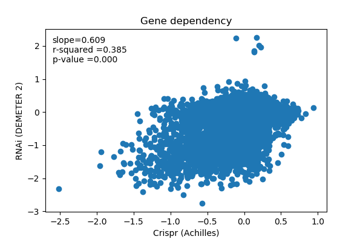
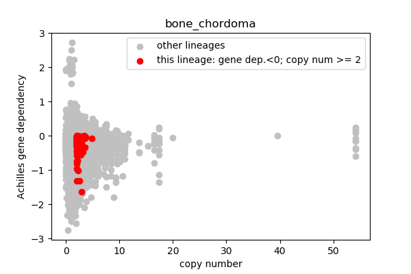
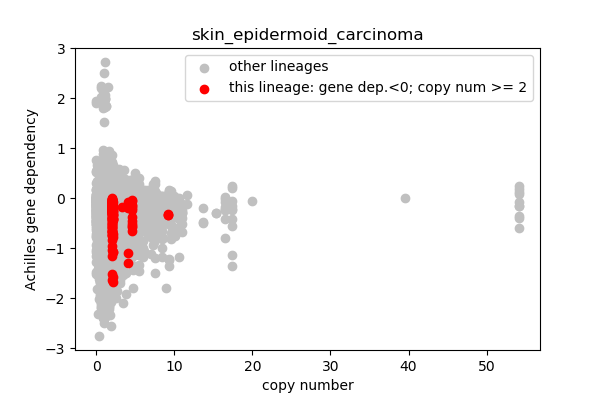
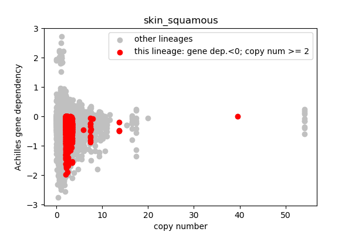
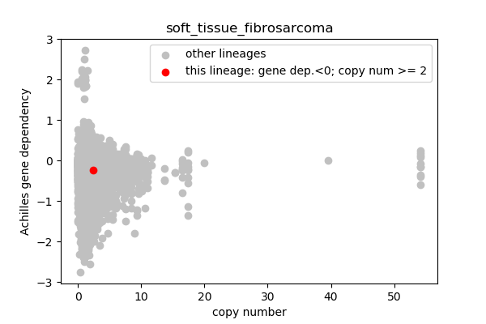
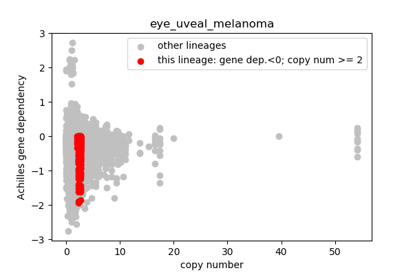
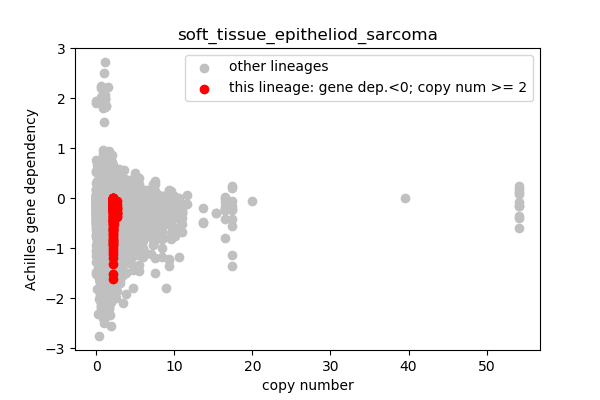
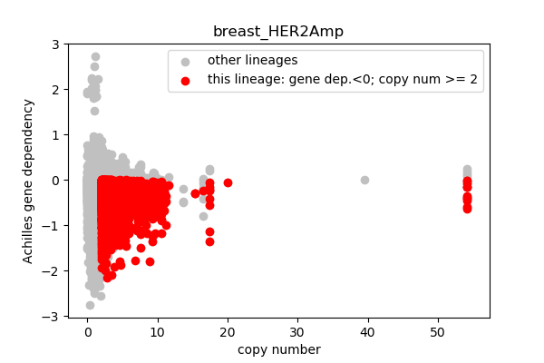
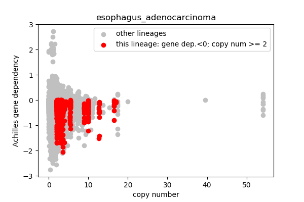

# Sample analysis of Cancer Dependency Map (DepMap) data 
## Request
* Identify the most frequent genetic alterations (could be mutations or copy number variations) in the cancer cell lines
* Match them with the best genetic dependencies that could be used for drug development for the cancers that carry those mutations
* Take into account the lineage of cancer cell lines (certain mutations/CNVs may be restricted to a specific lineage)

## Resources
### DepMap (https://depmap.org/portal) Data 
* Cell line metadata
* Expression (RNASeq)
* Copy number variation
* Mutations
* Genetic dependency
  * Crispr (Achilles)
  * RNAi (DEMETER2)
  
<b>Citations:</b> 
* Jordan G. Bryan, John M. Krill-Burger, Thomas M. Green, Francisca Vazquez, Jesse S. Boehm, Todd R. Golub, William C. Hahn, David E. Root, Aviad Tsherniak. (2018). Improved estimation of cancer dependencies from large-scale RNAi screens using model-based normalization and data integration. Nature Communications 9, 1. https://doi.org/10.1038/s41467-018-06916-5
* DepMap, Broad (2019): DepMap 19Q3 Public. figshare. Dataset doi:10.6084/m9.figshare.9201770.v1.
* Robin M. Meyers, Jordan G. Bryan, James M. McFarland, Barbara A. Weir, ... David E. Root, William C. Hahn, Aviad Tsherniak. Computational correction of copy number effect improves specificity of CRISPR-Cas9 essentiality screens in cancer cells. Nature Genetics 2017 October 49:1779–1784. doi:10.1038/ng.3984

### NCBI (via https://humanmine.org)
* Entrez gene IDs mapped to symbol, name, descrion, uniprot

### Reactome
* Entrez gene IDs mapped to Reactome pathways

### MFR (http://bmbl.sdstate.edu/MFR)
* A Machine Learning Model for measuring relatedness between a pair of genes

### Jupyter (https://jupyter.org/)
* Python programming framework for analysis prototyping and reporting

### GitHub (https://github.com/)
* Revision control for Python code
* Reporting mechanism for analysi summary and details

## Get gene descriptions, etc.
Use data from humanmine (http://www.humanmine.org/) to map NCBI gene IDs to name, summary, symbol, uniprot

## Aggregate CCLE cell lines by lineage
<b>DepMap source file:</b> sample_info.csv
* Group all cell lines (CCLE cell line IDs) by main (parent) lineage
* If a lineage has > 1 defined sublineages, also aggregate cell lines by sublineage (eg: leukemia -> AML)

<pre>
Number of cell lines: 1429
Number of lineages: 33
Number of lineages with sub-lineages: 16
Number of sub-lineages 61
</pre>

## Expression Data (RNASeq)
RNAseq TPM gene expression data for just protein coding genes using RSEM. Log2 transformed, using a pseudo-count of 1.

<b>DepMap source file:</b> CCLE_expression.csv
* Transpose columns (gene names) and rows (CCLE cell line IDs)
* Translate gene names to NCBI gene IDs
* Apply BOOLEAN mask to accept log2 tpm > 0 as positive for expression

Sample expression data: 
 <table border="1" class="dataframe">
  <thead>
    <tr style="text-align: right;">
      <th></th>
      <th>ACH-001097</th>
      <th>ACH-001485</th>
      <th>ACH-001396</th>
      <th>ACH-000534</th>
      <th>ACH-000742</th>
      <th>ACH-001818</th>
      <th>ACH-000545</th>
      <th>ACH-000836</th>
      <th>ACH-001959</th>
      <th>ACH-000470</th>
    </tr>
  </thead>
  <tbody>
    <tr>
      <th>7105</th>
      <td>0.000000</td>
      <td>0.000000</td>
      <td>2.883621</td>
      <td>0.839960</td>
      <td>3.722466</td>
      <td>4.032982</td>
      <td>4.251719</td>
      <td>4.632268</td>
      <td>3.321928</td>
      <td>3.681449</td>
    </tr>
    <tr>
      <th>64102</th>
      <td>0.000000</td>
      <td>0.000000</td>
      <td>0.000000</td>
      <td>0.000000</td>
      <td>0.000000</td>
      <td>0.000000</td>
      <td>0.000000</td>
      <td>0.000000</td>
      <td>0.000000</td>
      <td>0.000000</td>
    </tr>
    <tr>
      <th>8813</th>
      <td>4.667324</td>
      <td>5.755689</td>
      <td>4.471838</td>
      <td>5.376082</td>
      <td>6.029674</td>
      <td>5.933100</td>
      <td>5.651052</td>
      <td>6.704180</td>
      <td>7.357288</td>
      <td>7.294896</td>
    </tr>
  </tbody>
</table>
 Sample masked expression: 
 <table border="1" class="dataframe">
  <thead>
    <tr style="text-align: right;">
      <th></th>
      <th>ACH-001097</th>
      <th>ACH-001485</th>
      <th>ACH-001396</th>
      <th>ACH-000534</th>
      <th>ACH-000742</th>
      <th>ACH-001818</th>
      <th>ACH-000545</th>
      <th>ACH-000836</th>
      <th>ACH-001959</th>
      <th>ACH-000470</th>
    </tr>
  </thead>
  <tbody>
    <tr>
      <th>7105</th>
      <td>False</td>
      <td>False</td>
      <td>True</td>
      <td>True</td>
      <td>True</td>
      <td>True</td>
      <td>True</td>
      <td>True</td>
      <td>True</td>
      <td>True</td>
    </tr>
    <tr>
      <th>64102</th>
      <td>False</td>
      <td>False</td>
      <td>False</td>
      <td>False</td>
      <td>False</td>
      <td>False</td>
      <td>False</td>
      <td>False</td>
      <td>False</td>
      <td>False</td>
    </tr>
    <tr>
      <th>8813</th>
      <td>True</td>
      <td>True</td>
      <td>True</td>
      <td>True</td>
      <td>True</td>
      <td>True</td>
      <td>True</td>
      <td>True</td>
      <td>True</td>
      <td>True</td>
    </tr>
  </tbody>
</table>

## Mutation Data 
<b>DepMap source file:</b> CCLE_mutations.csv
* Keep track of TCGA and COSMIC hotspot genes by lineage
* Just using hotspot genes for now but track deleterious mutations by lineage for future reference

8704 TCGA or COSMIC hotspot genes

## Copy number data
Gene level copy number data, log2 transformed with a pseudo count of 1. This is generated by mapping genes onto the segment level calls.

<b>Depmap source file:</b> CCLE_gene_cn_v2.csv

* Transpose columns (gene names) and rows (CCLE cell line IDs)
* Translate gene names to NCBI gene IDs

Sample copy number data: 
 <table border="1" class="dataframe">
  <thead>
    <tr style="text-align: right;">
      <th></th>
      <th>ACH-001793</th>
      <th>ACH-002176</th>
      <th>ACH-000652</th>
      <th>ACH-001295</th>
      <th>ACH-000798</th>
      <th>ACH-001399</th>
      <th>ACH-000111</th>
      <th>ACH-002358</th>
      <th>ACH-000367</th>
      <th>ACH-000584</th>
    </tr>
  </thead>
  <tbody>
    <tr>
      <th>1</th>
      <td>1.086422</td>
      <td>1.526188</td>
      <td>0.776609</td>
      <td>0.964857</td>
      <td>0.986651</td>
      <td>1.097441</td>
      <td>1.577719</td>
      <td>0.990491</td>
      <td>0.972714</td>
      <td>1.232228</td>
    </tr>
    <tr>
      <th>10</th>
      <td>1.103066</td>
      <td>1.044267</td>
      <td>0.520576</td>
      <td>1.001427</td>
      <td>0.974178</td>
      <td>0.775405</td>
      <td>1.209647</td>
      <td>1.001602</td>
      <td>0.564791</td>
      <td>0.379099</td>
    </tr>
    <tr>
      <th>100</th>
      <td>0.910926</td>
      <td>1.089161</td>
      <td>1.555780</td>
      <td>1.010086</td>
      <td>0.987801</td>
      <td>1.877675</td>
      <td>0.826138</td>
      <td>0.999580</td>
      <td>1.128533</td>
      <td>1.254932</td>
    </tr>
  </tbody>
</table>
Samlpe copy number data descritive stats: 
 <table border="1" class="dataframe">
  <thead>
    <tr style="text-align: right;">
      <th></th>
      <th>ACH-001793</th>
      <th>ACH-002176</th>
      <th>ACH-000652</th>
      <th>ACH-001295</th>
      <th>ACH-000798</th>
      <th>ACH-001399</th>
      <th>ACH-000111</th>
      <th>ACH-002358</th>
      <th>ACH-000367</th>
      <th>ACH-000584</th>
    </tr>
  </thead>
  <tbody>
    <tr>
      <th>count</th>
      <td>27639.000000</td>
      <td>2.763900e+04</td>
      <td>2.763900e+04</td>
      <td>2.763900e+04</td>
      <td>27639.000000</td>
      <td>27639.000000</td>
      <td>2.763900e+04</td>
      <td>27639.000000</td>
      <td>2.763900e+04</td>
      <td>27639.000000</td>
    </tr>
    <tr>
      <th>mean</th>
      <td>1.098416</td>
      <td>1.005611e+00</td>
      <td>9.739989e-01</td>
      <td>1.061859e+00</td>
      <td>1.019288</td>
      <td>1.057222</td>
      <td>1.127191e+00</td>
      <td>0.980485</td>
      <td>9.532559e-01</td>
      <td>1.057527</td>
    </tr>
    <tr>
      <th>std</th>
      <td>1.119507</td>
      <td>3.482645e-01</td>
      <td>2.416796e-01</td>
      <td>6.685549e-01</td>
      <td>0.123101</td>
      <td>0.306522</td>
      <td>3.919352e-01</td>
      <td>0.092264</td>
      <td>2.693422e-01</td>
      <td>0.366487</td>
    </tr>
    <tr>
      <th>min</th>
      <td>0.171960</td>
      <td>7.998209e-10</td>
      <td>8.220704e-10</td>
      <td>7.984062e-10</td>
      <td>0.000036</td>
      <td>0.000020</td>
      <td>1.102449e-09</td>
      <td>0.000021</td>
      <td>8.282854e-10</td>
      <td>0.000009</td>
    </tr>
    <tr>
      <th>25%</th>
      <td>0.889299</td>
      <td>7.318536e-01</td>
      <td>7.900758e-01</td>
      <td>9.845272e-01</td>
      <td>0.982870</td>
      <td>0.812673</td>
      <td>8.295737e-01</td>
      <td>0.993549</td>
      <td>6.015790e-01</td>
      <td>0.700131</td>
    </tr>
    <tr>
      <th>50%</th>
      <td>1.053484</td>
      <td>1.045336e+00</td>
      <td>1.027553e+00</td>
      <td>9.942944e-01</td>
      <td>0.986097</td>
      <td>1.003401</td>
      <td>9.373404e-01</td>
      <td>0.999580</td>
      <td>1.056217e+00</td>
      <td>0.990265</td>
    </tr>
    <tr>
      <th>75%</th>
      <td>1.113955</td>
      <td>1.111985e+00</td>
      <td>1.068509e+00</td>
      <td>1.002200e+00</td>
      <td>0.989550</td>
      <td>1.120454</td>
      <td>1.321072e+00</td>
      <td>1.002886</td>
      <td>1.131187e+00</td>
      <td>1.262886</td>
    </tr>
    <tr>
      <th>max</th>
      <td>35.734800</td>
      <td>4.952679e+00</td>
      <td>4.804283e+00</td>
      <td>3.963217e+01</td>
      <td>1.462469</td>
      <td>3.217691</td>
      <td>3.229879e+00</td>
      <td>1.006658</td>
      <td>1.729972e+00</td>
      <td>3.354475</td>
    </tr>
  </tbody>
</table>

## Search for high copy number genes in each of the lineages
* Seleting genes with copy number > 2 in <b><i>all</i></b> cell lines is a lineage is a bit too stringent
* Retain genes that have copy number >= 2 in 80% or more cell lines in a lineage
* Extract the data for any cell lines with high copy number genes to use as plotting baseline

<pre>
esophagus_adenocarcinoma; 7 cell lines; 7 high copy number genes
bone_chordoma; 4 cell lines; 11 high copy number genes
skin_epidermoid_carcinoma; 1 cell lines; 234 high copy number genes
skin_squamous; 3 cell lines; 251 high copy number genes
adrenal_cortex; 1 cell lines; 200 high copy number genes
upper_aerodigestive_buccal_mucosa; 1 cell lines; 592 high copy number genes
peripheral_nervous_system_PNET; 1 cell lines; 22 high copy number genes
lung_immortalized; 1 cell lines; 6 high copy number genes
gastric_adenosquamous; 1 cell lines; 508 high copy number genes
soft_tissue_sarcoma_undifferentiated; 2 cell lines; 164 high copy number genes
soft_tissue_fibrosarcoma; 1 cell lines; 2 high copy number genes
soft_tissue_liposarcoma; 5 cell lines; 44 high copy number genes
soft_tissue_epitheliod_sarcoma; 2 cell lines; 2 high copy number genes
lymphoblastic_lymphoma; 1 cell lines; 311 high copy number genes
eye_uveal_melanoma; 5 cell lines; 1016 high copy number genes
ovary_immortalized; 1 cell lines; 9 high copy number genes
central_nervous_system_PNET; 1 cell lines; 2 high copy number genes
central_nervous_system_immortalized; 1 cell lines; 26 high copy number genes
breast_HER2Amp; 13 cell lines; 11 high copy number genes
breast_ERneg; 1 cell lines; 960 high copy number genes
breast_immortalized; 2 cell lines; 8 high copy number genes
</pre>

## DEMETER2 RNAi gene dependency data
Cancer cell line genetic dependencies estimated using the DEMETER2 model. DEMETER2 is applied to three large-scale RNAi screening datasets: the Broad Institute Project Achilles, Novartis Project DRIVE, and the Marcotte et al. breast cell line dataset. The model is also applied to generate a combined dataset of gene dependencies covering a total of 712 unique cancer cell lines.

<b>DepMap source file:</b> D2_combined_gene_dep_scores.csv 

* Data source uses CCLE names rather than DepMap cell line IDS
* Translate the cell line names to IDS for consistency with other data sources
* Also deal with rows in the table with multiple gene names (eg 'GTF2IP4&GTF2IP1 (100093631&2970)')

## Achilles Crispr gene dependency data
CERES data with principle components strongly related to known batch effects removed, then shifted and scaled per cell line so the median nonessential KO effect is 0 and the median essential KO effect is -1.

<b>DepMap source file:</b> Achilles_gene_effect.csv 

* Translate gene names (column labels) to NCBI IDS
* Transpose rows and columns so each cell line is a column label with vertivally stacked gene data

Sample Achilles data:
 <table border="1" class="dataframe">
  <thead>
    <tr style="text-align: right;">
      <th></th>
      <th>ACH-000004</th>
      <th>ACH-000005</th>
      <th>ACH-000007</th>
      <th>ACH-000009</th>
      <th>ACH-000011</th>
      <th>ACH-000012</th>
      <th>ACH-000013</th>
      <th>ACH-000014</th>
      <th>ACH-000015</th>
      <th>ACH-000017</th>
    </tr>
  </thead>
  <tbody>
    <tr>
      <th>1</th>
      <td>0.168684</td>
      <td>-0.068759</td>
      <td>0.053893</td>
      <td>0.059874</td>
      <td>0.277165</td>
      <td>0.008073</td>
      <td>0.062131</td>
      <td>0.143078</td>
      <td>-0.090890</td>
      <td>0.178427</td>
    </tr>
    <tr>
      <th>29974</th>
      <td>0.089128</td>
      <td>0.218792</td>
      <td>0.081444</td>
      <td>-0.011153</td>
      <td>0.085354</td>
      <td>0.167177</td>
      <td>0.038687</td>
      <td>-0.035837</td>
      <td>0.007894</td>
      <td>0.106952</td>
    </tr>
  </tbody>
</table>

### How many cell lines and genes are shared between D2 (RNAi) and Achilles (Crispr) gene dependency data sets?

<pre>
423 cell lines are shared
16052 genes are shared
</pre>

* significant p-value means reject H0 that slope == 0
* We will use the Achilles (Crispr) gene dependency score and check for positive agreement with RNAi later

### Sanity checking with ERBB2 (2064)
Evaluating breast cancer lineages where at least one cell line had copy number > 2:
* Is ERB2B in the hotspot gene set?
* We expect ERBB2 to have high copy number in breast cancer lineages
  ** What is the mean ERB2B copy number in breast cancers?
* The gene dependency score should be < 0
  ** What is the mean gene dependency score in breast cancers?

ERBB2 is in hotspot gene set? <b>TRUE</b>
<pre>
ERBB2 mean copy number for breast_HER2Amp (11 cell lines): 14.84
ERBB2 mean copy number for breast_TPBC (5 cell lines): 9.59
ERBB2 mean copy number for breast_TNBC (27 cell lines): 1.89
ERBB2 mean gene dependency for breast_HER2Amp (6 cell lines): -0.83
ERBB2 mean gene dependency for breast_ERpos (7 cell lines): -0.27
ERBB2 mean gene dependency for breast_TNBC (15 cell lines): -0.28
</pre>

## Lineages with observed high copy number genes

* Go through the list of lineages with high copy number genes
* Plot gene dependency vs. copy number
* Highlight genes/cell-lines with copy number > 2 and gene dependency < 0 for specific lineages

### Copy number vs gene dependency

## Candidate target genes

* All genes in this table have copy number > 2 and Achilles gene dependency < 0 for at least 80% of the cell lines in 1 cell lineage'
* Other data for cross-validation:
  * RNAi gene dependency score
  * Whether the gene is a TCGA or COSMIC mutation hotspot
  * Whether the gene has > 0 TPM RNASeq expression

<table id="candidates" border="1" class="dataframe">
  <thead>
    <tr style="text-align: right;">
      <th>DepMap_ID</th>
      <th>sublineage</th>
      <th>HUGO_symbol</th>
      <th>Entrez_ID</th>
      <th>copy_number</th>
      <th>achilles_gene_dep</th>
      <th>rnai_gene_dep</th>
      <th>hotspot</th>
      <th>rnaseq_expressed</th>
    </tr>
  </thead>
  <tbody>
    <tr>
      <td>ACH-000383</td>
      <td>esophagus_adenocarcinoma</td>
      <td>RASA4B</td>
      <td>100271927</td>
      <td>2.997041</td>
      <td>-0.067043</td>
      <td>-0.037759</td>
      <td>False</td>
      <td>True</td>
    </tr>
    <tr>
      <td>ACH-000383</td>
      <td>esophagus_adenocarcinoma</td>
      <td>MUC12</td>
      <td>10071</td>
      <td>2.997041</td>
      <td>-0.382201</td>
      <td>NaN</td>
      <td>False</td>
      <td>True</td>
    </tr>
    <tr>
      <td>ACH-000383</td>
      <td>esophagus_adenocarcinoma</td>
      <td>NAMPT</td>
      <td>10135</td>
      <td>2.997041</td>
      <td>-0.880275</td>
      <td>-0.126734</td>
      <td>False</td>
      <td>True</td>
    </tr>
    <tr>
      <td>ACH-000383</td>
      <td>esophagus_adenocarcinoma</td>
      <td>RASA4</td>
      <td>10156</td>
      <td>2.997041</td>
      <td>-0.520096</td>
      <td>-0.024795</td>
      <td>False</td>
      <td>True</td>
    </tr>
    <tr>
      <td>ACH-000383</td>
      <td>esophagus_adenocarcinoma</td>
      <td>SLC25A13</td>
      <td>10165</td>
      <td>2.997041</td>
      <td>-0.083599</td>
      <td>0.190876</td>
      <td>True</td>
      <td>True</td>
    </tr>
    <tr>
      <td>ACH-000383</td>
      <td>esophagus_adenocarcinoma</td>
      <td>CDK6</td>
      <td>1021</td>
      <td>2.790880</td>
      <td>-0.720473</td>
      <td>-0.070864</td>
      <td>True</td>
      <td>True</td>
    </tr>
    <tr>
      <td>ACH-000383</td>
      <td>esophagus_adenocarcinoma</td>
      <td>POP7</td>
      <td>10248</td>
      <td>2.997041</td>
      <td>-0.437669</td>
      <td>0.003675</td>
      <td>False</td>
      <td>True</td>
    </tr>
    <tr>
      <td>ACH-000383</td>
      <td>esophagus_adenocarcinoma</td>
      <td>BET1</td>
      <td>10282</td>
      <td>2.790880</td>
      <td>-0.074207</td>
      <td>NaN</td>
      <td>False</td>
      <td>True</td>
    </tr>
    <tr>
      <td>ACH-000383</td>
      <td>esophagus_adenocarcinoma</td>
      <td>SEMA3A</td>
      <td>10371</td>
      <td>2.614386</td>
      <td>-0.058638</td>
      <td>-0.025639</td>
      <td>True</td>
      <td>True</td>
    </tr>
    <tr>
      <td>ACH-000383</td>
      <td>esophagus_adenocarcinoma</td>
      <td>COG5</td>
      <td>10466</td>
      <td>2.997041</td>
      <td>-0.053520</td>
      <td>NaN</td>
      <td>False</td>
      <td>True</td>
    </tr>
    <tr>
      <td>ACH-000383</td>
      <td>esophagus_adenocarcinoma</td>
      <td>ZNHIT1</td>
      <td>10467</td>
      <td>2.997041</td>
      <td>-0.229107</td>
      <td>NaN</td>
      <td>False</td>
      <td>True</td>
    </tr>
    <tr>
      <td>ACH-000383</td>
      <td>esophagus_adenocarcinoma</td>
      <td>SEMA3C</td>
      <td>10512</td>
      <td>2.864732</td>
      <td>-0.069647</td>
      <td>-0.061808</td>
      <td>True</td>
      <td>True</td>
    </tr>
    <tr>
      <td>ACH-000383</td>
      <td>esophagus_adenocarcinoma</td>
      <td>SPAG5</td>
      <td>10615</td>
      <td>2.052757</td>
      <td>-0.594421</td>
      <td>NaN</td>
      <td>False</td>
      <td>True</td>
    </tr>
    <tr>
      <td>ACH-000383</td>
      <td>esophagus_adenocarcinoma</td>
      <td>UPK3BL2</td>
      <td>107983993</td>
      <td>2.997041</td>
      <td>-0.326704</td>
      <td>NaN</td>
      <td>False</td>
      <td>False</td>
    </tr>
    <tr>
      <td>ACH-000383</td>
      <td>esophagus_adenocarcinoma</td>
      <td>CFTR</td>
      <td>1080</td>
      <td>5.423706</td>
      <td>-0.065061</td>
      <td>-0.371001</td>
      <td>True</td>
      <td>True</td>
    </tr>
    <tr>
      <td>ACH-000383</td>
      <td>esophagus_adenocarcinoma</td>
      <td>CPSF4</td>
      <td>10898</td>
      <td>2.997041</td>
      <td>-1.368066</td>
      <td>-0.324242</td>
      <td>True</td>
      <td>True</td>
    </tr>
    <tr>
      <td>ACH-000383</td>
      <td>esophagus_adenocarcinoma</td>
      <td>DBF4</td>
      <td>10926</td>
      <td>2.790880</td>
      <td>-0.753845</td>
      <td>-0.359071</td>
      <td>True</td>
      <td>True</td>
    </tr>
    <tr>
      <td>ACH-000383</td>
      <td>esophagus_adenocarcinoma</td>
      <td>STARD3</td>
      <td>10948</td>
      <td>3.552442</td>
      <td>-0.090655</td>
      <td>NaN</td>
      <td>False</td>
      <td>True</td>
    </tr>
    <tr>
      <td>ACH-000383</td>
      <td>esophagus_adenocarcinoma</td>
      <td>COPS6</td>
      <td>10980</td>
      <td>2.997041</td>
      <td>-1.238834</td>
      <td>-0.626759</td>
      <td>False</td>
      <td>True</td>
    </tr>
    <tr>
      <td>ACH-000383</td>
      <td>esophagus_adenocarcinoma</td>
      <td>DUS4L</td>
      <td>11062</td>
      <td>2.997041</td>
      <td>-0.170967</td>
      <td>0.041769</td>
      <td>False</td>
      <td>True</td>
    </tr>
    <tr>
      <td>ACH-000383</td>
      <td>esophagus_adenocarcinoma</td>
      <td>ZNF277</td>
      <td>11179</td>
      <td>5.423706</td>
      <td>-0.216839</td>
      <td>-0.215300</td>
      <td>False</td>
      <td>True</td>
    </tr>
    <tr>
      <td>ACH-000383</td>
      <td>esophagus_adenocarcinoma</td>
      <td>PDAP1</td>
      <td>11333</td>
      <td>2.997041</td>
      <td>-1.086854</td>
      <td>-0.007918</td>
      <td>True</td>
      <td>True</td>
    </tr>
    <tr>
      <td>ACH-000383</td>
      <td>esophagus_adenocarcinoma</td>
      <td>TLCD1</td>
      <td>116238</td>
      <td>2.052757</td>
      <td>-0.626215</td>
      <td>NaN</td>
      <td>True</td>
      <td>True</td>
    </tr>
    <tr>
      <td>ACH-000383</td>
      <td>esophagus_adenocarcinoma</td>
      <td>AP1S1</td>
      <td>1174</td>
      <td>2.997041</td>
      <td>-0.391330</td>
      <td>-0.331107</td>
      <td>True</td>
      <td>True</td>
    </tr>
    <tr>
      <td>ACH-000383</td>
      <td>esophagus_adenocarcinoma</td>
      <td>SEZ6</td>
      <td>124925</td>
      <td>2.052757</td>
      <td>-0.193041</td>
      <td>NaN</td>
      <td>False</td>
      <td>True</td>
    </tr>
    <tr>
      <td>ACH-000383</td>
      <td>esophagus_adenocarcinoma</td>
      <td>ASZ1</td>
      <td>136991</td>
      <td>5.423706</td>
      <td>-0.235077</td>
      <td>NaN</td>
      <td>False</td>
      <td>True</td>
    </tr>
    <tr>
      <td>ACH-000383</td>
      <td>esophagus_adenocarcinoma</td>
      <td>MUC17</td>
      <td>140453</td>
      <td>2.997041</td>
      <td>-0.043972</td>
      <td>NaN</td>
      <td>True</td>
      <td>False</td>
    </tr>
    <tr>
      <td>ACH-000383</td>
      <td>esophagus_adenocarcinoma</td>
      <td>TMEM199</td>
      <td>147007</td>
      <td>2.052757</td>
      <td>-0.739281</td>
      <td>NaN</td>
      <td>True</td>
      <td>True</td>
    </tr>
    <tr>
      <td>ACH-000383</td>
      <td>esophagus_adenocarcinoma</td>
      <td>PROCA1</td>
      <td>147011</td>
      <td>2.052757</td>
      <td>-0.417481</td>
      <td>-0.204783</td>
      <td>False</td>
      <td>True</td>
    </tr>
    <tr>
      <td>ACH-000383</td>
      <td>esophagus_adenocarcinoma</td>
      <td>DHRS13</td>
      <td>147015</td>
      <td>2.052757</td>
      <td>-0.229889</td>
      <td>-0.336988</td>
      <td>False</td>
      <td>True</td>
    </tr>
    <tr>
      <td>ACH-000383</td>
      <td>esophagus_adenocarcinoma</td>
      <td>THAP5</td>
      <td>168451</td>
      <td>2.997041</td>
      <td>-0.049483</td>
      <td>NaN</td>
      <td>True</td>
      <td>True</td>
    </tr>
    <tr>
      <td>ACH-000383</td>
      <td>esophagus_adenocarcinoma</td>
      <td>BHLHA15</td>
      <td>168620</td>
      <td>2.997041</td>
      <td>-0.565174</td>
      <td>0.068072</td>
      <td>False</td>
      <td>True</td>
    </tr>
    <tr>
      <td>ACH-000383</td>
      <td>esophagus_adenocarcinoma</td>
      <td>DLD</td>
      <td>1738</td>
      <td>2.997041</td>
      <td>-0.370021</td>
      <td>-0.016066</td>
      <td>True</td>
      <td>True</td>
    </tr>
    <tr>
      <td>ACH-000383</td>
      <td>esophagus_adenocarcinoma</td>
      <td>DLX5</td>
      <td>1749</td>
      <td>2.997041</td>
      <td>-0.179556</td>
      <td>-0.100339</td>
      <td>True</td>
      <td>True</td>
    </tr>
    <tr>
      <td>ACH-000383</td>
      <td>esophagus_adenocarcinoma</td>
      <td>DLX6</td>
      <td>1750</td>
      <td>2.997041</td>
      <td>-0.073458</td>
      <td>-0.144791</td>
      <td>True</td>
      <td>True</td>
    </tr>
    <tr>
      <td>ACH-000383</td>
      <td>esophagus_adenocarcinoma</td>
      <td>SLC26A3</td>
      <td>1811</td>
      <td>2.997041</td>
      <td>-0.001297</td>
      <td>0.029176</td>
      <td>True</td>
      <td>False</td>
    </tr>
    <tr>
      <td>ACH-000383</td>
      <td>esophagus_adenocarcinoma</td>
      <td>EPO</td>
      <td>2056</td>
      <td>2.997041</td>
      <td>-0.018751</td>
      <td>0.040403</td>
      <td>True</td>
      <td>True</td>
    </tr>
    <tr>
      <td>ACH-000383</td>
      <td>esophagus_adenocarcinoma</td>
      <td>ERBB2</td>
      <td>2064</td>
      <td>8.926799</td>
      <td>-0.366606</td>
      <td>-0.021312</td>
      <td>True</td>
      <td>True</td>
    </tr>
    <tr>
      <td>ACH-000383</td>
      <td>esophagus_adenocarcinoma</td>
      <td>ZNF804B</td>
      <td>219578</td>
      <td>2.790880</td>
      <td>-0.113100</td>
      <td>NaN</td>
      <td>True</td>
      <td>False</td>
    </tr>
    <tr>
      <td>ACH-000383</td>
      <td>esophagus_adenocarcinoma</td>
      <td>ZSCAN25</td>
      <td>221785</td>
      <td>2.997041</td>
      <td>-0.450901</td>
      <td>0.287382</td>
      <td>False</td>
      <td>True</td>
    </tr>
    <tr>
      <td>ACH-000383</td>
      <td>esophagus_adenocarcinoma</td>
      <td>FAM200A</td>
      <td>221786</td>
      <td>2.997041</td>
      <td>-0.081451</td>
      <td>NaN</td>
      <td>False</td>
      <td>True</td>
    </tr>
    <tr>
      <td>ACH-000383</td>
      <td>esophagus_adenocarcinoma</td>
      <td>KIAA1324L</td>
      <td>222223</td>
      <td>2.614386</td>
      <td>-0.174472</td>
      <td>NaN</td>
      <td>False</td>
      <td>True</td>
    </tr>
    <tr>
      <td>ACH-000383</td>
      <td>esophagus_adenocarcinoma</td>
      <td>LRWD1</td>
      <td>222229</td>
      <td>2.997041</td>
      <td>-0.650900</td>
      <td>NaN</td>
      <td>False</td>
      <td>True</td>
    </tr>
    <tr>
      <td>ACH-000383</td>
      <td>esophagus_adenocarcinoma</td>
      <td>FAM185A</td>
      <td>222234</td>
      <td>2.997041</td>
      <td>-0.260581</td>
      <td>NaN</td>
      <td>False</td>
      <td>True</td>
    </tr>
    <tr>
      <td>ACH-000383</td>
      <td>esophagus_adenocarcinoma</td>
      <td>FBXL13</td>
      <td>222235</td>
      <td>2.997041</td>
      <td>-0.232546</td>
      <td>NaN</td>
      <td>True</td>
      <td>True</td>
    </tr>
    <tr>
      <td>ACH-000383</td>
      <td>esophagus_adenocarcinoma</td>
      <td>NAPEPLD</td>
      <td>222236</td>
      <td>2.997041</td>
      <td>-0.010145</td>
      <td>0.324130</td>
      <td>False</td>
      <td>True</td>
    </tr>
    <tr>
      <td>ACH-000383</td>
      <td>esophagus_adenocarcinoma</td>
      <td>ATXN7L1</td>
      <td>222255</td>
      <td>2.997041</td>
      <td>-0.046907</td>
      <td>NaN</td>
      <td>True</td>
      <td>True</td>
    </tr>
    <tr>
      <td>ACH-000383</td>
      <td>esophagus_adenocarcinoma</td>
      <td>CDHR3</td>
      <td>222256</td>
      <td>2.997041</td>
      <td>-0.089707</td>
      <td>0.116412</td>
      <td>False</td>
      <td>True</td>
    </tr>
    <tr>
      <td>ACH-000383</td>
      <td>esophagus_adenocarcinoma</td>
      <td>TMEM130</td>
      <td>222865</td>
      <td>2.997041</td>
      <td>-0.061526</td>
      <td>0.089743</td>
      <td>True</td>
      <td>False</td>
    </tr>
    <tr>
      <td>ACH-000383</td>
      <td>esophagus_adenocarcinoma</td>
      <td>NYAP1</td>
      <td>222950</td>
      <td>2.997041</td>
      <td>-0.195415</td>
      <td>NaN</td>
      <td>True</td>
      <td>True</td>
    </tr>
    <tr>
      <td>ACH-000383</td>
      <td>esophagus_adenocarcinoma</td>
      <td>LAMB4</td>
      <td>22798</td>
      <td>2.997041</td>
      <td>-0.200140</td>
      <td>NaN</td>
      <td>True</td>
      <td>True</td>
    </tr>
    <tr>
      <td>ACH-000383</td>
      <td>esophagus_adenocarcinoma</td>
      <td>IKZF3</td>
      <td>22806</td>
      <td>8.926799</td>
      <td>-0.242321</td>
      <td>-0.079592</td>
      <td>True</td>
      <td>True</td>
    </tr>
    <tr>
      <td>ACH-000383</td>
      <td>esophagus_adenocarcinoma</td>
      <td>LMTK2</td>
      <td>22853</td>
      <td>2.997041</td>
      <td>-0.340913</td>
      <td>NaN</td>
      <td>True</td>
      <td>True</td>
    </tr>
    <tr>
      <td>ACH-000383</td>
      <td>esophagus_adenocarcinoma</td>
      <td>ALDOC</td>
      <td>230</td>
      <td>2.052757</td>
      <td>-0.376178</td>
      <td>-0.065979</td>
      <td>False</td>
      <td>True</td>
    </tr>
    <tr>
      <td>ACH-000383</td>
      <td>esophagus_adenocarcinoma</td>
      <td>FLOT2</td>
      <td>2319</td>
      <td>2.052757</td>
      <td>-0.235930</td>
      <td>NaN</td>
      <td>True</td>
      <td>True</td>
    </tr>
    <tr>
      <td>ACH-000383</td>
      <td>esophagus_adenocarcinoma</td>
      <td>ZKSCAN5</td>
      <td>23660</td>
      <td>2.997041</td>
      <td>-0.530859</td>
      <td>-0.125467</td>
      <td>True</td>
      <td>True</td>
    </tr>
    <tr>
      <td>ACH-000383</td>
      <td>esophagus_adenocarcinoma</td>
      <td>CLDN15</td>
      <td>24146</td>
      <td>2.997041</td>
      <td>-0.094013</td>
      <td>NaN</td>
      <td>False</td>
      <td>True</td>
    </tr>
    <tr>
      <td>ACH-000383</td>
      <td>esophagus_adenocarcinoma</td>
      <td>CNPY4</td>
      <td>245812</td>
      <td>2.997041</td>
      <td>-0.545770</td>
      <td>NaN</td>
      <td>False</td>
      <td>True</td>
    </tr>
    <tr>
      <td>ACH-000383</td>
      <td>esophagus_adenocarcinoma</td>
      <td>HEPACAM2</td>
      <td>253012</td>
      <td>2.790880</td>
      <td>-0.117046</td>
      <td>NaN</td>
      <td>True</td>
      <td>False</td>
    </tr>
    <tr>
      <td>ACH-000383</td>
      <td>esophagus_adenocarcinoma</td>
      <td>FAM133B</td>
      <td>257415</td>
      <td>2.790880</td>
      <td>-0.709931</td>
      <td>NaN</td>
      <td>False</td>
      <td>True</td>
    </tr>
    <tr>
      <td>ACH-000383</td>
      <td>esophagus_adenocarcinoma</td>
      <td>BRI3</td>
      <td>25798</td>
      <td>2.997041</td>
      <td>-0.401531</td>
      <td>0.318737</td>
      <td>False</td>
      <td>True</td>
    </tr>
    <tr>
      <td>ACH-000383</td>
      <td>esophagus_adenocarcinoma</td>
      <td>PTCD1</td>
      <td>26024</td>
      <td>2.997041</td>
      <td>-0.418822</td>
      <td>NaN</td>
      <td>False</td>
      <td>True</td>
    </tr>
    <tr>
      <td>ACH-000383</td>
      <td>esophagus_adenocarcinoma</td>
      <td>TES</td>
      <td>26136</td>
      <td>5.423706</td>
      <td>-0.004820</td>
      <td>NaN</td>
      <td>False</td>
      <td>True</td>
    </tr>
    <tr>
      <td>ACH-000383</td>
      <td>esophagus_adenocarcinoma</td>
      <td>STEAP2</td>
      <td>261729</td>
      <td>2.790880</td>
      <td>-0.256623</td>
      <td>-0.104121</td>
      <td>True</td>
      <td>True</td>
    </tr>
    <tr>
      <td>ACH-000383</td>
      <td>esophagus_adenocarcinoma</td>
      <td>FBXO24</td>
      <td>26261</td>
      <td>2.997041</td>
      <td>-0.244921</td>
      <td>0.169353</td>
      <td>True</td>
      <td>True</td>
    </tr>
    <tr>
      <td>ACH-000383</td>
      <td>esophagus_adenocarcinoma</td>
      <td>ERAL1</td>
      <td>26284</td>
      <td>2.052757</td>
      <td>-0.497025</td>
      <td>0.045628</td>
      <td>False</td>
      <td>True</td>
    </tr>
    <tr>
      <td>ACH-000383</td>
      <td>esophagus_adenocarcinoma</td>
      <td>HBP1</td>
      <td>26959</td>
      <td>2.997041</td>
      <td>-0.045889</td>
      <td>-0.037657</td>
      <td>False</td>
      <td>True</td>
    </tr>
    <tr>
      <td>ACH-000383</td>
      <td>esophagus_adenocarcinoma</td>
      <td>TMEM97</td>
      <td>27346</td>
      <td>2.052757</td>
      <td>-0.580213</td>
      <td>NaN</td>
      <td>True</td>
      <td>True</td>
    </tr>
    <tr>
      <td>ACH-000383</td>
      <td>esophagus_adenocarcinoma</td>
      <td>GNAI1</td>
      <td>2770</td>
      <td>2.864732</td>
      <td>-0.210615</td>
      <td>-0.050031</td>
      <td>False</td>
      <td>True</td>
    </tr>
    <tr>
      <td>ACH-000383</td>
      <td>esophagus_adenocarcinoma</td>
      <td>GNB2</td>
      <td>2783</td>
      <td>2.997041</td>
      <td>-0.500265</td>
      <td>-0.077463</td>
      <td>True</td>
      <td>True</td>
    </tr>
    <tr>
      <td>ACH-000383</td>
      <td>esophagus_adenocarcinoma</td>
      <td>NEK8</td>
      <td>284086</td>
      <td>2.052757</td>
      <td>-0.136877</td>
      <td>NaN</td>
      <td>False</td>
      <td>True</td>
    </tr>
    <tr>
      <td>ACH-000383</td>
      <td>esophagus_adenocarcinoma</td>
      <td>ZNF789</td>
      <td>285989</td>
      <td>2.997041</td>
      <td>-0.368762</td>
      <td>NaN</td>
      <td>True</td>
      <td>True</td>
    </tr>
    <tr>
      <td>ACH-000383</td>
      <td>esophagus_adenocarcinoma</td>
      <td>GRB7</td>
      <td>2886</td>
      <td>8.926799</td>
      <td>-0.370852</td>
      <td>-0.324671</td>
      <td>False</td>
      <td>True</td>
    </tr>
    <tr>
      <td>ACH-000383</td>
      <td>esophagus_adenocarcinoma</td>
      <td>MDFIC</td>
      <td>29969</td>
      <td>5.423706</td>
      <td>-0.033591</td>
      <td>0.153625</td>
      <td>False</td>
      <td>True</td>
    </tr>
    <tr>
      <td>ACH-000383</td>
      <td>esophagus_adenocarcinoma</td>
      <td>PILRB</td>
      <td>29990</td>
      <td>2.997041</td>
      <td>-0.128908</td>
      <td>0.104319</td>
      <td>False</td>
      <td>True</td>
    </tr>
    <tr>
      <td>ACH-000383</td>
      <td>esophagus_adenocarcinoma</td>
      <td>PILRA</td>
      <td>29992</td>
      <td>2.997041</td>
      <td>-0.297126</td>
      <td>-0.270375</td>
      <td>False</td>
      <td>True</td>
    </tr>
    <tr>
      <td>ACH-000383</td>
      <td>esophagus_adenocarcinoma</td>
      <td>ERVW-1</td>
      <td>30816</td>
      <td>2.790880</td>
      <td>-0.746075</td>
      <td>0.329329</td>
      <td>False</td>
      <td>True</td>
    </tr>
    <tr>
      <td>ACH-000383</td>
      <td>esophagus_adenocarcinoma</td>
      <td>AGFG2</td>
      <td>3268</td>
      <td>2.997041</td>
      <td>-0.372383</td>
      <td>NaN</td>
      <td>True</td>
      <td>True</td>
    </tr>
    <tr>
      <td>ACH-000383</td>
      <td>esophagus_adenocarcinoma</td>
      <td>MOGAT3</td>
      <td>346606</td>
      <td>2.997041</td>
      <td>-0.359391</td>
      <td>-0.049733</td>
      <td>True</td>
      <td>True</td>
    </tr>
    <tr>
      <td>ACH-000383</td>
      <td>esophagus_adenocarcinoma</td>
      <td>IFRD1</td>
      <td>3475</td>
      <td>5.423706</td>
      <td>-0.096524</td>
      <td>NaN</td>
      <td>True</td>
      <td>True</td>
    </tr>
    <tr>
      <td>ACH-000383</td>
      <td>esophagus_adenocarcinoma</td>
      <td>CASTOR3</td>
      <td>352954</td>
      <td>2.997041</td>
      <td>-0.518834</td>
      <td>NaN</td>
      <td>False</td>
      <td>True</td>
    </tr>
    <tr>
      <td>ACH-000383</td>
      <td>esophagus_adenocarcinoma</td>
      <td>NAT16</td>
      <td>375607</td>
      <td>2.997041</td>
      <td>-0.333747</td>
      <td>NaN</td>
      <td>False</td>
      <td>True</td>
    </tr>
    <tr>
      <td>ACH-000383</td>
      <td>esophagus_adenocarcinoma</td>
      <td>SLC26A5</td>
      <td>375611</td>
      <td>2.997041</td>
      <td>-0.377354</td>
      <td>NaN</td>
      <td>True</td>
      <td>True</td>
    </tr>
    <tr>
      <td>ACH-000383</td>
      <td>esophagus_adenocarcinoma</td>
      <td>LAMB1</td>
      <td>3912</td>
      <td>2.997041</td>
      <td>-0.210297</td>
      <td>0.243994</td>
      <td>True</td>
      <td>True</td>
    </tr>
    <tr>
      <td>ACH-000383</td>
      <td>esophagus_adenocarcinoma</td>
      <td>MYO18A</td>
      <td>399687</td>
      <td>2.052757</td>
      <td>-0.525164</td>
      <td>-0.366013</td>
      <td>False</td>
      <td>True</td>
    </tr>
    <tr>
      <td>ACH-000383</td>
      <td>esophagus_adenocarcinoma</td>
      <td>LRRD1</td>
      <td>401387</td>
      <td>2.790880</td>
      <td>-0.160321</td>
      <td>NaN</td>
      <td>False</td>
      <td>False</td>
    </tr>
    <tr>
      <td>ACH-000383</td>
      <td>esophagus_adenocarcinoma</td>
      <td>KPNA7</td>
      <td>402569</td>
      <td>2.997041</td>
      <td>-0.325906</td>
      <td>NaN</td>
      <td>False</td>
      <td>True</td>
    </tr>
    <tr>
      <td>ACH-000383</td>
      <td>esophagus_adenocarcinoma</td>
      <td>LRCH4</td>
      <td>4034</td>
      <td>2.997041</td>
      <td>-0.563341</td>
      <td>0.091848</td>
      <td>True</td>
      <td>True</td>
    </tr>
    <tr>
      <td>ACH-000383</td>
      <td>esophagus_adenocarcinoma</td>
      <td>MCM7</td>
      <td>4176</td>
      <td>2.997041</td>
      <td>-1.213115</td>
      <td>-0.360722</td>
      <td>True</td>
      <td>True</td>
    </tr>
    <tr>
      <td>ACH-000383</td>
      <td>esophagus_adenocarcinoma</td>
      <td>DNAJB9</td>
      <td>4189</td>
      <td>2.997041</td>
      <td>-0.210429</td>
      <td>0.166844</td>
      <td>False</td>
      <td>True</td>
    </tr>
    <tr>
      <td>ACH-000383</td>
      <td>esophagus_adenocarcinoma</td>
      <td>MET</td>
      <td>4233</td>
      <td>5.423706</td>
      <td>-1.146115</td>
      <td>-0.387129</td>
      <td>True</td>
      <td>True</td>
    </tr>
    <tr>
      <td>ACH-000383</td>
      <td>esophagus_adenocarcinoma</td>
      <td>ACHE</td>
      <td>43</td>
      <td>2.997041</td>
      <td>-0.285597</td>
      <td>0.071944</td>
      <td>True</td>
      <td>True</td>
    </tr>
    <tr>
      <td>ACH-000383</td>
      <td>esophagus_adenocarcinoma</td>
      <td>ASNS</td>
      <td>440</td>
      <td>2.997041</td>
      <td>-0.160707</td>
      <td>0.058408</td>
      <td>False</td>
      <td>True</td>
    </tr>
    <tr>
      <td>ACH-000383</td>
      <td>esophagus_adenocarcinoma</td>
      <td>SPDYE3</td>
      <td>441272</td>
      <td>2.997041</td>
      <td>-0.064962</td>
      <td>NaN</td>
      <td>False</td>
      <td>True</td>
    </tr>
    <tr>
      <td>ACH-000383</td>
      <td>esophagus_adenocarcinoma</td>
      <td>SPDYE2</td>
      <td>441273</td>
      <td>2.997041</td>
      <td>-0.542838</td>
      <td>NaN</td>
      <td>False</td>
      <td>True</td>
    </tr>
    <tr>
      <td>ACH-000383</td>
      <td>esophagus_adenocarcinoma</td>
      <td>NEUROD2</td>
      <td>4761</td>
      <td>3.552442</td>
      <td>-0.482961</td>
      <td>0.044840</td>
      <td>False</td>
      <td>False</td>
    </tr>
    <tr>
      <td>ACH-000383</td>
      <td>esophagus_adenocarcinoma</td>
      <td>ORC5</td>
      <td>5001</td>
      <td>2.997041</td>
      <td>-0.260646</td>
      <td>NaN</td>
      <td>False</td>
      <td>True</td>
    </tr>
    <tr>
      <td>ACH-000383</td>
      <td>esophagus_adenocarcinoma</td>
      <td>SERPINE1</td>
      <td>5054</td>
      <td>2.997041</td>
      <td>-0.161893</td>
      <td>-0.180634</td>
      <td>False</td>
      <td>True</td>
    </tr>
    <tr>
      <td>ACH-000383</td>
      <td>esophagus_adenocarcinoma</td>
      <td>PNPLA8</td>
      <td>50640</td>
      <td>2.997041</td>
      <td>-0.293913</td>
      <td>0.071008</td>
      <td>False</td>
      <td>True</td>
    </tr>
    <tr>
      <td>ACH-000383</td>
      <td>esophagus_adenocarcinoma</td>
      <td>FIS1</td>
      <td>51024</td>
      <td>2.997041</td>
      <td>-0.352545</td>
      <td>NaN</td>
      <td>False</td>
      <td>True</td>
    </tr>
    <tr>
      <td>ACH-000383</td>
      <td>esophagus_adenocarcinoma</td>
      <td>PCOLCE</td>
      <td>5118</td>
      <td>2.997041</td>
      <td>-0.321136</td>
      <td>NaN</td>
      <td>False</td>
      <td>True</td>
    </tr>
    <tr>
      <td>ACH-000383</td>
      <td>esophagus_adenocarcinoma</td>
      <td>PIPOX</td>
      <td>51268</td>
      <td>2.052757</td>
      <td>-0.296024</td>
      <td>0.008793</td>
      <td>True</td>
      <td>True</td>
    </tr>
    <tr>
      <td>ACH-000383</td>
      <td>esophagus_adenocarcinoma</td>
      <td>ACTL6B</td>
      <td>51412</td>
      <td>2.997041</td>
      <td>-0.177592</td>
      <td>NaN</td>
      <td>False</td>
      <td>False</td>
    </tr>
    <tr>
      <td>ACH-000383</td>
      <td>esophagus_adenocarcinoma</td>
      <td>SRRT</td>
      <td>51593</td>
      <td>2.997041</td>
      <td>-0.594634</td>
      <td>-0.816285</td>
      <td>True</td>
      <td>True</td>
    </tr>
    <tr>
      <td>ACH-000383</td>
      <td>esophagus_adenocarcinoma</td>
      <td>PDK4</td>
      <td>5166</td>
      <td>2.997041</td>
      <td>-0.039279</td>
      <td>-0.020823</td>
      <td>True</td>
      <td>True</td>
    </tr>
    <tr>
      <td>ACH-000383</td>
      <td>esophagus_adenocarcinoma</td>
      <td>PEX1</td>
      <td>5189</td>
      <td>2.790880</td>
      <td>-0.436764</td>
      <td>0.095224</td>
      <td>True</td>
      <td>True</td>
    </tr>
    <tr>
      <td>ACH-000383</td>
      <td>esophagus_adenocarcinoma</td>
      <td>ABCB1</td>
      <td>5243</td>
      <td>2.614386</td>
      <td>-0.204002</td>
      <td>-0.080607</td>
      <td>True</td>
      <td>True</td>
    </tr>
    <tr>
      <td>ACH-000383</td>
      <td>esophagus_adenocarcinoma</td>
      <td>ABCB4</td>
      <td>5244</td>
      <td>2.614386</td>
      <td>-0.087244</td>
      <td>-0.013916</td>
      <td>True</td>
      <td>True</td>
    </tr>
    <tr>
      <td>ACH-000383</td>
      <td>esophagus_adenocarcinoma</td>
      <td>PIK3CG</td>
      <td>5294</td>
      <td>2.997041</td>
      <td>-0.213519</td>
      <td>0.161324</td>
      <td>True</td>
      <td>True</td>
    </tr>
    <tr>
      <td>ACH-000383</td>
      <td>esophagus_adenocarcinoma</td>
      <td>PNMT</td>
      <td>5409</td>
      <td>8.926799</td>
      <td>-0.172188</td>
      <td>0.183438</td>
      <td>False</td>
      <td>True</td>
    </tr>
    <tr>
      <td>ACH-000383</td>
      <td>esophagus_adenocarcinoma</td>
      <td>POLR2J</td>
      <td>5439</td>
      <td>2.997041</td>
      <td>-1.633813</td>
      <td>-0.794193</td>
      <td>False</td>
      <td>True</td>
    </tr>
    <tr>
      <td>ACH-000383</td>
      <td>esophagus_adenocarcinoma</td>
      <td>PON1</td>
      <td>5444</td>
      <td>2.790880</td>
      <td>-0.444748</td>
      <td>0.135701</td>
      <td>True</td>
      <td>True</td>
    </tr>
    <tr>
      <td>ACH-000383</td>
      <td>esophagus_adenocarcinoma</td>
      <td>PON2</td>
      <td>5445</td>
      <td>2.790880</td>
      <td>-0.112015</td>
      <td>0.002657</td>
      <td>False</td>
      <td>True</td>
    </tr>
    <tr>
      <td>ACH-000383</td>
      <td>esophagus_adenocarcinoma</td>
      <td>PON3</td>
      <td>5446</td>
      <td>2.790880</td>
      <td>-0.223855</td>
      <td>-0.012282</td>
      <td>False</td>
      <td>True</td>
    </tr>
    <tr>
      <td>ACH-000383</td>
      <td>esophagus_adenocarcinoma</td>
      <td>ANKIB1</td>
      <td>54467</td>
      <td>2.790880</td>
      <td>-0.782823</td>
      <td>NaN</td>
      <td>True</td>
      <td>True</td>
    </tr>
    <tr>
      <td>ACH-000383</td>
      <td>esophagus_adenocarcinoma</td>
      <td>CROT</td>
      <td>54677</td>
      <td>2.614386</td>
      <td>-0.011350</td>
      <td>0.186824</td>
      <td>True</td>
      <td>True</td>
    </tr>
    <tr>
      <td>ACH-000383</td>
      <td>esophagus_adenocarcinoma</td>
      <td>ALKBH4</td>
      <td>54784</td>
      <td>2.997041</td>
      <td>-0.345382</td>
      <td>NaN</td>
      <td>False</td>
      <td>True</td>
    </tr>
    <tr>
      <td>ACH-000383</td>
      <td>esophagus_adenocarcinoma</td>
      <td>PPP1R3A</td>
      <td>5506</td>
      <td>5.423706</td>
      <td>-0.064089</td>
      <td>0.027513</td>
      <td>True</td>
      <td>False</td>
    </tr>
    <tr>
      <td>ACH-000383</td>
      <td>esophagus_adenocarcinoma</td>
      <td>ZCWPW1</td>
      <td>55063</td>
      <td>2.997041</td>
      <td>-0.178683</td>
      <td>NaN</td>
      <td>False</td>
      <td>True</td>
    </tr>
    <tr>
      <td>ACH-000383</td>
      <td>esophagus_adenocarcinoma</td>
      <td>MAP11</td>
      <td>55262</td>
      <td>2.997041</td>
      <td>-0.355434</td>
      <td>NaN</td>
      <td>False</td>
      <td>True</td>
    </tr>
    <tr>
      <td>ACH-000383</td>
      <td>esophagus_adenocarcinoma</td>
      <td>PPP1R9A</td>
      <td>55607</td>
      <td>2.790880</td>
      <td>-0.109662</td>
      <td>-0.179520</td>
      <td>True</td>
      <td>True</td>
    </tr>
    <tr>
      <td>ACH-000383</td>
      <td>esophagus_adenocarcinoma</td>
      <td>VPS50</td>
      <td>55610</td>
      <td>2.790880</td>
      <td>-0.303511</td>
      <td>NaN</td>
      <td>True</td>
      <td>True</td>
    </tr>
    <tr>
      <td>ACH-000383</td>
      <td>esophagus_adenocarcinoma</td>
      <td>FAM222B</td>
      <td>55731</td>
      <td>2.052757</td>
      <td>-0.097457</td>
      <td>NaN</td>
      <td>True</td>
      <td>True</td>
    </tr>
    <tr>
      <td>ACH-000383</td>
      <td>esophagus_adenocarcinoma</td>
      <td>PRKAR2B</td>
      <td>5577</td>
      <td>2.997041</td>
      <td>-0.108941</td>
      <td>-0.171731</td>
      <td>True</td>
      <td>True</td>
    </tr>
    <tr>
      <td>ACH-000383</td>
      <td>esophagus_adenocarcinoma</td>
      <td>KMT2E</td>
      <td>55904</td>
      <td>2.997041</td>
      <td>-0.154843</td>
      <td>NaN</td>
      <td>True</td>
      <td>True</td>
    </tr>
    <tr>
      <td>ACH-000383</td>
      <td>esophagus_adenocarcinoma</td>
      <td>BAIAP2L1</td>
      <td>55971</td>
      <td>2.997041</td>
      <td>-0.085038</td>
      <td>0.043309</td>
      <td>True</td>
      <td>True</td>
    </tr>
    <tr>
      <td>ACH-000383</td>
      <td>esophagus_adenocarcinoma</td>
      <td>BCAP29</td>
      <td>55973</td>
      <td>2.997041</td>
      <td>-0.080369</td>
      <td>-0.359132</td>
      <td>True</td>
      <td>True</td>
    </tr>
    <tr>
      <td>ACH-000383</td>
      <td>esophagus_adenocarcinoma</td>
      <td>MEPCE</td>
      <td>56257</td>
      <td>2.997041</td>
      <td>-0.398074</td>
      <td>NaN</td>
      <td>False</td>
      <td>True</td>
    </tr>
    <tr>
      <td>ACH-000383</td>
      <td>esophagus_adenocarcinoma</td>
      <td>AZGP1</td>
      <td>563</td>
      <td>2.997041</td>
      <td>-0.244932</td>
      <td>-0.039859</td>
      <td>False</td>
      <td>True</td>
    </tr>
    <tr>
      <td>ACH-000383</td>
      <td>esophagus_adenocarcinoma</td>
      <td>RELN</td>
      <td>5649</td>
      <td>2.997041</td>
      <td>-0.053360</td>
      <td>0.188484</td>
      <td>True</td>
      <td>True</td>
    </tr>
    <tr>
      <td>ACH-000383</td>
      <td>esophagus_adenocarcinoma</td>
      <td>SLC12A9</td>
      <td>56996</td>
      <td>2.997041</td>
      <td>-0.424937</td>
      <td>-0.197519</td>
      <td>False</td>
      <td>True</td>
    </tr>
    <tr>
      <td>ACH-000383</td>
      <td>esophagus_adenocarcinoma</td>
      <td>PSMC2</td>
      <td>5701</td>
      <td>2.997041</td>
      <td>-1.002223</td>
      <td>-0.898799</td>
      <td>True</td>
      <td>True</td>
    </tr>
    <tr>
      <td>ACH-000383</td>
      <td>esophagus_adenocarcinoma</td>
      <td>SMURF1</td>
      <td>57154</td>
      <td>2.997041</td>
      <td>-0.267064</td>
      <td>-0.193540</td>
      <td>False</td>
      <td>True</td>
    </tr>
    <tr>
      <td>ACH-000383</td>
      <td>esophagus_adenocarcinoma</td>
      <td>PHF12</td>
      <td>57649</td>
      <td>2.052757</td>
      <td>-1.017243</td>
      <td>-0.132657</td>
      <td>True</td>
      <td>True</td>
    </tr>
    <tr>
      <td>ACH-000383</td>
      <td>esophagus_adenocarcinoma</td>
      <td>GATAD1</td>
      <td>57798</td>
      <td>2.790880</td>
      <td>-0.400769</td>
      <td>0.235234</td>
      <td>False</td>
      <td>True</td>
    </tr>
    <tr>
      <td>ACH-000383</td>
      <td>esophagus_adenocarcinoma</td>
      <td>RINT1</td>
      <td>60561</td>
      <td>2.997041</td>
      <td>-0.290219</td>
      <td>NaN</td>
      <td>True</td>
      <td>True</td>
    </tr>
    <tr>
      <td>ACH-000383</td>
      <td>esophagus_adenocarcinoma</td>
      <td>RPL23A</td>
      <td>6147</td>
      <td>2.052757</td>
      <td>-1.237597</td>
      <td>-0.951306</td>
      <td>False</td>
      <td>True</td>
    </tr>
    <tr>
      <td>ACH-000383</td>
      <td>esophagus_adenocarcinoma</td>
      <td>SDF2</td>
      <td>6388</td>
      <td>2.052757</td>
      <td>-0.193678</td>
      <td>NaN</td>
      <td>False</td>
      <td>True</td>
    </tr>
    <tr>
      <td>ACH-000383</td>
      <td>esophagus_adenocarcinoma</td>
      <td>IFT22</td>
      <td>64792</td>
      <td>2.997041</td>
      <td>-0.406113</td>
      <td>NaN</td>
      <td>False</td>
      <td>True</td>
    </tr>
    <tr>
      <td>ACH-000383</td>
      <td>esophagus_adenocarcinoma</td>
      <td>CYP3A43</td>
      <td>64816</td>
      <td>2.997041</td>
      <td>-0.203808</td>
      <td>0.028627</td>
      <td>True</td>
      <td>False</td>
    </tr>
    <tr>
      <td>ACH-000383</td>
      <td>esophagus_adenocarcinoma</td>
      <td>SRI</td>
      <td>6717</td>
      <td>2.790880</td>
      <td>-0.202371</td>
      <td>-0.113013</td>
      <td>True</td>
      <td>True</td>
    </tr>
    <tr>
      <td>ACH-000383</td>
      <td>esophagus_adenocarcinoma</td>
      <td>SUPT6H</td>
      <td>6830</td>
      <td>2.052757</td>
      <td>-1.516939</td>
      <td>-0.862225</td>
      <td>True</td>
      <td>True</td>
    </tr>
    <tr>
      <td>ACH-000383</td>
      <td>esophagus_adenocarcinoma</td>
      <td>SYPL1</td>
      <td>6856</td>
      <td>2.997041</td>
      <td>-0.003549</td>
      <td>-0.225212</td>
      <td>False</td>
      <td>True</td>
    </tr>
    <tr>
      <td>ACH-000383</td>
      <td>esophagus_adenocarcinoma</td>
      <td>TAF6</td>
      <td>6878</td>
      <td>2.997041</td>
      <td>-1.277735</td>
      <td>0.164309</td>
      <td>True</td>
      <td>True</td>
    </tr>
    <tr>
      <td>ACH-000383</td>
      <td>esophagus_adenocarcinoma</td>
      <td>TFR2</td>
      <td>7036</td>
      <td>2.997041</td>
      <td>-0.139455</td>
      <td>-0.156759</td>
      <td>False</td>
      <td>True</td>
    </tr>
    <tr>
      <td>ACH-000383</td>
      <td>esophagus_adenocarcinoma</td>
      <td>TNFAIP1</td>
      <td>7126</td>
      <td>2.052757</td>
      <td>-0.053593</td>
      <td>NaN</td>
      <td>True</td>
      <td>True</td>
    </tr>
    <tr>
      <td>ACH-000383</td>
      <td>esophagus_adenocarcinoma</td>
      <td>TRIP6</td>
      <td>7205</td>
      <td>2.997041</td>
      <td>-0.482362</td>
      <td>-0.084824</td>
      <td>False</td>
      <td>True</td>
    </tr>
    <tr>
      <td>ACH-000383</td>
      <td>esophagus_adenocarcinoma</td>
      <td>VTN</td>
      <td>7448</td>
      <td>2.052757</td>
      <td>-0.291739</td>
      <td>NaN</td>
      <td>False</td>
      <td>True</td>
    </tr>
    <tr>
      <td>ACH-000383</td>
      <td>esophagus_adenocarcinoma</td>
      <td>WNT2</td>
      <td>7472</td>
      <td>5.423706</td>
      <td>-0.118517</td>
      <td>0.274424</td>
      <td>True</td>
      <td>False</td>
    </tr>
    <tr>
      <td>ACH-000383</td>
      <td>esophagus_adenocarcinoma</td>
      <td>ZNF3</td>
      <td>7551</td>
      <td>2.997041</td>
      <td>-0.179141</td>
      <td>-0.166374</td>
      <td>True</td>
      <td>True</td>
    </tr>
    <tr>
      <td>ACH-000383</td>
      <td>esophagus_adenocarcinoma</td>
      <td>ZKSCAN1</td>
      <td>7586</td>
      <td>2.997041</td>
      <td>-0.388271</td>
      <td>-0.195746</td>
      <td>True</td>
      <td>True</td>
    </tr>
    <tr>
      <td>ACH-000383</td>
      <td>esophagus_adenocarcinoma</td>
      <td>CACNA2D1</td>
      <td>781</td>
      <td>2.864732</td>
      <td>-0.208911</td>
      <td>-0.011329</td>
      <td>True</td>
      <td>True</td>
    </tr>
    <tr>
      <td>ACH-000383</td>
      <td>esophagus_adenocarcinoma</td>
      <td>ZNF655</td>
      <td>79027</td>
      <td>2.997041</td>
      <td>-0.251763</td>
      <td>-0.017099</td>
      <td>False</td>
      <td>True</td>
    </tr>
    <tr>
      <td>ACH-000383</td>
      <td>esophagus_adenocarcinoma</td>
      <td>TMEM243</td>
      <td>79161</td>
      <td>2.614386</td>
      <td>-0.057993</td>
      <td>0.352412</td>
      <td>False</td>
      <td>True</td>
    </tr>
    <tr>
      <td>ACH-000383</td>
      <td>esophagus_adenocarcinoma</td>
      <td>GAL3ST4</td>
      <td>79690</td>
      <td>2.997041</td>
      <td>-0.534818</td>
      <td>-0.028667</td>
      <td>False</td>
      <td>True</td>
    </tr>
    <tr>
      <td>ACH-000383</td>
      <td>esophagus_adenocarcinoma</td>
      <td>PRKRIP1</td>
      <td>79706</td>
      <td>2.997041</td>
      <td>-0.774356</td>
      <td>NaN</td>
      <td>False</td>
      <td>True</td>
    </tr>
    <tr>
      <td>ACH-000383</td>
      <td>esophagus_adenocarcinoma</td>
      <td>SEM1</td>
      <td>7979</td>
      <td>2.997041</td>
      <td>-0.868769</td>
      <td>-1.036438</td>
      <td>False</td>
      <td>True</td>
    </tr>
    <tr>
      <td>ACH-000383</td>
      <td>esophagus_adenocarcinoma</td>
      <td>TFPI2</td>
      <td>7980</td>
      <td>2.790880</td>
      <td>-0.230155</td>
      <td>-0.133536</td>
      <td>True</td>
      <td>True</td>
    </tr>
    <tr>
      <td>ACH-000383</td>
      <td>esophagus_adenocarcinoma</td>
      <td>ST7</td>
      <td>7982</td>
      <td>5.423706</td>
      <td>-0.100336</td>
      <td>-0.219554</td>
      <td>True</td>
      <td>True</td>
    </tr>
    <tr>
      <td>ACH-000383</td>
      <td>esophagus_adenocarcinoma</td>
      <td>CBLL1</td>
      <td>79872</td>
      <td>2.997041</td>
      <td>-0.527726</td>
      <td>0.244335</td>
      <td>True</td>
      <td>True</td>
    </tr>
    <tr>
      <td>ACH-000383</td>
      <td>esophagus_adenocarcinoma</td>
      <td>ORAI2</td>
      <td>80228</td>
      <td>2.997041</td>
      <td>-0.034789</td>
      <td>NaN</td>
      <td>False</td>
      <td>True</td>
    </tr>
    <tr>
      <td>ACH-000383</td>
      <td>esophagus_adenocarcinoma</td>
      <td>TRIM56</td>
      <td>81844</td>
      <td>2.997041</td>
      <td>-0.036761</td>
      <td>-0.054403</td>
      <td>True</td>
      <td>True</td>
    </tr>
    <tr>
      <td>ACH-000383</td>
      <td>esophagus_adenocarcinoma</td>
      <td>TRRAP</td>
      <td>8295</td>
      <td>2.997041</td>
      <td>-1.393580</td>
      <td>-0.711882</td>
      <td>True</td>
      <td>True</td>
    </tr>
    <tr>
      <td>ACH-000383</td>
      <td>esophagus_adenocarcinoma</td>
      <td>CAPZA2</td>
      <td>830</td>
      <td>5.423706</td>
      <td>-0.213186</td>
      <td>0.112978</td>
      <td>True</td>
      <td>True</td>
    </tr>
    <tr>
      <td>ACH-000383</td>
      <td>esophagus_adenocarcinoma</td>
      <td>FZD1</td>
      <td>8321</td>
      <td>2.790880</td>
      <td>-0.169205</td>
      <td>-0.129461</td>
      <td>True</td>
      <td>True</td>
    </tr>
    <tr>
      <td>ACH-000383</td>
      <td>esophagus_adenocarcinoma</td>
      <td>ARMC10</td>
      <td>83787</td>
      <td>2.997041</td>
      <td>-0.344398</td>
      <td>NaN</td>
      <td>True</td>
      <td>True</td>
    </tr>
    <tr>
      <td>ACH-000383</td>
      <td>esophagus_adenocarcinoma</td>
      <td>RAB34</td>
      <td>83871</td>
      <td>2.052757</td>
      <td>-0.262251</td>
      <td>-0.150403</td>
      <td>False</td>
      <td>True</td>
    </tr>
    <tr>
      <td>ACH-000383</td>
      <td>esophagus_adenocarcinoma</td>
      <td>IMMP2L</td>
      <td>83943</td>
      <td>5.423706</td>
      <td>-0.478817</td>
      <td>0.131284</td>
      <td>False</td>
      <td>True</td>
    </tr>
    <tr>
      <td>ACH-000383</td>
      <td>esophagus_adenocarcinoma</td>
      <td>RBM48</td>
      <td>84060</td>
      <td>2.790880</td>
      <td>-0.587606</td>
      <td>NaN</td>
      <td>True</td>
      <td>True</td>
    </tr>
    <tr>
      <td>ACH-000383</td>
      <td>esophagus_adenocarcinoma</td>
      <td>ZNF394</td>
      <td>84124</td>
      <td>2.997041</td>
      <td>-0.132839</td>
      <td>0.090354</td>
      <td>False</td>
      <td>True</td>
    </tr>
    <tr>
      <td>ACH-000383</td>
      <td>esophagus_adenocarcinoma</td>
      <td>PPP1R1B</td>
      <td>84152</td>
      <td>3.552442</td>
      <td>-0.476019</td>
      <td>-0.247775</td>
      <td>False</td>
      <td>True</td>
    </tr>
    <tr>
      <td>ACH-000383</td>
      <td>esophagus_adenocarcinoma</td>
      <td>MIEN1</td>
      <td>84299</td>
      <td>8.926799</td>
      <td>-0.444342</td>
      <td>NaN</td>
      <td>True</td>
      <td>True</td>
    </tr>
    <tr>
      <td>ACH-000383</td>
      <td>esophagus_adenocarcinoma</td>
      <td>FOXN1</td>
      <td>8456</td>
      <td>2.052757</td>
      <td>-0.276483</td>
      <td>-0.252653</td>
      <td>False</td>
      <td>False</td>
    </tr>
    <tr>
      <td>ACH-000383</td>
      <td>esophagus_adenocarcinoma</td>
      <td>TCAP</td>
      <td>8557</td>
      <td>8.926799</td>
      <td>-0.128444</td>
      <td>-0.118996</td>
      <td>False</td>
      <td>True</td>
    </tr>
    <tr>
      <td>ACH-000383</td>
      <td>esophagus_adenocarcinoma</td>
      <td>CAV1</td>
      <td>857</td>
      <td>5.423706</td>
      <td>-0.159867</td>
      <td>0.074049</td>
      <td>False</td>
      <td>True</td>
    </tr>
    <tr>
      <td>ACH-000383</td>
      <td>esophagus_adenocarcinoma</td>
      <td>CAV2</td>
      <td>858</td>
      <td>5.423706</td>
      <td>-0.286450</td>
      <td>NaN</td>
      <td>True</td>
      <td>True</td>
    </tr>
    <tr>
      <td>ACH-000383</td>
      <td>esophagus_adenocarcinoma</td>
      <td>GTPBP10</td>
      <td>85865</td>
      <td>2.790880</td>
      <td>-0.231518</td>
      <td>NaN</td>
      <td>True</td>
      <td>True</td>
    </tr>
    <tr>
      <td>ACH-000383</td>
      <td>esophagus_adenocarcinoma</td>
      <td>BUD31</td>
      <td>8896</td>
      <td>2.997041</td>
      <td>-1.699960</td>
      <td>-0.766556</td>
      <td>True</td>
      <td>True</td>
    </tr>
    <tr>
      <td>ACH-000383</td>
      <td>esophagus_adenocarcinoma</td>
      <td>TRIM4</td>
      <td>89122</td>
      <td>2.997041</td>
      <td>-0.091589</td>
      <td>-0.176303</td>
      <td>False</td>
      <td>True</td>
    </tr>
    <tr>
      <td>ACH-000383</td>
      <td>esophagus_adenocarcinoma</td>
      <td>PLOD3</td>
      <td>8985</td>
      <td>2.997041</td>
      <td>-0.306882</td>
      <td>0.050921</td>
      <td>True</td>
      <td>True</td>
    </tr>
    <tr>
      <td>ACH-000383</td>
      <td>esophagus_adenocarcinoma</td>
      <td>SLC13A2</td>
      <td>9058</td>
      <td>2.052757</td>
      <td>-0.334455</td>
      <td>-0.151803</td>
      <td>True</td>
      <td>False</td>
    </tr>
    <tr>
      <td>ACH-000383</td>
      <td>esophagus_adenocarcinoma</td>
      <td>UNC119</td>
      <td>9094</td>
      <td>2.052757</td>
      <td>-0.427696</td>
      <td>NaN</td>
      <td>False</td>
      <td>True</td>
    </tr>
    <tr>
      <td>ACH-000383</td>
      <td>esophagus_adenocarcinoma</td>
      <td>TIAF1</td>
      <td>9220</td>
      <td>2.052757</td>
      <td>-0.359925</td>
      <td>0.522832</td>
      <td>False</td>
      <td>True</td>
    </tr>
    <tr>
      <td>ACH-000383</td>
      <td>esophagus_adenocarcinoma</td>
      <td>PGAP3</td>
      <td>93210</td>
      <td>8.926799</td>
      <td>-0.339571</td>
      <td>NaN</td>
      <td>False</td>
      <td>True</td>
    </tr>
    <tr>
      <td>ACH-000383</td>
      <td>esophagus_adenocarcinoma</td>
      <td>PIGS</td>
      <td>94005</td>
      <td>2.052757</td>
      <td>-0.460280</td>
      <td>NaN</td>
      <td>False</td>
      <td>True</td>
    </tr>
    <tr>
      <td>ACH-000383</td>
      <td>esophagus_adenocarcinoma</td>
      <td>CD36</td>
      <td>948</td>
      <td>2.864732</td>
      <td>-0.002926</td>
      <td>0.164953</td>
      <td>True</td>
      <td>True</td>
    </tr>
    <tr>
      <td>ACH-000383</td>
      <td>esophagus_adenocarcinoma</td>
      <td>PMPCB</td>
      <td>9512</td>
      <td>2.997041</td>
      <td>-1.210017</td>
      <td>-0.972036</td>
      <td>True</td>
      <td>True</td>
    </tr>
    <tr>
      <td>ACH-000383</td>
      <td>esophagus_adenocarcinoma</td>
      <td>ATP5MF</td>
      <td>9551</td>
      <td>2.997041</td>
      <td>-0.589424</td>
      <td>-0.036191</td>
      <td>False</td>
      <td>True</td>
    </tr>
    <tr>
      <td>ACH-000383</td>
      <td>esophagus_adenocarcinoma</td>
      <td>TRAF4</td>
      <td>9618</td>
      <td>2.052757</td>
      <td>-0.330518</td>
      <td>0.123967</td>
      <td>False</td>
      <td>True</td>
    </tr>
    <tr>
      <td>ACH-000383</td>
      <td>esophagus_adenocarcinoma</td>
      <td>KIAA0100</td>
      <td>9703</td>
      <td>2.052757</td>
      <td>-0.460265</td>
      <td>NaN</td>
      <td>True</td>
      <td>True</td>
    </tr>
    <tr>
      <td>ACH-000383</td>
      <td>esophagus_adenocarcinoma</td>
      <td>SEMA3E</td>
      <td>9723</td>
      <td>2.864732</td>
      <td>-0.141219</td>
      <td>-0.350364</td>
      <td>True</td>
      <td>True</td>
    </tr>
    <tr>
      <td>ACH-000383</td>
      <td>esophagus_adenocarcinoma</td>
      <td>DMTF1</td>
      <td>9988</td>
      <td>2.614386</td>
      <td>-0.123136</td>
      <td>0.292912</td>
      <td>False</td>
      <td>True</td>
    </tr>
    <tr>
      <td>ACH-000054</td>
      <td>soft_tissue_fibrosarcoma</td>
      <td>TERT</td>
      <td>7015</td>
      <td>2.403867</td>
      <td>-0.244190</td>
      <td>-0.150555</td>
      <td>False</td>
      <td>True</td>
    </tr>
    <tr>
      <td>ACH-000017</td>
      <td>breast_HER2Amp</td>
      <td>ATP9A</td>
      <td>10079</td>
      <td>2.724837</td>
      <td>-0.134067</td>
      <td>0.156146</td>
      <td>False</td>
      <td>True</td>
    </tr>
    <tr>
      <td>ACH-000017</td>
      <td>breast_HER2Amp</td>
      <td>TRIB1</td>
      <td>10221</td>
      <td>2.846243</td>
      <td>-0.025388</td>
      <td>-0.586669</td>
      <td>True</td>
      <td>True</td>
    </tr>
    <tr>
      <td>ACH-000017</td>
      <td>breast_HER2Amp</td>
      <td>POP7</td>
      <td>10248</td>
      <td>2.009567</td>
      <td>-0.188283</td>
      <td>-0.318338</td>
      <td>False</td>
      <td>True</td>
    </tr>
    <tr>
      <td>ACH-000017</td>
      <td>breast_HER2Amp</td>
      <td>CCL26</td>
      <td>10344</td>
      <td>2.016381</td>
      <td>-0.186259</td>
      <td>-0.203867</td>
      <td>False</td>
      <td>False</td>
    </tr>
    <tr>
      <td>ACH-000017</td>
      <td>breast_HER2Amp</td>
      <td>CEBPB</td>
      <td>1051</td>
      <td>2.724837</td>
      <td>-1.145821</td>
      <td>-0.330065</td>
      <td>False</td>
      <td>True</td>
    </tr>
    <tr>
      <td>ACH-000017</td>
      <td>breast_HER2Amp</td>
      <td>COLEC10</td>
      <td>10584</td>
      <td>7.580395</td>
      <td>-0.275477</td>
      <td>-0.066983</td>
      <td>False</td>
      <td>True</td>
    </tr>
    <tr>
      <td>ACH-000017</td>
      <td>breast_HER2Amp</td>
      <td>SPAG5</td>
      <td>10615</td>
      <td>2.103939</td>
      <td>-0.416357</td>
      <td>-0.866148</td>
      <td>False</td>
      <td>True</td>
    </tr>
    <tr>
      <td>ACH-000017</td>
      <td>breast_HER2Amp</td>
      <td>STARD3</td>
      <td>10948</td>
      <td>10.553327</td>
      <td>-0.325511</td>
      <td>-0.268501</td>
      <td>False</td>
      <td>True</td>
    </tr>
    <tr>
      <td>ACH-000017</td>
      <td>breast_HER2Amp</td>
      <td>WWP1</td>
      <td>11059</td>
      <td>3.313711</td>
      <td>-0.063447</td>
      <td>-0.084591</td>
      <td>True</td>
      <td>True</td>
    </tr>
    <tr>
      <td>ACH-000017</td>
      <td>breast_HER2Amp</td>
      <td>STMN2</td>
      <td>11075</td>
      <td>6.606463</td>
      <td>-0.570593</td>
      <td>0.315825</td>
      <td>False</td>
      <td>True</td>
    </tr>
    <tr>
      <td>ACH-000017</td>
      <td>breast_HER2Amp</td>
      <td>RNF139</td>
      <td>11236</td>
      <td>3.543586</td>
      <td>-0.492769</td>
      <td>-0.440568</td>
      <td>True</td>
      <td>True</td>
    </tr>
    <tr>
      <td>ACH-000017</td>
      <td>breast_HER2Amp</td>
      <td>BUD23</td>
      <td>114049</td>
      <td>2.016381</td>
      <td>-1.033495</td>
      <td>0.083848</td>
      <td>False</td>
      <td>True</td>
    </tr>
    <tr>
      <td>ACH-000017</td>
      <td>breast_HER2Amp</td>
      <td>CSMD3</td>
      <td>114788</td>
      <td>9.702833</td>
      <td>-0.168422</td>
      <td>-0.127057</td>
      <td>True</td>
      <td>False</td>
    </tr>
    <tr>
      <td>ACH-000017</td>
      <td>breast_HER2Amp</td>
      <td>FBXO32</td>
      <td>114907</td>
      <td>9.901273</td>
      <td>-0.164484</td>
      <td>0.130730</td>
      <td>False</td>
      <td>True</td>
    </tr>
    <tr>
      <td>ACH-000017</td>
      <td>breast_HER2Amp</td>
      <td>TLCD1</td>
      <td>116238</td>
      <td>2.103939</td>
      <td>-0.763571</td>
      <td>NaN</td>
      <td>True</td>
      <td>True</td>
    </tr>
    <tr>
      <td>ACH-000017</td>
      <td>breast_HER2Amp</td>
      <td>SEZ6</td>
      <td>124925</td>
      <td>2.103939</td>
      <td>-0.451309</td>
      <td>-0.099004</td>
      <td>False</td>
      <td>True</td>
    </tr>
    <tr>
      <td>ACH-000017</td>
      <td>breast_HER2Amp</td>
      <td>TSHZ2</td>
      <td>128553</td>
      <td>3.369417</td>
      <td>-0.103511</td>
      <td>0.122948</td>
      <td>True</td>
      <td>True</td>
    </tr>
    <tr>
      <td>ACH-000017</td>
      <td>breast_HER2Amp</td>
      <td>TRIM50</td>
      <td>135892</td>
      <td>2.016381</td>
      <td>-0.041940</td>
      <td>0.098550</td>
      <td>False</td>
      <td>True</td>
    </tr>
    <tr>
      <td>ACH-000017</td>
      <td>breast_HER2Amp</td>
      <td>SSC4D</td>
      <td>136853</td>
      <td>2.016381</td>
      <td>-0.186630</td>
      <td>0.247917</td>
      <td>False</td>
      <td>True</td>
    </tr>
    <tr>
      <td>ACH-000017</td>
      <td>breast_HER2Amp</td>
      <td>ASZ1</td>
      <td>136991</td>
      <td>3.159274</td>
      <td>-0.186576</td>
      <td>-0.372970</td>
      <td>False</td>
      <td>True</td>
    </tr>
    <tr>
      <td>ACH-000017</td>
      <td>breast_HER2Amp</td>
      <td>ZNF572</td>
      <td>137209</td>
      <td>2.846243</td>
      <td>-0.174256</td>
      <td>-0.178417</td>
      <td>True</td>
      <td>True</td>
    </tr>
    <tr>
      <td>ACH-000017</td>
      <td>breast_HER2Amp</td>
      <td>DCAF4L2</td>
      <td>138009</td>
      <td>15.342386</td>
      <td>-0.296467</td>
      <td>-0.244377</td>
      <td>True</td>
      <td>True</td>
    </tr>
    <tr>
      <td>ACH-000017</td>
      <td>breast_HER2Amp</td>
      <td>CBLN4</td>
      <td>140689</td>
      <td>3.369417</td>
      <td>-0.020052</td>
      <td>0.121864</td>
      <td>True</td>
      <td>True</td>
    </tr>
    <tr>
      <td>ACH-000017</td>
      <td>breast_HER2Amp</td>
      <td>CTCFL</td>
      <td>140690</td>
      <td>3.369417</td>
      <td>-0.020969</td>
      <td>-0.431600</td>
      <td>True</td>
      <td>False</td>
    </tr>
    <tr>
      <td>ACH-000017</td>
      <td>breast_HER2Amp</td>
      <td>RIPOR3</td>
      <td>140876</td>
      <td>2.724837</td>
      <td>-0.382302</td>
      <td>NaN</td>
      <td>True</td>
      <td>True</td>
    </tr>
    <tr>
      <td>ACH-000017</td>
      <td>breast_HER2Amp</td>
      <td>CRYGS</td>
      <td>1427</td>
      <td>2.102687</td>
      <td>-0.142679</td>
      <td>0.027737</td>
      <td>True</td>
      <td>True</td>
    </tr>
    <tr>
      <td>ACH-000017</td>
      <td>breast_HER2Amp</td>
      <td>CSE1L</td>
      <td>1434</td>
      <td>2.166285</td>
      <td>-0.934006</td>
      <td>-1.101413</td>
      <td>False</td>
      <td>True</td>
    </tr>
    <tr>
      <td>ACH-000017</td>
      <td>breast_HER2Amp</td>
      <td>TMEM199</td>
      <td>147007</td>
      <td>2.103939</td>
      <td>-0.708277</td>
      <td>-0.059107</td>
      <td>True</td>
      <td>True</td>
    </tr>
    <tr>
      <td>ACH-000017</td>
      <td>breast_HER2Amp</td>
      <td>PROCA1</td>
      <td>147011</td>
      <td>2.103939</td>
      <td>-0.357762</td>
      <td>0.440281</td>
      <td>False</td>
      <td>True</td>
    </tr>
    <tr>
      <td>ACH-000017</td>
      <td>breast_HER2Amp</td>
      <td>DHRS13</td>
      <td>147015</td>
      <td>2.103939</td>
      <td>-0.400467</td>
      <td>-0.350498</td>
      <td>False</td>
      <td>True</td>
    </tr>
    <tr>
      <td>ACH-000017</td>
      <td>breast_HER2Amp</td>
      <td>CSTF1</td>
      <td>1477</td>
      <td>3.369417</td>
      <td>-1.007228</td>
      <td>NaN</td>
      <td>False</td>
      <td>True</td>
    </tr>
    <tr>
      <td>ACH-000017</td>
      <td>breast_HER2Amp</td>
      <td>TMEM65</td>
      <td>157378</td>
      <td>3.543586</td>
      <td>-0.094321</td>
      <td>-0.159271</td>
      <td>False</td>
      <td>True</td>
    </tr>
    <tr>
      <td>ACH-000017</td>
      <td>breast_HER2Amp</td>
      <td>SLC7A13</td>
      <td>157724</td>
      <td>3.313711</td>
      <td>-0.100961</td>
      <td>-0.713032</td>
      <td>True</td>
      <td>True</td>
    </tr>
    <tr>
      <td>ACH-000017</td>
      <td>breast_HER2Amp</td>
      <td>FAM91A1</td>
      <td>157769</td>
      <td>3.543586</td>
      <td>-0.243956</td>
      <td>NaN</td>
      <td>True</td>
      <td>True</td>
    </tr>
    <tr>
      <td>ACH-000017</td>
      <td>breast_HER2Amp</td>
      <td>SBSPON</td>
      <td>157869</td>
      <td>4.647452</td>
      <td>-0.003457</td>
      <td>-0.143002</td>
      <td>True</td>
      <td>True</td>
    </tr>
    <tr>
      <td>ACH-000017</td>
      <td>breast_HER2Amp</td>
      <td>DECR1</td>
      <td>1666</td>
      <td>7.480735</td>
      <td>-0.425493</td>
      <td>0.241614</td>
      <td>True</td>
      <td>True</td>
    </tr>
    <tr>
      <td>ACH-000017</td>
      <td>breast_HER2Amp</td>
      <td>SLC30A8</td>
      <td>169026</td>
      <td>3.124361</td>
      <td>-0.196660</td>
      <td>-0.123753</td>
      <td>False</td>
      <td>True</td>
    </tr>
    <tr>
      <td>ACH-000017</td>
      <td>breast_HER2Amp</td>
      <td>TMEM64</td>
      <td>169200</td>
      <td>3.303321</td>
      <td>-0.285766</td>
      <td>NaN</td>
      <td>True</td>
      <td>True</td>
    </tr>
    <tr>
      <td>ACH-000017</td>
      <td>breast_HER2Amp</td>
      <td>EIF4A2</td>
      <td>1974</td>
      <td>2.102687</td>
      <td>-0.024687</td>
      <td>-0.807897</td>
      <td>False</td>
      <td>True</td>
    </tr>
    <tr>
      <td>ACH-000017</td>
      <td>breast_HER2Amp</td>
      <td>ERBB2</td>
      <td>2064</td>
      <td>10.553327</td>
      <td>-1.183709</td>
      <td>-1.680262</td>
      <td>True</td>
      <td>True</td>
    </tr>
    <tr>
      <td>ACH-000017</td>
      <td>breast_HER2Amp</td>
      <td>ETV5</td>
      <td>2119</td>
      <td>2.102687</td>
      <td>-0.053556</td>
      <td>-0.140398</td>
      <td>False</td>
      <td>True</td>
    </tr>
    <tr>
      <td>ACH-000017</td>
      <td>breast_HER2Amp</td>
      <td>IKZF3</td>
      <td>22806</td>
      <td>10.553327</td>
      <td>-0.366744</td>
      <td>-0.192702</td>
      <td>True</td>
      <td>True</td>
    </tr>
    <tr>
      <td>ACH-000017</td>
      <td>breast_HER2Amp</td>
      <td>ALDOC</td>
      <td>230</td>
      <td>2.103939</td>
      <td>-0.290188</td>
      <td>0.011307</td>
      <td>False</td>
      <td>True</td>
    </tr>
    <tr>
      <td>ACH-000017</td>
      <td>breast_HER2Amp</td>
      <td>FLOT2</td>
      <td>2319</td>
      <td>2.103939</td>
      <td>-0.087827</td>
      <td>-0.139998</td>
      <td>True</td>
      <td>True</td>
    </tr>
    <tr>
      <td>ACH-000017</td>
      <td>breast_HER2Amp</td>
      <td>SLC9A8</td>
      <td>23315</td>
      <td>2.724837</td>
      <td>-0.214933</td>
      <td>0.365436</td>
      <td>True</td>
      <td>True</td>
    </tr>
    <tr>
      <td>ACH-000017</td>
      <td>breast_HER2Amp</td>
      <td>ADNP</td>
      <td>23394</td>
      <td>2.724837</td>
      <td>-0.795189</td>
      <td>0.183570</td>
      <td>True</td>
      <td>True</td>
    </tr>
    <tr>
      <td>ACH-000017</td>
      <td>breast_HER2Amp</td>
      <td>HEY1</td>
      <td>23462</td>
      <td>6.606463</td>
      <td>-0.516327</td>
      <td>0.087751</td>
      <td>False</td>
      <td>True</td>
    </tr>
    <tr>
      <td>ACH-000017</td>
      <td>breast_HER2Amp</td>
      <td>ZMYND8</td>
      <td>23613</td>
      <td>2.606428</td>
      <td>-1.128441</td>
      <td>0.017980</td>
      <td>True</td>
      <td>True</td>
    </tr>
    <tr>
      <td>ACH-000017</td>
      <td>breast_HER2Amp</td>
      <td>LY96</td>
      <td>23643</td>
      <td>2.673504</td>
      <td>-0.192784</td>
      <td>-0.345314</td>
      <td>True</td>
      <td>True</td>
    </tr>
    <tr>
      <td>ACH-000017</td>
      <td>breast_HER2Amp</td>
      <td>WSB1</td>
      <td>26118</td>
      <td>2.103939</td>
      <td>-0.271498</td>
      <td>NaN</td>
      <td>True</td>
      <td>True</td>
    </tr>
    <tr>
      <td>ACH-000017</td>
      <td>breast_HER2Amp</td>
      <td>FBXO24</td>
      <td>26261</td>
      <td>2.009567</td>
      <td>-0.137013</td>
      <td>0.095611</td>
      <td>True</td>
      <td>True</td>
    </tr>
    <tr>
      <td>ACH-000017</td>
      <td>breast_HER2Amp</td>
      <td>ERAL1</td>
      <td>26284</td>
      <td>2.103939</td>
      <td>-0.380084</td>
      <td>-0.011526</td>
      <td>False</td>
      <td>True</td>
    </tr>
    <tr>
      <td>ACH-000017</td>
      <td>breast_HER2Amp</td>
      <td>FETUB</td>
      <td>26998</td>
      <td>2.102687</td>
      <td>-0.237695</td>
      <td>0.161650</td>
      <td>False</td>
      <td>False</td>
    </tr>
    <tr>
      <td>ACH-000017</td>
      <td>breast_HER2Amp</td>
      <td>MTBP</td>
      <td>27085</td>
      <td>8.473700</td>
      <td>-1.167876</td>
      <td>0.080385</td>
      <td>True</td>
      <td>True</td>
    </tr>
    <tr>
      <td>ACH-000017</td>
      <td>breast_HER2Amp</td>
      <td>MOCS3</td>
      <td>27304</td>
      <td>2.724837</td>
      <td>-0.784273</td>
      <td>0.391388</td>
      <td>False</td>
      <td>True</td>
    </tr>
    <tr>
      <td>ACH-000017</td>
      <td>breast_HER2Amp</td>
      <td>TMEM97</td>
      <td>27346</td>
      <td>2.103939</td>
      <td>-0.380151</td>
      <td>-0.034540</td>
      <td>True</td>
      <td>True</td>
    </tr>
    <tr>
      <td>ACH-000017</td>
      <td>breast_HER2Amp</td>
      <td>GNAS</td>
      <td>2778</td>
      <td>3.369417</td>
      <td>-0.249621</td>
      <td>-0.586201</td>
      <td>True</td>
      <td>True</td>
    </tr>
    <tr>
      <td>ACH-000017</td>
      <td>breast_HER2Amp</td>
      <td>GNB2</td>
      <td>2783</td>
      <td>2.009567</td>
      <td>-0.406792</td>
      <td>-0.065294</td>
      <td>True</td>
      <td>True</td>
    </tr>
    <tr>
      <td>ACH-000017</td>
      <td>breast_HER2Amp</td>
      <td>NEK8</td>
      <td>284086</td>
      <td>2.103939</td>
      <td>-0.089534</td>
      <td>0.063579</td>
      <td>False</td>
      <td>True</td>
    </tr>
    <tr>
      <td>ACH-000017</td>
      <td>breast_HER2Amp</td>
      <td>GRB7</td>
      <td>2886</td>
      <td>10.553327</td>
      <td>-0.190768</td>
      <td>-0.570171</td>
      <td>False</td>
      <td>True</td>
    </tr>
    <tr>
      <td>ACH-000017</td>
      <td>breast_HER2Amp</td>
      <td>MRPS28</td>
      <td>28957</td>
      <td>6.606463</td>
      <td>-0.765773</td>
      <td>-0.022858</td>
      <td>False</td>
      <td>True</td>
    </tr>
    <tr>
      <td>ACH-000017</td>
      <td>breast_HER2Amp</td>
      <td>MRPL13</td>
      <td>28998</td>
      <td>8.473700</td>
      <td>-0.820998</td>
      <td>-0.138826</td>
      <td>False</td>
      <td>True</td>
    </tr>
    <tr>
      <td>ACH-000017</td>
      <td>breast_HER2Amp</td>
      <td>ATAD2</td>
      <td>29028</td>
      <td>9.901273</td>
      <td>-0.344680</td>
      <td>NaN</td>
      <td>True</td>
      <td>True</td>
    </tr>
    <tr>
      <td>ACH-000017</td>
      <td>breast_HER2Amp</td>
      <td>GTF2I</td>
      <td>2969</td>
      <td>2.016381</td>
      <td>-0.158107</td>
      <td>-0.311385</td>
      <td>False</td>
      <td>True</td>
    </tr>
    <tr>
      <td>ACH-000017</td>
      <td>breast_HER2Amp</td>
      <td>HAS2</td>
      <td>3037</td>
      <td>19.966908</td>
      <td>-0.053229</td>
      <td>-0.229729</td>
      <td>True</td>
      <td>True</td>
    </tr>
    <tr>
      <td>ACH-000017</td>
      <td>breast_HER2Amp</td>
      <td>HIP1</td>
      <td>3092</td>
      <td>2.016381</td>
      <td>-0.046430</td>
      <td>-1.003991</td>
      <td>True</td>
      <td>True</td>
    </tr>
    <tr>
      <td>ACH-000017</td>
      <td>breast_HER2Amp</td>
      <td>ANXA13</td>
      <td>312</td>
      <td>9.901273</td>
      <td>-0.276453</td>
      <td>-0.075172</td>
      <td>False</td>
      <td>True</td>
    </tr>
    <tr>
      <td>ACH-000017</td>
      <td>breast_HER2Amp</td>
      <td>HNF4G</td>
      <td>3174</td>
      <td>6.606463</td>
      <td>-0.319016</td>
      <td>0.016246</td>
      <td>True</td>
      <td>True</td>
    </tr>
    <tr>
      <td>ACH-000017</td>
      <td>breast_HER2Amp</td>
      <td>AGFG2</td>
      <td>3268</td>
      <td>2.009567</td>
      <td>-0.295025</td>
      <td>-0.195935</td>
      <td>True</td>
      <td>True</td>
    </tr>
    <tr>
      <td>ACH-000017</td>
      <td>breast_HER2Amp</td>
      <td>KLHL38</td>
      <td>340359</td>
      <td>9.901273</td>
      <td>-0.234373</td>
      <td>NaN</td>
      <td>False</td>
      <td>True</td>
    </tr>
    <tr>
      <td>ACH-000017</td>
      <td>breast_HER2Amp</td>
      <td>IGFBP4</td>
      <td>3487</td>
      <td>2.970447</td>
      <td>-0.143346</td>
      <td>0.129787</td>
      <td>True</td>
      <td>True</td>
    </tr>
    <tr>
      <td>ACH-000017</td>
      <td>breast_HER2Amp</td>
      <td>KCNG1</td>
      <td>3755</td>
      <td>2.724837</td>
      <td>-0.401120</td>
      <td>0.068627</td>
      <td>True</td>
      <td>True</td>
    </tr>
    <tr>
      <td>ACH-000017</td>
      <td>breast_HER2Amp</td>
      <td>KNG1</td>
      <td>3827</td>
      <td>2.102687</td>
      <td>-0.175002</td>
      <td>0.106647</td>
      <td>True</td>
      <td>True</td>
    </tr>
    <tr>
      <td>ACH-000017</td>
      <td>breast_HER2Amp</td>
      <td>TMEM189</td>
      <td>387521</td>
      <td>2.724837</td>
      <td>-0.300240</td>
      <td>-0.191525</td>
      <td>False</td>
      <td>True</td>
    </tr>
    <tr>
      <td>ACH-000017</td>
      <td>breast_HER2Amp</td>
      <td>XKR9</td>
      <td>389668</td>
      <td>9.990542</td>
      <td>-0.082248</td>
      <td>-0.177574</td>
      <td>True</td>
      <td>True</td>
    </tr>
    <tr>
      <td>ACH-000017</td>
      <td>breast_HER2Amp</td>
      <td>LGALS9</td>
      <td>3965</td>
      <td>2.103939</td>
      <td>-0.235037</td>
      <td>0.061926</td>
      <td>True</td>
      <td>True</td>
    </tr>
    <tr>
      <td>ACH-000017</td>
      <td>breast_HER2Amp</td>
      <td>MYO18A</td>
      <td>399687</td>
      <td>2.103939</td>
      <td>-0.737299</td>
      <td>-0.330738</td>
      <td>False</td>
      <td>True</td>
    </tr>
    <tr>
      <td>ACH-000017</td>
      <td>breast_HER2Amp</td>
      <td>SAMD12</td>
      <td>401474</td>
      <td>7.580395</td>
      <td>-0.159548</td>
      <td>NaN</td>
      <td>True</td>
      <td>True</td>
    </tr>
    <tr>
      <td>ACH-000017</td>
      <td>breast_HER2Amp</td>
      <td>LRCH4</td>
      <td>4034</td>
      <td>2.009567</td>
      <td>-0.234810</td>
      <td>-0.144065</td>
      <td>True</td>
      <td>True</td>
    </tr>
    <tr>
      <td>ACH-000017</td>
      <td>breast_HER2Amp</td>
      <td>ACHE</td>
      <td>43</td>
      <td>2.009567</td>
      <td>-0.263466</td>
      <td>-0.182573</td>
      <td>True</td>
      <td>True</td>
    </tr>
    <tr>
      <td>ACH-000017</td>
      <td>breast_HER2Amp</td>
      <td>MMP16</td>
      <td>4325</td>
      <td>15.342386</td>
      <td>-0.294053</td>
      <td>-0.601561</td>
      <td>True</td>
      <td>True</td>
    </tr>
    <tr>
      <td>ACH-000017</td>
      <td>breast_HER2Amp</td>
      <td>AARD</td>
      <td>441376</td>
      <td>3.124361</td>
      <td>-0.485495</td>
      <td>0.207397</td>
      <td>True</td>
      <td>True</td>
    </tr>
    <tr>
      <td>ACH-000017</td>
      <td>breast_HER2Amp</td>
      <td>MYC</td>
      <td>4609</td>
      <td>8.955531</td>
      <td>-1.796486</td>
      <td>-0.120385</td>
      <td>True</td>
      <td>True</td>
    </tr>
    <tr>
      <td>ACH-000017</td>
      <td>breast_HER2Amp</td>
      <td>NBN</td>
      <td>4683</td>
      <td>7.480735</td>
      <td>-0.423630</td>
      <td>0.015389</td>
      <td>True</td>
      <td>True</td>
    </tr>
    <tr>
      <td>ACH-000017</td>
      <td>breast_HER2Amp</td>
      <td>NDUFB9</td>
      <td>4715</td>
      <td>3.543586</td>
      <td>-0.627784</td>
      <td>0.006999</td>
      <td>False</td>
      <td>True</td>
    </tr>
    <tr>
      <td>ACH-000017</td>
      <td>breast_HER2Amp</td>
      <td>NEUROD2</td>
      <td>4761</td>
      <td>10.553327</td>
      <td>-0.349924</td>
      <td>0.049887</td>
      <td>False</td>
      <td>True</td>
    </tr>
    <tr>
      <td>ACH-000017</td>
      <td>breast_HER2Amp</td>
      <td>NOS2</td>
      <td>4843</td>
      <td>2.103939</td>
      <td>-0.250721</td>
      <td>-0.023444</td>
      <td>True</td>
      <td>True</td>
    </tr>
    <tr>
      <td>ACH-000017</td>
      <td>breast_HER2Amp</td>
      <td>CCN3</td>
      <td>4856</td>
      <td>7.580395</td>
      <td>-0.601674</td>
      <td>-0.092996</td>
      <td>True</td>
      <td>True</td>
    </tr>
    <tr>
      <td>ACH-000017</td>
      <td>breast_HER2Amp</td>
      <td>PCK1</td>
      <td>5105</td>
      <td>3.369417</td>
      <td>-0.065969</td>
      <td>-0.035082</td>
      <td>False</td>
      <td>True</td>
    </tr>
    <tr>
      <td>ACH-000017</td>
      <td>breast_HER2Amp</td>
      <td>PI15</td>
      <td>51050</td>
      <td>2.737215</td>
      <td>-0.047285</td>
      <td>NaN</td>
      <td>True</td>
      <td>True</td>
    </tr>
    <tr>
      <td>ACH-000017</td>
      <td>breast_HER2Amp</td>
      <td>MLXIPL</td>
      <td>51085</td>
      <td>2.016381</td>
      <td>-0.008700</td>
      <td>-0.234237</td>
      <td>True</td>
      <td>True</td>
    </tr>
    <tr>
      <td>ACH-000017</td>
      <td>breast_HER2Amp</td>
      <td>RMDN1</td>
      <td>51115</td>
      <td>3.313711</td>
      <td>-0.306112</td>
      <td>0.219481</td>
      <td>False</td>
      <td>True</td>
    </tr>
    <tr>
      <td>ACH-000017</td>
      <td>breast_HER2Amp</td>
      <td>PCOLCE</td>
      <td>5118</td>
      <td>2.009567</td>
      <td>-0.286769</td>
      <td>NaN</td>
      <td>False</td>
      <td>True</td>
    </tr>
    <tr>
      <td>ACH-000017</td>
      <td>breast_HER2Amp</td>
      <td>PIPOX</td>
      <td>51268</td>
      <td>2.103939</td>
      <td>-0.471959</td>
      <td>-0.802505</td>
      <td>True</td>
      <td>True</td>
    </tr>
    <tr>
      <td>ACH-000017</td>
      <td>breast_HER2Amp</td>
      <td>RTF2</td>
      <td>51507</td>
      <td>3.369417</td>
      <td>-0.497883</td>
      <td>0.146785</td>
      <td>False</td>
      <td>True</td>
    </tr>
    <tr>
      <td>ACH-000017</td>
      <td>breast_HER2Amp</td>
      <td>SRRT</td>
      <td>51593</td>
      <td>2.009567</td>
      <td>-0.514445</td>
      <td>-1.082817</td>
      <td>True</td>
      <td>True</td>
    </tr>
    <tr>
      <td>ACH-000017</td>
      <td>breast_HER2Amp</td>
      <td>OTUD6B</td>
      <td>51633</td>
      <td>3.303321</td>
      <td>-0.248976</td>
      <td>-0.420044</td>
      <td>False</td>
      <td>True</td>
    </tr>
    <tr>
      <td>ACH-000017</td>
      <td>breast_HER2Amp</td>
      <td>ENPP2</td>
      <td>5168</td>
      <td>7.580395</td>
      <td>-0.477416</td>
      <td>-0.226184</td>
      <td>True</td>
      <td>True</td>
    </tr>
    <tr>
      <td>ACH-000017</td>
      <td>breast_HER2Amp</td>
      <td>PFDN4</td>
      <td>5203</td>
      <td>3.369417</td>
      <td>-0.781443</td>
      <td>-0.015043</td>
      <td>False</td>
      <td>True</td>
    </tr>
    <tr>
      <td>ACH-000017</td>
      <td>breast_HER2Amp</td>
      <td>GDAP1</td>
      <td>54332</td>
      <td>6.218868</td>
      <td>-0.167072</td>
      <td>-0.320319</td>
      <td>False</td>
      <td>True</td>
    </tr>
    <tr>
      <td>ACH-000017</td>
      <td>breast_HER2Amp</td>
      <td>POU5F1B</td>
      <td>5462</td>
      <td>8.955531</td>
      <td>-0.468931</td>
      <td>NaN</td>
      <td>False</td>
      <td>True</td>
    </tr>
    <tr>
      <td>ACH-000017</td>
      <td>breast_HER2Amp</td>
      <td>CNGB3</td>
      <td>54714</td>
      <td>3.313711</td>
      <td>-0.123346</td>
      <td>-0.227125</td>
      <td>True</td>
      <td>False</td>
    </tr>
    <tr>
      <td>ACH-000017</td>
      <td>breast_HER2Amp</td>
      <td>TMEM70</td>
      <td>54968</td>
      <td>2.673504</td>
      <td>-0.307533</td>
      <td>-0.613451</td>
      <td>False</td>
      <td>True</td>
    </tr>
    <tr>
      <td>ACH-000017</td>
      <td>breast_HER2Amp</td>
      <td>TRMT12</td>
      <td>55039</td>
      <td>3.543586</td>
      <td>-0.402314</td>
      <td>NaN</td>
      <td>False</td>
      <td>True</td>
    </tr>
    <tr>
      <td>ACH-000017</td>
      <td>breast_HER2Amp</td>
      <td>WDYHV1</td>
      <td>55093</td>
      <td>9.901273</td>
      <td>-0.055863</td>
      <td>NaN</td>
      <td>True</td>
      <td>True</td>
    </tr>
    <tr>
      <td>ACH-000017</td>
      <td>breast_HER2Amp</td>
      <td>UBE2W</td>
      <td>55284</td>
      <td>2.673504</td>
      <td>-0.546682</td>
      <td>-0.137082</td>
      <td>False</td>
      <td>True</td>
    </tr>
    <tr>
      <td>ACH-000017</td>
      <td>breast_HER2Amp</td>
      <td>PIP4P2</td>
      <td>55529</td>
      <td>3.303321</td>
      <td>-0.145484</td>
      <td>0.060959</td>
      <td>True</td>
      <td>True</td>
    </tr>
    <tr>
      <td>ACH-000017</td>
      <td>breast_HER2Amp</td>
      <td>RBM38</td>
      <td>55544</td>
      <td>3.369417</td>
      <td>-0.500575</td>
      <td>-0.120313</td>
      <td>False</td>
      <td>True</td>
    </tr>
    <tr>
      <td>ACH-000017</td>
      <td>breast_HER2Amp</td>
      <td>BCAS4</td>
      <td>55653</td>
      <td>2.724837</td>
      <td>-0.130331</td>
      <td>NaN</td>
      <td>False</td>
      <td>True</td>
    </tr>
    <tr>
      <td>ACH-000017</td>
      <td>breast_HER2Amp</td>
      <td>DDX27</td>
      <td>55661</td>
      <td>2.166285</td>
      <td>-1.015743</td>
      <td>-0.526678</td>
      <td>True</td>
      <td>True</td>
    </tr>
    <tr>
      <td>ACH-000017</td>
      <td>breast_HER2Amp</td>
      <td>PKIA</td>
      <td>5569</td>
      <td>6.606463</td>
      <td>-0.139671</td>
      <td>-0.184720</td>
      <td>False</td>
      <td>True</td>
    </tr>
    <tr>
      <td>ACH-000017</td>
      <td>breast_HER2Amp</td>
      <td>FAM222B</td>
      <td>55731</td>
      <td>2.103939</td>
      <td>-0.272067</td>
      <td>-0.145414</td>
      <td>True</td>
      <td>True</td>
    </tr>
    <tr>
      <td>ACH-000017</td>
      <td>breast_HER2Amp</td>
      <td>ZFP64</td>
      <td>55734</td>
      <td>2.724837</td>
      <td>-0.051134</td>
      <td>0.117977</td>
      <td>True</td>
      <td>True</td>
    </tr>
    <tr>
      <td>ACH-000017</td>
      <td>breast_HER2Amp</td>
      <td>RNF114</td>
      <td>55905</td>
      <td>2.724837</td>
      <td>-0.122904</td>
      <td>0.040400</td>
      <td>False</td>
      <td>True</td>
    </tr>
    <tr>
      <td>ACH-000017</td>
      <td>breast_HER2Amp</td>
      <td>SULF2</td>
      <td>55959</td>
      <td>2.606428</td>
      <td>-0.156531</td>
      <td>-0.118862</td>
      <td>True</td>
      <td>True</td>
    </tr>
    <tr>
      <td>ACH-000017</td>
      <td>breast_HER2Amp</td>
      <td>PMEPA1</td>
      <td>56937</td>
      <td>3.369417</td>
      <td>-0.318181</td>
      <td>0.105033</td>
      <td>False</td>
      <td>True</td>
    </tr>
    <tr>
      <td>ACH-000017</td>
      <td>breast_HER2Amp</td>
      <td>SLC12A9</td>
      <td>56996</td>
      <td>2.009567</td>
      <td>-0.028934</td>
      <td>NaN</td>
      <td>False</td>
      <td>True</td>
    </tr>
    <tr>
      <td>ACH-000017</td>
      <td>breast_HER2Amp</td>
      <td>SALL4</td>
      <td>57167</td>
      <td>2.724837</td>
      <td>-0.004553</td>
      <td>-0.044525</td>
      <td>True</td>
      <td>True</td>
    </tr>
    <tr>
      <td>ACH-000017</td>
      <td>breast_HER2Amp</td>
      <td>ZNFX1</td>
      <td>57169</td>
      <td>2.724837</td>
      <td>-0.133207</td>
      <td>0.183940</td>
      <td>True</td>
      <td>True</td>
    </tr>
    <tr>
      <td>ACH-000017</td>
      <td>breast_HER2Amp</td>
      <td>PTGIS</td>
      <td>5740</td>
      <td>2.724837</td>
      <td>-0.382213</td>
      <td>-0.055381</td>
      <td>True</td>
      <td>True</td>
    </tr>
    <tr>
      <td>ACH-000017</td>
      <td>breast_HER2Amp</td>
      <td>RAB22A</td>
      <td>57403</td>
      <td>3.369417</td>
      <td>-0.333023</td>
      <td>-0.010271</td>
      <td>True</td>
      <td>True</td>
    </tr>
    <tr>
      <td>ACH-000017</td>
      <td>breast_HER2Amp</td>
      <td>PREX1</td>
      <td>57580</td>
      <td>2.606428</td>
      <td>-0.803346</td>
      <td>0.178211</td>
      <td>True</td>
      <td>True</td>
    </tr>
    <tr>
      <td>ACH-000017</td>
      <td>breast_HER2Amp</td>
      <td>PHF12</td>
      <td>57649</td>
      <td>2.103939</td>
      <td>-0.527865</td>
      <td>-0.140408</td>
      <td>True</td>
      <td>True</td>
    </tr>
    <tr>
      <td>ACH-000017</td>
      <td>breast_HER2Amp</td>
      <td>PTPN1</td>
      <td>5770</td>
      <td>2.724837</td>
      <td>-0.132041</td>
      <td>-0.138647</td>
      <td>True</td>
      <td>True</td>
    </tr>
    <tr>
      <td>ACH-000017</td>
      <td>breast_HER2Amp</td>
      <td>PEX2</td>
      <td>5828</td>
      <td>6.606463</td>
      <td>-0.358810</td>
      <td>0.215118</td>
      <td>True</td>
      <td>True</td>
    </tr>
    <tr>
      <td>ACH-000017</td>
      <td>breast_HER2Amp</td>
      <td>RAD21</td>
      <td>5885</td>
      <td>3.124361</td>
      <td>-1.117530</td>
      <td>0.155533</td>
      <td>False</td>
      <td>True</td>
    </tr>
    <tr>
      <td>ACH-000017</td>
      <td>breast_HER2Amp</td>
      <td>RFC2</td>
      <td>5982</td>
      <td>2.016381</td>
      <td>-1.630114</td>
      <td>-0.793392</td>
      <td>True</td>
      <td>True</td>
    </tr>
    <tr>
      <td>ACH-000017</td>
      <td>breast_HER2Amp</td>
      <td>RFC4</td>
      <td>5984</td>
      <td>2.102687</td>
      <td>-0.607769</td>
      <td>-0.767233</td>
      <td>False</td>
      <td>True</td>
    </tr>
    <tr>
      <td>ACH-000017</td>
      <td>breast_HER2Amp</td>
      <td>RPL7</td>
      <td>6129</td>
      <td>4.647452</td>
      <td>-0.884648</td>
      <td>-0.079583</td>
      <td>False</td>
      <td>True</td>
    </tr>
    <tr>
      <td>ACH-000017</td>
      <td>breast_HER2Amp</td>
      <td>RPL23A</td>
      <td>6147</td>
      <td>2.103939</td>
      <td>-0.859436</td>
      <td>-0.314983</td>
      <td>False</td>
      <td>True</td>
    </tr>
    <tr>
      <td>ACH-000017</td>
      <td>breast_HER2Amp</td>
      <td>CCL24</td>
      <td>6369</td>
      <td>2.016381</td>
      <td>-0.042379</td>
      <td>0.016615</td>
      <td>False</td>
      <td>False</td>
    </tr>
    <tr>
      <td>ACH-000017</td>
      <td>breast_HER2Amp</td>
      <td>SDF2</td>
      <td>6388</td>
      <td>2.103939</td>
      <td>-0.283603</td>
      <td>NaN</td>
      <td>False</td>
      <td>True</td>
    </tr>
    <tr>
      <td>ACH-000017</td>
      <td>breast_HER2Amp</td>
      <td>NECAB1</td>
      <td>64168</td>
      <td>3.303321</td>
      <td>-0.287952</td>
      <td>0.204091</td>
      <td>False</td>
      <td>True</td>
    </tr>
    <tr>
      <td>ACH-000017</td>
      <td>breast_HER2Amp</td>
      <td>TRA2B</td>
      <td>6434</td>
      <td>2.102687</td>
      <td>-0.541103</td>
      <td>-0.408951</td>
      <td>True</td>
      <td>True</td>
    </tr>
    <tr>
      <td>ACH-000017</td>
      <td>breast_HER2Amp</td>
      <td>FER1L6</td>
      <td>654463</td>
      <td>3.543586</td>
      <td>-0.337206</td>
      <td>NaN</td>
      <td>True</td>
      <td>True</td>
    </tr>
    <tr>
      <td>ACH-000017</td>
      <td>breast_HER2Amp</td>
      <td>ZBTB10</td>
      <td>65986</td>
      <td>11.617108</td>
      <td>-0.113368</td>
      <td>NaN</td>
      <td>False</td>
      <td>True</td>
    </tr>
    <tr>
      <td>ACH-000017</td>
      <td>breast_HER2Amp</td>
      <td>SNAI1</td>
      <td>6615</td>
      <td>2.724837</td>
      <td>-0.015810</td>
      <td>0.076565</td>
      <td>False</td>
      <td>True</td>
    </tr>
    <tr>
      <td>ACH-000017</td>
      <td>breast_HER2Amp</td>
      <td>SQLE</td>
      <td>6713</td>
      <td>2.846243</td>
      <td>-0.405103</td>
      <td>0.092210</td>
      <td>True</td>
      <td>True</td>
    </tr>
    <tr>
      <td>ACH-000017</td>
      <td>breast_HER2Amp</td>
      <td>AURKA</td>
      <td>6790</td>
      <td>3.369417</td>
      <td>-0.868560</td>
      <td>0.344459</td>
      <td>False</td>
      <td>True</td>
    </tr>
    <tr>
      <td>ACH-000017</td>
      <td>breast_HER2Amp</td>
      <td>SUPT6H</td>
      <td>6830</td>
      <td>2.103939</td>
      <td>-1.548594</td>
      <td>-0.371562</td>
      <td>True</td>
      <td>True</td>
    </tr>
    <tr>
      <td>ACH-000017</td>
      <td>breast_HER2Amp</td>
      <td>TAF2</td>
      <td>6873</td>
      <td>4.253251</td>
      <td>-0.478696</td>
      <td>-0.333757</td>
      <td>True</td>
      <td>True</td>
    </tr>
    <tr>
      <td>ACH-000017</td>
      <td>breast_HER2Amp</td>
      <td>ELOC</td>
      <td>6921</td>
      <td>2.673504</td>
      <td>-0.458634</td>
      <td>0.457814</td>
      <td>False</td>
      <td>True</td>
    </tr>
    <tr>
      <td>ACH-000017</td>
      <td>breast_HER2Amp</td>
      <td>TERF1</td>
      <td>7013</td>
      <td>4.647452</td>
      <td>-1.153764</td>
      <td>-0.083701</td>
      <td>False</td>
      <td>True</td>
    </tr>
    <tr>
      <td>ACH-000017</td>
      <td>breast_HER2Amp</td>
      <td>TFAP2C</td>
      <td>7022</td>
      <td>3.369417</td>
      <td>-1.528403</td>
      <td>-1.054020</td>
      <td>False</td>
      <td>True</td>
    </tr>
    <tr>
      <td>ACH-000017</td>
      <td>breast_HER2Amp</td>
      <td>TFR2</td>
      <td>7036</td>
      <td>2.009567</td>
      <td>-0.059963</td>
      <td>0.327635</td>
      <td>False</td>
      <td>True</td>
    </tr>
    <tr>
      <td>ACH-000017</td>
      <td>breast_HER2Amp</td>
      <td>TNFAIP1</td>
      <td>7126</td>
      <td>2.103939</td>
      <td>-0.087254</td>
      <td>NaN</td>
      <td>True</td>
      <td>True</td>
    </tr>
    <tr>
      <td>ACH-000017</td>
      <td>breast_HER2Amp</td>
      <td>TPD52</td>
      <td>7163</td>
      <td>6.606463</td>
      <td>-0.024517</td>
      <td>-0.197389</td>
      <td>False</td>
      <td>True</td>
    </tr>
    <tr>
      <td>ACH-000017</td>
      <td>breast_HER2Amp</td>
      <td>TRIP6</td>
      <td>7205</td>
      <td>2.009567</td>
      <td>-0.342964</td>
      <td>-0.159614</td>
      <td>False</td>
      <td>True</td>
    </tr>
    <tr>
      <td>ACH-000017</td>
      <td>breast_HER2Amp</td>
      <td>TRPS1</td>
      <td>7227</td>
      <td>5.800254</td>
      <td>-0.629946</td>
      <td>-0.148499</td>
      <td>True</td>
      <td>True</td>
    </tr>
    <tr>
      <td>ACH-000017</td>
      <td>breast_HER2Amp</td>
      <td>OSGIN2</td>
      <td>734</td>
      <td>7.480735</td>
      <td>-0.201574</td>
      <td>-0.075833</td>
      <td>True</td>
      <td>True</td>
    </tr>
    <tr>
      <td>ACH-000017</td>
      <td>breast_HER2Amp</td>
      <td>COL14A1</td>
      <td>7373</td>
      <td>16.528524</td>
      <td>-0.242211</td>
      <td>-0.084285</td>
      <td>True</td>
      <td>True</td>
    </tr>
    <tr>
      <td>ACH-000017</td>
      <td>breast_HER2Amp</td>
      <td>VTN</td>
      <td>7448</td>
      <td>2.103939</td>
      <td>-0.283214</td>
      <td>0.006646</td>
      <td>False</td>
      <td>True</td>
    </tr>
    <tr>
      <td>ACH-000017</td>
      <td>breast_HER2Amp</td>
      <td>EIF4H</td>
      <td>7458</td>
      <td>2.016381</td>
      <td>-0.057444</td>
      <td>-0.219871</td>
      <td>False</td>
      <td>True</td>
    </tr>
    <tr>
      <td>ACH-000017</td>
      <td>breast_HER2Amp</td>
      <td>YWHAG</td>
      <td>7532</td>
      <td>2.016381</td>
      <td>-0.582381</td>
      <td>0.037439</td>
      <td>False</td>
      <td>True</td>
    </tr>
    <tr>
      <td>ACH-000017</td>
      <td>breast_HER2Amp</td>
      <td>ZNF217</td>
      <td>7764</td>
      <td>3.369417</td>
      <td>-0.846025</td>
      <td>0.110428</td>
      <td>True</td>
      <td>True</td>
    </tr>
    <tr>
      <td>ACH-000017</td>
      <td>breast_HER2Amp</td>
      <td>ZP3</td>
      <td>7784</td>
      <td>2.016381</td>
      <td>-0.181160</td>
      <td>-0.059469</td>
      <td>True</td>
      <td>True</td>
    </tr>
    <tr>
      <td>ACH-000017</td>
      <td>breast_HER2Amp</td>
      <td>DSCC1</td>
      <td>79075</td>
      <td>4.253251</td>
      <td>-0.458783</td>
      <td>-0.204723</td>
      <td>False</td>
      <td>True</td>
    </tr>
    <tr>
      <td>ACH-000017</td>
      <td>breast_HER2Amp</td>
      <td>DERL1</td>
      <td>79139</td>
      <td>9.901273</td>
      <td>-0.199529</td>
      <td>0.361026</td>
      <td>False</td>
      <td>True</td>
    </tr>
    <tr>
      <td>ACH-000017</td>
      <td>breast_HER2Amp</td>
      <td>NPEPL1</td>
      <td>79716</td>
      <td>3.369417</td>
      <td>-0.050774</td>
      <td>-0.096192</td>
      <td>False</td>
      <td>True</td>
    </tr>
    <tr>
      <td>ACH-000017</td>
      <td>breast_HER2Amp</td>
      <td>ZFHX4</td>
      <td>79776</td>
      <td>6.606463</td>
      <td>-0.579149</td>
      <td>0.139975</td>
      <td>True</td>
      <td>True</td>
    </tr>
    <tr>
      <td>ACH-000017</td>
      <td>breast_HER2Amp</td>
      <td>ST7</td>
      <td>7982</td>
      <td>3.159274</td>
      <td>-0.235545</td>
      <td>-0.112798</td>
      <td>True</td>
      <td>True</td>
    </tr>
    <tr>
      <td>ACH-000017</td>
      <td>breast_HER2Amp</td>
      <td>RCC1L</td>
      <td>81554</td>
      <td>2.016381</td>
      <td>-0.410479</td>
      <td>-0.281682</td>
      <td>False</td>
      <td>True</td>
    </tr>
    <tr>
      <td>ACH-000017</td>
      <td>breast_HER2Amp</td>
      <td>NCOA3</td>
      <td>8202</td>
      <td>2.606428</td>
      <td>-0.438756</td>
      <td>0.143426</td>
      <td>True</td>
      <td>True</td>
    </tr>
    <tr>
      <td>ACH-000017</td>
      <td>breast_HER2Amp</td>
      <td>FZD9</td>
      <td>8326</td>
      <td>2.016381</td>
      <td>-0.220168</td>
      <td>0.112844</td>
      <td>True</td>
      <td>True</td>
    </tr>
    <tr>
      <td>ACH-000017</td>
      <td>breast_HER2Amp</td>
      <td>ABHD11</td>
      <td>83451</td>
      <td>2.016381</td>
      <td>-0.583560</td>
      <td>0.268941</td>
      <td>False</td>
      <td>True</td>
    </tr>
    <tr>
      <td>ACH-000017</td>
      <td>breast_HER2Amp</td>
      <td>CALN1</td>
      <td>83698</td>
      <td>2.016381</td>
      <td>-0.147750</td>
      <td>0.220476</td>
      <td>True</td>
      <td>False</td>
    </tr>
    <tr>
      <td>ACH-000017</td>
      <td>breast_HER2Amp</td>
      <td>RAB34</td>
      <td>83871</td>
      <td>2.103939</td>
      <td>-0.516295</td>
      <td>0.107778</td>
      <td>False</td>
      <td>True</td>
    </tr>
    <tr>
      <td>ACH-000017</td>
      <td>breast_HER2Amp</td>
      <td>PPP1R1B</td>
      <td>84152</td>
      <td>10.553327</td>
      <td>-0.408380</td>
      <td>-0.100085</td>
      <td>False</td>
      <td>True</td>
    </tr>
    <tr>
      <td>ACH-000017</td>
      <td>breast_HER2Amp</td>
      <td>DNAJC30</td>
      <td>84277</td>
      <td>2.016381</td>
      <td>-0.127865</td>
      <td>0.121395</td>
      <td>False</td>
      <td>True</td>
    </tr>
    <tr>
      <td>ACH-000017</td>
      <td>breast_HER2Amp</td>
      <td>MIEN1</td>
      <td>84299</td>
      <td>10.553327</td>
      <td>-0.584553</td>
      <td>NaN</td>
      <td>True</td>
      <td>True</td>
    </tr>
    <tr>
      <td>ACH-000017</td>
      <td>breast_HER2Amp</td>
      <td>FOXN1</td>
      <td>8456</td>
      <td>2.103939</td>
      <td>-0.310786</td>
      <td>0.168143</td>
      <td>False</td>
      <td>True</td>
    </tr>
    <tr>
      <td>ACH-000017</td>
      <td>breast_HER2Amp</td>
      <td>PARD6B</td>
      <td>84612</td>
      <td>2.724837</td>
      <td>-0.076109</td>
      <td>-0.260790</td>
      <td>False</td>
      <td>True</td>
    </tr>
    <tr>
      <td>ACH-000017</td>
      <td>breast_HER2Amp</td>
      <td>RAE1</td>
      <td>8480</td>
      <td>3.369417</td>
      <td>-1.030493</td>
      <td>NaN</td>
      <td>True</td>
      <td>True</td>
    </tr>
    <tr>
      <td>ACH-000017</td>
      <td>breast_HER2Amp</td>
      <td>BCAS1</td>
      <td>8537</td>
      <td>3.369417</td>
      <td>-0.207538</td>
      <td>0.009172</td>
      <td>False</td>
      <td>True</td>
    </tr>
    <tr>
      <td>ACH-000017</td>
      <td>breast_HER2Amp</td>
      <td>TCAP</td>
      <td>8557</td>
      <td>10.553327</td>
      <td>-0.367693</td>
      <td>0.026090</td>
      <td>False</td>
      <td>True</td>
    </tr>
    <tr>
      <td>ACH-000017</td>
      <td>breast_HER2Amp</td>
      <td>CAV2</td>
      <td>858</td>
      <td>3.526400</td>
      <td>-0.091187</td>
      <td>-0.381008</td>
      <td>True</td>
      <td>True</td>
    </tr>
    <tr>
      <td>ACH-000017</td>
      <td>breast_HER2Amp</td>
      <td>EIF3H</td>
      <td>8667</td>
      <td>5.800254</td>
      <td>-0.660548</td>
      <td>-1.060163</td>
      <td>False</td>
      <td>True</td>
    </tr>
    <tr>
      <td>ACH-000017</td>
      <td>breast_HER2Amp</td>
      <td>STX16</td>
      <td>8675</td>
      <td>3.369417</td>
      <td>-0.049479</td>
      <td>NaN</td>
      <td>True</td>
      <td>True</td>
    </tr>
    <tr>
      <td>ACH-000017</td>
      <td>breast_HER2Amp</td>
      <td>RIPK2</td>
      <td>8767</td>
      <td>7.480735</td>
      <td>-0.047957</td>
      <td>-0.424999</td>
      <td>False</td>
      <td>True</td>
    </tr>
    <tr>
      <td>ACH-000017</td>
      <td>breast_HER2Amp</td>
      <td>DPM1</td>
      <td>8813</td>
      <td>2.724837</td>
      <td>-0.301546</td>
      <td>NaN</td>
      <td>False</td>
      <td>True</td>
    </tr>
    <tr>
      <td>ACH-000017</td>
      <td>breast_HER2Amp</td>
      <td>KSR1</td>
      <td>8844</td>
      <td>2.103939</td>
      <td>-0.010349</td>
      <td>-0.346963</td>
      <td>True</td>
      <td>True</td>
    </tr>
    <tr>
      <td>ACH-000017</td>
      <td>breast_HER2Amp</td>
      <td>CPNE3</td>
      <td>8895</td>
      <td>3.313711</td>
      <td>-0.411486</td>
      <td>-0.080650</td>
      <td>False</td>
      <td>True</td>
    </tr>
    <tr>
      <td>ACH-000017</td>
      <td>breast_HER2Amp</td>
      <td>TRPA1</td>
      <td>8989</td>
      <td>4.647452</td>
      <td>-0.214370</td>
      <td>0.084881</td>
      <td>True</td>
      <td>False</td>
    </tr>
    <tr>
      <td>ACH-000017</td>
      <td>breast_HER2Amp</td>
      <td>BAZ1B</td>
      <td>9031</td>
      <td>2.016381</td>
      <td>-0.291009</td>
      <td>-0.472440</td>
      <td>True</td>
      <td>True</td>
    </tr>
    <tr>
      <td>ACH-000017</td>
      <td>breast_HER2Amp</td>
      <td>MED30</td>
      <td>90390</td>
      <td>7.580395</td>
      <td>-1.492049</td>
      <td>0.083440</td>
      <td>True</td>
      <td>True</td>
    </tr>
    <tr>
      <td>ACH-000017</td>
      <td>breast_HER2Amp</td>
      <td>SLC13A2</td>
      <td>9058</td>
      <td>2.103939</td>
      <td>-0.426388</td>
      <td>-0.063969</td>
      <td>True</td>
      <td>True</td>
    </tr>
    <tr>
      <td>ACH-000017</td>
      <td>breast_HER2Amp</td>
      <td>UNC119</td>
      <td>9094</td>
      <td>2.103939</td>
      <td>-0.586713</td>
      <td>0.107693</td>
      <td>False</td>
      <td>True</td>
    </tr>
    <tr>
      <td>ACH-000017</td>
      <td>breast_HER2Amp</td>
      <td>VAPB</td>
      <td>9217</td>
      <td>3.369417</td>
      <td>-0.642520</td>
      <td>-0.086068</td>
      <td>False</td>
      <td>True</td>
    </tr>
    <tr>
      <td>ACH-000017</td>
      <td>breast_HER2Amp</td>
      <td>TIAF1</td>
      <td>9220</td>
      <td>2.103939</td>
      <td>-0.532657</td>
      <td>0.236073</td>
      <td>False</td>
      <td>True</td>
    </tr>
    <tr>
      <td>ACH-000017</td>
      <td>breast_HER2Amp</td>
      <td>MSC</td>
      <td>9242</td>
      <td>4.647452</td>
      <td>-0.313053</td>
      <td>-0.244264</td>
      <td>False</td>
      <td>True</td>
    </tr>
    <tr>
      <td>ACH-000017</td>
      <td>breast_HER2Amp</td>
      <td>PGAP3</td>
      <td>93210</td>
      <td>10.553327</td>
      <td>-0.169483</td>
      <td>NaN</td>
      <td>False</td>
      <td>True</td>
    </tr>
    <tr>
      <td>ACH-000017</td>
      <td>breast_HER2Amp</td>
      <td>B4GALT5</td>
      <td>9334</td>
      <td>2.724837</td>
      <td>-0.079316</td>
      <td>0.229592</td>
      <td>True</td>
      <td>True</td>
    </tr>
    <tr>
      <td>ACH-000017</td>
      <td>breast_HER2Amp</td>
      <td>TBC1D31</td>
      <td>93594</td>
      <td>9.901273</td>
      <td>-0.153409</td>
      <td>0.000418</td>
      <td>True</td>
      <td>True</td>
    </tr>
    <tr>
      <td>ACH-000017</td>
      <td>breast_HER2Amp</td>
      <td>PIGS</td>
      <td>94005</td>
      <td>2.103939</td>
      <td>-0.654103</td>
      <td>0.067917</td>
      <td>False</td>
      <td>True</td>
    </tr>
    <tr>
      <td>ACH-000017</td>
      <td>breast_HER2Amp</td>
      <td>TRAF4</td>
      <td>9618</td>
      <td>2.103939</td>
      <td>-0.547222</td>
      <td>-0.452946</td>
      <td>False</td>
      <td>True</td>
    </tr>
    <tr>
      <td>ACH-000017</td>
      <td>breast_HER2Amp</td>
      <td>KIAA0100</td>
      <td>9703</td>
      <td>2.103939</td>
      <td>-0.773252</td>
      <td>-0.987427</td>
      <td>True</td>
      <td>True</td>
    </tr>
    <tr>
      <td>ACH-000017</td>
      <td>breast_HER2Amp</td>
      <td>MTSS1</td>
      <td>9788</td>
      <td>8.612983</td>
      <td>-0.795145</td>
      <td>-0.063788</td>
      <td>True</td>
      <td>True</td>
    </tr>
    <tr>
      <td>ACH-000017</td>
      <td>breast_HER2Amp</td>
      <td>SPATA2</td>
      <td>9825</td>
      <td>2.724837</td>
      <td>-0.146882</td>
      <td>NaN</td>
      <td>False</td>
      <td>True</td>
    </tr>
    <tr>
      <td>ACH-000017</td>
      <td>breast_HER2Amp</td>
      <td>WASHC5</td>
      <td>9897</td>
      <td>2.846243</td>
      <td>-0.487777</td>
      <td>-0.399157</td>
      <td>False</td>
      <td>True</td>
    </tr>
    <tr>
      <td>ACH-000248</td>
      <td>breast_HER2Amp</td>
      <td>ATP9A</td>
      <td>10079</td>
      <td>2.031511</td>
      <td>-0.151214</td>
      <td>-0.029678</td>
      <td>False</td>
      <td>True</td>
    </tr>
    <tr>
      <td>ACH-000248</td>
      <td>breast_HER2Amp</td>
      <td>TRIB1</td>
      <td>10221</td>
      <td>3.414618</td>
      <td>-0.274033</td>
      <td>-0.340272</td>
      <td>True</td>
      <td>True</td>
    </tr>
    <tr>
      <td>ACH-000248</td>
      <td>breast_HER2Amp</td>
      <td>CEBPB</td>
      <td>1051</td>
      <td>2.031511</td>
      <td>-0.608399</td>
      <td>-0.422964</td>
      <td>False</td>
      <td>True</td>
    </tr>
    <tr>
      <td>ACH-000248</td>
      <td>breast_HER2Amp</td>
      <td>COLEC10</td>
      <td>10584</td>
      <td>7.033486</td>
      <td>-0.150902</td>
      <td>0.114748</td>
      <td>False</td>
      <td>True</td>
    </tr>
    <tr>
      <td>ACH-000248</td>
      <td>breast_HER2Amp</td>
      <td>STARD3</td>
      <td>10948</td>
      <td>9.627685</td>
      <td>-0.380292</td>
      <td>-0.352616</td>
      <td>False</td>
      <td>True</td>
    </tr>
    <tr>
      <td>ACH-000248</td>
      <td>breast_HER2Amp</td>
      <td>STMN2</td>
      <td>11075</td>
      <td>8.398007</td>
      <td>-0.241092</td>
      <td>0.056774</td>
      <td>False</td>
      <td>True</td>
    </tr>
    <tr>
      <td>ACH-000248</td>
      <td>breast_HER2Amp</td>
      <td>RNF139</td>
      <td>11236</td>
      <td>3.108525</td>
      <td>-0.514711</td>
      <td>0.135580</td>
      <td>True</td>
      <td>True</td>
    </tr>
    <tr>
      <td>ACH-000248</td>
      <td>breast_HER2Amp</td>
      <td>CSMD3</td>
      <td>114788</td>
      <td>7.663859</td>
      <td>-0.325822</td>
      <td>0.131327</td>
      <td>True</td>
      <td>True</td>
    </tr>
    <tr>
      <td>ACH-000248</td>
      <td>breast_HER2Amp</td>
      <td>FBXO32</td>
      <td>114907</td>
      <td>8.436146</td>
      <td>-0.189744</td>
      <td>-0.096397</td>
      <td>False</td>
      <td>True</td>
    </tr>
    <tr>
      <td>ACH-000248</td>
      <td>breast_HER2Amp</td>
      <td>FAM210B</td>
      <td>116151</td>
      <td>2.621912</td>
      <td>-0.169402</td>
      <td>0.116391</td>
      <td>False</td>
      <td>True</td>
    </tr>
    <tr>
      <td>ACH-000248</td>
      <td>breast_HER2Amp</td>
      <td>C20orf85</td>
      <td>128602</td>
      <td>2.621912</td>
      <td>-0.052812</td>
      <td>0.263103</td>
      <td>True</td>
      <td>False</td>
    </tr>
    <tr>
      <td>ACH-000248</td>
      <td>breast_HER2Amp</td>
      <td>ASZ1</td>
      <td>136991</td>
      <td>2.479675</td>
      <td>-0.178162</td>
      <td>-0.726145</td>
      <td>False</td>
      <td>True</td>
    </tr>
    <tr>
      <td>ACH-000248</td>
      <td>breast_HER2Amp</td>
      <td>ZNF572</td>
      <td>137209</td>
      <td>3.414618</td>
      <td>-0.320804</td>
      <td>-0.438543</td>
      <td>True</td>
      <td>True</td>
    </tr>
    <tr>
      <td>ACH-000248</td>
      <td>breast_HER2Amp</td>
      <td>DCAF4L2</td>
      <td>138009</td>
      <td>9.565272</td>
      <td>-0.701031</td>
      <td>0.026936</td>
      <td>True</td>
      <td>True</td>
    </tr>
    <tr>
      <td>ACH-000248</td>
      <td>breast_HER2Amp</td>
      <td>RIPOR3</td>
      <td>140876</td>
      <td>2.031511</td>
      <td>-0.209383</td>
      <td>0.002496</td>
      <td>True</td>
      <td>True</td>
    </tr>
    <tr>
      <td>ACH-000248</td>
      <td>breast_HER2Amp</td>
      <td>CSE1L</td>
      <td>1434</td>
      <td>2.031511</td>
      <td>-1.073752</td>
      <td>-0.852179</td>
      <td>False</td>
      <td>True</td>
    </tr>
    <tr>
      <td>ACH-000248</td>
      <td>breast_HER2Amp</td>
      <td>CSTF1</td>
      <td>1477</td>
      <td>2.621912</td>
      <td>-1.110214</td>
      <td>-0.052004</td>
      <td>False</td>
      <td>True</td>
    </tr>
    <tr>
      <td>ACH-000248</td>
      <td>breast_HER2Amp</td>
      <td>SLC7A13</td>
      <td>157724</td>
      <td>2.675230</td>
      <td>-0.103666</td>
      <td>0.221400</td>
      <td>True</td>
      <td>False</td>
    </tr>
    <tr>
      <td>ACH-000248</td>
      <td>breast_HER2Amp</td>
      <td>FAM91A1</td>
      <td>157769</td>
      <td>3.108525</td>
      <td>-0.202981</td>
      <td>-0.162596</td>
      <td>True</td>
      <td>True</td>
    </tr>
    <tr>
      <td>ACH-000248</td>
      <td>breast_HER2Amp</td>
      <td>SBSPON</td>
      <td>157869</td>
      <td>3.819424</td>
      <td>-0.283913</td>
      <td>-0.198823</td>
      <td>True</td>
      <td>True</td>
    </tr>
    <tr>
      <td>ACH-000248</td>
      <td>breast_HER2Amp</td>
      <td>CYP24A1</td>
      <td>1591</td>
      <td>2.621912</td>
      <td>-0.046405</td>
      <td>-0.046857</td>
      <td>True</td>
      <td>True</td>
    </tr>
    <tr>
      <td>ACH-000248</td>
      <td>breast_HER2Amp</td>
      <td>DECR1</td>
      <td>1666</td>
      <td>9.565272</td>
      <td>-0.413434</td>
      <td>0.038191</td>
      <td>True</td>
      <td>True</td>
    </tr>
    <tr>
      <td>ACH-000248</td>
      <td>breast_HER2Amp</td>
      <td>SLC30A8</td>
      <td>169026</td>
      <td>3.005190</td>
      <td>-0.410828</td>
      <td>0.074517</td>
      <td>False</td>
      <td>True</td>
    </tr>
    <tr>
      <td>ACH-000248</td>
      <td>breast_HER2Amp</td>
      <td>TMEM64</td>
      <td>169200</td>
      <td>4.062301</td>
      <td>-0.172846</td>
      <td>NaN</td>
      <td>True</td>
      <td>True</td>
    </tr>
    <tr>
      <td>ACH-000248</td>
      <td>breast_HER2Amp</td>
      <td>ERBB2</td>
      <td>2064</td>
      <td>9.627685</td>
      <td>-0.814894</td>
      <td>-0.828721</td>
      <td>True</td>
      <td>True</td>
    </tr>
    <tr>
      <td>ACH-000248</td>
      <td>breast_HER2Amp</td>
      <td>EXT1</td>
      <td>2131</td>
      <td>7.033486</td>
      <td>-0.067414</td>
      <td>-0.024000</td>
      <td>True</td>
      <td>True</td>
    </tr>
    <tr>
      <td>ACH-000248</td>
      <td>breast_HER2Amp</td>
      <td>IKZF3</td>
      <td>22806</td>
      <td>9.627685</td>
      <td>-0.550712</td>
      <td>-0.084285</td>
      <td>True</td>
      <td>True</td>
    </tr>
    <tr>
      <td>ACH-000248</td>
      <td>breast_HER2Amp</td>
      <td>ZHX2</td>
      <td>22882</td>
      <td>8.436146</td>
      <td>-0.112282</td>
      <td>0.077556</td>
      <td>True</td>
      <td>True</td>
    </tr>
    <tr>
      <td>ACH-000248</td>
      <td>breast_HER2Amp</td>
      <td>ADNP</td>
      <td>23394</td>
      <td>2.031511</td>
      <td>-0.808978</td>
      <td>-0.203337</td>
      <td>True</td>
      <td>True</td>
    </tr>
    <tr>
      <td>ACH-000248</td>
      <td>breast_HER2Amp</td>
      <td>HEY1</td>
      <td>23462</td>
      <td>8.398007</td>
      <td>-0.440994</td>
      <td>0.096767</td>
      <td>False</td>
      <td>True</td>
    </tr>
    <tr>
      <td>ACH-000248</td>
      <td>breast_HER2Amp</td>
      <td>ZMYND8</td>
      <td>23613</td>
      <td>2.031511</td>
      <td>-0.588304</td>
      <td>-0.281386</td>
      <td>True</td>
      <td>True</td>
    </tr>
    <tr>
      <td>ACH-000248</td>
      <td>breast_HER2Amp</td>
      <td>ATP6V0D2</td>
      <td>245972</td>
      <td>2.675230</td>
      <td>-0.170311</td>
      <td>0.056724</td>
      <td>True</td>
      <td>False</td>
    </tr>
    <tr>
      <td>ACH-000248</td>
      <td>breast_HER2Amp</td>
      <td>MTBP</td>
      <td>27085</td>
      <td>8.436146</td>
      <td>-0.995835</td>
      <td>0.115826</td>
      <td>True</td>
      <td>True</td>
    </tr>
    <tr>
      <td>ACH-000248</td>
      <td>breast_HER2Amp</td>
      <td>MOCS3</td>
      <td>27304</td>
      <td>2.031511</td>
      <td>-1.316602</td>
      <td>0.202947</td>
      <td>False</td>
      <td>True</td>
    </tr>
    <tr>
      <td>ACH-000248</td>
      <td>breast_HER2Amp</td>
      <td>GNAS</td>
      <td>2778</td>
      <td>2.621912</td>
      <td>-0.103750</td>
      <td>-0.315552</td>
      <td>True</td>
      <td>True</td>
    </tr>
    <tr>
      <td>ACH-000248</td>
      <td>breast_HER2Amp</td>
      <td>GRB7</td>
      <td>2886</td>
      <td>9.627685</td>
      <td>-0.323955</td>
      <td>-0.228634</td>
      <td>False</td>
      <td>True</td>
    </tr>
    <tr>
      <td>ACH-000248</td>
      <td>breast_HER2Amp</td>
      <td>MRPS28</td>
      <td>28957</td>
      <td>8.398007</td>
      <td>-0.552382</td>
      <td>-0.037331</td>
      <td>False</td>
      <td>True</td>
    </tr>
    <tr>
      <td>ACH-000248</td>
      <td>breast_HER2Amp</td>
      <td>MRPL13</td>
      <td>28998</td>
      <td>8.436146</td>
      <td>-0.656108</td>
      <td>0.041471</td>
      <td>False</td>
      <td>True</td>
    </tr>
    <tr>
      <td>ACH-000248</td>
      <td>breast_HER2Amp</td>
      <td>ATAD2</td>
      <td>29028</td>
      <td>8.436146</td>
      <td>-0.195579</td>
      <td>-0.103779</td>
      <td>True</td>
      <td>True</td>
    </tr>
    <tr>
      <td>ACH-000248</td>
      <td>breast_HER2Amp</td>
      <td>HAS2</td>
      <td>3037</td>
      <td>8.436146</td>
      <td>-0.161871</td>
      <td>-0.337951</td>
      <td>True</td>
      <td>True</td>
    </tr>
    <tr>
      <td>ACH-000248</td>
      <td>breast_HER2Amp</td>
      <td>ANXA13</td>
      <td>312</td>
      <td>8.436146</td>
      <td>-0.137104</td>
      <td>-0.207741</td>
      <td>False</td>
      <td>True</td>
    </tr>
    <tr>
      <td>ACH-000248</td>
      <td>breast_HER2Amp</td>
      <td>HNF4G</td>
      <td>3174</td>
      <td>5.218640</td>
      <td>-0.574093</td>
      <td>0.010801</td>
      <td>True</td>
      <td>True</td>
    </tr>
    <tr>
      <td>ACH-000248</td>
      <td>breast_HER2Amp</td>
      <td>KLHL38</td>
      <td>340359</td>
      <td>8.436146</td>
      <td>-0.374630</td>
      <td>NaN</td>
      <td>False</td>
      <td>True</td>
    </tr>
    <tr>
      <td>ACH-000248</td>
      <td>breast_HER2Amp</td>
      <td>IGFBP4</td>
      <td>3487</td>
      <td>2.403870</td>
      <td>-0.151631</td>
      <td>-0.043570</td>
      <td>True</td>
      <td>True</td>
    </tr>
    <tr>
      <td>ACH-000248</td>
      <td>breast_HER2Amp</td>
      <td>KCNB1</td>
      <td>3745</td>
      <td>2.031511</td>
      <td>-0.073164</td>
      <td>-0.048639</td>
      <td>True</td>
      <td>True</td>
    </tr>
    <tr>
      <td>ACH-000248</td>
      <td>breast_HER2Amp</td>
      <td>KCNG1</td>
      <td>3755</td>
      <td>2.031511</td>
      <td>-0.306502</td>
      <td>-0.143152</td>
      <td>True</td>
      <td>True</td>
    </tr>
    <tr>
      <td>ACH-000248</td>
      <td>breast_HER2Amp</td>
      <td>TMEM189</td>
      <td>387521</td>
      <td>2.031511</td>
      <td>-0.082615</td>
      <td>-0.046038</td>
      <td>False</td>
      <td>True</td>
    </tr>
    <tr>
      <td>ACH-000248</td>
      <td>breast_HER2Amp</td>
      <td>XKR9</td>
      <td>389668</td>
      <td>9.243601</td>
      <td>-0.046375</td>
      <td>-0.285629</td>
      <td>True</td>
      <td>True</td>
    </tr>
    <tr>
      <td>ACH-000248</td>
      <td>breast_HER2Amp</td>
      <td>SAMD12</td>
      <td>401474</td>
      <td>7.033486</td>
      <td>-0.296934</td>
      <td>-0.173296</td>
      <td>True</td>
      <td>True</td>
    </tr>
    <tr>
      <td>ACH-000248</td>
      <td>breast_HER2Amp</td>
      <td>MC3R</td>
      <td>4159</td>
      <td>2.621912</td>
      <td>-0.031605</td>
      <td>-0.189535</td>
      <td>True</td>
      <td>False</td>
    </tr>
    <tr>
      <td>ACH-000248</td>
      <td>breast_HER2Amp</td>
      <td>MMP16</td>
      <td>4325</td>
      <td>9.565272</td>
      <td>-0.385393</td>
      <td>-0.061254</td>
      <td>True</td>
      <td>False</td>
    </tr>
    <tr>
      <td>ACH-000248</td>
      <td>breast_HER2Amp</td>
      <td>AARD</td>
      <td>441376</td>
      <td>3.005190</td>
      <td>-0.463891</td>
      <td>0.422302</td>
      <td>True</td>
      <td>True</td>
    </tr>
    <tr>
      <td>ACH-000248</td>
      <td>breast_HER2Amp</td>
      <td>MYC</td>
      <td>4609</td>
      <td>3.414618</td>
      <td>-2.098877</td>
      <td>-0.516201</td>
      <td>True</td>
      <td>True</td>
    </tr>
    <tr>
      <td>ACH-000248</td>
      <td>breast_HER2Amp</td>
      <td>NBN</td>
      <td>4683</td>
      <td>9.565272</td>
      <td>-0.201978</td>
      <td>-0.037988</td>
      <td>True</td>
      <td>True</td>
    </tr>
    <tr>
      <td>ACH-000248</td>
      <td>breast_HER2Amp</td>
      <td>NDUFB9</td>
      <td>4715</td>
      <td>7.009162</td>
      <td>-0.778593</td>
      <td>-0.048536</td>
      <td>False</td>
      <td>True</td>
    </tr>
    <tr>
      <td>ACH-000248</td>
      <td>breast_HER2Amp</td>
      <td>NEUROD2</td>
      <td>4761</td>
      <td>9.627685</td>
      <td>-0.300023</td>
      <td>0.089552</td>
      <td>False</td>
      <td>True</td>
    </tr>
    <tr>
      <td>ACH-000248</td>
      <td>breast_HER2Amp</td>
      <td>CCN3</td>
      <td>4856</td>
      <td>7.033486</td>
      <td>-0.518440</td>
      <td>0.054870</td>
      <td>True</td>
      <td>True</td>
    </tr>
    <tr>
      <td>ACH-000248</td>
      <td>breast_HER2Amp</td>
      <td>PCK1</td>
      <td>5105</td>
      <td>2.621912</td>
      <td>-0.006034</td>
      <td>-0.140234</td>
      <td>False</td>
      <td>True</td>
    </tr>
    <tr>
      <td>ACH-000248</td>
      <td>breast_HER2Amp</td>
      <td>PI15</td>
      <td>51050</td>
      <td>2.192748</td>
      <td>-0.016635</td>
      <td>-0.827426</td>
      <td>True</td>
      <td>True</td>
    </tr>
    <tr>
      <td>ACH-000248</td>
      <td>breast_HER2Amp</td>
      <td>RMDN1</td>
      <td>51115</td>
      <td>2.675230</td>
      <td>-0.195630</td>
      <td>0.266299</td>
      <td>False</td>
      <td>True</td>
    </tr>
    <tr>
      <td>ACH-000248</td>
      <td>breast_HER2Amp</td>
      <td>NELFCD</td>
      <td>51497</td>
      <td>2.621912</td>
      <td>-0.826637</td>
      <td>0.002708</td>
      <td>True</td>
      <td>True</td>
    </tr>
    <tr>
      <td>ACH-000248</td>
      <td>breast_HER2Amp</td>
      <td>RTF2</td>
      <td>51507</td>
      <td>2.621912</td>
      <td>-0.543441</td>
      <td>0.107555</td>
      <td>False</td>
      <td>True</td>
    </tr>
    <tr>
      <td>ACH-000248</td>
      <td>breast_HER2Amp</td>
      <td>OTUD6B</td>
      <td>51633</td>
      <td>4.062301</td>
      <td>-0.334991</td>
      <td>-0.378422</td>
      <td>False</td>
      <td>True</td>
    </tr>
    <tr>
      <td>ACH-000248</td>
      <td>breast_HER2Amp</td>
      <td>ENPP2</td>
      <td>5168</td>
      <td>7.033486</td>
      <td>-0.482909</td>
      <td>-0.266351</td>
      <td>True</td>
      <td>True</td>
    </tr>
    <tr>
      <td>ACH-000248</td>
      <td>breast_HER2Amp</td>
      <td>PFDN4</td>
      <td>5203</td>
      <td>2.621912</td>
      <td>-0.468853</td>
      <td>-0.525191</td>
      <td>False</td>
      <td>True</td>
    </tr>
    <tr>
      <td>ACH-000248</td>
      <td>breast_HER2Amp</td>
      <td>PNMT</td>
      <td>5409</td>
      <td>9.627685</td>
      <td>-0.348810</td>
      <td>0.075953</td>
      <td>False</td>
      <td>True</td>
    </tr>
    <tr>
      <td>ACH-000248</td>
      <td>breast_HER2Amp</td>
      <td>GDAP1</td>
      <td>54332</td>
      <td>3.819424</td>
      <td>-0.506193</td>
      <td>-0.125661</td>
      <td>False</td>
      <td>True</td>
    </tr>
    <tr>
      <td>ACH-000248</td>
      <td>breast_HER2Amp</td>
      <td>PON1</td>
      <td>5444</td>
      <td>2.120887</td>
      <td>-0.466287</td>
      <td>0.183997</td>
      <td>True</td>
      <td>True</td>
    </tr>
    <tr>
      <td>ACH-000248</td>
      <td>breast_HER2Amp</td>
      <td>PON2</td>
      <td>5445</td>
      <td>2.120887</td>
      <td>-0.214982</td>
      <td>0.027567</td>
      <td>False</td>
      <td>True</td>
    </tr>
    <tr>
      <td>ACH-000248</td>
      <td>breast_HER2Amp</td>
      <td>POU5F1B</td>
      <td>5462</td>
      <td>3.414618</td>
      <td>-0.938564</td>
      <td>0.008018</td>
      <td>False</td>
      <td>True</td>
    </tr>
    <tr>
      <td>ACH-000248</td>
      <td>breast_HER2Amp</td>
      <td>CNGB3</td>
      <td>54714</td>
      <td>2.675230</td>
      <td>-0.285307</td>
      <td>0.156350</td>
      <td>True</td>
      <td>True</td>
    </tr>
    <tr>
      <td>ACH-000248</td>
      <td>breast_HER2Amp</td>
      <td>CDKAL1</td>
      <td>54901</td>
      <td>2.052789</td>
      <td>-0.183621</td>
      <td>-0.299385</td>
      <td>True</td>
      <td>True</td>
    </tr>
    <tr>
      <td>ACH-000248</td>
      <td>breast_HER2Amp</td>
      <td>TMEM70</td>
      <td>54968</td>
      <td>3.819424</td>
      <td>-0.111242</td>
      <td>-0.683281</td>
      <td>False</td>
      <td>True</td>
    </tr>
    <tr>
      <td>ACH-000248</td>
      <td>breast_HER2Amp</td>
      <td>TRMT12</td>
      <td>55039</td>
      <td>3.108525</td>
      <td>-0.387105</td>
      <td>0.091860</td>
      <td>False</td>
      <td>True</td>
    </tr>
    <tr>
      <td>ACH-000248</td>
      <td>breast_HER2Amp</td>
      <td>WDYHV1</td>
      <td>55093</td>
      <td>8.436146</td>
      <td>-0.225307</td>
      <td>NaN</td>
      <td>True</td>
      <td>True</td>
    </tr>
    <tr>
      <td>ACH-000248</td>
      <td>breast_HER2Amp</td>
      <td>UBE2W</td>
      <td>55284</td>
      <td>3.819424</td>
      <td>-0.113545</td>
      <td>-0.432083</td>
      <td>False</td>
      <td>True</td>
    </tr>
    <tr>
      <td>ACH-000248</td>
      <td>breast_HER2Amp</td>
      <td>PIP4P2</td>
      <td>55529</td>
      <td>4.062301</td>
      <td>-0.158716</td>
      <td>0.091795</td>
      <td>True</td>
      <td>True</td>
    </tr>
    <tr>
      <td>ACH-000248</td>
      <td>breast_HER2Amp</td>
      <td>RBM38</td>
      <td>55544</td>
      <td>2.621912</td>
      <td>-0.103554</td>
      <td>-0.209405</td>
      <td>False</td>
      <td>True</td>
    </tr>
    <tr>
      <td>ACH-000248</td>
      <td>breast_HER2Amp</td>
      <td>PPP1R9A</td>
      <td>55607</td>
      <td>2.120887</td>
      <td>-0.112497</td>
      <td>-0.516872</td>
      <td>True</td>
      <td>True</td>
    </tr>
    <tr>
      <td>ACH-000248</td>
      <td>breast_HER2Amp</td>
      <td>BCAS4</td>
      <td>55653</td>
      <td>2.031511</td>
      <td>-0.248032</td>
      <td>-0.003762</td>
      <td>False</td>
      <td>True</td>
    </tr>
    <tr>
      <td>ACH-000248</td>
      <td>breast_HER2Amp</td>
      <td>DDX27</td>
      <td>55661</td>
      <td>2.031511</td>
      <td>-0.846676</td>
      <td>-0.528074</td>
      <td>True</td>
      <td>True</td>
    </tr>
    <tr>
      <td>ACH-000248</td>
      <td>breast_HER2Amp</td>
      <td>PKIA</td>
      <td>5569</td>
      <td>5.218640</td>
      <td>-0.510681</td>
      <td>0.023034</td>
      <td>False</td>
      <td>True</td>
    </tr>
    <tr>
      <td>ACH-000248</td>
      <td>breast_HER2Amp</td>
      <td>ZFP64</td>
      <td>55734</td>
      <td>2.031511</td>
      <td>-0.221875</td>
      <td>0.073286</td>
      <td>True</td>
      <td>True</td>
    </tr>
    <tr>
      <td>ACH-000248</td>
      <td>breast_HER2Amp</td>
      <td>DOK5</td>
      <td>55816</td>
      <td>2.621912</td>
      <td>-0.085314</td>
      <td>-0.065137</td>
      <td>True</td>
      <td>False</td>
    </tr>
    <tr>
      <td>ACH-000248</td>
      <td>breast_HER2Amp</td>
      <td>RNF114</td>
      <td>55905</td>
      <td>2.031511</td>
      <td>-0.272418</td>
      <td>-0.049336</td>
      <td>False</td>
      <td>True</td>
    </tr>
    <tr>
      <td>ACH-000248</td>
      <td>breast_HER2Amp</td>
      <td>SULF2</td>
      <td>55959</td>
      <td>2.031511</td>
      <td>-0.199527</td>
      <td>-0.231204</td>
      <td>True</td>
      <td>True</td>
    </tr>
    <tr>
      <td>ACH-000248</td>
      <td>breast_HER2Amp</td>
      <td>JPH1</td>
      <td>56704</td>
      <td>3.819424</td>
      <td>-0.085990</td>
      <td>0.092940</td>
      <td>True</td>
      <td>True</td>
    </tr>
    <tr>
      <td>ACH-000248</td>
      <td>breast_HER2Amp</td>
      <td>PMEPA1</td>
      <td>56937</td>
      <td>2.621912</td>
      <td>-0.236474</td>
      <td>-0.141718</td>
      <td>False</td>
      <td>True</td>
    </tr>
    <tr>
      <td>ACH-000248</td>
      <td>breast_HER2Amp</td>
      <td>SALL4</td>
      <td>57167</td>
      <td>2.031511</td>
      <td>-0.141661</td>
      <td>-0.163777</td>
      <td>True</td>
      <td>True</td>
    </tr>
    <tr>
      <td>ACH-000248</td>
      <td>breast_HER2Amp</td>
      <td>ZNFX1</td>
      <td>57169</td>
      <td>2.031511</td>
      <td>-0.062280</td>
      <td>-0.081431</td>
      <td>True</td>
      <td>True</td>
    </tr>
    <tr>
      <td>ACH-000248</td>
      <td>breast_HER2Amp</td>
      <td>PTGIS</td>
      <td>5740</td>
      <td>2.031511</td>
      <td>-0.173054</td>
      <td>-0.053554</td>
      <td>True</td>
      <td>True</td>
    </tr>
    <tr>
      <td>ACH-000248</td>
      <td>breast_HER2Amp</td>
      <td>RAB22A</td>
      <td>57403</td>
      <td>2.621912</td>
      <td>-0.274564</td>
      <td>-0.097883</td>
      <td>True</td>
      <td>True</td>
    </tr>
    <tr>
      <td>ACH-000248</td>
      <td>breast_HER2Amp</td>
      <td>PREX1</td>
      <td>57580</td>
      <td>2.031511</td>
      <td>-0.217223</td>
      <td>-0.096119</td>
      <td>True</td>
      <td>True</td>
    </tr>
    <tr>
      <td>ACH-000248</td>
      <td>breast_HER2Amp</td>
      <td>PTPN1</td>
      <td>5770</td>
      <td>2.031511</td>
      <td>-0.277727</td>
      <td>0.028319</td>
      <td>True</td>
      <td>True</td>
    </tr>
    <tr>
      <td>ACH-000248</td>
      <td>breast_HER2Amp</td>
      <td>PEX2</td>
      <td>5828</td>
      <td>5.218640</td>
      <td>-0.379422</td>
      <td>0.225964</td>
      <td>True</td>
      <td>True</td>
    </tr>
    <tr>
      <td>ACH-000248</td>
      <td>breast_HER2Amp</td>
      <td>RAD21</td>
      <td>5885</td>
      <td>3.005190</td>
      <td>-0.908110</td>
      <td>-0.043236</td>
      <td>False</td>
      <td>True</td>
    </tr>
    <tr>
      <td>ACH-000248</td>
      <td>breast_HER2Amp</td>
      <td>RPL7</td>
      <td>6129</td>
      <td>3.819424</td>
      <td>-1.247315</td>
      <td>-0.396148</td>
      <td>False</td>
      <td>True</td>
    </tr>
    <tr>
      <td>ACH-000248</td>
      <td>breast_HER2Amp</td>
      <td>ZNF704</td>
      <td>619279</td>
      <td>8.398007</td>
      <td>-0.233373</td>
      <td>0.041748</td>
      <td>False</td>
      <td>True</td>
    </tr>
    <tr>
      <td>ACH-000248</td>
      <td>breast_HER2Amp</td>
      <td>NECAB1</td>
      <td>64168</td>
      <td>4.062301</td>
      <td>-0.446734</td>
      <td>0.095258</td>
      <td>False</td>
      <td>False</td>
    </tr>
    <tr>
      <td>ACH-000248</td>
      <td>breast_HER2Amp</td>
      <td>FER1L6</td>
      <td>654463</td>
      <td>3.108525</td>
      <td>-0.168153</td>
      <td>NaN</td>
      <td>True</td>
      <td>True</td>
    </tr>
    <tr>
      <td>ACH-000248</td>
      <td>breast_HER2Amp</td>
      <td>SNAI2</td>
      <td>6591</td>
      <td>3.616505</td>
      <td>-0.357094</td>
      <td>-0.091231</td>
      <td>True</td>
      <td>True</td>
    </tr>
    <tr>
      <td>ACH-000248</td>
      <td>breast_HER2Amp</td>
      <td>ZBTB10</td>
      <td>65986</td>
      <td>8.398007</td>
      <td>-0.100339</td>
      <td>0.335582</td>
      <td>False</td>
      <td>True</td>
    </tr>
    <tr>
      <td>ACH-000248</td>
      <td>breast_HER2Amp</td>
      <td>SNTB1</td>
      <td>6641</td>
      <td>8.436146</td>
      <td>-0.311463</td>
      <td>0.067077</td>
      <td>False</td>
      <td>True</td>
    </tr>
    <tr>
      <td>ACH-000248</td>
      <td>breast_HER2Amp</td>
      <td>SQLE</td>
      <td>6713</td>
      <td>3.414618</td>
      <td>-0.257274</td>
      <td>0.068167</td>
      <td>True</td>
      <td>True</td>
    </tr>
    <tr>
      <td>ACH-000248</td>
      <td>breast_HER2Amp</td>
      <td>AURKA</td>
      <td>6790</td>
      <td>2.621912</td>
      <td>-1.183755</td>
      <td>-0.381438</td>
      <td>False</td>
      <td>True</td>
    </tr>
    <tr>
      <td>ACH-000248</td>
      <td>breast_HER2Amp</td>
      <td>TAF2</td>
      <td>6873</td>
      <td>3.852132</td>
      <td>-0.678607</td>
      <td>-0.379327</td>
      <td>True</td>
      <td>True</td>
    </tr>
    <tr>
      <td>ACH-000248</td>
      <td>breast_HER2Amp</td>
      <td>ELOC</td>
      <td>6921</td>
      <td>3.819424</td>
      <td>-0.403087</td>
      <td>-0.143811</td>
      <td>False</td>
      <td>True</td>
    </tr>
    <tr>
      <td>ACH-000248</td>
      <td>breast_HER2Amp</td>
      <td>TERF1</td>
      <td>7013</td>
      <td>3.819424</td>
      <td>-0.985061</td>
      <td>0.074043</td>
      <td>False</td>
      <td>True</td>
    </tr>
    <tr>
      <td>ACH-000248</td>
      <td>breast_HER2Amp</td>
      <td>TFAP2C</td>
      <td>7022</td>
      <td>2.621912</td>
      <td>-1.292566</td>
      <td>-1.364174</td>
      <td>False</td>
      <td>True</td>
    </tr>
    <tr>
      <td>ACH-000248</td>
      <td>breast_HER2Amp</td>
      <td>TRPS1</td>
      <td>7227</td>
      <td>7.663859</td>
      <td>-0.327188</td>
      <td>-0.335768</td>
      <td>True</td>
      <td>True</td>
    </tr>
    <tr>
      <td>ACH-000248</td>
      <td>breast_HER2Amp</td>
      <td>OSGIN2</td>
      <td>734</td>
      <td>9.565272</td>
      <td>-0.154150</td>
      <td>-0.121691</td>
      <td>True</td>
      <td>True</td>
    </tr>
    <tr>
      <td>ACH-000248</td>
      <td>breast_HER2Amp</td>
      <td>COL14A1</td>
      <td>7373</td>
      <td>8.436146</td>
      <td>-0.465080</td>
      <td>0.054282</td>
      <td>True</td>
      <td>True</td>
    </tr>
    <tr>
      <td>ACH-000248</td>
      <td>breast_HER2Amp</td>
      <td>ZNF217</td>
      <td>7764</td>
      <td>2.621912</td>
      <td>-1.238830</td>
      <td>-0.158254</td>
      <td>True</td>
      <td>True</td>
    </tr>
    <tr>
      <td>ACH-000248</td>
      <td>breast_HER2Amp</td>
      <td>DSCC1</td>
      <td>79075</td>
      <td>3.852132</td>
      <td>-0.221726</td>
      <td>-0.058122</td>
      <td>False</td>
      <td>True</td>
    </tr>
    <tr>
      <td>ACH-000248</td>
      <td>breast_HER2Amp</td>
      <td>DERL1</td>
      <td>79139</td>
      <td>8.436146</td>
      <td>-0.215419</td>
      <td>0.203818</td>
      <td>False</td>
      <td>True</td>
    </tr>
    <tr>
      <td>ACH-000248</td>
      <td>breast_HER2Amp</td>
      <td>NPEPL1</td>
      <td>79716</td>
      <td>2.621912</td>
      <td>-0.011523</td>
      <td>-0.299182</td>
      <td>False</td>
      <td>True</td>
    </tr>
    <tr>
      <td>ACH-000248</td>
      <td>breast_HER2Amp</td>
      <td>ZFHX4</td>
      <td>79776</td>
      <td>5.218640</td>
      <td>-0.654428</td>
      <td>0.211814</td>
      <td>True</td>
      <td>True</td>
    </tr>
    <tr>
      <td>ACH-000248</td>
      <td>breast_HER2Amp</td>
      <td>NCOA3</td>
      <td>8202</td>
      <td>2.031511</td>
      <td>-0.054993</td>
      <td>0.345610</td>
      <td>True</td>
      <td>True</td>
    </tr>
    <tr>
      <td>ACH-000248</td>
      <td>breast_HER2Amp</td>
      <td>PPP1R1B</td>
      <td>84152</td>
      <td>9.627685</td>
      <td>-0.530466</td>
      <td>0.040641</td>
      <td>False</td>
      <td>True</td>
    </tr>
    <tr>
      <td>ACH-000248</td>
      <td>breast_HER2Amp</td>
      <td>MIEN1</td>
      <td>84299</td>
      <td>9.627685</td>
      <td>-0.351978</td>
      <td>NaN</td>
      <td>True</td>
      <td>True</td>
    </tr>
    <tr>
      <td>ACH-000248</td>
      <td>breast_HER2Amp</td>
      <td>PARD6B</td>
      <td>84612</td>
      <td>2.031511</td>
      <td>-0.174388</td>
      <td>-0.060104</td>
      <td>False</td>
      <td>True</td>
    </tr>
    <tr>
      <td>ACH-000248</td>
      <td>breast_HER2Amp</td>
      <td>RAE1</td>
      <td>8480</td>
      <td>2.621912</td>
      <td>-1.379768</td>
      <td>-0.677301</td>
      <td>True</td>
      <td>True</td>
    </tr>
    <tr>
      <td>ACH-000248</td>
      <td>breast_HER2Amp</td>
      <td>BCAS1</td>
      <td>8537</td>
      <td>2.621912</td>
      <td>-0.030318</td>
      <td>0.289939</td>
      <td>False</td>
      <td>True</td>
    </tr>
    <tr>
      <td>ACH-000248</td>
      <td>breast_HER2Amp</td>
      <td>TCAP</td>
      <td>8557</td>
      <td>9.627685</td>
      <td>-0.138830</td>
      <td>-0.031669</td>
      <td>False</td>
      <td>True</td>
    </tr>
    <tr>
      <td>ACH-000248</td>
      <td>breast_HER2Amp</td>
      <td>CAV2</td>
      <td>858</td>
      <td>2.479675</td>
      <td>-0.082447</td>
      <td>0.149343</td>
      <td>True</td>
      <td>True</td>
    </tr>
    <tr>
      <td>ACH-000248</td>
      <td>breast_HER2Amp</td>
      <td>EIF3H</td>
      <td>8667</td>
      <td>3.005190</td>
      <td>-0.783835</td>
      <td>-0.880441</td>
      <td>False</td>
      <td>True</td>
    </tr>
    <tr>
      <td>ACH-000248</td>
      <td>breast_HER2Amp</td>
      <td>RIPK2</td>
      <td>8767</td>
      <td>9.565272</td>
      <td>-0.055789</td>
      <td>-0.024634</td>
      <td>False</td>
      <td>True</td>
    </tr>
    <tr>
      <td>ACH-000248</td>
      <td>breast_HER2Amp</td>
      <td>DPM1</td>
      <td>8813</td>
      <td>2.031511</td>
      <td>-0.496996</td>
      <td>-0.003764</td>
      <td>False</td>
      <td>True</td>
    </tr>
    <tr>
      <td>ACH-000248</td>
      <td>breast_HER2Amp</td>
      <td>CPNE3</td>
      <td>8895</td>
      <td>2.675230</td>
      <td>-0.170028</td>
      <td>0.104250</td>
      <td>False</td>
      <td>True</td>
    </tr>
    <tr>
      <td>ACH-000248</td>
      <td>breast_HER2Amp</td>
      <td>TRPA1</td>
      <td>8989</td>
      <td>3.819424</td>
      <td>-0.502972</td>
      <td>0.010093</td>
      <td>True</td>
      <td>True</td>
    </tr>
    <tr>
      <td>ACH-000248</td>
      <td>breast_HER2Amp</td>
      <td>MED30</td>
      <td>90390</td>
      <td>7.033486</td>
      <td>-1.125939</td>
      <td>-0.269099</td>
      <td>True</td>
      <td>True</td>
    </tr>
    <tr>
      <td>ACH-000248</td>
      <td>breast_HER2Amp</td>
      <td>VAPB</td>
      <td>9217</td>
      <td>2.621912</td>
      <td>-0.053363</td>
      <td>-0.042984</td>
      <td>False</td>
      <td>True</td>
    </tr>
    <tr>
      <td>ACH-000248</td>
      <td>breast_HER2Amp</td>
      <td>MSC</td>
      <td>9242</td>
      <td>3.819424</td>
      <td>-0.275419</td>
      <td>-0.174721</td>
      <td>False</td>
      <td>True</td>
    </tr>
    <tr>
      <td>ACH-000248</td>
      <td>breast_HER2Amp</td>
      <td>KCNB2</td>
      <td>9312</td>
      <td>3.819424</td>
      <td>-0.204566</td>
      <td>-0.040271</td>
      <td>True</td>
      <td>False</td>
    </tr>
    <tr>
      <td>ACH-000248</td>
      <td>breast_HER2Amp</td>
      <td>PGAP3</td>
      <td>93210</td>
      <td>9.627685</td>
      <td>-0.528862</td>
      <td>0.088909</td>
      <td>False</td>
      <td>True</td>
    </tr>
    <tr>
      <td>ACH-000248</td>
      <td>breast_HER2Amp</td>
      <td>B4GALT5</td>
      <td>9334</td>
      <td>2.031511</td>
      <td>-0.038528</td>
      <td>-0.062402</td>
      <td>True</td>
      <td>True</td>
    </tr>
    <tr>
      <td>ACH-000248</td>
      <td>breast_HER2Amp</td>
      <td>TBC1D31</td>
      <td>93594</td>
      <td>8.436146</td>
      <td>-0.077922</td>
      <td>-0.093573</td>
      <td>True</td>
      <td>True</td>
    </tr>
    <tr>
      <td>ACH-000248</td>
      <td>breast_HER2Amp</td>
      <td>MTSS1</td>
      <td>9788</td>
      <td>7.009162</td>
      <td>-0.531712</td>
      <td>-0.164393</td>
      <td>True</td>
      <td>True</td>
    </tr>
    <tr>
      <td>ACH-000248</td>
      <td>breast_HER2Amp</td>
      <td>SPATA2</td>
      <td>9825</td>
      <td>2.031511</td>
      <td>-0.333096</td>
      <td>0.179415</td>
      <td>False</td>
      <td>True</td>
    </tr>
    <tr>
      <td>ACH-000248</td>
      <td>breast_HER2Amp</td>
      <td>WASHC5</td>
      <td>9897</td>
      <td>3.414618</td>
      <td>-0.587326</td>
      <td>-0.256536</td>
      <td>False</td>
      <td>True</td>
    </tr>
    <tr>
      <td>ACH-000277</td>
      <td>breast_HER2Amp</td>
      <td>ATP9A</td>
      <td>10079</td>
      <td>4.319873</td>
      <td>-0.295676</td>
      <td>0.033613</td>
      <td>False</td>
      <td>True</td>
    </tr>
    <tr>
      <td>ACH-000277</td>
      <td>breast_HER2Amp</td>
      <td>FSBP</td>
      <td>100861412</td>
      <td>2.685085</td>
      <td>-0.085322</td>
      <td>-0.426981</td>
      <td>False</td>
      <td>True</td>
    </tr>
    <tr>
      <td>ACH-000277</td>
      <td>breast_HER2Amp</td>
      <td>CDH17</td>
      <td>1015</td>
      <td>6.870838</td>
      <td>-0.426109</td>
      <td>0.048682</td>
      <td>True</td>
      <td>True</td>
    </tr>
    <tr>
      <td>ACH-000277</td>
      <td>breast_HER2Amp</td>
      <td>TRIB1</td>
      <td>10221</td>
      <td>3.837458</td>
      <td>-0.287911</td>
      <td>0.077032</td>
      <td>True</td>
      <td>True</td>
    </tr>
    <tr>
      <td>ACH-000277</td>
      <td>breast_HER2Amp</td>
      <td>RIDA</td>
      <td>10247</td>
      <td>2.220519</td>
      <td>-0.297109</td>
      <td>0.174599</td>
      <td>True</td>
      <td>True</td>
    </tr>
    <tr>
      <td>ACH-000277</td>
      <td>breast_HER2Amp</td>
      <td>SYCP2</td>
      <td>10388</td>
      <td>2.256374</td>
      <td>-0.138280</td>
      <td>0.065319</td>
      <td>True</td>
      <td>True</td>
    </tr>
    <tr>
      <td>ACH-000277</td>
      <td>breast_HER2Amp</td>
      <td>CPQ</td>
      <td>10404</td>
      <td>2.220519</td>
      <td>-0.222978</td>
      <td>-0.051143</td>
      <td>True</td>
      <td>False</td>
    </tr>
    <tr>
      <td>ACH-000277</td>
      <td>breast_HER2Amp</td>
      <td>CEBPB</td>
      <td>1051</td>
      <td>2.523496</td>
      <td>-0.577102</td>
      <td>-0.014275</td>
      <td>False</td>
      <td>True</td>
    </tr>
    <tr>
      <td>ACH-000277</td>
      <td>breast_HER2Amp</td>
      <td>SPAG5</td>
      <td>10615</td>
      <td>2.688067</td>
      <td>-0.340010</td>
      <td>0.027331</td>
      <td>False</td>
      <td>True</td>
    </tr>
    <tr>
      <td>ACH-000277</td>
      <td>breast_HER2Amp</td>
      <td>POP1</td>
      <td>10940</td>
      <td>2.220519</td>
      <td>-0.594437</td>
      <td>-0.037699</td>
      <td>True</td>
      <td>True</td>
    </tr>
    <tr>
      <td>ACH-000277</td>
      <td>breast_HER2Amp</td>
      <td>STARD3</td>
      <td>10948</td>
      <td>17.438657</td>
      <td>-0.418987</td>
      <td>-0.324913</td>
      <td>False</td>
      <td>True</td>
    </tr>
    <tr>
      <td>ACH-000277</td>
      <td>breast_HER2Amp</td>
      <td>WWP1</td>
      <td>11059</td>
      <td>5.495550</td>
      <td>-0.080062</td>
      <td>-0.041783</td>
      <td>True</td>
      <td>True</td>
    </tr>
    <tr>
      <td>ACH-000277</td>
      <td>breast_HER2Amp</td>
      <td>PTP4A3</td>
      <td>11156</td>
      <td>3.227073</td>
      <td>-0.370026</td>
      <td>-0.208932</td>
      <td>False</td>
      <td>True</td>
    </tr>
    <tr>
      <td>ACH-000277</td>
      <td>breast_HER2Amp</td>
      <td>RNF139</td>
      <td>11236</td>
      <td>3.837458</td>
      <td>-0.941854</td>
      <td>0.039091</td>
      <td>True</td>
      <td>True</td>
    </tr>
    <tr>
      <td>ACH-000277</td>
      <td>breast_HER2Amp</td>
      <td>ZHX1</td>
      <td>11244</td>
      <td>3.837458</td>
      <td>-0.273136</td>
      <td>0.084228</td>
      <td>True</td>
      <td>True</td>
    </tr>
    <tr>
      <td>ACH-000277</td>
      <td>breast_HER2Amp</td>
      <td>MFSD3</td>
      <td>113655</td>
      <td>7.292427</td>
      <td>-0.601227</td>
      <td>NaN</td>
      <td>False</td>
      <td>True</td>
    </tr>
    <tr>
      <td>ACH-000277</td>
      <td>breast_HER2Amp</td>
      <td>FBXO32</td>
      <td>114907</td>
      <td>3.837458</td>
      <td>-0.121586</td>
      <td>-0.476993</td>
      <td>False</td>
      <td>True</td>
    </tr>
    <tr>
      <td>ACH-000277</td>
      <td>breast_HER2Amp</td>
      <td>CTHRC1</td>
      <td>115908</td>
      <td>3.039055</td>
      <td>-0.356394</td>
      <td>0.157009</td>
      <td>False</td>
      <td>True</td>
    </tr>
    <tr>
      <td>ACH-000277</td>
      <td>breast_HER2Amp</td>
      <td>OSR2</td>
      <td>116039</td>
      <td>2.220519</td>
      <td>-0.074021</td>
      <td>-0.020778</td>
      <td>True</td>
      <td>True</td>
    </tr>
    <tr>
      <td>ACH-000277</td>
      <td>breast_HER2Amp</td>
      <td>PHACTR3</td>
      <td>116154</td>
      <td>2.256374</td>
      <td>-0.341513</td>
      <td>-0.075628</td>
      <td>True</td>
      <td>True</td>
    </tr>
    <tr>
      <td>ACH-000277</td>
      <td>breast_HER2Amp</td>
      <td>TLCD1</td>
      <td>116238</td>
      <td>2.688067</td>
      <td>-0.726421</td>
      <td>NaN</td>
      <td>True</td>
      <td>True</td>
    </tr>
    <tr>
      <td>ACH-000277</td>
      <td>breast_HER2Amp</td>
      <td>SEZ6</td>
      <td>124925</td>
      <td>2.688067</td>
      <td>-0.511734</td>
      <td>0.029644</td>
      <td>False</td>
      <td>True</td>
    </tr>
    <tr>
      <td>ACH-000277</td>
      <td>breast_HER2Amp</td>
      <td>TSHZ2</td>
      <td>128553</td>
      <td>4.319873</td>
      <td>-0.190449</td>
      <td>0.143447</td>
      <td>True</td>
      <td>True</td>
    </tr>
    <tr>
      <td>ACH-000277</td>
      <td>breast_HER2Amp</td>
      <td>COX6C</td>
      <td>1345</td>
      <td>3.948799</td>
      <td>-1.024018</td>
      <td>-0.340711</td>
      <td>False</td>
      <td>True</td>
    </tr>
    <tr>
      <td>ACH-000277</td>
      <td>breast_HER2Amp</td>
      <td>NDUFAF6</td>
      <td>137682</td>
      <td>6.899754</td>
      <td>-0.110577</td>
      <td>0.047546</td>
      <td>False</td>
      <td>True</td>
    </tr>
    <tr>
      <td>ACH-000277</td>
      <td>breast_HER2Amp</td>
      <td>ABRA</td>
      <td>137735</td>
      <td>3.039055</td>
      <td>-0.334493</td>
      <td>NaN</td>
      <td>True</td>
      <td>True</td>
    </tr>
    <tr>
      <td>ACH-000277</td>
      <td>breast_HER2Amp</td>
      <td>DCAF4L2</td>
      <td>138009</td>
      <td>7.737905</td>
      <td>-0.213974</td>
      <td>-0.084010</td>
      <td>True</td>
      <td>False</td>
    </tr>
    <tr>
      <td>ACH-000277</td>
      <td>breast_HER2Amp</td>
      <td>RALYL</td>
      <td>138046</td>
      <td>2.066174</td>
      <td>-0.211524</td>
      <td>0.122717</td>
      <td>True</td>
      <td>True</td>
    </tr>
    <tr>
      <td>ACH-000277</td>
      <td>breast_HER2Amp</td>
      <td>CBLN4</td>
      <td>140689</td>
      <td>4.319873</td>
      <td>-0.278268</td>
      <td>-0.059951</td>
      <td>True</td>
      <td>False</td>
    </tr>
    <tr>
      <td>ACH-000277</td>
      <td>breast_HER2Amp</td>
      <td>RIPOR3</td>
      <td>140876</td>
      <td>4.319873</td>
      <td>-0.567740</td>
      <td>NaN</td>
      <td>True</td>
      <td>True</td>
    </tr>
    <tr>
      <td>ACH-000277</td>
      <td>breast_HER2Amp</td>
      <td>CSE1L</td>
      <td>1434</td>
      <td>3.614079</td>
      <td>-1.168320</td>
      <td>-1.003610</td>
      <td>False</td>
      <td>True</td>
    </tr>
    <tr>
      <td>ACH-000277</td>
      <td>breast_HER2Amp</td>
      <td>PROCA1</td>
      <td>147011</td>
      <td>2.688067</td>
      <td>-0.722240</td>
      <td>0.120949</td>
      <td>False</td>
      <td>True</td>
    </tr>
    <tr>
      <td>ACH-000277</td>
      <td>breast_HER2Amp</td>
      <td>DHRS13</td>
      <td>147015</td>
      <td>2.688067</td>
      <td>-0.222179</td>
      <td>0.081731</td>
      <td>False</td>
      <td>True</td>
    </tr>
    <tr>
      <td>ACH-000277</td>
      <td>breast_HER2Amp</td>
      <td>CSTF1</td>
      <td>1477</td>
      <td>4.319873</td>
      <td>-1.032069</td>
      <td>NaN</td>
      <td>False</td>
      <td>True</td>
    </tr>
    <tr>
      <td>ACH-000277</td>
      <td>breast_HER2Amp</td>
      <td>CTSZ</td>
      <td>1522</td>
      <td>5.069273</td>
      <td>-0.315080</td>
      <td>0.029850</td>
      <td>False</td>
      <td>True</td>
    </tr>
    <tr>
      <td>ACH-000277</td>
      <td>breast_HER2Amp</td>
      <td>CYC1</td>
      <td>1537</td>
      <td>5.442498</td>
      <td>-1.344480</td>
      <td>-0.408503</td>
      <td>False</td>
      <td>True</td>
    </tr>
    <tr>
      <td>ACH-000277</td>
      <td>breast_HER2Amp</td>
      <td>TMEM65</td>
      <td>157378</td>
      <td>3.837458</td>
      <td>-0.284315</td>
      <td>-0.328936</td>
      <td>False</td>
      <td>True</td>
    </tr>
    <tr>
      <td>ACH-000277</td>
      <td>breast_HER2Amp</td>
      <td>SLC7A13</td>
      <td>157724</td>
      <td>5.495550</td>
      <td>-0.533932</td>
      <td>0.070640</td>
      <td>True</td>
      <td>True</td>
    </tr>
    <tr>
      <td>ACH-000277</td>
      <td>breast_HER2Amp</td>
      <td>FAM91A1</td>
      <td>157769</td>
      <td>3.837458</td>
      <td>-0.533478</td>
      <td>NaN</td>
      <td>True</td>
      <td>True</td>
    </tr>
    <tr>
      <td>ACH-000277</td>
      <td>breast_HER2Amp</td>
      <td>CYP11B1</td>
      <td>1584</td>
      <td>3.227073</td>
      <td>-0.479356</td>
      <td>0.125303</td>
      <td>True</td>
      <td>False</td>
    </tr>
    <tr>
      <td>ACH-000277</td>
      <td>breast_HER2Amp</td>
      <td>CYP24A1</td>
      <td>1591</td>
      <td>4.319873</td>
      <td>-0.042256</td>
      <td>-0.003304</td>
      <td>True</td>
      <td>True</td>
    </tr>
    <tr>
      <td>ACH-000277</td>
      <td>breast_HER2Amp</td>
      <td>DECR1</td>
      <td>1666</td>
      <td>2.919465</td>
      <td>-0.240107</td>
      <td>0.026310</td>
      <td>True</td>
      <td>True</td>
    </tr>
    <tr>
      <td>ACH-000277</td>
      <td>breast_HER2Amp</td>
      <td>SLC30A8</td>
      <td>169026</td>
      <td>5.267787</td>
      <td>-0.148043</td>
      <td>0.046311</td>
      <td>False</td>
      <td>True</td>
    </tr>
    <tr>
      <td>ACH-000277</td>
      <td>breast_HER2Amp</td>
      <td>SNX31</td>
      <td>169166</td>
      <td>3.039055</td>
      <td>-0.285578</td>
      <td>0.067654</td>
      <td>True</td>
      <td>True</td>
    </tr>
    <tr>
      <td>ACH-000277</td>
      <td>breast_HER2Amp</td>
      <td>TMEM64</td>
      <td>169200</td>
      <td>2.919465</td>
      <td>-0.977900</td>
      <td>NaN</td>
      <td>True</td>
      <td>True</td>
    </tr>
    <tr>
      <td>ACH-000277</td>
      <td>breast_HER2Amp</td>
      <td>TSNARE1</td>
      <td>203062</td>
      <td>3.227073</td>
      <td>-0.336573</td>
      <td>-0.282523</td>
      <td>False</td>
      <td>True</td>
    </tr>
    <tr>
      <td>ACH-000277</td>
      <td>breast_HER2Amp</td>
      <td>ERBB2</td>
      <td>2064</td>
      <td>17.438657</td>
      <td>-1.351421</td>
      <td>-1.271433</td>
      <td>True</td>
      <td>True</td>
    </tr>
    <tr>
      <td>ACH-000277</td>
      <td>breast_HER2Amp</td>
      <td>FABP4</td>
      <td>2167</td>
      <td>7.572848</td>
      <td>-0.434763</td>
      <td>0.028593</td>
      <td>False</td>
      <td>False</td>
    </tr>
    <tr>
      <td>ACH-000277</td>
      <td>breast_HER2Amp</td>
      <td>FABP5</td>
      <td>2171</td>
      <td>7.572848</td>
      <td>-0.099266</td>
      <td>-0.117879</td>
      <td>False</td>
      <td>True</td>
    </tr>
    <tr>
      <td>ACH-000277</td>
      <td>breast_HER2Amp</td>
      <td>IKZF3</td>
      <td>22806</td>
      <td>17.438657</td>
      <td>-0.147724</td>
      <td>-0.056701</td>
      <td>True</td>
      <td>True</td>
    </tr>
    <tr>
      <td>ACH-000277</td>
      <td>breast_HER2Amp</td>
      <td>DENND3</td>
      <td>22898</td>
      <td>3.227073</td>
      <td>-0.350879</td>
      <td>-0.015301</td>
      <td>True</td>
      <td>True</td>
    </tr>
    <tr>
      <td>ACH-000277</td>
      <td>breast_HER2Amp</td>
      <td>ALDOC</td>
      <td>230</td>
      <td>2.688067</td>
      <td>-0.271505</td>
      <td>0.137568</td>
      <td>False</td>
      <td>True</td>
    </tr>
    <tr>
      <td>ACH-000277</td>
      <td>breast_HER2Amp</td>
      <td>FLOT2</td>
      <td>2319</td>
      <td>2.688067</td>
      <td>-0.113434</td>
      <td>0.095616</td>
      <td>True</td>
      <td>True</td>
    </tr>
    <tr>
      <td>ACH-000277</td>
      <td>breast_HER2Amp</td>
      <td>ARC</td>
      <td>23237</td>
      <td>3.227073</td>
      <td>-0.257691</td>
      <td>0.018868</td>
      <td>True</td>
      <td>True</td>
    </tr>
    <tr>
      <td>ACH-000277</td>
      <td>breast_HER2Amp</td>
      <td>BOP1</td>
      <td>23246</td>
      <td>3.208342</td>
      <td>-0.887929</td>
      <td>-0.400614</td>
      <td>False</td>
      <td>True</td>
    </tr>
    <tr>
      <td>ACH-000277</td>
      <td>breast_HER2Amp</td>
      <td>SLC9A8</td>
      <td>23315</td>
      <td>2.523496</td>
      <td>-0.116265</td>
      <td>0.499412</td>
      <td>True</td>
      <td>True</td>
    </tr>
    <tr>
      <td>ACH-000277</td>
      <td>breast_HER2Amp</td>
      <td>ADNP</td>
      <td>23394</td>
      <td>4.319873</td>
      <td>-0.883666</td>
      <td>-0.232368</td>
      <td>True</td>
      <td>True</td>
    </tr>
    <tr>
      <td>ACH-000277</td>
      <td>breast_HER2Amp</td>
      <td>RAD54B</td>
      <td>25788</td>
      <td>2.685085</td>
      <td>-0.084430</td>
      <td>-0.048958</td>
      <td>True</td>
      <td>True</td>
    </tr>
    <tr>
      <td>ACH-000277</td>
      <td>breast_HER2Amp</td>
      <td>DCAF13</td>
      <td>25879</td>
      <td>3.039055</td>
      <td>-0.555038</td>
      <td>-0.007448</td>
      <td>True</td>
      <td>True</td>
    </tr>
    <tr>
      <td>ACH-000277</td>
      <td>breast_HER2Amp</td>
      <td>RNF19A</td>
      <td>25897</td>
      <td>3.948799</td>
      <td>-0.334429</td>
      <td>0.126250</td>
      <td>True</td>
      <td>True</td>
    </tr>
    <tr>
      <td>ACH-000277</td>
      <td>breast_HER2Amp</td>
      <td>VIRMA</td>
      <td>25962</td>
      <td>2.685085</td>
      <td>-0.986895</td>
      <td>0.135024</td>
      <td>True</td>
      <td>True</td>
    </tr>
    <tr>
      <td>ACH-000277</td>
      <td>breast_HER2Amp</td>
      <td>FBXL6</td>
      <td>26233</td>
      <td>3.208342</td>
      <td>-0.620845</td>
      <td>0.157876</td>
      <td>False</td>
      <td>True</td>
    </tr>
    <tr>
      <td>ACH-000277</td>
      <td>breast_HER2Amp</td>
      <td>ERAL1</td>
      <td>26284</td>
      <td>2.688067</td>
      <td>-0.551382</td>
      <td>0.116795</td>
      <td>False</td>
      <td>True</td>
    </tr>
    <tr>
      <td>ACH-000277</td>
      <td>breast_HER2Amp</td>
      <td>GEM</td>
      <td>2669</td>
      <td>2.685085</td>
      <td>-0.017669</td>
      <td>-0.192119</td>
      <td>True</td>
      <td>True</td>
    </tr>
    <tr>
      <td>ACH-000277</td>
      <td>breast_HER2Amp</td>
      <td>PABPC1</td>
      <td>26986</td>
      <td>3.039055</td>
      <td>-1.097432</td>
      <td>-0.098779</td>
      <td>True</td>
      <td>True</td>
    </tr>
    <tr>
      <td>ACH-000277</td>
      <td>breast_HER2Amp</td>
      <td>MTBP</td>
      <td>27085</td>
      <td>9.280960</td>
      <td>-1.356431</td>
      <td>-0.003620</td>
      <td>True</td>
      <td>True</td>
    </tr>
    <tr>
      <td>ACH-000277</td>
      <td>breast_HER2Amp</td>
      <td>AGO2</td>
      <td>27161</td>
      <td>3.227073</td>
      <td>-0.090881</td>
      <td>-0.071703</td>
      <td>True</td>
      <td>True</td>
    </tr>
    <tr>
      <td>ACH-000277</td>
      <td>breast_HER2Amp</td>
      <td>MOCS3</td>
      <td>27304</td>
      <td>4.319873</td>
      <td>-0.927859</td>
      <td>0.082377</td>
      <td>False</td>
      <td>True</td>
    </tr>
    <tr>
      <td>ACH-000277</td>
      <td>breast_HER2Amp</td>
      <td>GML</td>
      <td>2765</td>
      <td>3.227073</td>
      <td>-0.196941</td>
      <td>0.105013</td>
      <td>False</td>
      <td>False</td>
    </tr>
    <tr>
      <td>ACH-000277</td>
      <td>breast_HER2Amp</td>
      <td>GNAS</td>
      <td>2778</td>
      <td>5.069273</td>
      <td>-0.914247</td>
      <td>-0.036154</td>
      <td>True</td>
      <td>True</td>
    </tr>
    <tr>
      <td>ACH-000277</td>
      <td>breast_HER2Amp</td>
      <td>NEK8</td>
      <td>284086</td>
      <td>2.688067</td>
      <td>-0.087394</td>
      <td>-0.014125</td>
      <td>False</td>
      <td>True</td>
    </tr>
    <tr>
      <td>ACH-000277</td>
      <td>breast_HER2Amp</td>
      <td>GPR20</td>
      <td>2843</td>
      <td>3.227073</td>
      <td>-0.100388</td>
      <td>-0.544291</td>
      <td>True</td>
      <td>False</td>
    </tr>
    <tr>
      <td>ACH-000277</td>
      <td>breast_HER2Amp</td>
      <td>DPY19L4</td>
      <td>286148</td>
      <td>2.685085</td>
      <td>-0.393405</td>
      <td>-0.087863</td>
      <td>False</td>
      <td>True</td>
    </tr>
    <tr>
      <td>ACH-000277</td>
      <td>breast_HER2Amp</td>
      <td>GPT</td>
      <td>2875</td>
      <td>7.292427</td>
      <td>-0.239212</td>
      <td>NaN</td>
      <td>False</td>
      <td>True</td>
    </tr>
    <tr>
      <td>ACH-000277</td>
      <td>breast_HER2Amp</td>
      <td>COMMD5</td>
      <td>28991</td>
      <td>7.292427</td>
      <td>-0.182663</td>
      <td>-0.230766</td>
      <td>False</td>
      <td>True</td>
    </tr>
    <tr>
      <td>ACH-000277</td>
      <td>breast_HER2Amp</td>
      <td>MRPL13</td>
      <td>28998</td>
      <td>9.280960</td>
      <td>-1.243892</td>
      <td>-0.262879</td>
      <td>False</td>
      <td>True</td>
    </tr>
    <tr>
      <td>ACH-000277</td>
      <td>breast_HER2Amp</td>
      <td>ATAD2</td>
      <td>29028</td>
      <td>3.837458</td>
      <td>-0.288152</td>
      <td>NaN</td>
      <td>True</td>
      <td>True</td>
    </tr>
    <tr>
      <td>ACH-000277</td>
      <td>breast_HER2Amp</td>
      <td>GRINA</td>
      <td>2907</td>
      <td>5.442498</td>
      <td>-0.824047</td>
      <td>0.322949</td>
      <td>True</td>
      <td>True</td>
    </tr>
    <tr>
      <td>ACH-000277</td>
      <td>breast_HER2Amp</td>
      <td>CPSF1</td>
      <td>29894</td>
      <td>3.208342</td>
      <td>-1.224070</td>
      <td>-0.515787</td>
      <td>False</td>
      <td>True</td>
    </tr>
    <tr>
      <td>ACH-000277</td>
      <td>breast_HER2Amp</td>
      <td>LRP12</td>
      <td>29967</td>
      <td>3.039055</td>
      <td>-0.154034</td>
      <td>-0.004961</td>
      <td>True</td>
      <td>True</td>
    </tr>
    <tr>
      <td>ACH-000277</td>
      <td>breast_HER2Amp</td>
      <td>ANXA13</td>
      <td>312</td>
      <td>3.837458</td>
      <td>-0.084914</td>
      <td>0.039873</td>
      <td>False</td>
      <td>True</td>
    </tr>
    <tr>
      <td>ACH-000277</td>
      <td>breast_HER2Amp</td>
      <td>HSF1</td>
      <td>3297</td>
      <td>3.208342</td>
      <td>-0.996268</td>
      <td>-0.054921</td>
      <td>True</td>
      <td>True</td>
    </tr>
    <tr>
      <td>ACH-000277</td>
      <td>breast_HER2Amp</td>
      <td>KLHL38</td>
      <td>340359</td>
      <td>3.837458</td>
      <td>-0.344783</td>
      <td>NaN</td>
      <td>False</td>
      <td>True</td>
    </tr>
    <tr>
      <td>ACH-000277</td>
      <td>breast_HER2Amp</td>
      <td>ZNF517</td>
      <td>340385</td>
      <td>7.292427</td>
      <td>-0.197419</td>
      <td>0.074111</td>
      <td>False</td>
      <td>True</td>
    </tr>
    <tr>
      <td>ACH-000277</td>
      <td>breast_HER2Amp</td>
      <td>IMPA1</td>
      <td>3612</td>
      <td>7.572848</td>
      <td>-0.213588</td>
      <td>-0.133298</td>
      <td>False</td>
      <td>True</td>
    </tr>
    <tr>
      <td>ACH-000277</td>
      <td>breast_HER2Amp</td>
      <td>KCNB1</td>
      <td>3745</td>
      <td>5.523256</td>
      <td>-0.104392</td>
      <td>-0.187745</td>
      <td>True</td>
      <td>True</td>
    </tr>
    <tr>
      <td>ACH-000277</td>
      <td>breast_HER2Amp</td>
      <td>KCNG1</td>
      <td>3755</td>
      <td>4.319873</td>
      <td>-0.363257</td>
      <td>0.293150</td>
      <td>True</td>
      <td>True</td>
    </tr>
    <tr>
      <td>ACH-000277</td>
      <td>breast_HER2Amp</td>
      <td>KCNS2</td>
      <td>3788</td>
      <td>2.220519</td>
      <td>-0.348391</td>
      <td>0.122408</td>
      <td>True</td>
      <td>True</td>
    </tr>
    <tr>
      <td>ACH-000277</td>
      <td>breast_HER2Amp</td>
      <td>TMEM189</td>
      <td>387521</td>
      <td>2.523496</td>
      <td>-0.098529</td>
      <td>-0.073256</td>
      <td>False</td>
      <td>True</td>
    </tr>
    <tr>
      <td>ACH-000277</td>
      <td>breast_HER2Amp</td>
      <td>RBM12B</td>
      <td>389677</td>
      <td>6.870838</td>
      <td>-0.153205</td>
      <td>-0.265402</td>
      <td>True</td>
      <td>True</td>
    </tr>
    <tr>
      <td>ACH-000277</td>
      <td>breast_HER2Amp</td>
      <td>MYO18A</td>
      <td>399687</td>
      <td>2.688067</td>
      <td>-0.451090</td>
      <td>-0.409607</td>
      <td>False</td>
      <td>True</td>
    </tr>
    <tr>
      <td>ACH-000277</td>
      <td>breast_HER2Amp</td>
      <td>LY6E</td>
      <td>4061</td>
      <td>3.227073</td>
      <td>-0.194153</td>
      <td>-0.029707</td>
      <td>False</td>
      <td>True</td>
    </tr>
    <tr>
      <td>ACH-000277</td>
      <td>breast_HER2Amp</td>
      <td>MATN2</td>
      <td>4147</td>
      <td>2.220519</td>
      <td>-0.108997</td>
      <td>-0.017814</td>
      <td>True</td>
      <td>True</td>
    </tr>
    <tr>
      <td>ACH-000277</td>
      <td>breast_HER2Amp</td>
      <td>C8orf82</td>
      <td>414919</td>
      <td>7.292427</td>
      <td>-0.643106</td>
      <td>NaN</td>
      <td>False</td>
      <td>True</td>
    </tr>
    <tr>
      <td>ACH-000277</td>
      <td>breast_HER2Amp</td>
      <td>MC3R</td>
      <td>4159</td>
      <td>4.319873</td>
      <td>-0.110633</td>
      <td>-0.307529</td>
      <td>True</td>
      <td>False</td>
    </tr>
    <tr>
      <td>ACH-000277</td>
      <td>breast_HER2Amp</td>
      <td>AARD</td>
      <td>441376</td>
      <td>5.267787</td>
      <td>-0.711901</td>
      <td>0.141708</td>
      <td>True</td>
      <td>True</td>
    </tr>
    <tr>
      <td>ACH-000277</td>
      <td>breast_HER2Amp</td>
      <td>MYC</td>
      <td>4609</td>
      <td>3.837458</td>
      <td>-1.911438</td>
      <td>0.104132</td>
      <td>True</td>
      <td>True</td>
    </tr>
    <tr>
      <td>ACH-000277</td>
      <td>breast_HER2Amp</td>
      <td>NBN</td>
      <td>4683</td>
      <td>2.919465</td>
      <td>-0.261784</td>
      <td>0.017609</td>
      <td>True</td>
      <td>True</td>
    </tr>
    <tr>
      <td>ACH-000277</td>
      <td>breast_HER2Amp</td>
      <td>NDUFB9</td>
      <td>4715</td>
      <td>3.837458</td>
      <td>-1.000115</td>
      <td>-0.045413</td>
      <td>False</td>
      <td>True</td>
    </tr>
    <tr>
      <td>ACH-000277</td>
      <td>breast_HER2Amp</td>
      <td>NEUROD2</td>
      <td>4761</td>
      <td>17.438657</td>
      <td>-0.556783</td>
      <td>-0.007501</td>
      <td>False</td>
      <td>True</td>
    </tr>
    <tr>
      <td>ACH-000277</td>
      <td>breast_HER2Amp</td>
      <td>TONSL</td>
      <td>4796</td>
      <td>3.208342</td>
      <td>-1.462879</td>
      <td>-0.232297</td>
      <td>True</td>
      <td>True</td>
    </tr>
    <tr>
      <td>ACH-000277</td>
      <td>breast_HER2Amp</td>
      <td>ODF1</td>
      <td>4956</td>
      <td>3.039055</td>
      <td>-0.132656</td>
      <td>-0.212957</td>
      <td>True</td>
      <td>False</td>
    </tr>
    <tr>
      <td>ACH-000277</td>
      <td>breast_HER2Amp</td>
      <td>RRM2B</td>
      <td>50484</td>
      <td>3.039055</td>
      <td>-0.124078</td>
      <td>-0.133151</td>
      <td>True</td>
      <td>True</td>
    </tr>
    <tr>
      <td>ACH-000277</td>
      <td>breast_HER2Amp</td>
      <td>CYHR1</td>
      <td>50626</td>
      <td>3.208342</td>
      <td>-1.432031</td>
      <td>NaN</td>
      <td>False</td>
      <td>True</td>
    </tr>
    <tr>
      <td>ACH-000277</td>
      <td>breast_HER2Amp</td>
      <td>ASAP1</td>
      <td>50807</td>
      <td>3.837458</td>
      <td>-0.014614</td>
      <td>-0.036718</td>
      <td>True</td>
      <td>True</td>
    </tr>
    <tr>
      <td>ACH-000277</td>
      <td>breast_HER2Amp</td>
      <td>PRELID3B</td>
      <td>51012</td>
      <td>5.069273</td>
      <td>-0.700531</td>
      <td>0.424695</td>
      <td>True</td>
      <td>True</td>
    </tr>
    <tr>
      <td>ACH-000277</td>
      <td>breast_HER2Amp</td>
      <td>PCK1</td>
      <td>5105</td>
      <td>4.661241</td>
      <td>-0.274262</td>
      <td>-0.055505</td>
      <td>False</td>
      <td>True</td>
    </tr>
    <tr>
      <td>ACH-000277</td>
      <td>breast_HER2Amp</td>
      <td>RMDN1</td>
      <td>51115</td>
      <td>5.495550</td>
      <td>-0.224751</td>
      <td>0.158409</td>
      <td>False</td>
      <td>True</td>
    </tr>
    <tr>
      <td>ACH-000277</td>
      <td>breast_HER2Amp</td>
      <td>VPS28</td>
      <td>51160</td>
      <td>3.208342</td>
      <td>-1.070999</td>
      <td>-0.214391</td>
      <td>True</td>
      <td>True</td>
    </tr>
    <tr>
      <td>ACH-000277</td>
      <td>breast_HER2Amp</td>
      <td>PIPOX</td>
      <td>51268</td>
      <td>2.688067</td>
      <td>-0.345939</td>
      <td>-0.053966</td>
      <td>True</td>
      <td>True</td>
    </tr>
    <tr>
      <td>ACH-000277</td>
      <td>breast_HER2Amp</td>
      <td>KCNK9</td>
      <td>51305</td>
      <td>3.227073</td>
      <td>-0.291476</td>
      <td>0.120502</td>
      <td>True</td>
      <td>True</td>
    </tr>
    <tr>
      <td>ACH-000277</td>
      <td>breast_HER2Amp</td>
      <td>UBR5</td>
      <td>51366</td>
      <td>3.039055</td>
      <td>-0.912926</td>
      <td>-0.280025</td>
      <td>True</td>
      <td>True</td>
    </tr>
    <tr>
      <td>ACH-000277</td>
      <td>breast_HER2Amp</td>
      <td>ATP5F1E</td>
      <td>514</td>
      <td>5.069273</td>
      <td>-1.067757</td>
      <td>-0.503326</td>
      <td>False</td>
      <td>True</td>
    </tr>
    <tr>
      <td>ACH-000277</td>
      <td>breast_HER2Amp</td>
      <td>NELFCD</td>
      <td>51497</td>
      <td>5.069273</td>
      <td>-0.396822</td>
      <td>0.029316</td>
      <td>True</td>
      <td>True</td>
    </tr>
    <tr>
      <td>ACH-000277</td>
      <td>breast_HER2Amp</td>
      <td>RTF2</td>
      <td>51507</td>
      <td>4.319873</td>
      <td>-0.545592</td>
      <td>0.135941</td>
      <td>False</td>
      <td>True</td>
    </tr>
    <tr>
      <td>ACH-000277</td>
      <td>breast_HER2Amp</td>
      <td>AZIN1</td>
      <td>51582</td>
      <td>3.039055</td>
      <td>-1.035154</td>
      <td>-0.420691</td>
      <td>False</td>
      <td>True</td>
    </tr>
    <tr>
      <td>ACH-000277</td>
      <td>breast_HER2Amp</td>
      <td>OTUD6B</td>
      <td>51633</td>
      <td>2.919465</td>
      <td>-0.463355</td>
      <td>-0.252384</td>
      <td>False</td>
      <td>True</td>
    </tr>
    <tr>
      <td>ACH-000277</td>
      <td>breast_HER2Amp</td>
      <td>PFDN4</td>
      <td>5203</td>
      <td>4.319873</td>
      <td>-0.793726</td>
      <td>-0.154834</td>
      <td>False</td>
      <td>True</td>
    </tr>
    <tr>
      <td>ACH-000277</td>
      <td>breast_HER2Amp</td>
      <td>ATP6V1C1</td>
      <td>528</td>
      <td>3.039055</td>
      <td>-0.648773</td>
      <td>-0.300197</td>
      <td>True</td>
      <td>True</td>
    </tr>
    <tr>
      <td>ACH-000277</td>
      <td>breast_HER2Amp</td>
      <td>CHRAC1</td>
      <td>54108</td>
      <td>3.227073</td>
      <td>-0.742322</td>
      <td>0.114451</td>
      <td>False</td>
      <td>True</td>
    </tr>
    <tr>
      <td>ACH-000277</td>
      <td>breast_HER2Amp</td>
      <td>POLR2K</td>
      <td>5440</td>
      <td>3.948799</td>
      <td>-0.965905</td>
      <td>0.041424</td>
      <td>True</td>
      <td>True</td>
    </tr>
    <tr>
      <td>ACH-000277</td>
      <td>breast_HER2Amp</td>
      <td>EXOSC4</td>
      <td>54512</td>
      <td>5.442498</td>
      <td>-1.129723</td>
      <td>0.024211</td>
      <td>False</td>
      <td>True</td>
    </tr>
    <tr>
      <td>ACH-000277</td>
      <td>breast_HER2Amp</td>
      <td>POU5F1B</td>
      <td>5462</td>
      <td>3.837458</td>
      <td>-0.451185</td>
      <td>NaN</td>
      <td>False</td>
      <td>True</td>
    </tr>
    <tr>
      <td>ACH-000277</td>
      <td>breast_HER2Amp</td>
      <td>PDP1</td>
      <td>54704</td>
      <td>6.870838</td>
      <td>-0.273473</td>
      <td>0.189289</td>
      <td>False</td>
      <td>True</td>
    </tr>
    <tr>
      <td>ACH-000277</td>
      <td>breast_HER2Amp</td>
      <td>LY6K</td>
      <td>54742</td>
      <td>3.227073</td>
      <td>-0.371676</td>
      <td>-0.090702</td>
      <td>True</td>
      <td>True</td>
    </tr>
    <tr>
      <td>ACH-000277</td>
      <td>breast_HER2Amp</td>
      <td>ESRP1</td>
      <td>54845</td>
      <td>2.685085</td>
      <td>-0.655176</td>
      <td>NaN</td>
      <td>True</td>
      <td>True</td>
    </tr>
    <tr>
      <td>ACH-000277</td>
      <td>breast_HER2Amp</td>
      <td>TRMT12</td>
      <td>55039</td>
      <td>3.837458</td>
      <td>-0.722267</td>
      <td>NaN</td>
      <td>False</td>
      <td>True</td>
    </tr>
    <tr>
      <td>ACH-000277</td>
      <td>breast_HER2Amp</td>
      <td>PPP1R3D</td>
      <td>5509</td>
      <td>2.256374</td>
      <td>-0.204067</td>
      <td>0.057788</td>
      <td>True</td>
      <td>True</td>
    </tr>
    <tr>
      <td>ACH-000277</td>
      <td>breast_HER2Amp</td>
      <td>WDYHV1</td>
      <td>55093</td>
      <td>3.837458</td>
      <td>-0.297574</td>
      <td>NaN</td>
      <td>True</td>
      <td>True</td>
    </tr>
    <tr>
      <td>ACH-000277</td>
      <td>breast_HER2Amp</td>
      <td>LAPTM4B</td>
      <td>55353</td>
      <td>2.220519</td>
      <td>-0.242512</td>
      <td>0.114810</td>
      <td>False</td>
      <td>True</td>
    </tr>
    <tr>
      <td>ACH-000277</td>
      <td>breast_HER2Amp</td>
      <td>PIP4P2</td>
      <td>55529</td>
      <td>2.919465</td>
      <td>-0.255269</td>
      <td>0.072489</td>
      <td>True</td>
      <td>True</td>
    </tr>
    <tr>
      <td>ACH-000277</td>
      <td>breast_HER2Amp</td>
      <td>RBM38</td>
      <td>55544</td>
      <td>4.661241</td>
      <td>-1.161769</td>
      <td>-0.009128</td>
      <td>False</td>
      <td>True</td>
    </tr>
    <tr>
      <td>ACH-000277</td>
      <td>breast_HER2Amp</td>
      <td>SLC39A4</td>
      <td>55630</td>
      <td>3.208342</td>
      <td>-0.052334</td>
      <td>-0.158886</td>
      <td>False</td>
      <td>True</td>
    </tr>
    <tr>
      <td>ACH-000277</td>
      <td>breast_HER2Amp</td>
      <td>BCAS4</td>
      <td>55653</td>
      <td>4.319873</td>
      <td>-0.890519</td>
      <td>NaN</td>
      <td>False</td>
      <td>True</td>
    </tr>
    <tr>
      <td>ACH-000277</td>
      <td>breast_HER2Amp</td>
      <td>INTS8</td>
      <td>55656</td>
      <td>2.685085</td>
      <td>-1.113378</td>
      <td>0.072423</td>
      <td>True</td>
      <td>True</td>
    </tr>
    <tr>
      <td>ACH-000277</td>
      <td>breast_HER2Amp</td>
      <td>DDX27</td>
      <td>55661</td>
      <td>5.523256</td>
      <td>-1.457709</td>
      <td>-0.184814</td>
      <td>True</td>
      <td>True</td>
    </tr>
    <tr>
      <td>ACH-000277</td>
      <td>breast_HER2Amp</td>
      <td>FAM222B</td>
      <td>55731</td>
      <td>2.688067</td>
      <td>-0.193206</td>
      <td>0.166109</td>
      <td>True</td>
      <td>True</td>
    </tr>
    <tr>
      <td>ACH-000277</td>
      <td>breast_HER2Amp</td>
      <td>ZFP64</td>
      <td>55734</td>
      <td>4.319873</td>
      <td>-0.197751</td>
      <td>0.098142</td>
      <td>True</td>
      <td>True</td>
    </tr>
    <tr>
      <td>ACH-000277</td>
      <td>breast_HER2Amp</td>
      <td>PAG1</td>
      <td>55824</td>
      <td>7.572848</td>
      <td>-0.141419</td>
      <td>0.175354</td>
      <td>True</td>
      <td>True</td>
    </tr>
    <tr>
      <td>ACH-000277</td>
      <td>breast_HER2Amp</td>
      <td>RNF114</td>
      <td>55905</td>
      <td>2.523496</td>
      <td>-0.286198</td>
      <td>0.033547</td>
      <td>False</td>
      <td>True</td>
    </tr>
    <tr>
      <td>ACH-000277</td>
      <td>breast_HER2Amp</td>
      <td>GSDMC</td>
      <td>56169</td>
      <td>3.837458</td>
      <td>-0.295506</td>
      <td>-0.157336</td>
      <td>True</td>
      <td>True</td>
    </tr>
    <tr>
      <td>ACH-000277</td>
      <td>breast_HER2Amp</td>
      <td>PMEPA1</td>
      <td>56937</td>
      <td>3.300714</td>
      <td>-0.486194</td>
      <td>0.089044</td>
      <td>False</td>
      <td>True</td>
    </tr>
    <tr>
      <td>ACH-000277</td>
      <td>breast_HER2Amp</td>
      <td>SALL4</td>
      <td>57167</td>
      <td>4.319873</td>
      <td>-0.340059</td>
      <td>-0.082147</td>
      <td>True</td>
      <td>True</td>
    </tr>
    <tr>
      <td>ACH-000277</td>
      <td>breast_HER2Amp</td>
      <td>ZNFX1</td>
      <td>57169</td>
      <td>5.523256</td>
      <td>-0.404761</td>
      <td>-0.103266</td>
      <td>True</td>
      <td>True</td>
    </tr>
    <tr>
      <td>ACH-000277</td>
      <td>breast_HER2Amp</td>
      <td>PTGIS</td>
      <td>5740</td>
      <td>5.523256</td>
      <td>-0.466280</td>
      <td>-0.020999</td>
      <td>True</td>
      <td>True</td>
    </tr>
    <tr>
      <td>ACH-000277</td>
      <td>breast_HER2Amp</td>
      <td>RAB22A</td>
      <td>57403</td>
      <td>3.300714</td>
      <td>-0.323969</td>
      <td>0.051297</td>
      <td>True</td>
      <td>True</td>
    </tr>
    <tr>
      <td>ACH-000277</td>
      <td>breast_HER2Amp</td>
      <td>PTK2</td>
      <td>5747</td>
      <td>3.227073</td>
      <td>-0.377925</td>
      <td>0.077202</td>
      <td>True</td>
      <td>True</td>
    </tr>
    <tr>
      <td>ACH-000277</td>
      <td>breast_HER2Amp</td>
      <td>ADGRB1</td>
      <td>575</td>
      <td>3.227073</td>
      <td>-0.219593</td>
      <td>0.169167</td>
      <td>True</td>
      <td>True</td>
    </tr>
    <tr>
      <td>ACH-000277</td>
      <td>breast_HER2Amp</td>
      <td>PREX1</td>
      <td>57580</td>
      <td>3.614079</td>
      <td>-0.196719</td>
      <td>0.102604</td>
      <td>True</td>
      <td>True</td>
    </tr>
    <tr>
      <td>ACH-000277</td>
      <td>breast_HER2Amp</td>
      <td>PHF12</td>
      <td>57649</td>
      <td>2.688067</td>
      <td>-0.498022</td>
      <td>-0.102652</td>
      <td>True</td>
      <td>True</td>
    </tr>
    <tr>
      <td>ACH-000277</td>
      <td>breast_HER2Amp</td>
      <td>PTPN1</td>
      <td>5770</td>
      <td>2.523496</td>
      <td>-0.187974</td>
      <td>0.287274</td>
      <td>True</td>
      <td>True</td>
    </tr>
    <tr>
      <td>ACH-000277</td>
      <td>breast_HER2Amp</td>
      <td>ZNF250</td>
      <td>58500</td>
      <td>7.292427</td>
      <td>-0.551486</td>
      <td>-0.218051</td>
      <td>False</td>
      <td>True</td>
    </tr>
    <tr>
      <td>ACH-000277</td>
      <td>breast_HER2Amp</td>
      <td>RAD21</td>
      <td>5885</td>
      <td>5.267787</td>
      <td>-0.914131</td>
      <td>0.164648</td>
      <td>False</td>
      <td>True</td>
    </tr>
    <tr>
      <td>ACH-000277</td>
      <td>breast_HER2Amp</td>
      <td>CDH26</td>
      <td>60437</td>
      <td>2.256374</td>
      <td>-0.774253</td>
      <td>-0.087846</td>
      <td>True</td>
      <td>True</td>
    </tr>
    <tr>
      <td>ACH-000277</td>
      <td>breast_HER2Amp</td>
      <td>RPL8</td>
      <td>6132</td>
      <td>7.292427</td>
      <td>-0.930981</td>
      <td>-0.019869</td>
      <td>False</td>
      <td>True</td>
    </tr>
    <tr>
      <td>ACH-000277</td>
      <td>breast_HER2Amp</td>
      <td>RPL23A</td>
      <td>6147</td>
      <td>2.688067</td>
      <td>-1.016545</td>
      <td>-0.912616</td>
      <td>False</td>
      <td>True</td>
    </tr>
    <tr>
      <td>ACH-000277</td>
      <td>breast_HER2Amp</td>
      <td>RPL30</td>
      <td>6156</td>
      <td>2.220519</td>
      <td>-0.492015</td>
      <td>-0.032903</td>
      <td>False</td>
      <td>True</td>
    </tr>
    <tr>
      <td>ACH-000277</td>
      <td>breast_HER2Amp</td>
      <td>SDC2</td>
      <td>6383</td>
      <td>2.220519</td>
      <td>-0.381079</td>
      <td>0.065284</td>
      <td>True</td>
      <td>True</td>
    </tr>
    <tr>
      <td>ACH-000277</td>
      <td>breast_HER2Amp</td>
      <td>SDF2</td>
      <td>6388</td>
      <td>2.688067</td>
      <td>-0.355422</td>
      <td>NaN</td>
      <td>False</td>
      <td>True</td>
    </tr>
    <tr>
      <td>ACH-000277</td>
      <td>breast_HER2Amp</td>
      <td>SNX16</td>
      <td>64089</td>
      <td>7.572848</td>
      <td>-0.638804</td>
      <td>0.038868</td>
      <td>False</td>
      <td>True</td>
    </tr>
    <tr>
      <td>ACH-000277</td>
      <td>breast_HER2Amp</td>
      <td>NECAB1</td>
      <td>64168</td>
      <td>2.919465</td>
      <td>-0.487204</td>
      <td>-0.264151</td>
      <td>False</td>
      <td>True</td>
    </tr>
    <tr>
      <td>ACH-000277</td>
      <td>breast_HER2Amp</td>
      <td>SGCA</td>
      <td>6442</td>
      <td>4.420020</td>
      <td>-0.529579</td>
      <td>-0.051269</td>
      <td>True</td>
      <td>True</td>
    </tr>
    <tr>
      <td>ACH-000277</td>
      <td>breast_HER2Amp</td>
      <td>FABP12</td>
      <td>646486</td>
      <td>7.572848</td>
      <td>-0.011797</td>
      <td>NaN</td>
      <td>True</td>
      <td>True</td>
    </tr>
    <tr>
      <td>ACH-000277</td>
      <td>breast_HER2Amp</td>
      <td>C8orf33</td>
      <td>65265</td>
      <td>7.292427</td>
      <td>-0.485558</td>
      <td>-0.120882</td>
      <td>False</td>
      <td>True</td>
    </tr>
    <tr>
      <td>ACH-000277</td>
      <td>breast_HER2Amp</td>
      <td>FER1L6</td>
      <td>654463</td>
      <td>3.837458</td>
      <td>-0.445883</td>
      <td>NaN</td>
      <td>True</td>
      <td>True</td>
    </tr>
    <tr>
      <td>ACH-000277</td>
      <td>breast_HER2Amp</td>
      <td>SNAI1</td>
      <td>6615</td>
      <td>2.523496</td>
      <td>-0.370143</td>
      <td>-0.237664</td>
      <td>False</td>
      <td>True</td>
    </tr>
    <tr>
      <td>ACH-000277</td>
      <td>breast_HER2Amp</td>
      <td>SPAG1</td>
      <td>6674</td>
      <td>3.948799</td>
      <td>-0.053232</td>
      <td>-0.276056</td>
      <td>True</td>
      <td>True</td>
    </tr>
    <tr>
      <td>ACH-000277</td>
      <td>breast_HER2Amp</td>
      <td>SQLE</td>
      <td>6713</td>
      <td>3.837458</td>
      <td>-0.626836</td>
      <td>-0.328459</td>
      <td>True</td>
      <td>True</td>
    </tr>
    <tr>
      <td>ACH-000277</td>
      <td>breast_HER2Amp</td>
      <td>STAU1</td>
      <td>6780</td>
      <td>5.523256</td>
      <td>-0.002647</td>
      <td>NaN</td>
      <td>False</td>
      <td>True</td>
    </tr>
    <tr>
      <td>ACH-000277</td>
      <td>breast_HER2Amp</td>
      <td>STK3</td>
      <td>6788</td>
      <td>2.220519</td>
      <td>-0.686974</td>
      <td>-0.102987</td>
      <td>True</td>
      <td>True</td>
    </tr>
    <tr>
      <td>ACH-000277</td>
      <td>breast_HER2Amp</td>
      <td>AURKA</td>
      <td>6790</td>
      <td>4.319873</td>
      <td>-1.299522</td>
      <td>-0.008970</td>
      <td>False</td>
      <td>True</td>
    </tr>
    <tr>
      <td>ACH-000277</td>
      <td>breast_HER2Amp</td>
      <td>SUPT6H</td>
      <td>6830</td>
      <td>2.688067</td>
      <td>-1.309457</td>
      <td>-0.105806</td>
      <td>True</td>
      <td>True</td>
    </tr>
    <tr>
      <td>ACH-000277</td>
      <td>breast_HER2Amp</td>
      <td>TFAP2C</td>
      <td>7022</td>
      <td>4.661241</td>
      <td>-1.806639</td>
      <td>-1.164067</td>
      <td>False</td>
      <td>True</td>
    </tr>
    <tr>
      <td>ACH-000277</td>
      <td>breast_HER2Amp</td>
      <td>KLF10</td>
      <td>7071</td>
      <td>3.039055</td>
      <td>-0.405318</td>
      <td>0.029521</td>
      <td>False</td>
      <td>True</td>
    </tr>
    <tr>
      <td>ACH-000277</td>
      <td>breast_HER2Amp</td>
      <td>COL14A1</td>
      <td>7373</td>
      <td>3.250318</td>
      <td>-0.250474</td>
      <td>0.013079</td>
      <td>True</td>
      <td>True</td>
    </tr>
    <tr>
      <td>ACH-000277</td>
      <td>breast_HER2Amp</td>
      <td>UQCRB</td>
      <td>7381</td>
      <td>2.220519</td>
      <td>-0.459349</td>
      <td>-0.314207</td>
      <td>False</td>
      <td>True</td>
    </tr>
    <tr>
      <td>ACH-000277</td>
      <td>breast_HER2Amp</td>
      <td>YWHAZ</td>
      <td>7534</td>
      <td>3.039055</td>
      <td>-0.802112</td>
      <td>-0.390462</td>
      <td>False</td>
      <td>True</td>
    </tr>
    <tr>
      <td>ACH-000277</td>
      <td>breast_HER2Amp</td>
      <td>ZNF16</td>
      <td>7564</td>
      <td>7.292427</td>
      <td>-0.265229</td>
      <td>0.111983</td>
      <td>False</td>
      <td>True</td>
    </tr>
    <tr>
      <td>ACH-000277</td>
      <td>breast_HER2Amp</td>
      <td>CA1</td>
      <td>759</td>
      <td>5.495550</td>
      <td>-0.194051</td>
      <td>-0.787227</td>
      <td>False</td>
      <td>True</td>
    </tr>
    <tr>
      <td>ACH-000277</td>
      <td>breast_HER2Amp</td>
      <td>CA2</td>
      <td>760</td>
      <td>5.495550</td>
      <td>-0.705450</td>
      <td>-0.045891</td>
      <td>True</td>
      <td>True</td>
    </tr>
    <tr>
      <td>ACH-000277</td>
      <td>breast_HER2Amp</td>
      <td>CA3</td>
      <td>761</td>
      <td>5.495550</td>
      <td>-0.519212</td>
      <td>0.039280</td>
      <td>False</td>
      <td>True</td>
    </tr>
    <tr>
      <td>ACH-000277</td>
      <td>breast_HER2Amp</td>
      <td>ZNF217</td>
      <td>7764</td>
      <td>4.319873</td>
      <td>-1.263312</td>
      <td>-0.186574</td>
      <td>True</td>
      <td>True</td>
    </tr>
    <tr>
      <td>ACH-000277</td>
      <td>breast_HER2Amp</td>
      <td>DERL1</td>
      <td>79139</td>
      <td>3.837458</td>
      <td>-0.275769</td>
      <td>0.145665</td>
      <td>False</td>
      <td>True</td>
    </tr>
    <tr>
      <td>ACH-000277</td>
      <td>breast_HER2Amp</td>
      <td>SLC52A2</td>
      <td>79581</td>
      <td>3.208342</td>
      <td>-0.788283</td>
      <td>-0.285326</td>
      <td>True</td>
      <td>True</td>
    </tr>
    <tr>
      <td>ACH-000277</td>
      <td>breast_HER2Amp</td>
      <td>NPEPL1</td>
      <td>79716</td>
      <td>5.069273</td>
      <td>-0.016141</td>
      <td>-0.160090</td>
      <td>False</td>
      <td>True</td>
    </tr>
    <tr>
      <td>ACH-000277</td>
      <td>breast_HER2Amp</td>
      <td>ZFAND1</td>
      <td>79752</td>
      <td>7.572848</td>
      <td>-0.734543</td>
      <td>-0.416948</td>
      <td>True</td>
      <td>True</td>
    </tr>
    <tr>
      <td>ACH-000277</td>
      <td>breast_HER2Amp</td>
      <td>NIPAL2</td>
      <td>79815</td>
      <td>2.220519</td>
      <td>-0.691299</td>
      <td>0.530700</td>
      <td>True</td>
      <td>True</td>
    </tr>
    <tr>
      <td>ACH-000277</td>
      <td>breast_HER2Amp</td>
      <td>BAALC</td>
      <td>79870</td>
      <td>3.039055</td>
      <td>-0.578674</td>
      <td>NaN</td>
      <td>True</td>
      <td>True</td>
    </tr>
    <tr>
      <td>ACH-000277</td>
      <td>breast_HER2Amp</td>
      <td>GRHL2</td>
      <td>79977</td>
      <td>3.039055</td>
      <td>-0.680546</td>
      <td>-0.000569</td>
      <td>True</td>
      <td>True</td>
    </tr>
    <tr>
      <td>ACH-000277</td>
      <td>breast_HER2Amp</td>
      <td>PSCA</td>
      <td>8000</td>
      <td>3.227073</td>
      <td>-0.378872</td>
      <td>NaN</td>
      <td>False</td>
      <td>True</td>
    </tr>
    <tr>
      <td>ACH-000277</td>
      <td>breast_HER2Amp</td>
      <td>ARHGAP39</td>
      <td>80728</td>
      <td>7.292427</td>
      <td>-0.221062</td>
      <td>-0.130257</td>
      <td>False</td>
      <td>True</td>
    </tr>
    <tr>
      <td>ACH-000277</td>
      <td>breast_HER2Amp</td>
      <td>ZNF34</td>
      <td>80778</td>
      <td>7.292427</td>
      <td>-0.303587</td>
      <td>0.009120</td>
      <td>False</td>
      <td>True</td>
    </tr>
    <tr>
      <td>ACH-000277</td>
      <td>breast_HER2Amp</td>
      <td>TUBB1</td>
      <td>81027</td>
      <td>5.069273</td>
      <td>-0.278623</td>
      <td>0.073193</td>
      <td>False</td>
      <td>True</td>
    </tr>
    <tr>
      <td>ACH-000277</td>
      <td>breast_HER2Amp</td>
      <td>SLC25A32</td>
      <td>81034</td>
      <td>3.039055</td>
      <td>-0.388355</td>
      <td>0.127774</td>
      <td>True</td>
      <td>True</td>
    </tr>
    <tr>
      <td>ACH-000277</td>
      <td>breast_HER2Amp</td>
      <td>DCSTAMP</td>
      <td>81501</td>
      <td>3.039055</td>
      <td>-0.041958</td>
      <td>-0.158629</td>
      <td>True</td>
      <td>False</td>
    </tr>
    <tr>
      <td>ACH-000277</td>
      <td>breast_HER2Amp</td>
      <td>SHARPIN</td>
      <td>81858</td>
      <td>5.442498</td>
      <td>-0.651124</td>
      <td>-0.085516</td>
      <td>True</td>
      <td>True</td>
    </tr>
    <tr>
      <td>ACH-000277</td>
      <td>breast_HER2Amp</td>
      <td>SCRT1</td>
      <td>83482</td>
      <td>3.208342</td>
      <td>-0.549791</td>
      <td>0.306189</td>
      <td>False</td>
      <td>True</td>
    </tr>
    <tr>
      <td>ACH-000277</td>
      <td>breast_HER2Amp</td>
      <td>RAB34</td>
      <td>83871</td>
      <td>2.688067</td>
      <td>-0.343963</td>
      <td>-0.048982</td>
      <td>False</td>
      <td>True</td>
    </tr>
    <tr>
      <td>ACH-000277</td>
      <td>breast_HER2Amp</td>
      <td>NCALD</td>
      <td>83988</td>
      <td>3.039055</td>
      <td>-0.367909</td>
      <td>-0.111479</td>
      <td>False</td>
      <td>True</td>
    </tr>
    <tr>
      <td>ACH-000277</td>
      <td>breast_HER2Amp</td>
      <td>PPP1R1B</td>
      <td>84152</td>
      <td>17.438657</td>
      <td>-0.059223</td>
      <td>0.055903</td>
      <td>False</td>
      <td>True</td>
    </tr>
    <tr>
      <td>ACH-000277</td>
      <td>breast_HER2Amp</td>
      <td>MAF1</td>
      <td>84232</td>
      <td>5.442498</td>
      <td>-0.065056</td>
      <td>NaN</td>
      <td>False</td>
      <td>True</td>
    </tr>
    <tr>
      <td>ACH-000277</td>
      <td>breast_HER2Amp</td>
      <td>MIEN1</td>
      <td>84299</td>
      <td>17.438657</td>
      <td>-1.138178</td>
      <td>NaN</td>
      <td>True</td>
      <td>True</td>
    </tr>
    <tr>
      <td>ACH-000277</td>
      <td>breast_HER2Amp</td>
      <td>FOXN1</td>
      <td>8456</td>
      <td>2.688067</td>
      <td>-0.360720</td>
      <td>-0.176733</td>
      <td>False</td>
      <td>True</td>
    </tr>
    <tr>
      <td>ACH-000277</td>
      <td>breast_HER2Amp</td>
      <td>PARD6B</td>
      <td>84612</td>
      <td>4.319873</td>
      <td>-0.653057</td>
      <td>0.201527</td>
      <td>False</td>
      <td>True</td>
    </tr>
    <tr>
      <td>ACH-000277</td>
      <td>breast_HER2Amp</td>
      <td>RAE1</td>
      <td>8480</td>
      <td>4.661241</td>
      <td>-1.431133</td>
      <td>NaN</td>
      <td>True</td>
      <td>True</td>
    </tr>
    <tr>
      <td>ACH-000277</td>
      <td>breast_HER2Amp</td>
      <td>PARP10</td>
      <td>84875</td>
      <td>5.442498</td>
      <td>-0.864137</td>
      <td>-0.286327</td>
      <td>True</td>
      <td>True</td>
    </tr>
    <tr>
      <td>ACH-000277</td>
      <td>breast_HER2Amp</td>
      <td>PPP1R16A</td>
      <td>84988</td>
      <td>7.292427</td>
      <td>-0.451559</td>
      <td>-0.354743</td>
      <td>True</td>
      <td>True</td>
    </tr>
    <tr>
      <td>ACH-000277</td>
      <td>breast_HER2Amp</td>
      <td>LRRCC1</td>
      <td>85444</td>
      <td>2.066174</td>
      <td>-0.313803</td>
      <td>-0.147245</td>
      <td>True</td>
      <td>True</td>
    </tr>
    <tr>
      <td>ACH-000277</td>
      <td>breast_HER2Amp</td>
      <td>TSPYL5</td>
      <td>85453</td>
      <td>2.220519</td>
      <td>-1.110450</td>
      <td>-0.272527</td>
      <td>True</td>
      <td>True</td>
    </tr>
    <tr>
      <td>ACH-000277</td>
      <td>breast_HER2Amp</td>
      <td>PSKH2</td>
      <td>85481</td>
      <td>5.495550</td>
      <td>-0.608996</td>
      <td>-0.100378</td>
      <td>True</td>
      <td>True</td>
    </tr>
    <tr>
      <td>ACH-000277</td>
      <td>breast_HER2Amp</td>
      <td>TCAP</td>
      <td>8557</td>
      <td>17.438657</td>
      <td>-0.221450</td>
      <td>-0.196024</td>
      <td>False</td>
      <td>True</td>
    </tr>
    <tr>
      <td>ACH-000277</td>
      <td>breast_HER2Amp</td>
      <td>RUNX1T1</td>
      <td>862</td>
      <td>2.919465</td>
      <td>-0.216511</td>
      <td>0.314723</td>
      <td>True</td>
      <td>True</td>
    </tr>
    <tr>
      <td>ACH-000277</td>
      <td>breast_HER2Amp</td>
      <td>EIF3H</td>
      <td>8667</td>
      <td>5.267787</td>
      <td>-0.753162</td>
      <td>-0.341086</td>
      <td>False</td>
      <td>True</td>
    </tr>
    <tr>
      <td>ACH-000277</td>
      <td>breast_HER2Amp</td>
      <td>DGAT1</td>
      <td>8694</td>
      <td>3.208342</td>
      <td>-0.130584</td>
      <td>-0.034167</td>
      <td>False</td>
      <td>True</td>
    </tr>
    <tr>
      <td>ACH-000277</td>
      <td>breast_HER2Amp</td>
      <td>GPAA1</td>
      <td>8733</td>
      <td>5.442498</td>
      <td>-1.021183</td>
      <td>NaN</td>
      <td>True</td>
      <td>True</td>
    </tr>
    <tr>
      <td>ACH-000277</td>
      <td>breast_HER2Amp</td>
      <td>RIPK2</td>
      <td>8767</td>
      <td>2.919465</td>
      <td>-0.761727</td>
      <td>0.269034</td>
      <td>False</td>
      <td>True</td>
    </tr>
    <tr>
      <td>ACH-000277</td>
      <td>breast_HER2Amp</td>
      <td>DPM1</td>
      <td>8813</td>
      <td>4.319873</td>
      <td>-0.624729</td>
      <td>NaN</td>
      <td>False</td>
      <td>True</td>
    </tr>
    <tr>
      <td>ACH-000277</td>
      <td>breast_HER2Amp</td>
      <td>FOXH1</td>
      <td>8928</td>
      <td>7.292427</td>
      <td>-0.492996</td>
      <td>-0.173713</td>
      <td>False</td>
      <td>True</td>
    </tr>
    <tr>
      <td>ACH-000277</td>
      <td>breast_HER2Amp</td>
      <td>SLC13A2</td>
      <td>9058</td>
      <td>2.688067</td>
      <td>-0.178175</td>
      <td>0.023807</td>
      <td>True</td>
      <td>True</td>
    </tr>
    <tr>
      <td>ACH-000277</td>
      <td>breast_HER2Amp</td>
      <td>UNC119</td>
      <td>9094</td>
      <td>2.688067</td>
      <td>-0.345033</td>
      <td>-0.042987</td>
      <td>False</td>
      <td>True</td>
    </tr>
    <tr>
      <td>ACH-000277</td>
      <td>breast_HER2Amp</td>
      <td>KIFC2</td>
      <td>90990</td>
      <td>7.292427</td>
      <td>-0.727320</td>
      <td>-0.178365</td>
      <td>True</td>
      <td>True</td>
    </tr>
    <tr>
      <td>ACH-000277</td>
      <td>breast_HER2Amp</td>
      <td>TMEM67</td>
      <td>91147</td>
      <td>6.870838</td>
      <td>-0.597829</td>
      <td>-0.328223</td>
      <td>True</td>
      <td>True</td>
    </tr>
    <tr>
      <td>ACH-000277</td>
      <td>breast_HER2Amp</td>
      <td>CCNE2</td>
      <td>9134</td>
      <td>2.685085</td>
      <td>-0.096048</td>
      <td>-0.258936</td>
      <td>False</td>
      <td>True</td>
    </tr>
    <tr>
      <td>ACH-000277</td>
      <td>breast_HER2Amp</td>
      <td>MTDH</td>
      <td>92140</td>
      <td>2.220519</td>
      <td>-0.600574</td>
      <td>-0.060969</td>
      <td>False</td>
      <td>True</td>
    </tr>
    <tr>
      <td>ACH-000277</td>
      <td>breast_HER2Amp</td>
      <td>VAPB</td>
      <td>9217</td>
      <td>3.300714</td>
      <td>-0.442891</td>
      <td>-0.151002</td>
      <td>False</td>
      <td>True</td>
    </tr>
    <tr>
      <td>ACH-000277</td>
      <td>breast_HER2Amp</td>
      <td>TIAF1</td>
      <td>9220</td>
      <td>2.688067</td>
      <td>-0.223074</td>
      <td>0.306028</td>
      <td>False</td>
      <td>True</td>
    </tr>
    <tr>
      <td>ACH-000277</td>
      <td>breast_HER2Amp</td>
      <td>CHMP4C</td>
      <td>92421</td>
      <td>7.572848</td>
      <td>-1.204035</td>
      <td>NaN</td>
      <td>False</td>
      <td>True</td>
    </tr>
    <tr>
      <td>ACH-000277</td>
      <td>breast_HER2Amp</td>
      <td>PGAP3</td>
      <td>93210</td>
      <td>17.438657</td>
      <td>-0.231848</td>
      <td>NaN</td>
      <td>False</td>
      <td>True</td>
    </tr>
    <tr>
      <td>ACH-000277</td>
      <td>breast_HER2Amp</td>
      <td>B4GALT5</td>
      <td>9334</td>
      <td>5.523256</td>
      <td>-0.056210</td>
      <td>-0.722355</td>
      <td>True</td>
      <td>True</td>
    </tr>
    <tr>
      <td>ACH-000277</td>
      <td>breast_HER2Amp</td>
      <td>TBC1D31</td>
      <td>93594</td>
      <td>3.837458</td>
      <td>-0.455704</td>
      <td>-0.475479</td>
      <td>True</td>
      <td>True</td>
    </tr>
    <tr>
      <td>ACH-000277</td>
      <td>breast_HER2Amp</td>
      <td>PIGS</td>
      <td>94005</td>
      <td>2.688067</td>
      <td>-0.524711</td>
      <td>0.137705</td>
      <td>False</td>
      <td>True</td>
    </tr>
    <tr>
      <td>ACH-000277</td>
      <td>breast_HER2Amp</td>
      <td>TP53INP1</td>
      <td>94241</td>
      <td>6.899754</td>
      <td>-0.429245</td>
      <td>-0.018468</td>
      <td>False</td>
      <td>True</td>
    </tr>
    <tr>
      <td>ACH-000277</td>
      <td>breast_HER2Amp</td>
      <td>TRAF4</td>
      <td>9618</td>
      <td>2.688067</td>
      <td>-0.429537</td>
      <td>-0.030117</td>
      <td>False</td>
      <td>True</td>
    </tr>
    <tr>
      <td>ACH-000277</td>
      <td>breast_HER2Amp</td>
      <td>LRRC14</td>
      <td>9684</td>
      <td>7.292427</td>
      <td>-0.084529</td>
      <td>NaN</td>
      <td>True</td>
      <td>True</td>
    </tr>
    <tr>
      <td>ACH-000277</td>
      <td>breast_HER2Amp</td>
      <td>RIMS2</td>
      <td>9699</td>
      <td>3.039055</td>
      <td>-0.452380</td>
      <td>-0.122753</td>
      <td>True</td>
      <td>True</td>
    </tr>
    <tr>
      <td>ACH-000277</td>
      <td>breast_HER2Amp</td>
      <td>KIAA0100</td>
      <td>9703</td>
      <td>2.688067</td>
      <td>-0.393530</td>
      <td>-0.011955</td>
      <td>True</td>
      <td>True</td>
    </tr>
    <tr>
      <td>ACH-000277</td>
      <td>breast_HER2Amp</td>
      <td>MTSS1</td>
      <td>9788</td>
      <td>3.837458</td>
      <td>-0.644911</td>
      <td>-0.092827</td>
      <td>True</td>
      <td>True</td>
    </tr>
    <tr>
      <td>ACH-000277</td>
      <td>breast_HER2Amp</td>
      <td>PTDSS1</td>
      <td>9791</td>
      <td>2.220519</td>
      <td>-0.409390</td>
      <td>0.011803</td>
      <td>True</td>
      <td>True</td>
    </tr>
    <tr>
      <td>ACH-000277</td>
      <td>breast_HER2Amp</td>
      <td>SPATA2</td>
      <td>9825</td>
      <td>2.523496</td>
      <td>-0.188222</td>
      <td>NaN</td>
      <td>False</td>
      <td>True</td>
    </tr>
    <tr>
      <td>ACH-000277</td>
      <td>breast_HER2Amp</td>
      <td>WASHC5</td>
      <td>9897</td>
      <td>3.837458</td>
      <td>-0.398015</td>
      <td>-0.130973</td>
      <td>False</td>
      <td>True</td>
    </tr>
    <tr>
      <td>ACH-000711</td>
      <td>breast_HER2Amp</td>
      <td>ATP9A</td>
      <td>10079</td>
      <td>2.313048</td>
      <td>-0.008687</td>
      <td>-0.010742</td>
      <td>False</td>
      <td>True</td>
    </tr>
    <tr>
      <td>ACH-000711</td>
      <td>breast_HER2Amp</td>
      <td>TSFM</td>
      <td>10102</td>
      <td>5.499967</td>
      <td>-0.435169</td>
      <td>-0.160093</td>
      <td>False</td>
      <td>True</td>
    </tr>
    <tr>
      <td>ACH-000711</td>
      <td>breast_HER2Amp</td>
      <td>CTDSP2</td>
      <td>10106</td>
      <td>5.499967</td>
      <td>-0.241673</td>
      <td>-0.160118</td>
      <td>False</td>
      <td>True</td>
    </tr>
    <tr>
      <td>ACH-000711</td>
      <td>breast_HER2Amp</td>
      <td>CDK4</td>
      <td>1019</td>
      <td>5.499967</td>
      <td>-0.552839</td>
      <td>-0.211454</td>
      <td>True</td>
      <td>True</td>
    </tr>
    <tr>
      <td>ACH-000711</td>
      <td>breast_HER2Amp</td>
      <td>CEBPB</td>
      <td>1051</td>
      <td>2.313048</td>
      <td>-0.238155</td>
      <td>-0.164240</td>
      <td>False</td>
      <td>True</td>
    </tr>
    <tr>
      <td>ACH-000711</td>
      <td>breast_HER2Amp</td>
      <td>AVIL</td>
      <td>10677</td>
      <td>5.499967</td>
      <td>-0.174697</td>
      <td>0.092589</td>
      <td>False</td>
      <td>True</td>
    </tr>
    <tr>
      <td>ACH-000711</td>
      <td>breast_HER2Amp</td>
      <td>STARD3</td>
      <td>10948</td>
      <td>7.195136</td>
      <td>-0.189035</td>
      <td>-0.139704</td>
      <td>False</td>
      <td>True</td>
    </tr>
    <tr>
      <td>ACH-000711</td>
      <td>breast_HER2Amp</td>
      <td>OS9</td>
      <td>10956</td>
      <td>5.499967</td>
      <td>-0.306246</td>
      <td>-0.143609</td>
      <td>True</td>
      <td>True</td>
    </tr>
    <tr>
      <td>ACH-000711</td>
      <td>breast_HER2Amp</td>
      <td>ERLIN2</td>
      <td>11160</td>
      <td>2.500560</td>
      <td>-0.000202</td>
      <td>-0.151010</td>
      <td>False</td>
      <td>True</td>
    </tr>
    <tr>
      <td>ACH-000711</td>
      <td>breast_HER2Amp</td>
      <td>PLPBP</td>
      <td>11212</td>
      <td>2.500560</td>
      <td>-0.269504</td>
      <td>-0.113332</td>
      <td>True</td>
      <td>True</td>
    </tr>
    <tr>
      <td>ACH-000711</td>
      <td>breast_HER2Amp</td>
      <td>PHACTR3</td>
      <td>116154</td>
      <td>2.313048</td>
      <td>-0.099635</td>
      <td>0.257118</td>
      <td>True</td>
      <td>True</td>
    </tr>
    <tr>
      <td>ACH-000711</td>
      <td>breast_HER2Amp</td>
      <td>AGAP2</td>
      <td>116986</td>
      <td>5.499967</td>
      <td>-0.306715</td>
      <td>-0.071257</td>
      <td>True</td>
      <td>True</td>
    </tr>
    <tr>
      <td>ACH-000711</td>
      <td>breast_HER2Amp</td>
      <td>LETM2</td>
      <td>137994</td>
      <td>3.398292</td>
      <td>-0.164634</td>
      <td>-0.018562</td>
      <td>True</td>
      <td>True</td>
    </tr>
    <tr>
      <td>ACH-000711</td>
      <td>breast_HER2Amp</td>
      <td>RIPOR3</td>
      <td>140876</td>
      <td>2.313048</td>
      <td>-0.151119</td>
      <td>NaN</td>
      <td>True</td>
      <td>True</td>
    </tr>
    <tr>
      <td>ACH-000711</td>
      <td>breast_HER2Amp</td>
      <td>CSE1L</td>
      <td>1434</td>
      <td>2.313048</td>
      <td>-1.169326</td>
      <td>-0.679304</td>
      <td>False</td>
      <td>True</td>
    </tr>
    <tr>
      <td>ACH-000711</td>
      <td>breast_HER2Amp</td>
      <td>CSTF1</td>
      <td>1477</td>
      <td>2.313048</td>
      <td>-0.963180</td>
      <td>0.034816</td>
      <td>False</td>
      <td>True</td>
    </tr>
    <tr>
      <td>ACH-000711</td>
      <td>breast_HER2Amp</td>
      <td>ADRB3</td>
      <td>155</td>
      <td>2.500560</td>
      <td>-0.007840</td>
      <td>-0.078210</td>
      <td>False</td>
      <td>False</td>
    </tr>
    <tr>
      <td>ACH-000711</td>
      <td>breast_HER2Amp</td>
      <td>FAM91A1</td>
      <td>157769</td>
      <td>2.052907</td>
      <td>-0.257765</td>
      <td>0.086643</td>
      <td>True</td>
      <td>True</td>
    </tr>
    <tr>
      <td>ACH-000711</td>
      <td>breast_HER2Amp</td>
      <td>CYP27B1</td>
      <td>1594</td>
      <td>5.499967</td>
      <td>-0.314709</td>
      <td>-0.136540</td>
      <td>True</td>
      <td>True</td>
    </tr>
    <tr>
      <td>ACH-000711</td>
      <td>breast_HER2Amp</td>
      <td>HTRA4</td>
      <td>203100</td>
      <td>3.398292</td>
      <td>-0.181369</td>
      <td>-0.100023</td>
      <td>False</td>
      <td>False</td>
    </tr>
    <tr>
      <td>ACH-000711</td>
      <td>breast_HER2Amp</td>
      <td>ERBB2</td>
      <td>2064</td>
      <td>7.195136</td>
      <td>-0.312426</td>
      <td>-0.061091</td>
      <td>True</td>
      <td>True</td>
    </tr>
    <tr>
      <td>ACH-000711</td>
      <td>breast_HER2Amp</td>
      <td>FGFR1</td>
      <td>2260</td>
      <td>3.398292</td>
      <td>-0.015140</td>
      <td>0.045037</td>
      <td>True</td>
      <td>True</td>
    </tr>
    <tr>
      <td>ACH-000711</td>
      <td>breast_HER2Amp</td>
      <td>IKZF3</td>
      <td>22806</td>
      <td>7.195136</td>
      <td>-0.150406</td>
      <td>-0.154820</td>
      <td>True</td>
      <td>True</td>
    </tr>
    <tr>
      <td>ACH-000711</td>
      <td>breast_HER2Amp</td>
      <td>DDHD2</td>
      <td>23259</td>
      <td>3.398292</td>
      <td>-0.196004</td>
      <td>-0.003645</td>
      <td>False</td>
      <td>True</td>
    </tr>
    <tr>
      <td>ACH-000711</td>
      <td>breast_HER2Amp</td>
      <td>ADNP</td>
      <td>23394</td>
      <td>2.313048</td>
      <td>-0.455861</td>
      <td>-0.101854</td>
      <td>True</td>
      <td>True</td>
    </tr>
    <tr>
      <td>ACH-000711</td>
      <td>breast_HER2Amp</td>
      <td>ZMYND8</td>
      <td>23613</td>
      <td>2.313048</td>
      <td>-0.542018</td>
      <td>0.033823</td>
      <td>True</td>
      <td>True</td>
    </tr>
    <tr>
      <td>ACH-000711</td>
      <td>breast_HER2Amp</td>
      <td>B4GALNT1</td>
      <td>2583</td>
      <td>5.499967</td>
      <td>-0.158152</td>
      <td>-0.072438</td>
      <td>True</td>
      <td>True</td>
    </tr>
    <tr>
      <td>ACH-000711</td>
      <td>breast_HER2Amp</td>
      <td>EEF1AKMT3</td>
      <td>25895</td>
      <td>5.499967</td>
      <td>-0.237758</td>
      <td>0.121391</td>
      <td>True</td>
      <td>True</td>
    </tr>
    <tr>
      <td>ACH-000711</td>
      <td>breast_HER2Amp</td>
      <td>ADGRA2</td>
      <td>25960</td>
      <td>2.500560</td>
      <td>-0.213814</td>
      <td>-0.173710</td>
      <td>True</td>
      <td>True</td>
    </tr>
    <tr>
      <td>ACH-000711</td>
      <td>breast_HER2Amp</td>
      <td>LSM1</td>
      <td>27257</td>
      <td>2.500560</td>
      <td>-0.163589</td>
      <td>0.199490</td>
      <td>False</td>
      <td>True</td>
    </tr>
    <tr>
      <td>ACH-000711</td>
      <td>breast_HER2Amp</td>
      <td>MOCS3</td>
      <td>27304</td>
      <td>2.313048</td>
      <td>-1.003816</td>
      <td>0.153823</td>
      <td>False</td>
      <td>True</td>
    </tr>
    <tr>
      <td>ACH-000711</td>
      <td>breast_HER2Amp</td>
      <td>GNAS</td>
      <td>2778</td>
      <td>2.313048</td>
      <td>-0.025147</td>
      <td>-0.104594</td>
      <td>True</td>
      <td>True</td>
    </tr>
    <tr>
      <td>ACH-000711</td>
      <td>breast_HER2Amp</td>
      <td>GRB7</td>
      <td>2886</td>
      <td>7.195136</td>
      <td>-0.134284</td>
      <td>-0.130875</td>
      <td>False</td>
      <td>True</td>
    </tr>
    <tr>
      <td>ACH-000711</td>
      <td>breast_HER2Amp</td>
      <td>ATAD2</td>
      <td>29028</td>
      <td>2.052907</td>
      <td>-0.017624</td>
      <td>-0.068197</td>
      <td>True</td>
      <td>True</td>
    </tr>
    <tr>
      <td>ACH-000711</td>
      <td>breast_HER2Amp</td>
      <td>KLHL38</td>
      <td>340359</td>
      <td>2.052907</td>
      <td>-0.056799</td>
      <td>-0.090252</td>
      <td>False</td>
      <td>True</td>
    </tr>
    <tr>
      <td>ACH-000711</td>
      <td>breast_HER2Amp</td>
      <td>KCNG1</td>
      <td>3755</td>
      <td>2.313048</td>
      <td>-0.285376</td>
      <td>-0.034632</td>
      <td>True</td>
      <td>True</td>
    </tr>
    <tr>
      <td>ACH-000711</td>
      <td>breast_HER2Amp</td>
      <td>TMEM189</td>
      <td>387521</td>
      <td>2.313048</td>
      <td>-0.331083</td>
      <td>-0.158166</td>
      <td>False</td>
      <td>True</td>
    </tr>
    <tr>
      <td>ACH-000711</td>
      <td>breast_HER2Amp</td>
      <td>METTL1</td>
      <td>4234</td>
      <td>5.499967</td>
      <td>-0.240350</td>
      <td>-0.095410</td>
      <td>False</td>
      <td>True</td>
    </tr>
    <tr>
      <td>ACH-000711</td>
      <td>breast_HER2Amp</td>
      <td>PRELID3B</td>
      <td>51012</td>
      <td>2.313048</td>
      <td>-1.265812</td>
      <td>0.197961</td>
      <td>True</td>
      <td>True</td>
    </tr>
    <tr>
      <td>ACH-000711</td>
      <td>breast_HER2Amp</td>
      <td>PCK1</td>
      <td>5105</td>
      <td>2.313048</td>
      <td>-0.155813</td>
      <td>0.050788</td>
      <td>False</td>
      <td>False</td>
    </tr>
    <tr>
      <td>ACH-000711</td>
      <td>breast_HER2Amp</td>
      <td>ATP5F1E</td>
      <td>514</td>
      <td>2.313048</td>
      <td>-0.489844</td>
      <td>0.074602</td>
      <td>False</td>
      <td>True</td>
    </tr>
    <tr>
      <td>ACH-000711</td>
      <td>breast_HER2Amp</td>
      <td>NELFCD</td>
      <td>51497</td>
      <td>2.313048</td>
      <td>-0.389907</td>
      <td>0.108213</td>
      <td>True</td>
      <td>True</td>
    </tr>
    <tr>
      <td>ACH-000711</td>
      <td>breast_HER2Amp</td>
      <td>RTF2</td>
      <td>51507</td>
      <td>2.313048</td>
      <td>-0.826679</td>
      <td>0.030991</td>
      <td>False</td>
      <td>True</td>
    </tr>
    <tr>
      <td>ACH-000711</td>
      <td>breast_HER2Amp</td>
      <td>PFDN4</td>
      <td>5203</td>
      <td>2.313048</td>
      <td>-0.430176</td>
      <td>-0.134673</td>
      <td>False</td>
      <td>True</td>
    </tr>
    <tr>
      <td>ACH-000711</td>
      <td>breast_HER2Amp</td>
      <td>PNMT</td>
      <td>5409</td>
      <td>7.195136</td>
      <td>-0.125013</td>
      <td>-0.091701</td>
      <td>False</td>
      <td>True</td>
    </tr>
    <tr>
      <td>ACH-000711</td>
      <td>breast_HER2Amp</td>
      <td>NSD3</td>
      <td>54904</td>
      <td>3.398292</td>
      <td>-0.001797</td>
      <td>-0.017387</td>
      <td>True</td>
      <td>True</td>
    </tr>
    <tr>
      <td>ACH-000711</td>
      <td>breast_HER2Amp</td>
      <td>BRF2</td>
      <td>55290</td>
      <td>2.500560</td>
      <td>-1.199899</td>
      <td>0.012233</td>
      <td>False</td>
      <td>True</td>
    </tr>
    <tr>
      <td>ACH-000711</td>
      <td>breast_HER2Amp</td>
      <td>RBM38</td>
      <td>55544</td>
      <td>2.313048</td>
      <td>-0.273756</td>
      <td>-0.053170</td>
      <td>False</td>
      <td>True</td>
    </tr>
    <tr>
      <td>ACH-000711</td>
      <td>breast_HER2Amp</td>
      <td>BCAS4</td>
      <td>55653</td>
      <td>2.313048</td>
      <td>-0.075115</td>
      <td>NaN</td>
      <td>False</td>
      <td>True</td>
    </tr>
    <tr>
      <td>ACH-000711</td>
      <td>breast_HER2Amp</td>
      <td>DDX27</td>
      <td>55661</td>
      <td>2.313048</td>
      <td>-0.728915</td>
      <td>-0.226531</td>
      <td>True</td>
      <td>True</td>
    </tr>
    <tr>
      <td>ACH-000711</td>
      <td>breast_HER2Amp</td>
      <td>SULF2</td>
      <td>55959</td>
      <td>2.313048</td>
      <td>-0.067257</td>
      <td>-0.069129</td>
      <td>True</td>
      <td>True</td>
    </tr>
    <tr>
      <td>ACH-000711</td>
      <td>breast_HER2Amp</td>
      <td>SALL4</td>
      <td>57167</td>
      <td>2.313048</td>
      <td>-0.039134</td>
      <td>0.021211</td>
      <td>True</td>
      <td>True</td>
    </tr>
    <tr>
      <td>ACH-000711</td>
      <td>breast_HER2Amp</td>
      <td>ZNFX1</td>
      <td>57169</td>
      <td>2.313048</td>
      <td>-0.069815</td>
      <td>0.113977</td>
      <td>True</td>
      <td>True</td>
    </tr>
    <tr>
      <td>ACH-000711</td>
      <td>breast_HER2Amp</td>
      <td>PTGIS</td>
      <td>5740</td>
      <td>2.313048</td>
      <td>-0.036370</td>
      <td>-0.247369</td>
      <td>True</td>
      <td>True</td>
    </tr>
    <tr>
      <td>ACH-000711</td>
      <td>breast_HER2Amp</td>
      <td>RAB22A</td>
      <td>57403</td>
      <td>2.313048</td>
      <td>-0.144571</td>
      <td>-0.028948</td>
      <td>True</td>
      <td>True</td>
    </tr>
    <tr>
      <td>ACH-000711</td>
      <td>breast_HER2Amp</td>
      <td>PREX1</td>
      <td>57580</td>
      <td>2.313048</td>
      <td>-0.127156</td>
      <td>0.046157</td>
      <td>True</td>
      <td>True</td>
    </tr>
    <tr>
      <td>ACH-000711</td>
      <td>breast_HER2Amp</td>
      <td>PTPN1</td>
      <td>5770</td>
      <td>2.313048</td>
      <td>-0.205124</td>
      <td>0.023261</td>
      <td>True</td>
      <td>True</td>
    </tr>
    <tr>
      <td>ACH-000711</td>
      <td>breast_HER2Amp</td>
      <td>CDH26</td>
      <td>60437</td>
      <td>2.313048</td>
      <td>-0.252246</td>
      <td>0.175533</td>
      <td>True</td>
      <td>True</td>
    </tr>
    <tr>
      <td>ACH-000711</td>
      <td>breast_HER2Amp</td>
      <td>TSPAN31</td>
      <td>6302</td>
      <td>5.499967</td>
      <td>-0.372331</td>
      <td>0.115867</td>
      <td>False</td>
      <td>True</td>
    </tr>
    <tr>
      <td>ACH-000711</td>
      <td>breast_HER2Amp</td>
      <td>SLC26A10</td>
      <td>65012</td>
      <td>5.499967</td>
      <td>-0.243696</td>
      <td>-0.003177</td>
      <td>True</td>
      <td>True</td>
    </tr>
    <tr>
      <td>ACH-000711</td>
      <td>breast_HER2Amp</td>
      <td>STAR</td>
      <td>6770</td>
      <td>2.500560</td>
      <td>-0.210329</td>
      <td>-0.073192</td>
      <td>True</td>
      <td>True</td>
    </tr>
    <tr>
      <td>ACH-000711</td>
      <td>breast_HER2Amp</td>
      <td>STAU1</td>
      <td>6780</td>
      <td>2.313048</td>
      <td>-0.004681</td>
      <td>NaN</td>
      <td>False</td>
      <td>True</td>
    </tr>
    <tr>
      <td>ACH-000711</td>
      <td>breast_HER2Amp</td>
      <td>AURKA</td>
      <td>6790</td>
      <td>2.313048</td>
      <td>-0.890935</td>
      <td>-0.238923</td>
      <td>False</td>
      <td>True</td>
    </tr>
    <tr>
      <td>ACH-000711</td>
      <td>breast_HER2Amp</td>
      <td>TACC1</td>
      <td>6867</td>
      <td>3.398292</td>
      <td>-0.087880</td>
      <td>-0.002842</td>
      <td>True</td>
      <td>True</td>
    </tr>
    <tr>
      <td>ACH-000711</td>
      <td>breast_HER2Amp</td>
      <td>TFAP2C</td>
      <td>7022</td>
      <td>2.313048</td>
      <td>-0.500451</td>
      <td>-0.109173</td>
      <td>False</td>
      <td>True</td>
    </tr>
    <tr>
      <td>ACH-000711</td>
      <td>breast_HER2Amp</td>
      <td>ZNF217</td>
      <td>7764</td>
      <td>2.313048</td>
      <td>-0.731865</td>
      <td>-0.134169</td>
      <td>True</td>
      <td>True</td>
    </tr>
    <tr>
      <td>ACH-000711</td>
      <td>breast_HER2Amp</td>
      <td>DERL1</td>
      <td>79139</td>
      <td>2.052907</td>
      <td>-0.058502</td>
      <td>0.135330</td>
      <td>False</td>
      <td>True</td>
    </tr>
    <tr>
      <td>ACH-000711</td>
      <td>breast_HER2Amp</td>
      <td>ZNF703</td>
      <td>80139</td>
      <td>2.500560</td>
      <td>-0.128707</td>
      <td>-0.038854</td>
      <td>False</td>
      <td>True</td>
    </tr>
    <tr>
      <td>ACH-000711</td>
      <td>breast_HER2Amp</td>
      <td>NCOA3</td>
      <td>8202</td>
      <td>2.313048</td>
      <td>-0.220494</td>
      <td>0.041412</td>
      <td>True</td>
      <td>True</td>
    </tr>
    <tr>
      <td>ACH-000711</td>
      <td>breast_HER2Amp</td>
      <td>TM2D2</td>
      <td>83877</td>
      <td>3.398292</td>
      <td>-0.313207</td>
      <td>-0.059200</td>
      <td>False</td>
      <td>True</td>
    </tr>
    <tr>
      <td>ACH-000711</td>
      <td>breast_HER2Amp</td>
      <td>PPP1R1B</td>
      <td>84152</td>
      <td>7.195136</td>
      <td>-0.288421</td>
      <td>0.188300</td>
      <td>False</td>
      <td>True</td>
    </tr>
    <tr>
      <td>ACH-000711</td>
      <td>breast_HER2Amp</td>
      <td>MIEN1</td>
      <td>84299</td>
      <td>7.195136</td>
      <td>-0.387982</td>
      <td>0.075505</td>
      <td>True</td>
      <td>True</td>
    </tr>
    <tr>
      <td>ACH-000711</td>
      <td>breast_HER2Amp</td>
      <td>PLPP5</td>
      <td>84513</td>
      <td>3.398292</td>
      <td>-0.150598</td>
      <td>-0.038728</td>
      <td>True</td>
      <td>True</td>
    </tr>
    <tr>
      <td>ACH-000711</td>
      <td>breast_HER2Amp</td>
      <td>PARD6B</td>
      <td>84612</td>
      <td>2.313048</td>
      <td>-0.081107</td>
      <td>-0.017508</td>
      <td>False</td>
      <td>True</td>
    </tr>
    <tr>
      <td>ACH-000711</td>
      <td>breast_HER2Amp</td>
      <td>RAE1</td>
      <td>8480</td>
      <td>2.313048</td>
      <td>-1.050898</td>
      <td>-0.183950</td>
      <td>True</td>
      <td>True</td>
    </tr>
    <tr>
      <td>ACH-000711</td>
      <td>breast_HER2Amp</td>
      <td>TCAP</td>
      <td>8557</td>
      <td>7.195136</td>
      <td>-0.153291</td>
      <td>-0.213327</td>
      <td>False</td>
      <td>True</td>
    </tr>
    <tr>
      <td>ACH-000711</td>
      <td>breast_HER2Amp</td>
      <td>ADAM9</td>
      <td>8754</td>
      <td>3.398292</td>
      <td>-0.087866</td>
      <td>0.158462</td>
      <td>True</td>
      <td>True</td>
    </tr>
    <tr>
      <td>ACH-000711</td>
      <td>breast_HER2Amp</td>
      <td>DPM1</td>
      <td>8813</td>
      <td>2.313048</td>
      <td>-0.255885</td>
      <td>NaN</td>
      <td>False</td>
      <td>True</td>
    </tr>
    <tr>
      <td>ACH-000711</td>
      <td>breast_HER2Amp</td>
      <td>ASH2L</td>
      <td>9070</td>
      <td>2.500560</td>
      <td>-0.050411</td>
      <td>-0.002310</td>
      <td>False</td>
      <td>True</td>
    </tr>
    <tr>
      <td>ACH-000711</td>
      <td>breast_HER2Amp</td>
      <td>SLC6A5</td>
      <td>9152</td>
      <td>2.209417</td>
      <td>-0.149141</td>
      <td>0.097455</td>
      <td>True</td>
      <td>False</td>
    </tr>
    <tr>
      <td>ACH-000711</td>
      <td>breast_HER2Amp</td>
      <td>VAPB</td>
      <td>9217</td>
      <td>2.313048</td>
      <td>-0.112084</td>
      <td>-0.043013</td>
      <td>False</td>
      <td>True</td>
    </tr>
    <tr>
      <td>ACH-000711</td>
      <td>breast_HER2Amp</td>
      <td>MARCH9</td>
      <td>92979</td>
      <td>5.499967</td>
      <td>-0.408384</td>
      <td>0.277626</td>
      <td>False</td>
      <td>True</td>
    </tr>
    <tr>
      <td>ACH-000711</td>
      <td>breast_HER2Amp</td>
      <td>PGAP3</td>
      <td>93210</td>
      <td>7.195136</td>
      <td>-0.302584</td>
      <td>-0.074137</td>
      <td>False</td>
      <td>True</td>
    </tr>
    <tr>
      <td>ACH-000711</td>
      <td>breast_HER2Amp</td>
      <td>B4GALT5</td>
      <td>9334</td>
      <td>2.313048</td>
      <td>-0.122427</td>
      <td>0.049580</td>
      <td>True</td>
      <td>True</td>
    </tr>
    <tr>
      <td>ACH-000711</td>
      <td>breast_HER2Amp</td>
      <td>TBC1D31</td>
      <td>93594</td>
      <td>2.052907</td>
      <td>-0.161379</td>
      <td>0.002198</td>
      <td>True</td>
      <td>True</td>
    </tr>
    <tr>
      <td>ACH-000711</td>
      <td>breast_HER2Amp</td>
      <td>BAG4</td>
      <td>9530</td>
      <td>2.500560</td>
      <td>-0.117473</td>
      <td>0.208098</td>
      <td>False</td>
      <td>True</td>
    </tr>
    <tr>
      <td>ACH-000711</td>
      <td>breast_HER2Amp</td>
      <td>SPATA2</td>
      <td>9825</td>
      <td>2.313048</td>
      <td>-0.006927</td>
      <td>NaN</td>
      <td>False</td>
      <td>True</td>
    </tr>
    <tr>
      <td>ACH-000725</td>
      <td>breast_HER2Amp</td>
      <td>SPAG5</td>
      <td>10615</td>
      <td>3.088144</td>
      <td>-0.281652</td>
      <td>-0.124015</td>
      <td>False</td>
      <td>True</td>
    </tr>
    <tr>
      <td>ACH-000725</td>
      <td>breast_HER2Amp</td>
      <td>SPINT2</td>
      <td>10653</td>
      <td>3.051571</td>
      <td>-0.286979</td>
      <td>-0.036528</td>
      <td>False</td>
      <td>True</td>
    </tr>
    <tr>
      <td>ACH-000725</td>
      <td>breast_HER2Amp</td>
      <td>MFSD3</td>
      <td>113655</td>
      <td>2.095947</td>
      <td>-0.087619</td>
      <td>NaN</td>
      <td>False</td>
      <td>True</td>
    </tr>
    <tr>
      <td>ACH-000725</td>
      <td>breast_HER2Amp</td>
      <td>SEZ6</td>
      <td>124925</td>
      <td>3.748117</td>
      <td>-0.405493</td>
      <td>-0.033127</td>
      <td>False</td>
      <td>True</td>
    </tr>
    <tr>
      <td>ACH-000725</td>
      <td>breast_HER2Amp</td>
      <td>ADORA2A</td>
      <td>135</td>
      <td>2.105592</td>
      <td>-0.313520</td>
      <td>-0.051239</td>
      <td>False</td>
      <td>True</td>
    </tr>
    <tr>
      <td>ACH-000725</td>
      <td>breast_HER2Amp</td>
      <td>TMEM199</td>
      <td>147007</td>
      <td>3.088144</td>
      <td>-0.720750</td>
      <td>0.111893</td>
      <td>True</td>
      <td>True</td>
    </tr>
    <tr>
      <td>ACH-000725</td>
      <td>breast_HER2Amp</td>
      <td>DHRS13</td>
      <td>147015</td>
      <td>3.748117</td>
      <td>-0.033718</td>
      <td>-0.004690</td>
      <td>False</td>
      <td>True</td>
    </tr>
    <tr>
      <td>ACH-000725</td>
      <td>breast_HER2Amp</td>
      <td>CYC1</td>
      <td>1537</td>
      <td>2.095947</td>
      <td>-1.062294</td>
      <td>-0.524402</td>
      <td>False</td>
      <td>True</td>
    </tr>
    <tr>
      <td>ACH-000725</td>
      <td>breast_HER2Amp</td>
      <td>ADCK5</td>
      <td>203054</td>
      <td>2.095947</td>
      <td>-0.132197</td>
      <td>0.219531</td>
      <td>True</td>
      <td>True</td>
    </tr>
    <tr>
      <td>ACH-000725</td>
      <td>breast_HER2Amp</td>
      <td>ERBB2</td>
      <td>2064</td>
      <td>9.359315</td>
      <td>-1.224299</td>
      <td>-0.757990</td>
      <td>True</td>
      <td>True</td>
    </tr>
    <tr>
      <td>ACH-000725</td>
      <td>breast_HER2Amp</td>
      <td>ALDOC</td>
      <td>230</td>
      <td>3.088144</td>
      <td>-0.282289</td>
      <td>-0.223945</td>
      <td>False</td>
      <td>True</td>
    </tr>
    <tr>
      <td>ACH-000725</td>
      <td>breast_HER2Amp</td>
      <td>SIPA1L3</td>
      <td>23094</td>
      <td>3.051571</td>
      <td>-0.104669</td>
      <td>-0.113358</td>
      <td>True</td>
      <td>True</td>
    </tr>
    <tr>
      <td>ACH-000725</td>
      <td>breast_HER2Amp</td>
      <td>FLOT2</td>
      <td>2319</td>
      <td>3.748117</td>
      <td>-0.214032</td>
      <td>-0.189035</td>
      <td>True</td>
      <td>True</td>
    </tr>
    <tr>
      <td>ACH-000725</td>
      <td>breast_HER2Amp</td>
      <td>BOP1</td>
      <td>23246</td>
      <td>2.095947</td>
      <td>-0.908069</td>
      <td>-0.533527</td>
      <td>False</td>
      <td>True</td>
    </tr>
    <tr>
      <td>ACH-000725</td>
      <td>breast_HER2Amp</td>
      <td>SPECC1L</td>
      <td>23384</td>
      <td>2.105592</td>
      <td>-0.210652</td>
      <td>0.212043</td>
      <td>True</td>
      <td>True</td>
    </tr>
    <tr>
      <td>ACH-000725</td>
      <td>breast_HER2Amp</td>
      <td>CABIN1</td>
      <td>23523</td>
      <td>2.105592</td>
      <td>-0.378140</td>
      <td>-0.098875</td>
      <td>False</td>
      <td>True</td>
    </tr>
    <tr>
      <td>ACH-000725</td>
      <td>breast_HER2Amp</td>
      <td>TFIP11</td>
      <td>24144</td>
      <td>5.021293</td>
      <td>-0.081846</td>
      <td>-0.167089</td>
      <td>False</td>
      <td>True</td>
    </tr>
    <tr>
      <td>ACH-000725</td>
      <td>breast_HER2Amp</td>
      <td>ERAL1</td>
      <td>26284</td>
      <td>3.748117</td>
      <td>-0.536126</td>
      <td>0.007502</td>
      <td>False</td>
      <td>True</td>
    </tr>
    <tr>
      <td>ACH-000725</td>
      <td>breast_HER2Amp</td>
      <td>GGT1</td>
      <td>2678</td>
      <td>2.105592</td>
      <td>-0.215010</td>
      <td>-0.095893</td>
      <td>False</td>
      <td>True</td>
    </tr>
    <tr>
      <td>ACH-000725</td>
      <td>breast_HER2Amp</td>
      <td>GGT5</td>
      <td>2687</td>
      <td>2.105592</td>
      <td>-0.339738</td>
      <td>0.160756</td>
      <td>True</td>
      <td>True</td>
    </tr>
    <tr>
      <td>ACH-000725</td>
      <td>breast_HER2Amp</td>
      <td>TMEM97</td>
      <td>27346</td>
      <td>3.088144</td>
      <td>-0.555899</td>
      <td>-0.018933</td>
      <td>True</td>
      <td>True</td>
    </tr>
    <tr>
      <td>ACH-000725</td>
      <td>breast_HER2Amp</td>
      <td>GPT</td>
      <td>2875</td>
      <td>2.095947</td>
      <td>-0.127782</td>
      <td>-0.105278</td>
      <td>False</td>
      <td>True</td>
    </tr>
    <tr>
      <td>ACH-000725</td>
      <td>breast_HER2Amp</td>
      <td>COMMD5</td>
      <td>28991</td>
      <td>2.095947</td>
      <td>-0.100919</td>
      <td>0.019472</td>
      <td>False</td>
      <td>True</td>
    </tr>
    <tr>
      <td>ACH-000725</td>
      <td>breast_HER2Amp</td>
      <td>GRINA</td>
      <td>2907</td>
      <td>2.095947</td>
      <td>-0.192045</td>
      <td>-0.058697</td>
      <td>True</td>
      <td>True</td>
    </tr>
    <tr>
      <td>ACH-000725</td>
      <td>breast_HER2Amp</td>
      <td>CPSF1</td>
      <td>29894</td>
      <td>2.095947</td>
      <td>-1.176831</td>
      <td>-0.850445</td>
      <td>False</td>
      <td>True</td>
    </tr>
    <tr>
      <td>ACH-000725</td>
      <td>breast_HER2Amp</td>
      <td>HSF1</td>
      <td>3297</td>
      <td>2.095947</td>
      <td>-0.670338</td>
      <td>-0.338105</td>
      <td>True</td>
      <td>True</td>
    </tr>
    <tr>
      <td>ACH-000725</td>
      <td>breast_HER2Amp</td>
      <td>LRRC75B</td>
      <td>388886</td>
      <td>2.105592</td>
      <td>-0.283504</td>
      <td>0.125428</td>
      <td>False</td>
      <td>True</td>
    </tr>
    <tr>
      <td>ACH-000725</td>
      <td>breast_HER2Amp</td>
      <td>LGALS9</td>
      <td>3965</td>
      <td>4.353199</td>
      <td>-0.289570</td>
      <td>-0.253047</td>
      <td>True</td>
      <td>True</td>
    </tr>
    <tr>
      <td>ACH-000725</td>
      <td>breast_HER2Amp</td>
      <td>MYO18A</td>
      <td>399687</td>
      <td>3.748117</td>
      <td>-0.692498</td>
      <td>-0.353918</td>
      <td>False</td>
      <td>True</td>
    </tr>
    <tr>
      <td>ACH-000725</td>
      <td>breast_HER2Amp</td>
      <td>PIWIL3</td>
      <td>440822</td>
      <td>4.728164</td>
      <td>-0.464736</td>
      <td>0.201498</td>
      <td>True</td>
      <td>False</td>
    </tr>
    <tr>
      <td>ACH-000725</td>
      <td>breast_HER2Amp</td>
      <td>TONSL</td>
      <td>4796</td>
      <td>2.095947</td>
      <td>-1.688067</td>
      <td>-0.780612</td>
      <td>True</td>
      <td>True</td>
    </tr>
    <tr>
      <td>ACH-000725</td>
      <td>breast_HER2Amp</td>
      <td>NOS2</td>
      <td>4843</td>
      <td>3.088144</td>
      <td>-0.397237</td>
      <td>-0.087032</td>
      <td>True</td>
      <td>False</td>
    </tr>
    <tr>
      <td>ACH-000725</td>
      <td>breast_HER2Amp</td>
      <td>CYHR1</td>
      <td>50626</td>
      <td>2.095947</td>
      <td>-0.285264</td>
      <td>NaN</td>
      <td>False</td>
      <td>True</td>
    </tr>
    <tr>
      <td>ACH-000725</td>
      <td>breast_HER2Amp</td>
      <td>VPS28</td>
      <td>51160</td>
      <td>2.095947</td>
      <td>-0.865287</td>
      <td>-0.441349</td>
      <td>True</td>
      <td>True</td>
    </tr>
    <tr>
      <td>ACH-000725</td>
      <td>breast_HER2Amp</td>
      <td>PIPOX</td>
      <td>51268</td>
      <td>3.748117</td>
      <td>-0.580658</td>
      <td>-0.040829</td>
      <td>True</td>
      <td>True</td>
    </tr>
    <tr>
      <td>ACH-000725</td>
      <td>breast_HER2Amp</td>
      <td>UPB1</td>
      <td>51733</td>
      <td>2.105592</td>
      <td>-0.217559</td>
      <td>-0.102494</td>
      <td>False</td>
      <td>True</td>
    </tr>
    <tr>
      <td>ACH-000725</td>
      <td>breast_HER2Amp</td>
      <td>EXOSC4</td>
      <td>54512</td>
      <td>2.095947</td>
      <td>-0.925997</td>
      <td>-0.116834</td>
      <td>False</td>
      <td>True</td>
    </tr>
    <tr>
      <td>ACH-000725</td>
      <td>breast_HER2Amp</td>
      <td>FAM222B</td>
      <td>55731</td>
      <td>3.748117</td>
      <td>-0.351229</td>
      <td>-0.115036</td>
      <td>True</td>
      <td>True</td>
    </tr>
    <tr>
      <td>ACH-000725</td>
      <td>breast_HER2Amp</td>
      <td>SUSD2</td>
      <td>56241</td>
      <td>2.105592</td>
      <td>-0.440051</td>
      <td>-0.217564</td>
      <td>False</td>
      <td>True</td>
    </tr>
    <tr>
      <td>ACH-000725</td>
      <td>breast_HER2Amp</td>
      <td>PHF12</td>
      <td>57649</td>
      <td>3.748117</td>
      <td>-0.812538</td>
      <td>-0.145809</td>
      <td>True</td>
      <td>True</td>
    </tr>
    <tr>
      <td>ACH-000725</td>
      <td>breast_HER2Amp</td>
      <td>CATSPERG</td>
      <td>57828</td>
      <td>3.051571</td>
      <td>-0.332567</td>
      <td>-0.115364</td>
      <td>False</td>
      <td>True</td>
    </tr>
    <tr>
      <td>ACH-000725</td>
      <td>breast_HER2Amp</td>
      <td>ZNF250</td>
      <td>58500</td>
      <td>2.095947</td>
      <td>-0.098277</td>
      <td>-0.379269</td>
      <td>False</td>
      <td>True</td>
    </tr>
    <tr>
      <td>ACH-000725</td>
      <td>breast_HER2Amp</td>
      <td>RPL8</td>
      <td>6132</td>
      <td>2.095947</td>
      <td>-1.262925</td>
      <td>-0.683591</td>
      <td>False</td>
      <td>True</td>
    </tr>
    <tr>
      <td>ACH-000725</td>
      <td>breast_HER2Amp</td>
      <td>SGCA</td>
      <td>6442</td>
      <td>4.415201</td>
      <td>-0.230137</td>
      <td>0.100288</td>
      <td>True</td>
      <td>True</td>
    </tr>
    <tr>
      <td>ACH-000725</td>
      <td>breast_HER2Amp</td>
      <td>C8orf33</td>
      <td>65265</td>
      <td>2.095947</td>
      <td>-0.212846</td>
      <td>-0.181505</td>
      <td>False</td>
      <td>True</td>
    </tr>
    <tr>
      <td>ACH-000725</td>
      <td>breast_HER2Amp</td>
      <td>SNRPD3</td>
      <td>6634</td>
      <td>2.105592</td>
      <td>-1.065019</td>
      <td>-0.449873</td>
      <td>True</td>
      <td>True</td>
    </tr>
    <tr>
      <td>ACH-000725</td>
      <td>breast_HER2Amp</td>
      <td>SULT1A1</td>
      <td>6817</td>
      <td>2.075135</td>
      <td>-0.281875</td>
      <td>-0.186977</td>
      <td>False</td>
      <td>True</td>
    </tr>
    <tr>
      <td>ACH-000725</td>
      <td>breast_HER2Amp</td>
      <td>TNFAIP1</td>
      <td>7126</td>
      <td>3.088144</td>
      <td>-0.103808</td>
      <td>-0.158177</td>
      <td>True</td>
      <td>True</td>
    </tr>
    <tr>
      <td>ACH-000725</td>
      <td>breast_HER2Amp</td>
      <td>VTN</td>
      <td>7448</td>
      <td>3.088144</td>
      <td>-0.343478</td>
      <td>-0.125701</td>
      <td>False</td>
      <td>True</td>
    </tr>
    <tr>
      <td>ACH-000725</td>
      <td>breast_HER2Amp</td>
      <td>SLC52A2</td>
      <td>79581</td>
      <td>2.095947</td>
      <td>-0.278638</td>
      <td>-0.319848</td>
      <td>True</td>
      <td>True</td>
    </tr>
    <tr>
      <td>ACH-000725</td>
      <td>breast_HER2Amp</td>
      <td>ZNF34</td>
      <td>80778</td>
      <td>2.095947</td>
      <td>-0.098445</td>
      <td>0.071385</td>
      <td>False</td>
      <td>True</td>
    </tr>
    <tr>
      <td>ACH-000725</td>
      <td>breast_HER2Amp</td>
      <td>SHARPIN</td>
      <td>81858</td>
      <td>2.095947</td>
      <td>-0.310656</td>
      <td>-0.175375</td>
      <td>True</td>
      <td>True</td>
    </tr>
    <tr>
      <td>ACH-000725</td>
      <td>breast_HER2Amp</td>
      <td>DPF1</td>
      <td>8193</td>
      <td>3.051571</td>
      <td>-0.132048</td>
      <td>0.082031</td>
      <td>False</td>
      <td>True</td>
    </tr>
    <tr>
      <td>ACH-000725</td>
      <td>breast_HER2Amp</td>
      <td>SCRT1</td>
      <td>83482</td>
      <td>2.095947</td>
      <td>-0.247598</td>
      <td>-0.007097</td>
      <td>False</td>
      <td>True</td>
    </tr>
    <tr>
      <td>ACH-000725</td>
      <td>breast_HER2Amp</td>
      <td>GUCD1</td>
      <td>83606</td>
      <td>2.105592</td>
      <td>-0.464434</td>
      <td>-0.286273</td>
      <td>False</td>
      <td>True</td>
    </tr>
    <tr>
      <td>ACH-000725</td>
      <td>breast_HER2Amp</td>
      <td>WDR87</td>
      <td>83889</td>
      <td>3.051571</td>
      <td>-0.437523</td>
      <td>NaN</td>
      <td>True</td>
      <td>True</td>
    </tr>
    <tr>
      <td>ACH-000725</td>
      <td>breast_HER2Amp</td>
      <td>MAF1</td>
      <td>84232</td>
      <td>2.095947</td>
      <td>-0.123199</td>
      <td>-0.795408</td>
      <td>False</td>
      <td>True</td>
    </tr>
    <tr>
      <td>ACH-000725</td>
      <td>breast_HER2Amp</td>
      <td>MIEN1</td>
      <td>84299</td>
      <td>9.359315</td>
      <td>-0.063013</td>
      <td>NaN</td>
      <td>True</td>
      <td>True</td>
    </tr>
    <tr>
      <td>ACH-000725</td>
      <td>breast_HER2Amp</td>
      <td>FOXN1</td>
      <td>8456</td>
      <td>3.088144</td>
      <td>-0.091724</td>
      <td>-0.355086</td>
      <td>False</td>
      <td>True</td>
    </tr>
    <tr>
      <td>ACH-000725</td>
      <td>breast_HER2Amp</td>
      <td>ZNF607</td>
      <td>84775</td>
      <td>3.051571</td>
      <td>-0.000658</td>
      <td>0.057003</td>
      <td>True</td>
      <td>True</td>
    </tr>
    <tr>
      <td>ACH-000725</td>
      <td>breast_HER2Amp</td>
      <td>PARP10</td>
      <td>84875</td>
      <td>2.095947</td>
      <td>-0.519767</td>
      <td>0.087096</td>
      <td>True</td>
      <td>True</td>
    </tr>
    <tr>
      <td>ACH-000725</td>
      <td>breast_HER2Amp</td>
      <td>GPAA1</td>
      <td>8733</td>
      <td>2.095947</td>
      <td>-0.056384</td>
      <td>NaN</td>
      <td>True</td>
      <td>True</td>
    </tr>
    <tr>
      <td>ACH-000725</td>
      <td>breast_HER2Amp</td>
      <td>KSR1</td>
      <td>8844</td>
      <td>4.353199</td>
      <td>-0.204246</td>
      <td>-0.053284</td>
      <td>True</td>
      <td>True</td>
    </tr>
    <tr>
      <td>ACH-000725</td>
      <td>breast_HER2Amp</td>
      <td>YIF1B</td>
      <td>90522</td>
      <td>3.051571</td>
      <td>-0.275131</td>
      <td>NaN</td>
      <td>False</td>
      <td>True</td>
    </tr>
    <tr>
      <td>ACH-000725</td>
      <td>breast_HER2Amp</td>
      <td>SLC13A2</td>
      <td>9058</td>
      <td>3.088144</td>
      <td>-0.112406</td>
      <td>0.253210</td>
      <td>True</td>
      <td>True</td>
    </tr>
    <tr>
      <td>ACH-000725</td>
      <td>breast_HER2Amp</td>
      <td>UNC119</td>
      <td>9094</td>
      <td>3.088144</td>
      <td>-0.495417</td>
      <td>-0.022775</td>
      <td>False</td>
      <td>True</td>
    </tr>
    <tr>
      <td>ACH-000725</td>
      <td>breast_HER2Amp</td>
      <td>TIAF1</td>
      <td>9220</td>
      <td>3.748117</td>
      <td>-0.449323</td>
      <td>0.568611</td>
      <td>False</td>
      <td>True</td>
    </tr>
    <tr>
      <td>ACH-000725</td>
      <td>breast_HER2Amp</td>
      <td>PGAP3</td>
      <td>93210</td>
      <td>9.359315</td>
      <td>-0.301140</td>
      <td>-0.195293</td>
      <td>False</td>
      <td>True</td>
    </tr>
    <tr>
      <td>ACH-000725</td>
      <td>breast_HER2Amp</td>
      <td>PIGS</td>
      <td>94005</td>
      <td>3.088144</td>
      <td>-0.361379</td>
      <td>0.085538</td>
      <td>False</td>
      <td>True</td>
    </tr>
    <tr>
      <td>ACH-000725</td>
      <td>breast_HER2Amp</td>
      <td>PPP1R14A</td>
      <td>94274</td>
      <td>3.051571</td>
      <td>-0.194554</td>
      <td>-0.295099</td>
      <td>False</td>
      <td>False</td>
    </tr>
    <tr>
      <td>ACH-000725</td>
      <td>breast_HER2Amp</td>
      <td>TRAF4</td>
      <td>9618</td>
      <td>3.748117</td>
      <td>-0.584193</td>
      <td>-0.285744</td>
      <td>False</td>
      <td>True</td>
    </tr>
    <tr>
      <td>ACH-000725</td>
      <td>breast_HER2Amp</td>
      <td>KIAA0100</td>
      <td>9703</td>
      <td>3.088144</td>
      <td>-0.290594</td>
      <td>-0.300381</td>
      <td>True</td>
      <td>True</td>
    </tr>
    <tr>
      <td>ACH-000859</td>
      <td>breast_HER2Amp</td>
      <td>PDCD6</td>
      <td>10016</td>
      <td>2.405804</td>
      <td>-0.827621</td>
      <td>0.049004</td>
      <td>False</td>
      <td>True</td>
    </tr>
    <tr>
      <td>ACH-000859</td>
      <td>breast_HER2Amp</td>
      <td>FSBP</td>
      <td>100861412</td>
      <td>2.988122</td>
      <td>-0.143918</td>
      <td>0.210588</td>
      <td>False</td>
      <td>True</td>
    </tr>
    <tr>
      <td>ACH-000859</td>
      <td>breast_HER2Amp</td>
      <td>TRIB1</td>
      <td>10221</td>
      <td>2.571327</td>
      <td>-0.255613</td>
      <td>-0.068504</td>
      <td>True</td>
      <td>True</td>
    </tr>
    <tr>
      <td>ACH-000859</td>
      <td>breast_HER2Amp</td>
      <td>RIDA</td>
      <td>10247</td>
      <td>2.988122</td>
      <td>-0.306025</td>
      <td>-0.053977</td>
      <td>True</td>
      <td>True</td>
    </tr>
    <tr>
      <td>ACH-000859</td>
      <td>breast_HER2Amp</td>
      <td>CPQ</td>
      <td>10404</td>
      <td>2.988122</td>
      <td>-0.225780</td>
      <td>0.029368</td>
      <td>True</td>
      <td>True</td>
    </tr>
    <tr>
      <td>ACH-000859</td>
      <td>breast_HER2Amp</td>
      <td>YAP1</td>
      <td>10413</td>
      <td>2.616378</td>
      <td>-0.495854</td>
      <td>-0.200838</td>
      <td>True</td>
      <td>True</td>
    </tr>
    <tr>
      <td>ACH-000859</td>
      <td>breast_HER2Amp</td>
      <td>SLC12A7</td>
      <td>10723</td>
      <td>10.970300</td>
      <td>-0.402752</td>
      <td>0.071788</td>
      <td>False</td>
      <td>True</td>
    </tr>
    <tr>
      <td>ACH-000859</td>
      <td>breast_HER2Amp</td>
      <td>GPR83</td>
      <td>10888</td>
      <td>2.884384</td>
      <td>-0.029850</td>
      <td>-0.112088</td>
      <td>True</td>
      <td>True</td>
    </tr>
    <tr>
      <td>ACH-000859</td>
      <td>breast_HER2Amp</td>
      <td>POP1</td>
      <td>10940</td>
      <td>2.988122</td>
      <td>-0.501259</td>
      <td>0.158613</td>
      <td>True</td>
      <td>True</td>
    </tr>
    <tr>
      <td>ACH-000859</td>
      <td>breast_HER2Amp</td>
      <td>STARD3</td>
      <td>10948</td>
      <td>54.124990</td>
      <td>-0.404351</td>
      <td>-0.010224</td>
      <td>False</td>
      <td>True</td>
    </tr>
    <tr>
      <td>ACH-000859</td>
      <td>breast_HER2Amp</td>
      <td>RNF139</td>
      <td>11236</td>
      <td>2.571327</td>
      <td>-0.308056</td>
      <td>0.013151</td>
      <td>True</td>
      <td>True</td>
    </tr>
    <tr>
      <td>ACH-000859</td>
      <td>breast_HER2Amp</td>
      <td>PHACTR3</td>
      <td>116154</td>
      <td>3.527715</td>
      <td>-0.089249</td>
      <td>0.284813</td>
      <td>True</td>
      <td>True</td>
    </tr>
    <tr>
      <td>ACH-000859</td>
      <td>breast_HER2Amp</td>
      <td>LRRK2</td>
      <td>120892</td>
      <td>4.411086</td>
      <td>-0.142152</td>
      <td>-0.122701</td>
      <td>True</td>
      <td>True</td>
    </tr>
    <tr>
      <td>ACH-000859</td>
      <td>breast_HER2Amp</td>
      <td>COX6C</td>
      <td>1345</td>
      <td>2.718540</td>
      <td>-0.612450</td>
      <td>-0.061577</td>
      <td>False</td>
      <td>True</td>
    </tr>
    <tr>
      <td>ACH-000859</td>
      <td>breast_HER2Amp</td>
      <td>ZNF572</td>
      <td>137209</td>
      <td>2.571327</td>
      <td>-0.124613</td>
      <td>0.051961</td>
      <td>True</td>
      <td>True</td>
    </tr>
    <tr>
      <td>ACH-000859</td>
      <td>breast_HER2Amp</td>
      <td>NDUFAF6</td>
      <td>137682</td>
      <td>2.988122</td>
      <td>-0.255830</td>
      <td>0.109901</td>
      <td>False</td>
      <td>True</td>
    </tr>
    <tr>
      <td>ACH-000859</td>
      <td>breast_HER2Amp</td>
      <td>ABRA</td>
      <td>137735</td>
      <td>5.830097</td>
      <td>-0.568261</td>
      <td>0.176906</td>
      <td>True</td>
      <td>True</td>
    </tr>
    <tr>
      <td>ACH-000859</td>
      <td>breast_HER2Amp</td>
      <td>CBLN4</td>
      <td>140689</td>
      <td>2.401329</td>
      <td>-0.324809</td>
      <td>-0.023768</td>
      <td>True</td>
      <td>False</td>
    </tr>
    <tr>
      <td>ACH-000859</td>
      <td>breast_HER2Amp</td>
      <td>SESN3</td>
      <td>143686</td>
      <td>2.884384</td>
      <td>-0.232805</td>
      <td>-0.125119</td>
      <td>False</td>
      <td>True</td>
    </tr>
    <tr>
      <td>ACH-000859</td>
      <td>breast_HER2Amp</td>
      <td>PIWIL4</td>
      <td>143689</td>
      <td>2.884384</td>
      <td>-0.420075</td>
      <td>-0.055640</td>
      <td>True</td>
      <td>True</td>
    </tr>
    <tr>
      <td>ACH-000859</td>
      <td>breast_HER2Amp</td>
      <td>CSTF1</td>
      <td>1477</td>
      <td>2.401329</td>
      <td>-1.290057</td>
      <td>-0.063118</td>
      <td>False</td>
      <td>True</td>
    </tr>
    <tr>
      <td>ACH-000859</td>
      <td>breast_HER2Amp</td>
      <td>CTSZ</td>
      <td>1522</td>
      <td>2.401329</td>
      <td>-0.179793</td>
      <td>0.000388</td>
      <td>False</td>
      <td>True</td>
    </tr>
    <tr>
      <td>ACH-000859</td>
      <td>breast_HER2Amp</td>
      <td>PLEKHG4B</td>
      <td>153478</td>
      <td>2.405804</td>
      <td>-0.093763</td>
      <td>0.006184</td>
      <td>True</td>
      <td>True</td>
    </tr>
    <tr>
      <td>ACH-000859</td>
      <td>breast_HER2Amp</td>
      <td>IRX2</td>
      <td>153572</td>
      <td>6.142240</td>
      <td>-0.021500</td>
      <td>-0.124063</td>
      <td>True</td>
      <td>True</td>
    </tr>
    <tr>
      <td>ACH-000859</td>
      <td>breast_HER2Amp</td>
      <td>AMOTL1</td>
      <td>154810</td>
      <td>2.884384</td>
      <td>-0.011442</td>
      <td>-0.248780</td>
      <td>True</td>
      <td>True</td>
    </tr>
    <tr>
      <td>ACH-000859</td>
      <td>breast_HER2Amp</td>
      <td>TMEM65</td>
      <td>157378</td>
      <td>2.571327</td>
      <td>-0.203713</td>
      <td>-0.123839</td>
      <td>False</td>
      <td>True</td>
    </tr>
    <tr>
      <td>ACH-000859</td>
      <td>breast_HER2Amp</td>
      <td>LRATD2</td>
      <td>157638</td>
      <td>2.571327</td>
      <td>-0.139173</td>
      <td>0.100773</td>
      <td>False</td>
      <td>True</td>
    </tr>
    <tr>
      <td>ACH-000859</td>
      <td>breast_HER2Amp</td>
      <td>C8orf37</td>
      <td>157657</td>
      <td>2.988122</td>
      <td>-0.014662</td>
      <td>-0.187075</td>
      <td>False</td>
      <td>True</td>
    </tr>
    <tr>
      <td>ACH-000859</td>
      <td>breast_HER2Amp</td>
      <td>VPS13B</td>
      <td>157680</td>
      <td>5.213864</td>
      <td>-0.049924</td>
      <td>0.077219</td>
      <td>True</td>
      <td>True</td>
    </tr>
    <tr>
      <td>ACH-000859</td>
      <td>breast_HER2Amp</td>
      <td>TMEM74</td>
      <td>157753</td>
      <td>5.830097</td>
      <td>-0.037711</td>
      <td>0.164151</td>
      <td>True</td>
      <td>True</td>
    </tr>
    <tr>
      <td>ACH-000859</td>
      <td>breast_HER2Amp</td>
      <td>SLC30A8</td>
      <td>169026</td>
      <td>5.944284</td>
      <td>-0.480537</td>
      <td>-0.075459</td>
      <td>False</td>
      <td>False</td>
    </tr>
    <tr>
      <td>ACH-000859</td>
      <td>breast_HER2Amp</td>
      <td>SNX31</td>
      <td>169166</td>
      <td>2.718540</td>
      <td>-0.151709</td>
      <td>-0.015780</td>
      <td>True</td>
      <td>False</td>
    </tr>
    <tr>
      <td>ACH-000859</td>
      <td>breast_HER2Amp</td>
      <td>TMEM64</td>
      <td>169200</td>
      <td>2.988122</td>
      <td>-0.265773</td>
      <td>-0.094418</td>
      <td>True</td>
      <td>True</td>
    </tr>
    <tr>
      <td>ACH-000859</td>
      <td>breast_HER2Amp</td>
      <td>DPYS</td>
      <td>1807</td>
      <td>2.718540</td>
      <td>-0.220749</td>
      <td>-0.038458</td>
      <td>True</td>
      <td>True</td>
    </tr>
    <tr>
      <td>ACH-000859</td>
      <td>breast_HER2Amp</td>
      <td>ECM1</td>
      <td>1893</td>
      <td>2.066740</td>
      <td>-0.182009</td>
      <td>-0.034330</td>
      <td>True</td>
      <td>True</td>
    </tr>
    <tr>
      <td>ACH-000859</td>
      <td>breast_HER2Amp</td>
      <td>CTTN</td>
      <td>2017</td>
      <td>2.336213</td>
      <td>-0.578231</td>
      <td>0.120125</td>
      <td>True</td>
      <td>True</td>
    </tr>
    <tr>
      <td>ACH-000859</td>
      <td>breast_HER2Amp</td>
      <td>ENSA</td>
      <td>2029</td>
      <td>2.066740</td>
      <td>-0.420805</td>
      <td>-0.160586</td>
      <td>False</td>
      <td>True</td>
    </tr>
    <tr>
      <td>ACH-000859</td>
      <td>breast_HER2Amp</td>
      <td>ERBB2</td>
      <td>2064</td>
      <td>54.124990</td>
      <td>-0.078245</td>
      <td>-0.401528</td>
      <td>True</td>
      <td>True</td>
    </tr>
    <tr>
      <td>ACH-000859</td>
      <td>breast_HER2Amp</td>
      <td>EXT1</td>
      <td>2131</td>
      <td>5.944284</td>
      <td>-0.536223</td>
      <td>0.066570</td>
      <td>True</td>
      <td>True</td>
    </tr>
    <tr>
      <td>ACH-000859</td>
      <td>breast_HER2Amp</td>
      <td>LTO1</td>
      <td>220064</td>
      <td>5.028890</td>
      <td>-1.355198</td>
      <td>0.091399</td>
      <td>False</td>
      <td>True</td>
    </tr>
    <tr>
      <td>ACH-000859</td>
      <td>breast_HER2Amp</td>
      <td>FGF3</td>
      <td>2248</td>
      <td>2.336213</td>
      <td>-0.021047</td>
      <td>0.028977</td>
      <td>False</td>
      <td>True</td>
    </tr>
    <tr>
      <td>ACH-000859</td>
      <td>breast_HER2Amp</td>
      <td>FGF4</td>
      <td>2249</td>
      <td>5.028890</td>
      <td>-0.143983</td>
      <td>0.050295</td>
      <td>False</td>
      <td>True</td>
    </tr>
    <tr>
      <td>ACH-000859</td>
      <td>breast_HER2Amp</td>
      <td>IKZF3</td>
      <td>22806</td>
      <td>54.124990</td>
      <td>-0.148200</td>
      <td>-0.081708</td>
      <td>True</td>
      <td>True</td>
    </tr>
    <tr>
      <td>ACH-000859</td>
      <td>breast_HER2Amp</td>
      <td>EFR3A</td>
      <td>23167</td>
      <td>3.699227</td>
      <td>-0.293375</td>
      <td>0.080843</td>
      <td>True</td>
      <td>True</td>
    </tr>
    <tr>
      <td>ACH-000859</td>
      <td>breast_HER2Amp</td>
      <td>FUT4</td>
      <td>2526</td>
      <td>2.884384</td>
      <td>-0.173445</td>
      <td>NaN</td>
      <td>False</td>
      <td>True</td>
    </tr>
    <tr>
      <td>ACH-000859</td>
      <td>breast_HER2Amp</td>
      <td>VIRMA</td>
      <td>25962</td>
      <td>2.988122</td>
      <td>-0.748305</td>
      <td>0.047757</td>
      <td>True</td>
      <td>True</td>
    </tr>
    <tr>
      <td>ACH-000859</td>
      <td>breast_HER2Amp</td>
      <td>PABPC1</td>
      <td>26986</td>
      <td>2.718540</td>
      <td>-1.034146</td>
      <td>-0.089508</td>
      <td>True</td>
      <td>True</td>
    </tr>
    <tr>
      <td>ACH-000859</td>
      <td>breast_HER2Amp</td>
      <td>MTBP</td>
      <td>27085</td>
      <td>3.101648</td>
      <td>-1.258149</td>
      <td>-0.026870</td>
      <td>True</td>
      <td>True</td>
    </tr>
    <tr>
      <td>ACH-000859</td>
      <td>breast_HER2Amp</td>
      <td>GNAS</td>
      <td>2778</td>
      <td>2.401329</td>
      <td>-0.255488</td>
      <td>-0.091724</td>
      <td>True</td>
      <td>True</td>
    </tr>
    <tr>
      <td>ACH-000859</td>
      <td>breast_HER2Amp</td>
      <td>DPY19L4</td>
      <td>286148</td>
      <td>2.988122</td>
      <td>-0.185347</td>
      <td>0.047250</td>
      <td>False</td>
      <td>True</td>
    </tr>
    <tr>
      <td>ACH-000859</td>
      <td>breast_HER2Amp</td>
      <td>MRPL13</td>
      <td>28998</td>
      <td>3.101648</td>
      <td>-0.748258</td>
      <td>-0.034518</td>
      <td>False</td>
      <td>True</td>
    </tr>
    <tr>
      <td>ACH-000859</td>
      <td>breast_HER2Amp</td>
      <td>ATAD2</td>
      <td>29028</td>
      <td>3.101648</td>
      <td>-0.280805</td>
      <td>-0.062603</td>
      <td>True</td>
      <td>True</td>
    </tr>
    <tr>
      <td>ACH-000859</td>
      <td>breast_HER2Amp</td>
      <td>LRP12</td>
      <td>29967</td>
      <td>2.718540</td>
      <td>-0.022689</td>
      <td>0.137120</td>
      <td>True</td>
      <td>True</td>
    </tr>
    <tr>
      <td>ACH-000859</td>
      <td>breast_HER2Amp</td>
      <td>BIRC2</td>
      <td>329</td>
      <td>2.616378</td>
      <td>-0.234862</td>
      <td>-0.039885</td>
      <td>False</td>
      <td>True</td>
    </tr>
    <tr>
      <td>ACH-000859</td>
      <td>breast_HER2Amp</td>
      <td>SLC6A19</td>
      <td>340024</td>
      <td>10.970300</td>
      <td>-0.526128</td>
      <td>-0.193812</td>
      <td>True</td>
      <td>True</td>
    </tr>
    <tr>
      <td>ACH-000859</td>
      <td>breast_HER2Amp</td>
      <td>SLC6A18</td>
      <td>348932</td>
      <td>10.970300</td>
      <td>-0.299231</td>
      <td>0.043423</td>
      <td>True</td>
      <td>False</td>
    </tr>
    <tr>
      <td>ACH-000859</td>
      <td>breast_HER2Amp</td>
      <td>EIF3E</td>
      <td>3646</td>
      <td>5.830097</td>
      <td>-0.995528</td>
      <td>-0.072528</td>
      <td>True</td>
      <td>True</td>
    </tr>
    <tr>
      <td>ACH-000859</td>
      <td>breast_HER2Amp</td>
      <td>KCNS2</td>
      <td>3788</td>
      <td>2.988122</td>
      <td>-0.290834</td>
      <td>0.010496</td>
      <td>True</td>
      <td>True</td>
    </tr>
    <tr>
      <td>ACH-000859</td>
      <td>breast_HER2Amp</td>
      <td>RBM12B</td>
      <td>389677</td>
      <td>2.988122</td>
      <td>-0.253203</td>
      <td>-0.127973</td>
      <td>True</td>
      <td>True</td>
    </tr>
    <tr>
      <td>ACH-000859</td>
      <td>breast_HER2Amp</td>
      <td>KDM4E</td>
      <td>390245</td>
      <td>2.884384</td>
      <td>-0.227347</td>
      <td>0.142617</td>
      <td>False</td>
      <td>False</td>
    </tr>
    <tr>
      <td>ACH-000859</td>
      <td>breast_HER2Amp</td>
      <td>GDF6</td>
      <td>392255</td>
      <td>2.988122</td>
      <td>-0.097174</td>
      <td>0.157606</td>
      <td>True</td>
      <td>True</td>
    </tr>
    <tr>
      <td>ACH-000859</td>
      <td>breast_HER2Amp</td>
      <td>SAMD12</td>
      <td>401474</td>
      <td>5.944284</td>
      <td>-0.555581</td>
      <td>NaN</td>
      <td>True</td>
      <td>True</td>
    </tr>
    <tr>
      <td>ACH-000859</td>
      <td>breast_HER2Amp</td>
      <td>DDI1</td>
      <td>414301</td>
      <td>2.687715</td>
      <td>-0.000160</td>
      <td>0.022929</td>
      <td>True</td>
      <td>False</td>
    </tr>
    <tr>
      <td>ACH-000859</td>
      <td>breast_HER2Amp</td>
      <td>MATN2</td>
      <td>4147</td>
      <td>2.988122</td>
      <td>-0.075790</td>
      <td>-0.044013</td>
      <td>True</td>
      <td>True</td>
    </tr>
    <tr>
      <td>ACH-000859</td>
      <td>breast_HER2Amp</td>
      <td>MCL1</td>
      <td>4170</td>
      <td>2.066740</td>
      <td>-0.689065</td>
      <td>-0.112227</td>
      <td>False</td>
      <td>True</td>
    </tr>
    <tr>
      <td>ACH-000859</td>
      <td>breast_HER2Amp</td>
      <td>MMP7</td>
      <td>4316</td>
      <td>2.616378</td>
      <td>-0.136961</td>
      <td>-0.207085</td>
      <td>True</td>
      <td>True</td>
    </tr>
    <tr>
      <td>ACH-000859</td>
      <td>breast_HER2Amp</td>
      <td>MMP10</td>
      <td>4319</td>
      <td>2.616378</td>
      <td>-0.193275</td>
      <td>0.020630</td>
      <td>True</td>
      <td>True</td>
    </tr>
    <tr>
      <td>ACH-000859</td>
      <td>breast_HER2Amp</td>
      <td>MRE11</td>
      <td>4361</td>
      <td>2.884384</td>
      <td>-0.931374</td>
      <td>-0.140228</td>
      <td>True</td>
      <td>True</td>
    </tr>
    <tr>
      <td>ACH-000859</td>
      <td>breast_HER2Amp</td>
      <td>AARD</td>
      <td>441376</td>
      <td>5.944284</td>
      <td>-0.602977</td>
      <td>-0.037539</td>
      <td>True</td>
      <td>True</td>
    </tr>
    <tr>
      <td>ACH-000859</td>
      <td>breast_HER2Amp</td>
      <td>MYC</td>
      <td>4609</td>
      <td>2.571327</td>
      <td>-2.001812</td>
      <td>-0.416295</td>
      <td>True</td>
      <td>True</td>
    </tr>
    <tr>
      <td>ACH-000859</td>
      <td>breast_HER2Amp</td>
      <td>NDUFB9</td>
      <td>4715</td>
      <td>2.571327</td>
      <td>-0.728808</td>
      <td>0.010291</td>
      <td>False</td>
      <td>True</td>
    </tr>
    <tr>
      <td>ACH-000859</td>
      <td>breast_HER2Amp</td>
      <td>NDUFS6</td>
      <td>4726</td>
      <td>6.142240</td>
      <td>-0.157642</td>
      <td>0.027354</td>
      <td>False</td>
      <td>True</td>
    </tr>
    <tr>
      <td>ACH-000859</td>
      <td>breast_HER2Amp</td>
      <td>ODF1</td>
      <td>4956</td>
      <td>2.718540</td>
      <td>-0.198583</td>
      <td>0.165435</td>
      <td>True</td>
      <td>False</td>
    </tr>
    <tr>
      <td>ACH-000859</td>
      <td>breast_HER2Amp</td>
      <td>IRX4</td>
      <td>50805</td>
      <td>6.142240</td>
      <td>-0.174080</td>
      <td>-0.110683</td>
      <td>False</td>
      <td>True</td>
    </tr>
    <tr>
      <td>ACH-000859</td>
      <td>breast_HER2Amp</td>
      <td>PRELID3B</td>
      <td>51012</td>
      <td>3.527715</td>
      <td>-0.955385</td>
      <td>-0.131998</td>
      <td>True</td>
      <td>True</td>
    </tr>
    <tr>
      <td>ACH-000859</td>
      <td>breast_HER2Amp</td>
      <td>UBR5</td>
      <td>51366</td>
      <td>2.718540</td>
      <td>-0.469969</td>
      <td>0.007694</td>
      <td>True</td>
      <td>True</td>
    </tr>
    <tr>
      <td>ACH-000859</td>
      <td>breast_HER2Amp</td>
      <td>ATP5F1E</td>
      <td>514</td>
      <td>3.527715</td>
      <td>-0.706458</td>
      <td>0.016132</td>
      <td>False</td>
      <td>True</td>
    </tr>
    <tr>
      <td>ACH-000859</td>
      <td>breast_HER2Amp</td>
      <td>NELFCD</td>
      <td>51497</td>
      <td>2.401329</td>
      <td>-0.648142</td>
      <td>-0.022002</td>
      <td>True</td>
      <td>True</td>
    </tr>
    <tr>
      <td>ACH-000859</td>
      <td>breast_HER2Amp</td>
      <td>RTF2</td>
      <td>51507</td>
      <td>2.401329</td>
      <td>-1.009384</td>
      <td>0.016721</td>
      <td>False</td>
      <td>True</td>
    </tr>
    <tr>
      <td>ACH-000859</td>
      <td>breast_HER2Amp</td>
      <td>AZIN1</td>
      <td>51582</td>
      <td>2.718540</td>
      <td>-0.325454</td>
      <td>-0.191035</td>
      <td>False</td>
      <td>True</td>
    </tr>
    <tr>
      <td>ACH-000859</td>
      <td>breast_HER2Amp</td>
      <td>OTUD6B</td>
      <td>51633</td>
      <td>2.988122</td>
      <td>-0.034555</td>
      <td>0.029248</td>
      <td>False</td>
      <td>True</td>
    </tr>
    <tr>
      <td>ACH-000859</td>
      <td>breast_HER2Amp</td>
      <td>ATP6V1C1</td>
      <td>528</td>
      <td>2.718540</td>
      <td>-0.446798</td>
      <td>-0.210189</td>
      <td>True</td>
      <td>True</td>
    </tr>
    <tr>
      <td>ACH-000859</td>
      <td>breast_HER2Amp</td>
      <td>POLR2K</td>
      <td>5440</td>
      <td>2.718540</td>
      <td>-0.889403</td>
      <td>-0.274748</td>
      <td>True</td>
      <td>True</td>
    </tr>
    <tr>
      <td>ACH-000859</td>
      <td>breast_HER2Amp</td>
      <td>ADAMTSL4</td>
      <td>54507</td>
      <td>2.066740</td>
      <td>-0.228885</td>
      <td>0.213540</td>
      <td>False</td>
      <td>True</td>
    </tr>
    <tr>
      <td>ACH-000859</td>
      <td>breast_HER2Amp</td>
      <td>POU5F1B</td>
      <td>5462</td>
      <td>2.571327</td>
      <td>-0.495422</td>
      <td>-0.031639</td>
      <td>False</td>
      <td>True</td>
    </tr>
    <tr>
      <td>ACH-000859</td>
      <td>breast_HER2Amp</td>
      <td>ESRP1</td>
      <td>54845</td>
      <td>2.988122</td>
      <td>-0.239314</td>
      <td>0.067186</td>
      <td>True</td>
      <td>True</td>
    </tr>
    <tr>
      <td>ACH-000859</td>
      <td>breast_HER2Amp</td>
      <td>ANKRD49</td>
      <td>54851</td>
      <td>2.884384</td>
      <td>-0.566823</td>
      <td>-0.429456</td>
      <td>True</td>
      <td>True</td>
    </tr>
    <tr>
      <td>ACH-000859</td>
      <td>breast_HER2Amp</td>
      <td>TRMT12</td>
      <td>55039</td>
      <td>2.571327</td>
      <td>-0.236379</td>
      <td>NaN</td>
      <td>False</td>
      <td>True</td>
    </tr>
    <tr>
      <td>ACH-000859</td>
      <td>breast_HER2Amp</td>
      <td>OXR1</td>
      <td>55074</td>
      <td>5.830097</td>
      <td>-0.438760</td>
      <td>-0.050951</td>
      <td>True</td>
      <td>True</td>
    </tr>
    <tr>
      <td>ACH-000859</td>
      <td>breast_HER2Amp</td>
      <td>ANO1</td>
      <td>55107</td>
      <td>2.336213</td>
      <td>-0.340747</td>
      <td>-0.124555</td>
      <td>True</td>
      <td>True</td>
    </tr>
    <tr>
      <td>ACH-000859</td>
      <td>breast_HER2Amp</td>
      <td>GOLPH3L</td>
      <td>55204</td>
      <td>2.066740</td>
      <td>-0.267244</td>
      <td>-0.325198</td>
      <td>False</td>
      <td>True</td>
    </tr>
    <tr>
      <td>ACH-000859</td>
      <td>breast_HER2Amp</td>
      <td>LAPTM4B</td>
      <td>55353</td>
      <td>2.988122</td>
      <td>-0.237630</td>
      <td>-0.076579</td>
      <td>False</td>
      <td>True</td>
    </tr>
    <tr>
      <td>ACH-000859</td>
      <td>breast_HER2Amp</td>
      <td>RBM38</td>
      <td>55544</td>
      <td>2.401329</td>
      <td>-0.403589</td>
      <td>0.014086</td>
      <td>False</td>
      <td>True</td>
    </tr>
    <tr>
      <td>ACH-000859</td>
      <td>breast_HER2Amp</td>
      <td>INTS8</td>
      <td>55656</td>
      <td>2.988122</td>
      <td>-0.829967</td>
      <td>-0.062109</td>
      <td>True</td>
      <td>True</td>
    </tr>
    <tr>
      <td>ACH-000859</td>
      <td>breast_HER2Amp</td>
      <td>KDM4D</td>
      <td>55693</td>
      <td>2.884384</td>
      <td>-0.329085</td>
      <td>0.135174</td>
      <td>False</td>
      <td>True</td>
    </tr>
    <tr>
      <td>ACH-000859</td>
      <td>breast_HER2Amp</td>
      <td>CEP72</td>
      <td>55722</td>
      <td>10.123650</td>
      <td>-0.608638</td>
      <td>0.063502</td>
      <td>False</td>
      <td>True</td>
    </tr>
    <tr>
      <td>ACH-000859</td>
      <td>breast_HER2Amp</td>
      <td>GSDMC</td>
      <td>56169</td>
      <td>2.514614</td>
      <td>-0.077069</td>
      <td>-0.051600</td>
      <td>True</td>
      <td>True</td>
    </tr>
    <tr>
      <td>ACH-000859</td>
      <td>breast_HER2Amp</td>
      <td>PMEPA1</td>
      <td>56937</td>
      <td>2.401329</td>
      <td>-0.101962</td>
      <td>0.094951</td>
      <td>False</td>
      <td>True</td>
    </tr>
    <tr>
      <td>ACH-000859</td>
      <td>breast_HER2Amp</td>
      <td>RAB22A</td>
      <td>57403</td>
      <td>2.401329</td>
      <td>-0.354274</td>
      <td>-0.079419</td>
      <td>True</td>
      <td>True</td>
    </tr>
    <tr>
      <td>ACH-000859</td>
      <td>breast_HER2Amp</td>
      <td>AHRR</td>
      <td>57491</td>
      <td>4.314771</td>
      <td>-0.394967</td>
      <td>-0.053351</td>
      <td>True</td>
      <td>True</td>
    </tr>
    <tr>
      <td>ACH-000859</td>
      <td>breast_HER2Amp</td>
      <td>RAD21</td>
      <td>5885</td>
      <td>5.944284</td>
      <td>-1.005765</td>
      <td>-0.151426</td>
      <td>False</td>
      <td>True</td>
    </tr>
    <tr>
      <td>ACH-000859</td>
      <td>breast_HER2Amp</td>
      <td>CCND1</td>
      <td>595</td>
      <td>5.028890</td>
      <td>-0.673129</td>
      <td>-0.311130</td>
      <td>True</td>
      <td>True</td>
    </tr>
    <tr>
      <td>ACH-000859</td>
      <td>breast_HER2Amp</td>
      <td>CDH26</td>
      <td>60437</td>
      <td>3.527715</td>
      <td>-0.226921</td>
      <td>-0.031032</td>
      <td>True</td>
      <td>True</td>
    </tr>
    <tr>
      <td>ACH-000859</td>
      <td>breast_HER2Amp</td>
      <td>RPL30</td>
      <td>6156</td>
      <td>2.988122</td>
      <td>-0.319903</td>
      <td>0.034707</td>
      <td>False</td>
      <td>True</td>
    </tr>
    <tr>
      <td>ACH-000859</td>
      <td>breast_HER2Amp</td>
      <td>SDHA</td>
      <td>6389</td>
      <td>2.405804</td>
      <td>-0.779501</td>
      <td>0.025401</td>
      <td>False</td>
      <td>True</td>
    </tr>
    <tr>
      <td>ACH-000859</td>
      <td>breast_HER2Amp</td>
      <td>FAM217B</td>
      <td>63939</td>
      <td>3.527715</td>
      <td>-0.164477</td>
      <td>0.047624</td>
      <td>False</td>
      <td>True</td>
    </tr>
    <tr>
      <td>ACH-000859</td>
      <td>breast_HER2Amp</td>
      <td>NECAB1</td>
      <td>64168</td>
      <td>2.988122</td>
      <td>-0.122685</td>
      <td>-0.025858</td>
      <td>False</td>
      <td>True</td>
    </tr>
    <tr>
      <td>ACH-000859</td>
      <td>breast_HER2Amp</td>
      <td>MRPL36</td>
      <td>64979</td>
      <td>6.142240</td>
      <td>-1.062333</td>
      <td>-0.402691</td>
      <td>False</td>
      <td>True</td>
    </tr>
    <tr>
      <td>ACH-000859</td>
      <td>breast_HER2Amp</td>
      <td>ZDHHC11B</td>
      <td>653082</td>
      <td>10.123650</td>
      <td>-0.231550</td>
      <td>0.160155</td>
      <td>False</td>
      <td>True</td>
    </tr>
    <tr>
      <td>ACH-000859</td>
      <td>breast_HER2Amp</td>
      <td>SLC9A3</td>
      <td>6550</td>
      <td>4.314771</td>
      <td>-0.860812</td>
      <td>0.108557</td>
      <td>True</td>
      <td>True</td>
    </tr>
    <tr>
      <td>ACH-000859</td>
      <td>breast_HER2Amp</td>
      <td>BRD9</td>
      <td>65980</td>
      <td>10.970300</td>
      <td>-0.123552</td>
      <td>-0.014882</td>
      <td>True</td>
      <td>True</td>
    </tr>
    <tr>
      <td>ACH-000859</td>
      <td>breast_HER2Amp</td>
      <td>SQLE</td>
      <td>6713</td>
      <td>2.571327</td>
      <td>-0.428122</td>
      <td>0.091733</td>
      <td>True</td>
      <td>True</td>
    </tr>
    <tr>
      <td>ACH-000859</td>
      <td>breast_HER2Amp</td>
      <td>AURKA</td>
      <td>6790</td>
      <td>2.401329</td>
      <td>-0.921847</td>
      <td>-0.194352</td>
      <td>False</td>
      <td>True</td>
    </tr>
    <tr>
      <td>ACH-000859</td>
      <td>breast_HER2Amp</td>
      <td>TAF2</td>
      <td>6873</td>
      <td>2.300102</td>
      <td>-0.764537</td>
      <td>0.123661</td>
      <td>True</td>
      <td>True</td>
    </tr>
    <tr>
      <td>ACH-000859</td>
      <td>breast_HER2Amp</td>
      <td>TERT</td>
      <td>7015</td>
      <td>10.970300</td>
      <td>-0.233406</td>
      <td>-0.038549</td>
      <td>False</td>
      <td>True</td>
    </tr>
    <tr>
      <td>ACH-000859</td>
      <td>breast_HER2Amp</td>
      <td>TFAP2C</td>
      <td>7022</td>
      <td>2.401329</td>
      <td>-0.988608</td>
      <td>-0.478580</td>
      <td>False</td>
      <td>True</td>
    </tr>
    <tr>
      <td>ACH-000859</td>
      <td>breast_HER2Amp</td>
      <td>KLF10</td>
      <td>7071</td>
      <td>2.718540</td>
      <td>-0.457171</td>
      <td>-0.179453</td>
      <td>False</td>
      <td>True</td>
    </tr>
    <tr>
      <td>ACH-000859</td>
      <td>breast_HER2Amp</td>
      <td>COL14A1</td>
      <td>7373</td>
      <td>2.300102</td>
      <td>-0.073648</td>
      <td>0.146686</td>
      <td>True</td>
      <td>True</td>
    </tr>
    <tr>
      <td>ACH-000859</td>
      <td>breast_HER2Amp</td>
      <td>UQCRB</td>
      <td>7381</td>
      <td>2.988122</td>
      <td>-0.570661</td>
      <td>-0.124865</td>
      <td>False</td>
      <td>True</td>
    </tr>
    <tr>
      <td>ACH-000859</td>
      <td>breast_HER2Amp</td>
      <td>YWHAZ</td>
      <td>7534</td>
      <td>2.718540</td>
      <td>-0.383541</td>
      <td>0.227311</td>
      <td>False</td>
      <td>True</td>
    </tr>
    <tr>
      <td>ACH-000859</td>
      <td>breast_HER2Amp</td>
      <td>DSCC1</td>
      <td>79075</td>
      <td>2.300102</td>
      <td>-0.084269</td>
      <td>-0.181256</td>
      <td>False</td>
      <td>True</td>
    </tr>
    <tr>
      <td>ACH-000859</td>
      <td>breast_HER2Amp</td>
      <td>DERL1</td>
      <td>79139</td>
      <td>3.101648</td>
      <td>-0.128755</td>
      <td>0.065377</td>
      <td>False</td>
      <td>True</td>
    </tr>
    <tr>
      <td>ACH-000859</td>
      <td>breast_HER2Amp</td>
      <td>DYNC2H1</td>
      <td>79659</td>
      <td>2.616378</td>
      <td>-0.023824</td>
      <td>0.215054</td>
      <td>True</td>
      <td>True</td>
    </tr>
    <tr>
      <td>ACH-000859</td>
      <td>breast_HER2Amp</td>
      <td>NIPAL2</td>
      <td>79815</td>
      <td>2.988122</td>
      <td>-0.372280</td>
      <td>-0.108722</td>
      <td>True</td>
      <td>True</td>
    </tr>
    <tr>
      <td>ACH-000859</td>
      <td>breast_HER2Amp</td>
      <td>BAALC</td>
      <td>79870</td>
      <td>2.718540</td>
      <td>-0.250670</td>
      <td>NaN</td>
      <td>True</td>
      <td>True</td>
    </tr>
    <tr>
      <td>ACH-000859</td>
      <td>breast_HER2Amp</td>
      <td>LPCAT1</td>
      <td>79888</td>
      <td>6.142240</td>
      <td>-0.256926</td>
      <td>0.019324</td>
      <td>True</td>
      <td>True</td>
    </tr>
    <tr>
      <td>ACH-000859</td>
      <td>breast_HER2Amp</td>
      <td>GRHL2</td>
      <td>79977</td>
      <td>2.718540</td>
      <td>-0.337595</td>
      <td>-0.068288</td>
      <td>True</td>
      <td>True</td>
    </tr>
    <tr>
      <td>ACH-000859</td>
      <td>breast_HER2Amp</td>
      <td>TUBB1</td>
      <td>81027</td>
      <td>3.527715</td>
      <td>-0.020877</td>
      <td>0.089701</td>
      <td>False</td>
      <td>True</td>
    </tr>
    <tr>
      <td>ACH-000859</td>
      <td>breast_HER2Amp</td>
      <td>CLPTM1L</td>
      <td>81037</td>
      <td>10.970300</td>
      <td>-0.267365</td>
      <td>0.067501</td>
      <td>True</td>
      <td>True</td>
    </tr>
    <tr>
      <td>ACH-000859</td>
      <td>breast_HER2Amp</td>
      <td>TATDN1</td>
      <td>83940</td>
      <td>2.571327</td>
      <td>-0.019856</td>
      <td>-0.152912</td>
      <td>False</td>
      <td>True</td>
    </tr>
    <tr>
      <td>ACH-000859</td>
      <td>breast_HER2Amp</td>
      <td>NCALD</td>
      <td>83988</td>
      <td>2.718540</td>
      <td>-0.236285</td>
      <td>-0.089217</td>
      <td>False</td>
      <td>True</td>
    </tr>
    <tr>
      <td>ACH-000859</td>
      <td>breast_HER2Amp</td>
      <td>HORMAD1</td>
      <td>84072</td>
      <td>2.066740</td>
      <td>-0.221609</td>
      <td>-0.002800</td>
      <td>True</td>
      <td>True</td>
    </tr>
    <tr>
      <td>ACH-000859</td>
      <td>breast_HER2Amp</td>
      <td>PPP1R1B</td>
      <td>84152</td>
      <td>54.124990</td>
      <td>-0.163979</td>
      <td>-0.000578</td>
      <td>False</td>
      <td>True</td>
    </tr>
    <tr>
      <td>ACH-000859</td>
      <td>breast_HER2Amp</td>
      <td>DCUN1D5</td>
      <td>84259</td>
      <td>2.616378</td>
      <td>-0.128328</td>
      <td>0.017347</td>
      <td>False</td>
      <td>True</td>
    </tr>
    <tr>
      <td>ACH-000859</td>
      <td>breast_HER2Amp</td>
      <td>MIEN1</td>
      <td>84299</td>
      <td>54.124990</td>
      <td>-0.590896</td>
      <td>0.066007</td>
      <td>True</td>
      <td>True</td>
    </tr>
    <tr>
      <td>ACH-000859</td>
      <td>breast_HER2Amp</td>
      <td>RAE1</td>
      <td>8480</td>
      <td>2.401329</td>
      <td>-1.163981</td>
      <td>-0.302901</td>
      <td>True</td>
      <td>True</td>
    </tr>
    <tr>
      <td>ACH-000859</td>
      <td>breast_HER2Amp</td>
      <td>PPFIA1</td>
      <td>8500</td>
      <td>2.336213</td>
      <td>-0.705599</td>
      <td>-0.506953</td>
      <td>True</td>
      <td>True</td>
    </tr>
    <tr>
      <td>ACH-000859</td>
      <td>breast_HER2Amp</td>
      <td>CFAP300</td>
      <td>85016</td>
      <td>2.616378</td>
      <td>-0.065086</td>
      <td>-0.005544</td>
      <td>True</td>
      <td>True</td>
    </tr>
    <tr>
      <td>ACH-000859</td>
      <td>breast_HER2Amp</td>
      <td>NKD2</td>
      <td>85409</td>
      <td>10.970300</td>
      <td>-0.303025</td>
      <td>NaN</td>
      <td>False</td>
      <td>True</td>
    </tr>
    <tr>
      <td>ACH-000859</td>
      <td>breast_HER2Amp</td>
      <td>TSPYL5</td>
      <td>85453</td>
      <td>2.988122</td>
      <td>-0.544163</td>
      <td>-0.060689</td>
      <td>True</td>
      <td>True</td>
    </tr>
    <tr>
      <td>ACH-000859</td>
      <td>breast_HER2Amp</td>
      <td>RUNX1T1</td>
      <td>862</td>
      <td>2.988122</td>
      <td>-0.198179</td>
      <td>0.002468</td>
      <td>True</td>
      <td>True</td>
    </tr>
    <tr>
      <td>ACH-000859</td>
      <td>breast_HER2Amp</td>
      <td>EIF3H</td>
      <td>8667</td>
      <td>5.944284</td>
      <td>-0.629539</td>
      <td>-0.167314</td>
      <td>False</td>
      <td>True</td>
    </tr>
    <tr>
      <td>ACH-000859</td>
      <td>breast_HER2Amp</td>
      <td>FADD</td>
      <td>8772</td>
      <td>2.336213</td>
      <td>-0.568863</td>
      <td>-0.036786</td>
      <td>False</td>
      <td>True</td>
    </tr>
    <tr>
      <td>ACH-000859</td>
      <td>breast_HER2Amp</td>
      <td>MED30</td>
      <td>90390</td>
      <td>5.944284</td>
      <td>-1.168356</td>
      <td>-0.109305</td>
      <td>True</td>
      <td>True</td>
    </tr>
    <tr>
      <td>ACH-000859</td>
      <td>breast_HER2Amp</td>
      <td>MTDH</td>
      <td>92140</td>
      <td>2.988122</td>
      <td>-0.287203</td>
      <td>-0.132186</td>
      <td>False</td>
      <td>True</td>
    </tr>
    <tr>
      <td>ACH-000859</td>
      <td>breast_HER2Amp</td>
      <td>VAPB</td>
      <td>9217</td>
      <td>2.401329</td>
      <td>-0.009303</td>
      <td>0.008140</td>
      <td>False</td>
      <td>True</td>
    </tr>
    <tr>
      <td>ACH-000859</td>
      <td>breast_HER2Amp</td>
      <td>MMP20</td>
      <td>9313</td>
      <td>2.616378</td>
      <td>-0.096053</td>
      <td>0.011820</td>
      <td>False</td>
      <td>True</td>
    </tr>
    <tr>
      <td>ACH-000859</td>
      <td>breast_HER2Amp</td>
      <td>TRIP13</td>
      <td>9319</td>
      <td>10.970300</td>
      <td>-0.683287</td>
      <td>-0.131866</td>
      <td>False</td>
      <td>True</td>
    </tr>
    <tr>
      <td>ACH-000859</td>
      <td>breast_HER2Amp</td>
      <td>PGAP3</td>
      <td>93210</td>
      <td>54.124990</td>
      <td>-0.366416</td>
      <td>-0.085402</td>
      <td>False</td>
      <td>True</td>
    </tr>
    <tr>
      <td>ACH-000859</td>
      <td>breast_HER2Amp</td>
      <td>TP53INP1</td>
      <td>94241</td>
      <td>2.988122</td>
      <td>-0.088998</td>
      <td>-0.222729</td>
      <td>False</td>
      <td>True</td>
    </tr>
    <tr>
      <td>ACH-000859</td>
      <td>breast_HER2Amp</td>
      <td>EMC2</td>
      <td>9694</td>
      <td>5.830097</td>
      <td>-0.374587</td>
      <td>0.007540</td>
      <td>True</td>
      <td>True</td>
    </tr>
    <tr>
      <td>ACH-000859</td>
      <td>breast_HER2Amp</td>
      <td>RIMS2</td>
      <td>9699</td>
      <td>2.718540</td>
      <td>-0.065268</td>
      <td>0.068223</td>
      <td>True</td>
      <td>True</td>
    </tr>
    <tr>
      <td>ACH-000859</td>
      <td>breast_HER2Amp</td>
      <td>MTSS1</td>
      <td>9788</td>
      <td>2.571327</td>
      <td>-0.310511</td>
      <td>-0.132460</td>
      <td>True</td>
      <td>True</td>
    </tr>
    <tr>
      <td>ACH-000859</td>
      <td>breast_HER2Amp</td>
      <td>PTDSS1</td>
      <td>9791</td>
      <td>2.988122</td>
      <td>-0.652100</td>
      <td>-0.159076</td>
      <td>True</td>
      <td>True</td>
    </tr>
    <tr>
      <td>ACH-000859</td>
      <td>breast_HER2Amp</td>
      <td>WASHC5</td>
      <td>9897</td>
      <td>2.571327</td>
      <td>-0.636264</td>
      <td>-0.264181</td>
      <td>False</td>
      <td>True</td>
    </tr>
    <tr>
      <td>ACH-000859</td>
      <td>breast_HER2Amp</td>
      <td>FGF19</td>
      <td>9965</td>
      <td>5.028890</td>
      <td>-0.087812</td>
      <td>0.004424</td>
      <td>False</td>
      <td>True</td>
    </tr>
  </tbody>
</table>


